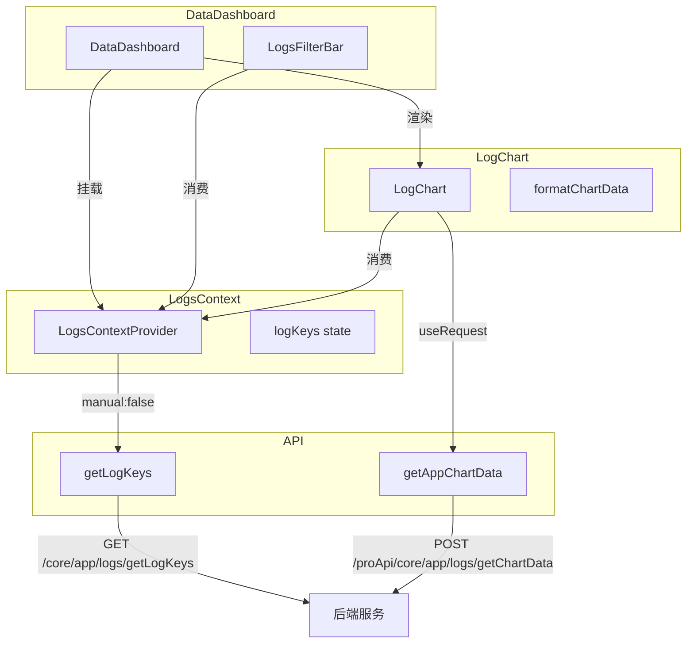

# 数据看板 — API 索引

## API 汇总表

| 序号 | API 端点 | 方法 | 功能 | 调用位置 | 商业版专属 |
|------|---------|------|------|---------|-----------|
| API-01 | `/proApi/core/app/logs/getChartData` | POST | 获取图表统计数据 | `LogChart.tsx` (useRequest) | ✅ 是 |
| API-02 | `/core/app/logs/getLogKeys` | GET | 获取日志字段配置 | `LogsContext/context.tsx` (useRequest) | ❌ 否 |

## API 详情

### API-01: 获取图表统计数据

- **端点**: `POST /proApi/core/app/logs/getChartData`
- **调用函数**: `getAppChartData` → `web/core/app/api/log.ts:42`
- **描述**: 获取应用的数据看板图表原始数据，包含用户数据（userData）、对话数据（chatData）和应用数据（appData）三个维度的时间序列数据
- **商业版专属**: ✅ 是（非商业版返回假数据 `fakeChartData`，图表模糊遮罩）

#### 请求参数 (getChartDataBody)

| 参数名 | 类型 | 必填 | 描述 |
|--------|------|------|------|
| `appId` | `string` | 是 | 应用 ID，从 ChatPageContext.chatSettings.appId 获取 |
| `dateStart` | `Date` | 是 | 起始日期，默认为 dateRange.from 或当前日期 |
| `dateEnd` | `Date` | 是 | 结束日期，默认为 dateRange.to + 1 天 |
| `offset` | `number` | 是 | 偏移量（用于留存用户计算），从 offsetOptions 中选取 |
| `source` | `ChatSourceEnum[]` | 是 | 渠道来源筛选列表 |
| `userTimespan` | `AppLogTimespanEnum` | 是 | 用户数据时间粒度：day / week / month / quarter |
| `chatTimespan` | `AppLogTimespanEnum` | 是 | 对话数据时间粒度：day / week / month / quarter |
| `appTimespan` | `AppLogTimespanEnum` | 是 | 应用数据时间粒度：day / week / month / quarter |

#### 响应数据 (getChartDataResponse)

| 字段 | 类型 | 描述 |
|------|------|------|
| `userData` | `Array<{timestamp: number, summary: UserSummary}>` | 用户数据时间序列 |
| `userData[].summary.userCount` | `number` | 用户总数 |
| `userData[].summary.newUserCount` | `number` | 新增用户数 |
| `userData[].summary.retentionUserCount` | `number` | 留存用户数 |
| `userData[].summary.points` | `number` | 积分消耗 |
| `userData[].summary.inputTokens` | `number` | 输入 Token 数 |
| `userData[].summary.outputTokens` | `number` | 输出 Token 数 |
| `userData[].summary.sourceCountMap` | `Record<ChatSourceEnum, number>` | 各渠道来源用户数 |
| `chatData` | `Array<{timestamp: number, summary: ChatSummary}>` | 对话数据时间序列 |
| `chatData[].summary.chatItemCount` | `number` | 对话条目数 |
| `chatData[].summary.chatCount` | `number` | 对话次数 |
| `chatData[].summary.points` | `number` | 积分消耗 |
| `chatData[].summary.errorCount` | `number` | 错误次数 |
| `appData` | `Array<{timestamp: number, summary: AppSummary}>` | 应用数据时间序列 |
| `appData[].summary.goodFeedBackCount` | `number` | 好评数 |
| `appData[].summary.badFeedBackCount` | `number` | 差评数 |
| `appData[].summary.totalResponseTime` | `number` | 总响应时长（毫秒） |
| `appData[].summary.chatCount` | `number` | 对话次数（用于计算平均时长） |

#### 前端数据加工

前端在 `LogChart.tsx` 的 `formatChartData` computed 中对原始数据做以下加工：

1. **时间序列补全**：`generateCompleteTimeSeries()` 根据 timeRange 和 timespan 生成完整时间范围
2. **缺失日期填充**：对于无数据的日期，填充默认值（各项为 0）
3. **留存率修正**：日粒度下 `newUserCount = newUserCount - retentionUserCount`（排除留存用户）
4. **衍生指标计算**：
   - `totalTokens` = `inputTokens + outputTokens`
   - `pointsPerChat` = `points / chatCount`（保留 2 位小数）
   - `errorRate` = `errorCount / chatItemCount * 100`（保留 2 位小数）
   - `avgDuration` = `totalResponseTime / chatCount`
5. **累计汇总**：`cumulative` 对象汇总所有时间点的 sum/avg 值

#### 刷新依赖

| 依赖项 | 说明 |
|--------|------|
| `appId` | 应用切换时重新请求 |
| `dateRange.from` | 起始日期变化 |
| `dateRange.to` | 结束日期变化 |
| `offset` | 偏移量切换 |
| `chatSources` | 渠道来源筛选变化 |
| `userTimespan` | 用户数据时间粒度切换 |
| `chatTimespan` | 对话数据时间粒度切换 |
| `appTimespan` | 应用数据时间粒度切换 |

---

### API-02: 获取日志字段配置

- **端点**: `GET /core/app/logs/getLogKeys`
- **调用函数**: `getLogKeys` → `web/core/app/api/log.ts:33`
- **描述**: 获取当前应用团队级别的日志显示字段配置

#### 请求参数 (getLogKeysQuery)

| 参数名 | 类型 | 必填 | 描述 |
|--------|------|------|------|
| `appId` | `string` | 是 | 应用 ID |

#### 响应数据 (getLogKeysResponseType)

| 字段 | 类型 | 描述 |
|------|------|------|
| `logKeys` | `AppLogKeysType[]` | 日志字段列表，含 key、label、enable 等属性 |

#### 调用时机与缓存策略

- **调用时机**：LogsContextProvider 挂载时自动调用（manual: false）
- **刷新依赖**：`appId` 变化时重新调用
- **本地缓存**：`localStorage` key 为 `app_log_keys_{appId}`
- **缓存策略**：成功回调中检查本地是否已有缓存，有则保留本地；无则从响应同步

## 依赖关系图

