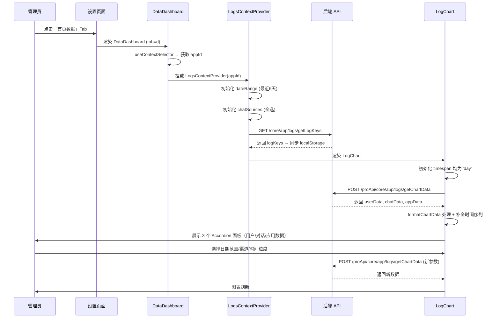

# 数据看板 — 业务流程详解

> 本模块为叶子节点，无 Tab 拆分。全部内容覆盖于此文档。

---

## 1. 页面初始化与数据加载

> 管理员从设置页面切换到「首页数据」Tab 时，DataDashboard 组件挂载并完成数据初始化。

### 步骤 1：组件挂载

| 用户操作 | 触发 API | 分支条件 | 页面变化 |
|---------|---------|---------|---------|
| 在设置页面点击「首页数据」Tab | 无（路由更新 `tab=d`） | — | ChatSetting 根据 tab 值渲染 `<DataDashboard Header={SettingHeader} />` |

### 步骤 2：获取 appId

| 用户操作 | 触发 API | 分支条件 | 页面变化 |
|---------|---------|---------|---------|
| 无（自动执行） | 无 | `chatSettings?.appId` 存在 | 获取到 appId，后续子组件正常渲染 |
| 无（自动执行） | 无 | `chatSettings?.appId` 为空字符串 | 传递空 appId，LogChart 从 `AppContext` 回退获取 appId |

appId 从 `ChatPageContext` 中通过 `useContextSelector(ChatPageContext, (v) => v.chatSettings?.appId || '')` 获取。

### 步骤 3：初始化日志筛选上下文

| 用户操作 | 触发 API | 分支条件 | 页面变化 |
|---------|---------|---------|---------|
| 无（自动执行） | `GET /core/app/logs/getLogKeys` | 接口调用成功，返回 logKeys | 设置团队日志字段配置，若本地无缓存则同步到 localStorage |
| 无（自动执行） | `GET /core/app/logs/getLogKeys` | 本地已有缓存的 logKeys（`localStorage: app_log_keys_{appId}`） | 优先使用本地缓存，不从接口覆盖 |

LogsContextProvider 挂载时：
- 日期范围默认为最近 6 天（`new Date(addDays(new Date(), -6))` 至当天 23:59:59）
- 渠道来源默认为全选（`useMultipleSelect(Object.values(ChatSourceEnum), true)`）
- 日志字段配置优先使用 localStorage 缓存，无缓存时从接口获取

### 步骤 4：加载图表数据

| 用户操作 | 触发 API | 分支条件 | 页面变化 |
|---------|---------|---------|---------|
| 无（自动执行） | `POST /proApi/core/app/logs/getChartData` | `feConfigs.isPlus` 为 `true` | 请求图表数据，各面板显示加载中（MyBox + loading spinner） |
| 无（自动执行） | 无（跳过请求） | `feConfigs.isPlus` 为 `false`（非商业版） | 使用 `fakeChartData` 假数据，图表显示模糊遮罩 |

图表数据请求依赖项：`appId`, `dateRange.from`, `dateRange.to`, `offset`, `chatSources`, `userTimespan`, `chatTimespan`, `appTimespan`。任一变化触发重新请求。

---

## 2. 数据筛选

> 管理员通过筛选栏调整图表数据范围。

### 步骤 1：修改日期范围

| 用户操作 | 触发 API | 分支条件 | 页面变化 |
|---------|---------|---------|---------|
| 在日期选择器中修改日期范围 | `POST /proApi/core/app/logs/getChartData`（自动重新请求） | 新日期范围有效 | 图表数据按新日期范围刷新 |
| 在日期选择器中修改日期范围 | 同上 | 日期范围非法（from > to） | 无变化（日期选择器组件内部校验） |

### 步骤 2：选择渠道来源

| 用户操作 | 触发 API | 分支条件 | 页面变化 |
|---------|---------|---------|---------|
| 在渠道多选下拉中勾选/取消渠道 | `POST /proApi/core/app/logs/getChartData`（自动重新请求） | 选择变化 | 图表数据按筛选后的渠道来源刷新 |

### 步骤 3：修改偏移量

| 用户操作 | 触发 API | 分支条件 | 页面变化 |
|---------|---------|---------|---------|
| 在「留存用户」面板的偏移量下拉中选择新值 | `POST /proApi/core/app/logs/getChartData`（自动重新请求） | offset 变化 | 留存用户数据按新偏移量刷新 |

---

## 3. 切换统计粒度

> 管理员在各数据面板中切换时间粒度（日/周/月/季度）。

### 步骤 1：切换用户数据时间粒度

| 用户操作 | 触发 API | 分支条件 | 页面变化 |
|---------|---------|---------|---------|
| 在「用户数据」面板右侧选择时间粒度（日/周/月/季度） | `POST /proApi/core/app/logs/getChartData`（自动重新请求，userTimespan 变化） | 选择「日」 | 折线/柱状图按天展示数据点 |
| 同上 | 同上 | 选择「周」 | 折线/柱状图按周展示，X 轴标签格式 `MM/DD-MM/DD` |
| 同上 | 同上 | 选择「月」 | 折线/柱状图按月展示 |
| 同上 | 同上 | 选择「季度」 | 折线/柱状图按季度展示 |

### 步骤 2：切换对话数据时间粒度

| 用户操作 | 触发 API | 分支条件 | 页面变化 |
|---------|---------|---------|---------|
| 在「对话数据」面板右侧选择时间粒度 | 同上（chatTimespan 变化） | 同用户数据面板逻辑 | 对话趋势图表按所选粒度展示 |

### 步骤 3：切换应用数据时间粒度

| 用户操作 | 触发 API | 分支条件 | 页面变化 |
|---------|---------|---------|---------|
| 在「应用数据」面板右侧选择时间粒度 | 同上（appTimespan 变化） | 同上述逻辑 | 反馈和响应时长图表按所选粒度展示 |

---

## 4. 图表交互

> 管理员与图表的交互操作。

### 步骤 1：查看图表详情

| 用户操作 | 触发 API | 分支条件 | 页面变化 |
|---------|---------|---------|---------|
| 鼠标悬停在图表数据点上 | 无 | — | 弹出 Tooltip 显示该数据点的详细信息 |
| 查看图表右上角汇总数据 | 无 | — | 显示该维度的累计/平均值（如「总: 1234」） |

### 步骤 2：展开/折叠面板

| 用户操作 | 触发 API | 分支条件 | 页面变化 |
|---------|---------|---------|---------|
| 点击「用户数据」面板标题 | 无 | — | 面板折叠/展开，切换 Accordion 状态 |
| 点击「对话数据」面板标题 | 无 | — | 面板折叠/展开 |
| 点击「应用数据」面板标题 | 无 | — | 面板折叠/展开 |

默认全部展开（`defaultIndex={[0, 1, 2]}`）。

---

## Mermaid 附录

