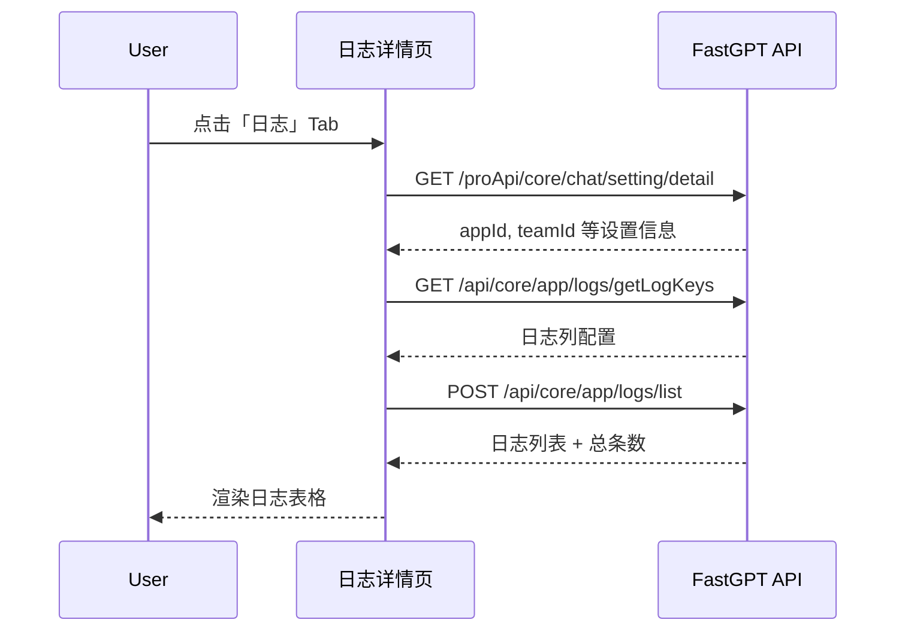
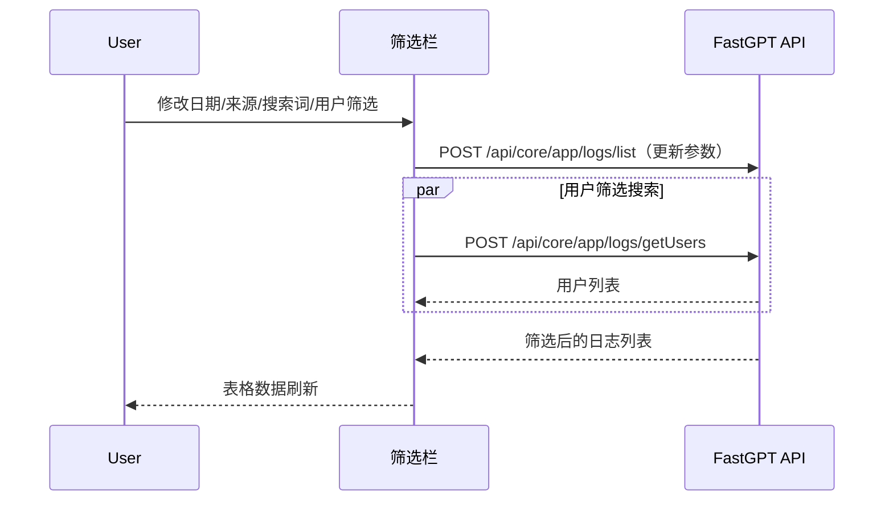
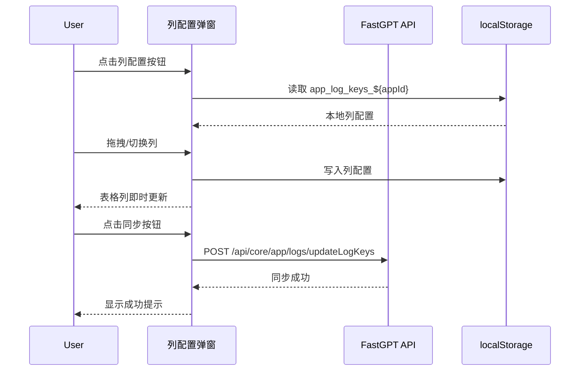
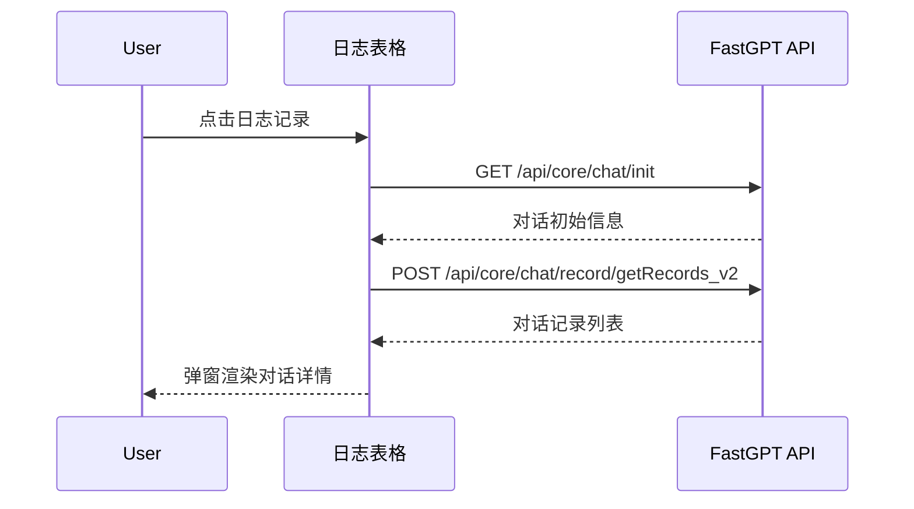
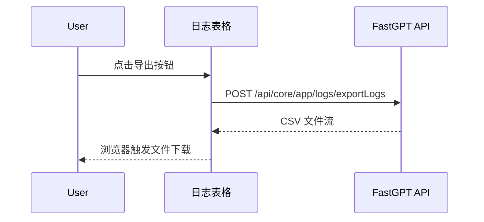
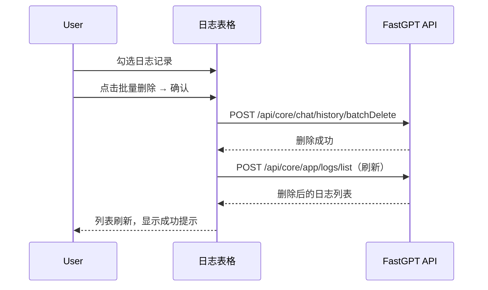

# 日志详情 — 业务流程详解

> 本模块为 ChatSetting 设置面板的日志 Tab，无子 Tab。以下按场景逐一追踪完整交互流程。

## 页面总览

日志详情页面由 Header 区域（由父组件 ChatSetting 传入）、筛选栏（LogsFilterBar）和日志表格（LogTable）三部分组成。页面通过 ChatPageContext 获取当前应用的 appId，然后以该 appId 初始化 LogsContextProvider，筛选栏和日志表格通过该 Context 共享日志查询状态。

---

### S01：查看日志列表

> 进入日志详情页面后，自动加载最近 N 天的对话日志列表。

#### 步骤 1：进入日志详情页面

| 用户操作 | 触发 API | 分支条件 | 页面变化 |
|---------|---------|---------|---------|
| 在对话首页点击设置按钮（s），再点击日志 Tab（l） | 无（仅路由切换） | `pane=s` 时 ChatSetting 组件渲染；`tab=l` 时 LogDetails 组件渲染 | 侧边栏切换为设置面板，主区域显示日志详情组件 |

ChatSetting 使用 Next.js `dynamic` 动态导入 LogDetails 组件，仅在切换到日志 Tab 时加载。

#### 步骤 2：初始化日志上下文

| 用户操作 | 触发 API | 分支条件 | 页面变化 |
|---------|---------|---------|---------|
| 页面自动加载（无需操作） | `GET /proApi/core/chat/setting/detail`（由 ChatPageContext 自动请求） | 无 | LogDetails 从 ChatPageContext 读取 `chatSettings.appId`；若 appId 为空则仅渲染空白区域和 Header |

#### 步骤 3：加载日志列配置

| 用户操作 | 触发 API | 分支条件 | 页面变化 |
|---------|---------|---------|---------|
| 页面自动加载（无需操作） | `GET /api/core/app/logs/getLogKeys` | appId 有值时自动请求 | 获取团队的日志列配置（logKeys），若无团队配置则使用本地 localStorage 缓存或默认列配置 |

#### 步骤 4：加载日志列表数据

| 用户操作 | 触发 API | 分支条件 | 页面变化 |
|---------|---------|---------|---------|
| 页面自动加载（无需操作） | `POST /api/core/app/logs/list` | 自动请求，参数为当前日期范围和筛选条件 | 显示加载状态 → 日志数据以分页表格形式渲染，展示总条数 |

##### 数据加载详情

| 加载阶段 | API | 关键参数 | 数据处理 | 渲染结果 |
|---------|-----|---------|---------|---------|
| 首次加载 | POST /api/core/app/logs/list | `appId`, `dateStart`, `dateEnd`, `pageNum=1`, `pageSize=50` | 按时间倒序排列 | 表格前 50 条日志 |
| 翻页 | POST /api/core/app/logs/list | `pageNum=N`, 其他筛选条件不变 | 无额外处理 | 表格第 N 页 |
| 筛选刷新 | POST /api/core/app/logs/list | 更新筛选条件参数，`pageNum=1` | 无额外处理 | 表格数据更新 |

- **分页参数**：默认每页 50 条
- **排序规则**：默认按时间倒序
- **筛选条件**：日期范围（dateStart/dateEnd）、对话来源（sources）、用户（tmbIds/outLinkUids）、搜索关键词（chatSearch）、反馈类型（feedbackFilter/feedbackType）、仅未读（unreadOnly）、错误筛选（errorFilter）

###### Mermaid 附录

---

### S02：多维度筛选日志

> 通过筛选栏的日期选择器、来源选择器、搜索框、用户筛选等控件组合筛选日志。

#### 步骤 1：修改日期范围

| 用户操作 | 触发 API | 分支条件 | 页面变化 |
|---------|---------|---------|---------|
| 点击日期范围选择器 → 选择起止日期 → 确认 | `POST /api/core/app/logs/list`（参数更新为新的 dateStart/dateEnd） | 日期变更后自动触发列表刷新 | 加载状态 → 表格更新为新的时间范围内的日志 |

#### 步骤 2：选择对话来源

| 用户操作 | 触发 API | 分支条件 | 页面变化 |
|---------|---------|---------|---------|
| 点击来源下拉框 → 勾选/取消勾选来源类型（如 Web、API、分享链接等）→ 确认 | `POST /api/core/app/logs/list`（参数更新为新的 sources 数组） | 全选时 sources 为空数组；取消全选时可单选或多选 | 加载状态 → 表格仅显示选中来源的日志。全选按钮联动更新状态 |

##### 分支条件

| 条件 | 行为 |
|------|------|
| 未选择任何来源（sources 为空） | 等同于全选，显示所有来源的日志 |
| 选择部分来源 | 仅显示选中来源的日志 |
| 全选开关为开 | sources 为空，显示全部来源 |
| 全选开关为关 | sources 为已选来源列表 |

#### 步骤 3：关键词搜索

| 用户操作 | 触发 API | 分支条件 | 页面变化 |
|---------|---------|---------|---------|
| 在搜索框中输入关键词（如用户问题文本） | `POST /api/core/app/logs/list`（参数更新为 chatSearch） | 搜索词变更后自动触发列表刷新 | 加载状态 → 表格更新为匹配搜索词的日志 |

#### 步骤 4：用户筛选

| 用户操作 | 触发 API | 分支条件 | 页面变化 |
|---------|---------|---------|---------|
| 点击用户筛选下拉 → 搜索用户 → 选择目标用户 | `POST /api/core/app/logs/getUsers`（搜索用户时）→ `POST /api/core/app/logs/list`（选择用户后） | 搜索框输入时实时查询用户列表 | 搜索结果加载状态 → 勾选用户后日志列表刷新 |

##### 数据加载详情（用户搜索）

| 加载阶段 | API | 关键参数 | 数据处理 | 渲染结果 |
|---------|-----|---------|---------|---------|
| 搜索用户 | POST /api/core/app/logs/getUsers | `appId`, `dateStart`, `dateEnd`, `searchKey` | 按头像+名称+记录数展示 | 用户下拉列表 |
| 选择用户后 | POST /api/core/app/logs/list | `tmbIds`/`outLinkUids` 参数追加 | 无额外处理 | 筛选后的日志 |

#### 步骤 5：错误筛选和反馈筛选

| 用户操作 | 触发 API | 分支条件 | 页面变化 |
|---------|---------|---------|---------|
| 点击错误筛选下拉 → 选择筛选条件（如仅显示有错误的记录） | `POST /api/core/app/logs/list`（参数更新为 errorFilter） | 筛选条件不为空时过滤 | 加载状态 → 表格显示匹配错误条件的日志 |
| 点击反馈筛选下拉 → 选择反馈类型（好评/差评/未反馈） | `POST /api/core/app/logs/list`（参数更新为 feedbackFilter/feedbackType） | 选择具体类型后过滤 | 加载状态 → 表格显示匹配反馈类型的日志 |

###### Mermaid 附录

---

### S03：配置日志列显示

> 通过拖拽调整日志表格的列配置。

#### 步骤 1：打开列配置弹窗

| 用户操作 | 触发 API | 分支条件 | 页面变化 |
|---------|---------|---------|---------|
| 点击筛选栏右侧的列配置图标按钮 | 无（纯前端操作） | 无 | 弹出 Popover，展示当前可见的列列表（可拖拽调整顺序、可切换显示/隐藏） |

#### 步骤 2：调整列配置

| 用户操作 | 触发 API | 分支条件 | 页面变化 |
|---------|---------|---------|---------|
| 拖拽列项调整顺序；点击眼睛图标切换可见/隐藏 | 无（本地状态更新 + localStorage 持久化） | 无 | Popover 内列表实时更新；关闭 Popover 后日志表格列配置即时生效 |

列配置通过 `localStorage`（key: `app_log_keys_${appId}`）持久化到本地。若有团队级别的 logKeys 配置，优先使用团队配置。

#### 步骤 3：同步列配置到团队

| 用户操作 | 触发 API | 分支条件 | 页面变化 |
|---------|---------|---------|---------|
| 点击「同步」按钮 → 确认同步 | `POST /api/core/app/logs/updateLogKeys` | 仅在管理员拥有团队管理权限时可操作 | 弹窗显示同步确认提示 → 确认后显示成功提示，团队其他成员下次打开时自动应用该列配置 |

##### 表单与交互详情

同步弹窗提示内容：告知管理员同步后团队所有成员将看到相同的列配置。

###### Mermaid 附录

---

### S04：查看单条对话详情

> 在日志列表中点击某条记录，弹出对话详情弹窗。

#### 步骤 1：打开对话详情弹窗

| 用户操作 | 触发 API | 分支条件 | 页面变化 |
|---------|---------|---------|---------|
| 在日志表格中点击某条记录行 | `GET /api/core/chat/init`（获取对话初始信息） | 无 | 弹出 DetailLogsModal 弹窗，显示加载状态 |

#### 步骤 2：加载对话记录

| 用户操作 | 触发 API | 分支条件 | 页面变化 |
|---------|---------|---------|---------|
| 弹窗自动加载（无需操作） | `POST /api/core/chat/record/getRecords_v2` | 自动请求 | 加载状态 → 渲染对话内容（用户消息与 AI 回复的完整交互记录） |

##### 数据加载详情

| 加载阶段 | API | 关键参数 | 数据处理 | 渲染结果 |
|---------|-----|---------|---------|---------|
| 获取对话信息 | GET /api/core/chat/init | `appId`, `chatId`, `loadCustomFeedbacks` | 初始化 ChatRecordContext | 对话上下文 |
| 获取对话记录 | POST /api/core/chat/record/getRecords_v2 | `chatId`, `appId`, `type`, `pageSize` | 按时间顺序渲染 | 对话消息列表 |

#### 步骤 3：查看和提交纠错记录（可选）

| 用户操作 | 触发 API | 分支条件 | 页面变化 |
|---------|---------|---------|---------|
| 点击纠错相关按钮 | `POST /api/core/chat/correction/list`（查看纠错列表）/ `POST /api/core/chat/correction/submit`（提交纠错） | 纠错功能可用 | 弹窗内展示纠错记录列表或提交表单 |

###### Mermaid 附录

---

### S05：导出日志数据

> 将当前筛选条件下的日志数据导出为 CSV 文件。

#### 步骤 1：触发导出

| 用户操作 | 触发 API | 分支条件 | 页面变化 |
|---------|---------|---------|---------|
| 点击日志表格右上角的「导出」按钮 | `POST /api/core/app/logs/exportLogs` | 无 | 按钮显示加载状态 → 浏览器触发文件下载（CSV） |

##### 导出参数

导出请求携带当前筛选栏的全部条件参数（日期范围、来源、用户筛选、搜索关键词、可见列配置等），确保导出的数据与页面展示一致。

###### Mermaid 附录

---

### S06：批量删除对话

> 勾选多条日志后批量删除对应的对话历史。

#### 步骤 1：勾选日志记录

| 用户操作 | 触发 API | 分支条件 | 页面变化 |
|---------|---------|---------|---------|
| 点击日志表格每行首列的复选框 | 无 | 单条选择模式 | 复选框变为勾选状态，批量操作工具栏出现（显示已选数量） |

#### 步骤 2：确认删除

| 用户操作 | 触发 API | 分支条件 | 页面变化 |
|---------|---------|---------|---------|
| 点击批量删除按钮 → 在确认弹窗中确认 | `POST /api/core/chat/history/batchDelete`（参数：`appId` + `chatIds`） | 无已选记录时删除按钮不可用 | 确认弹窗关闭 → 加载状态 → 删除成功提示 → 日志列表刷新 |

##### 删除链路详情

- **引用检查**：批量删除直接调用后端接口，后端校验权限和数据归属
- **确认弹窗**：弹窗标题提示「确认删除」，内容显示将删除的对话数量，确认/取消按钮
- **批量与单条差异**：批量删除一次性提交所有勾选的 chatIds；单条删除同理但仅发一条记录
- **级联影响**：删除对话历史后，关联的对话记录、纠错记录同步清除

###### Mermaid 附录

