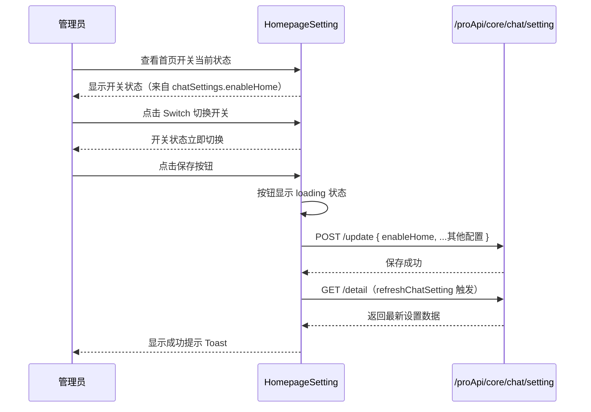
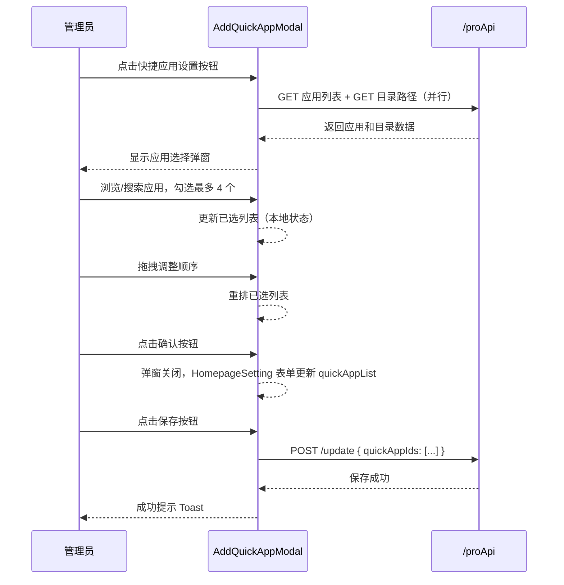
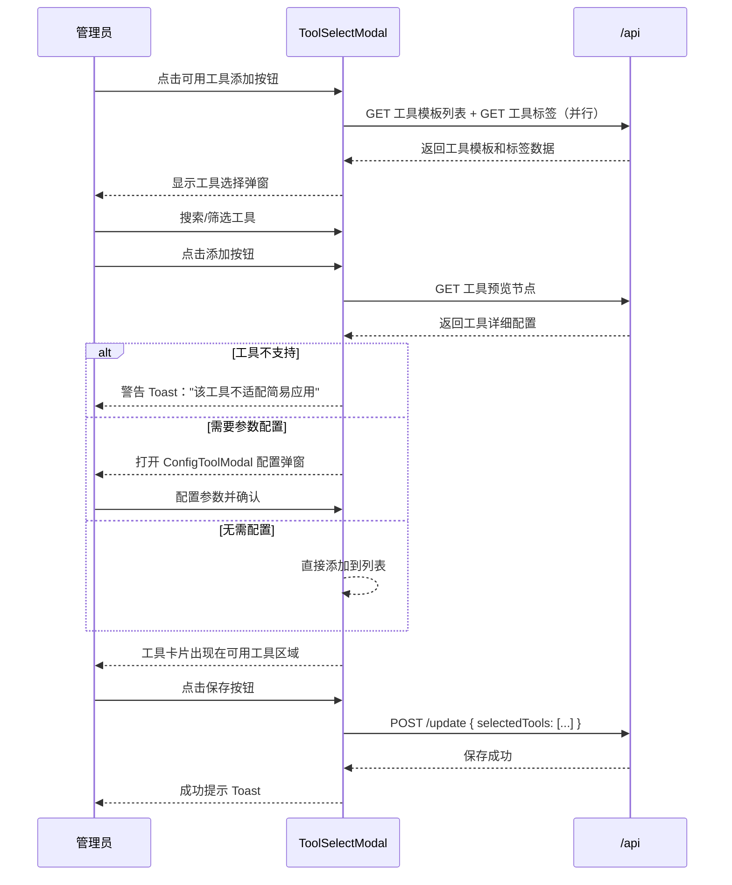
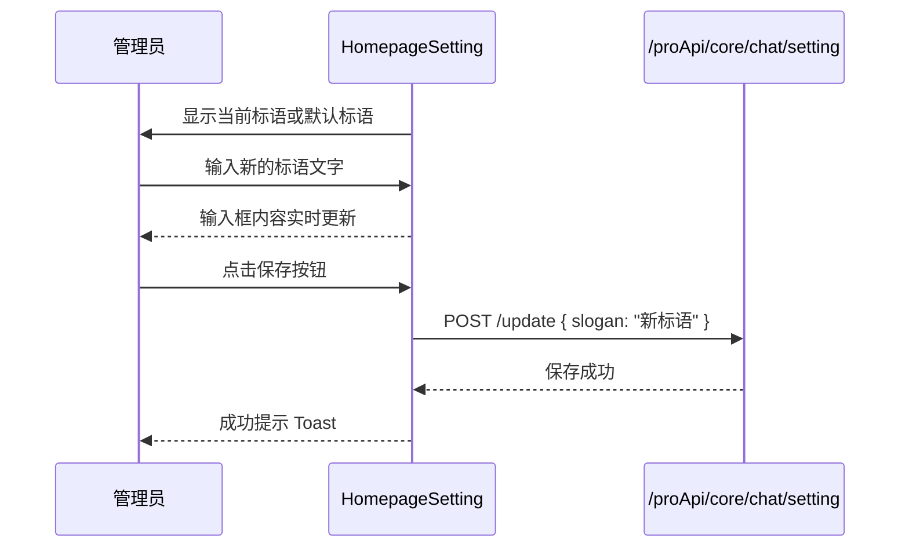

# 首页设置 — 业务流程详解

## 页面总览

首页设置模块位于对话首页设置面板的 HOME Tab 内，为团队管理员提供对话首页的个性化配置能力。页面采用垂直排列的表单布局，包含四个设置区域：启用首页开关、快捷应用管理、可用工具管理和欢迎标语输入。所有修改通过顶部的保存按钮统一提交。

## 场景 S01：配置首页展示开关

> 管理员通过 Switch 开关控制对话首页的启用状态。此操作实时反映在表单状态中，需点击保存按钮才会持久化。

### 步骤 1：切换首页启用状态

| 用户操作 | 触发 API | 分支条件 | 页面变化 |
|---------|---------|---------|---------|
| 进入 HOME Tab 设置页，查看「启用首页」开关当前状态 | GET `/proApi/core/chat/setting/detail`（父级 ChatPageContext 初始化时自动调用） | 无 | 页面加载时显示开关当前状态（开/关），开关从 `chatSettings.enableHome` 取值 |
| 点击 Switch 开关切换启用状态 | 无（仅更新本地表单状态） | 无 | 开关立即切换显示状态（开↔关），react-hook-form 的 `register('enableHome')` 更新表单值 |

### 步骤 2：保存设置

| 用户操作 | 触发 API | 分支条件 | 页面变化 |
|---------|---------|---------|---------|
| 点击页面顶部的「保存」按钮 | POST `/proApi/core/chat/setting/update` | 无 | 保存按钮显示 loading 状态（`isLoading={isSaving}`），保存成功后弹出成功提示（文案为 i18n key `chat:setting.save_success`），同时触发 `refreshChatSetting()` 刷新上下文中的设置数据 |

### Mermaid 附录

---

## 场景 S02：管理快捷应用列表

> 管理员通过弹窗从团队应用中选择最多 4 个应用作为对话首页的快捷入口，支持拖拽排序。已选应用以标签形式展示在设置区域，可随时打开弹窗重新配置。

### 步骤 1：打开展示快捷应用选择弹窗

| 用户操作 | 触发 API | 分支条件 | 页面变化 |
|---------|---------|---------|---------|
| 点击「快捷应用」区域的设置图标按钮 | 无 | 无 | `isOpenAddQuickApp` 状态变为 true，显示 AddQuickAppModal 弹窗 |
| 弹窗打开，自动加载应用列表 | GET 团队应用列表（`getMyApps`，根目录） + GET 目录路径（`getAppFolderPath`，根目录） | 并行请求 | 弹窗左侧显示应用列表（含文件夹和应用），弹窗显示 loading 状态直至数据加载完成 |

### 步骤 2：浏览和搜索应用

| 用户操作 | 触发 API | 分支条件 | 页面变化 |
|---------|---------|---------|---------|
| 在搜索框中输入关键词 | GET 团队应用列表（`getMyApps`，带 searchKey 参数） | 输入内容非空时：隐藏目录路径面包屑，仅显示搜索结果 | 应用列表根据搜索关键词过滤更新，有 500ms 节流 |
| 点击文件夹进入子目录 | GET 团队应用列表（`getMyApps`，parentId 指向文件夹） + GET 目录路径（`getAppFolderPath`，current 类型） | 仅当未在搜索状态时显示路径面包屑 | 应用列表更新为子目录内容，面包屑导航显示当前路径 |
| 查看应用详情提示 | 无 | 鼠标悬停时显示 | 显示 Tooltip 包含应用名称、作者、简介和费用信息 |

### 步骤 3：选择/取消选择应用

| 用户操作 | 触发 API | 分支条件 | 页面变化 |
|---------|---------|---------|---------|
| 勾选应用复选框 | 无（立即更新本地状态） | 已选数量已满 4 个时：不执行添加操作 | 该应用添加到右侧「已选列表」中，应用头像和名称显示在已选区域 |
| 在已选列表中点击关闭图标移除应用 | 无 | 无 | 该应用从已选列表中移除，左侧列表中对应复选框取消勾选 |
| 拖拽已选应用调整顺序 | 无 | 无 | 拖拽过程中显示拖拽占位，释放后列表顺序更新 |

### 步骤 4：确认选择

| 用户操作 | 触发 API | 分支条件 | 页面变化 |
|---------|---------|---------|---------|
| 点击弹窗底部「确认」按钮 | 无（仅通过 `onConfirm` 回调更新表单） | 无 | 弹窗关闭，快捷应用区域刷新显示已选应用列表（含头像和名称） |
| 点击「取消」按钮 | 无 | 无 | 弹窗关闭，不保存任何修改 |

### 步骤 5：保存设置到后端

| 用户操作 | 触发 API | 分支条件 | 页面变化 |
|---------|---------|---------|---------|
| 点击页面顶部的「保存」按钮 | POST `/proApi/core/chat/setting/update`（`quickAppIds` 字段为已选应用的 ID 数组） | 无 | 保存按钮 loading 状态，成功后弹出成功提示并刷新设置数据 |

### 补充：缺失应用信息回填

当选中的应用不在当前列表页数据中时（如通过搜索关键词找到并选中后切换目录），系统自动调用 `getAppBasicInfoByIds` 接口获取缺失应用的基本信息（名称、头像），确保已选列表中的每个应用都有正确的展示信息。

### Mermaid 附录

---

## 场景 S03：管理可用工具列表

> 管理员从系统工具模板库中选择工具添加到对话首页。选中的工具以卡片形式展示在设置区域，终端用户可在对话首页使用这些工具。

### 步骤 1：打开工具选择弹窗

| 用户操作 | 触发 API | 分支条件 | 页面变化 |
|---------|---------|---------|---------|
| 点击「可用工具」区域的添加按钮（空状态时点击虚线框，已有工具时点击添加按钮） | 无 | 无 | `toolSelectModalOpen` 状态变为 true，显示 ToolSelectModal 弹窗 |
| 弹窗自动加载工具模板 | GET 工具模板列表（`getAppToolTemplates`） + GET 工具标签列表（`getPluginToolTags`，并行） | 无 | 弹窗显示工具模板卡片列表，loading 状态 |

### 步骤 2：浏览和筛选工具

| 用户操作 | 触发 API | 分支条件 | 页面变化 |
|---------|---------|---------|---------|
| 在搜索框中输入关键词 | GET 工具模板列表（带 searchKey 参数） | 输入内容非空时：300ms 节流后重新请求 | 工具列表按关键词过滤更新 |
| 点击标签筛选器中的标签 | 无（前端过滤） | 选中标签后：在已加载的模板中按标签过滤 | 工具列表仅显示包含已选标签的工具 |
| 点击文件夹/工具集进入子目录 | GET 工具模板列表（带 parentId） + GET 目录路径 | 非搜索状态下才显示面包屑 | 工具列表更新，面包屑导航显示路径 |

### 步骤 3：添加工具

| 用户操作 | 触发 API | 分支条件 | 页面变化 |
|---------|---------|---------|---------|
| 点击工具的「添加」按钮 | GET 工具预览节点数据（`getToolPreviewNode`） | 工具含有不支持的输入类型（引用类型且无工具描述、数据集选择、动态外部数据等）时：弹出警告 Toast，不执行添加 | 添加按钮显示 loading 状态 |
| 工具校验通过 | 无（如果工具有表单输入类型则继续步骤 4） | 工具含有表单输入类型（input/textarea/numberInput/switch/select/JSONEditor）：弹出 ConfigToolModal 配置弹窗 | ConfigToolModal 打开，显示工具输入参数配置界面 |
| 工具校验通过且无表单输入 | 无 | `onAddTool` 回调执行 | 工具添加到 selectedTools 列表，卡片出现在可用工具区域 |

### 步骤 4：配置工具参数（条件触发）

| 用户操作 | 触发 API | 分支条件 | 页面变化 |
|---------|---------|---------|---------|
| 在 ConfigToolModal 中配置工具输入参数 | 无（本地编辑） | 文件上传类型输入：自动设置值为工作流起始节点的用户文件引用 | 配置弹窗显示工具的所有可配置输入参数 |
| 点击确认完成配置 | 无 | 无 | `onAddTool` 回调执行，工具添加到列表，弹窗关闭 |

### 步骤 5：移除工具

| 用户操作 | 触发 API | 分支条件 | 页面变化 |
|---------|---------|---------|---------|
| 鼠标悬停在工具卡片上，点击出现的删除图标 | 无（本地状态更新） | 无 | 该工具从 selectedTools 列表中移除，卡片消失 |
| 在工具选择弹窗中已选工具的旁边点击「移除」按钮 | 无 | 无 | 工具从列表中移除，弹窗内该工具按钮恢复为「添加」状态 |

### 步骤 6：保存设置

| 用户操作 | 触发 API | 分支条件 | 页面变化 |
|---------|---------|---------|---------|
| 点击页面顶部的「保存」按钮 | POST `/proApi/core/chat/setting/update`（`selectedTools` 字段含 pluginId 和 inputs） | 无 | 保存按钮 loading 状态，成功后弹出成功提示 |

### Mermaid 附录

---

## 场景 S04：修改欢迎标语

> 管理员修改对话首页显示的欢迎标语文案，支持自定义文本输入，有默认文案兜底。

### 步骤 1：编辑标语

| 用户操作 | 触发 API | 分支条件 | 页面变化 |
|---------|---------|---------|---------|
| 进入页面查看当前标语 | GET `/proApi/core/chat/setting/detail`（父级自动加载） | `slogan` 字段为空时：显示默认标语（i18n key: `chat:setting.home.slogan.default`） | 输入框中显示当前标语文本 |
| 点击输入框，输入新的标语文本 | 无 | 无 | 输入框内容实时更新，`register('slogan')` 绑定表单值 |

### 步骤 2：保存标语

| 用户操作 | 触发 API | 分支条件 | 页面变化 |
|---------|---------|---------|---------|
| 点击页面顶部的「保存」按钮 | POST `/proApi/core/chat/setting/update`（`slogan` 字段为输入内容） | `slogan` 字段为必填（`register('slogan', { required: true })`），空值时表单校验不通过 | 保存按钮 loading 状态，成功提示，刷新设置数据 |

### Mermaid 附录

