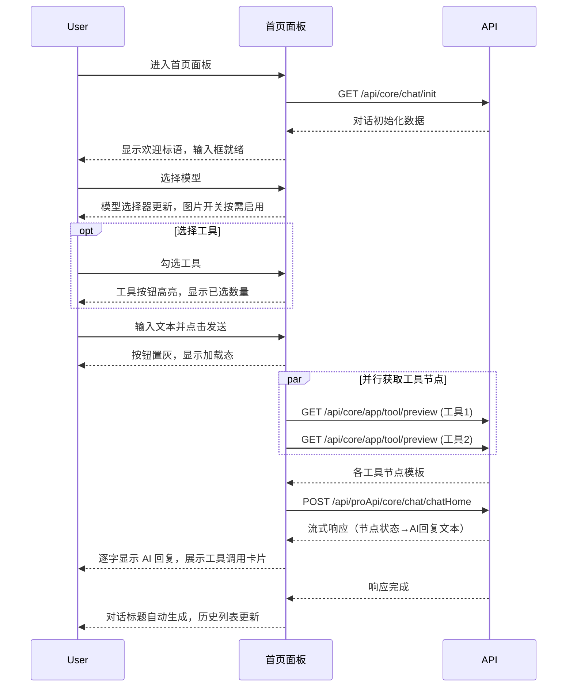
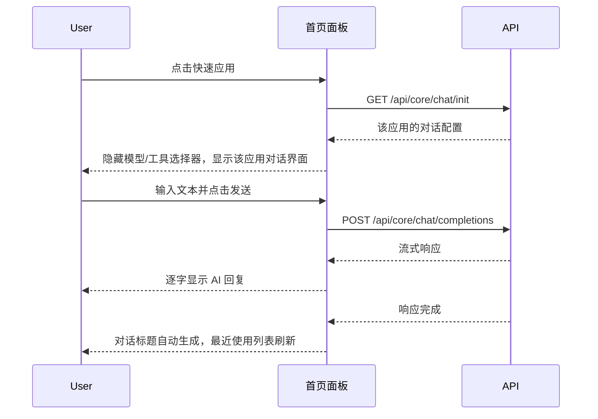

# 首页 — 业务流程详解

## 页面总览

首页面板是对话页面的默认视图，用户在此选择 AI 模型和工具后直接开始对话，或一键切换至预设的快速应用。面板的核心是 `ChatBox` 聊天容器，左侧输入区在非快速应用模式下展示模型选择器和工具多选下拉菜单。

> 本模块无 Tab 结构。以下按业务场景详述交互流程。

---

### S01：自定义模型与工具对话

> **业务描述**：用户在首页面板中从下拉菜单自由选择 AI 模型，并可多选工具（插件），以自定义配置发起对话。对话请求通过 `form2AppWorkflow` 将选中模型和工具组装为工作流后发送至后端。

#### 步骤 1：页面加载与对话初始化

| 用户操作 | 触发 API | 分支条件 | 页面变化 |
|---------|---------|---------|---------|
| 进入 `/chat` 页面（pane=HOME） | `GET /api/core/chat/init`（appId+chatId） | feConfigs.isPlus 为 false 时，自动跳转到团队应用面板；appId 为空时跳过请求 | 页面显示加载状态 → 请求成功后聊天容器就绪，显示欢迎标语 |

**数据加载详情**：

| 加载阶段 | API | 关键参数 | 数据处理 | 渲染结果 |
|---------|-----|---------|---------|---------|
| 对话初始化 | GET /api/core/chat/init | appId, chatId | 合并默认文件选择配置（根据所选模型设置图片识别能力）、whisper 语音配置 | 聊天容器渲染对话历史，输入框就绪 |

#### 步骤 2：选择模型

| 用户操作 | 触发 API | 分支条件 | 页面变化 |
|---------|---------|---------|---------|
| 点击模型选择器下拉 | — | availableModels 为空时选择器不显示 | 下拉展开，显示可用模型列表（含名称） |
| 点击某个模型 | — | 选择与当前模型不同的模型 | 选择器显示新模型名；若有图片识别能力（vision），文件选择配置中的图片开关自动启用 |
| 首次加载 | — | 默认值来自 localStorage（`chat_home_model`），其次为 `defaultModels.llm.id` | 选择器初始显示已保存的模型 |

#### 步骤 3：选择工具（可选）

| 用户操作 | 触发 API | 分支条件 | 页面变化 |
|---------|---------|---------|---------|
| 点击工具选择按钮 | — | availableTools 为空时不显示工具按钮 | 下拉菜单展开，列出所有可用工具（含头像和名称） |
| 勾选/取消工具 | — | — | 菜单项复选框切换选中态；按钮显示已选数量；选中 ≥1 个时按钮变高亮（蓝色） |
| 所选工具被管理员移除 | — | selectedToolIds 中的工具不在 availableTools 中 | 自动清除无效工具的选中状态 |

#### 步骤 4：输入并发送消息

| 用户操作 | 触发 API | 分支条件 | 页面变化 |
|---------|---------|---------|---------|
| 在输入框输入文本 | — | 输入内容保存至 sessionStorage（300ms 防抖） | — |
| 点击发送/按 Enter | `POST /api/proApi/core/chat/chatHome` | 未选择模型时：弹窗提示"No model selected"，不发送 | 发送按钮置灰、显示加载态；消息列表出现用户消息气泡和 AI 占位气泡 |

**API 调用链**（并行+串行）：

1. **并行获取工具节点**：`Promise.all(selectedToolIds.map(id => GET /api/core/app/tool/preview?appId={toolId}))` — 为每个已选工具获取节点模板
2. **组装工作流**：将模型 ID、工具节点、chatConfig 传入 `form2AppWorkflow` 生成工作流节点和边
3. **发送对话**：`POST /api/proApi/core/chat/chatHome` — 发送最后一条消息、变量、工作流数据

**流式响应处理**：

| 事件 | 用户可见的变化 |
|------|-------------|
| 收到 `flowNodeStatus` | 顶部显示当前工作流节点名称和运行状态 |
| 收到 `flowNodeResponse` | 记录节点响应数据 |
| 收到 `answer` / `fastAnswer` | AI 回复文本逐字流式显示；含 reasoning 时显示思考过程 |
| 收到 `toolCall` | 显示工具调用卡片（函数名+参数） |
| 收到 `toolResponse` | 更新工具调用卡片的响应内容 |
| 收到 `sandboxStatus` | 显示沙箱部署状态（部署技能/下载包/解压/就绪） |
| 收到 `skillCall` | 显示技能调用卡片（技能名、描述、状态） |

#### 步骤 5：对话完成

| 用户操作 | 触发 API | 分支条件 | 页面变化 |
|---------|---------|---------|---------|
| AI 回复完成 | — | — | 根据首条消息自动生成对话标题；对话加入侧边栏历史列表；最近使用列表刷新 |

**后置影响**：对话存储在对话历史中；标题根据首条用户消息自动生成。

---

### S02：快速应用对话

> **业务描述**：用户点击预设的快速应用，一键切换到该应用的工作流对话模式。快速应用模式下隐藏模型和工具选择器，对话直接使用应用已配置的工作流。

#### 步骤 1：点击快速应用

| 用户操作 | 触发 API | 分支条件 | 页面变化 |
|---------|---------|---------|---------|
| 点击快速应用图标 | `GET /api/core/chat/init` | 点击的是当前活跃的快速应用：取消选中，切换回首页默认应用；点击的是其他快速应用：切换到新应用 | ChatBox 切换至新 appId 的对话 |

**分支条件详解**：
- 当前 `appId === 被点击应用 ID` 且当前是快速应用模式 → 取消选中，调用 `onChangeGlobalAppId(homeAppId)` 切换回首页默认应用
- 否则 → 调用 `onChangeGlobalAppId(被点击应用 ID)` 切换至该应用

#### 步骤 2：对话初始化

| 用户操作 | 触发 API | 分支条件 | 页面变化 |
|---------|---------|---------|---------|
| 切换后自动触发 | `GET /api/core/chat/init` | — | 加载该应用的对话配置、变量、历史记录 |

**与自定义模式的差异**：
- 不显示模型选择器和工具选择器（`InputLeftComponent` 返回 `undefined`）
- 不调用 `getToolPreviewNode` 和 `form2AppWorkflow`
- 直接使用应用原有的 `streamFetch` 路径发送消息

#### 步骤 3：发送消息（快速应用路径）

| 用户操作 | 触发 API | 分支条件 | 页面变化 |
|---------|---------|---------|---------|
| 输入并发送 | `POST /api/core/chat/completions` | appId 为空时拒绝发送 | 流式渲染 AI 回复 |

**API 调用链**：
- 直接发送：`POST /api/core/chat/completions` — 参数含 `messages`（仅最后一条）、`variables`、`responseChatItemId`、`appId`、`chatId`
- 无并行工具获取步骤，工作流由后端按应用配置执行

#### 步骤 4：对话完成

同 S01 步骤 5。

---

## Mermaid 附录

### S01：自定义模型与工具对话

### S02：快速应用对话

