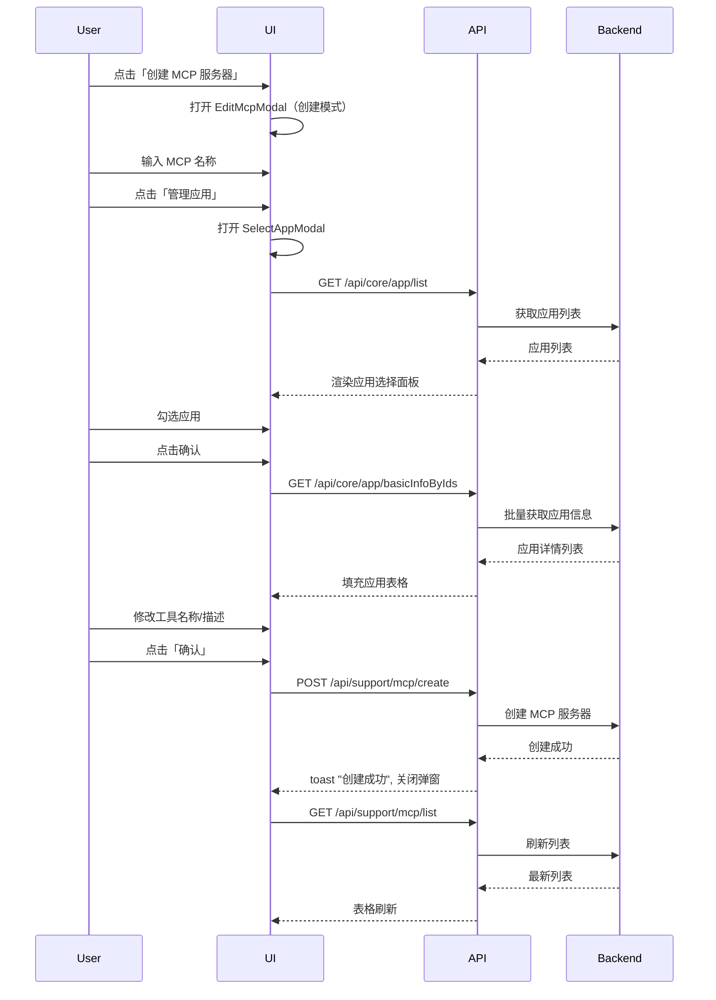
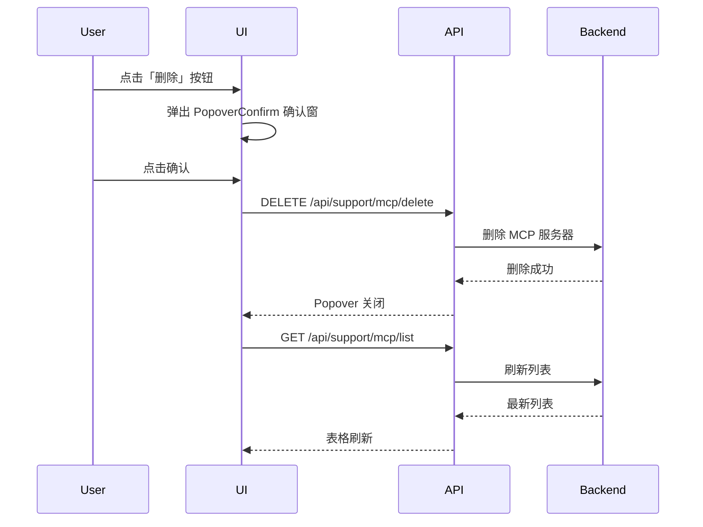
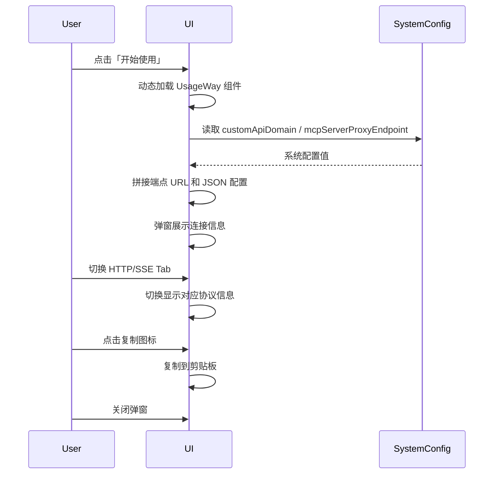

# MCP 服务器 — 业务流程详解

## 页面总览

MCP 服务器管理是一个单页面应用，位于工作台侧边栏「应用构建」分组下。页面布局由 DashboardContainer 提供统一的侧边栏和工作区容器，内容区展示 MCP 服务器列表表格，顶部有创建按钮，每行数据提供「开始使用」「编辑」「删除」三个操作入口。PC 端和移动端采用不同的标题栏布局。

---

### 场景 S01：查看 MCP 服务器列表

> 用户进入 MCP 服务器管理页面，查看当前团队已创建的所有 MCP 服务器。

#### 步骤 1：页面加载

| 用户操作 | 触发 API | 分支条件 | 页面变化 |
|---------|---------|---------|---------|
| 点击左侧导航栏「MCP 服务器」 | 自动触发 `GET /api/support/mcp/list` | 无 | 页面进入加载状态，MyBox 显示加载动画覆盖整个内容区 |

#### 步骤 2：列表渲染

| 用户操作 | 触发 API | 分支条件 | 页面变化 |
|---------|---------|---------|---------|
| 等待加载完成 | — | 列表为空 | 加载动画消失 → 表格区域显示空状态提示（EmptyTip） |
| 等待加载完成 | — | 列表不为空 | 加载动画消失 → 表格渲染，每行显示：MCP 名称、关联应用数、操作按钮组 |

**数据加载详情**：

| 加载阶段 | API | 关键参数 | 数据处理 | 渲染结果 |
|---------|-----|---------|---------|---------|
| 首次加载 | GET /api/support/mcp/list | 无 | 直接使用返回的数组 | 完整列表表格 |

**表格列说明**：
- MCP 名称列：直接显示 API 返回的 `name` 字段
- 应用数列：显示 `apps.length`（关联的应用工具数量）
- 操作列：固定宽度 311px，包含「开始使用」「编辑」「删除」三个按钮

---

### 场景 S02：创建 MCP 服务器

> 用户创建一个新的 MCP 服务器，配置名称并选择关联的应用工具。

#### 步骤 1：打开创建弹窗

| 用户操作 | 触发 API | 分支条件 | 页面变化 |
|---------|---------|---------|---------|
| 点击页面顶部「创建 MCP 服务器」按钮 | — | 用户无 `hasAppCreatePer` 权限 | 按钮置灰不可点击 |
| 点击页面顶部「创建 MCP 服务器」按钮 | — | 用户有 `hasAppCreatePer` 权限 | 打开 EditMcpModal 弹窗，模式为创建（isEdit=false），弹窗标题"创建 MCP 服务器" |

#### 步骤 2：填写名称

| 用户操作 | 触发 API | 分支条件 | 页面变化 |
|---------|---------|---------|---------|
| 在「名称」输入框中输入 MCP 服务器名称 | — | 无 | 输入框实时显示输入内容 |

**校验规则**：

| 规则 | 触发时机 | 错误提示文案 |
|------|---------|-------------|
| 名称必填 | 提交时（required 校验） | 浏览器默认必填提示 |

#### 步骤 3：选择关联应用

| 用户操作 | 触发 API | 分支条件 | 页面变化 |
|---------|---------|---------|---------|
| 点击「管理应用」按钮 | — | 无 | 打开 SelectAppModal 弹窗 |

#### 步骤 3a：浏览可选应用

| 用户操作 | 触发 API | 分支条件 | 页面变化 |
|---------|---------|---------|---------|
| SelectAppModal 自动加载 | `GET /api/core/app/list`（推断路径） | 无 | 左侧面板显示应用列表，每项含复选框、头像和名称 |
| 在搜索框中输入关键词 | `GET /api/core/app/list`（带搜索参数，节流 200ms） | 搜索关键词非空 | 左侧列表按搜索关键词过滤 |
| 点击文件夹项 | `GET /api/core/app/list`（带 parentId） | 搜索关键词为空 | 进入文件夹子级，Path 面包屑更新 |
| 点击文件夹项 | — | 搜索关键词非空 | 不进入文件夹，搜索模式下忽略文件夹导航 |
| 点击面包屑 Path | `GET /api/core/app/list`（对应 parentId） | 搜索关键词为空 | 跳转到对应层级 |

#### 步骤 3b：勾选应用

| 用户操作 | 触发 API | 分支条件 | 页面变化 |
|---------|---------|---------|---------|
| 点击应用行/复选框 | — | 未选中 → 选中 | 应用添加到右侧已选列表，计数器 +1 |
| 点击应用行/复选框 | — | 已选中 → 取消 | 应用从右侧列表移除，计数器 -1 |

**表单与交互详情**：

已选应用字段（右侧面板）：

| 字段名 | 控件类型 | 必填 | 默认值 | 可选值/约束 | 说明 |
|--------|---------|------|--------|------------|------|
| 应用 | 复选框列表 | ✅（至少 1 个） | — | 团队内的简单应用/工作流应用/Agent/助手 | 文件夹不可选 |

#### 步骤 3c：确认选择

| 用户操作 | 触发 API | 分支条件 | 页面变化 |
|---------|---------|---------|---------|
| 点击「确认」 | `GET /api/core/app/basicInfoByIds`（推断路径，批量获取选中应用信息） | 有选中应用 | SelectAppModal 关闭 → 回到 EditMcpModal，应用表格填充已选应用 |
| 点击「确认」 | — | 未选中任何应用 | 可正常确认（不阻断），应用表格为空 |

**选择后的数据填充规则**：
- `toolName`（工具名称）：默认为应用名称，可在后续步骤中手动修改
- `appName`（应用名称）：显示为应用原始名称，不可修改
- `description`（工具描述）：默认为应用的 `intro` 字段，可在后续步骤中手动修改

#### 步骤 4：编辑工具信息

| 用户操作 | 触发 API | 分支条件 | 页面变化 |
|---------|---------|---------|---------|
| 修改「工具名称」输入框 | — | 无 | 输入框实时更新 |
| 修改「工具描述」输入框 | — | 无 | 输入框实时更新 |
| 点击删除图标 | — | 无 | 该工具从列表中移除 |

**表单字段清单**（EditMcpModal 应用表格）：

| 字段名 | 控件类型 | 必填 | 默认值 | 说明 |
|--------|---------|------|--------|------|
| 工具名称 (toolName) | 文本输入 | ✅ | 应用名称 | 在 MCP Server 中对外暴露的工具名，支持自定义 |
| 应用名称 (appName) | 只读文本 | — | 应用原始名称 | 不可修改，仅用于展示 |
| 工具描述 (description) | 文本输入 | ✅ | 应用 intro | 工具的描述信息 |

#### 步骤 5：提交创建

| 用户操作 | 触发 API | 分支条件 | 页面变化 |
|---------|---------|---------|---------|
| 点击「确认」按钮 | — | 应用列表为空 | 按钮置灰（isDisabled=true），不可提交 |
| 点击「确认」按钮 | `POST /api/support/mcp/create` | 表单校验通过 | 按钮 loading 动画 → 成功：toast "创建成功"，弹窗关闭，列表刷新 → 失败：toast 错误信息 |
| 点击「取消」 | — | 无 | 弹窗关闭，不保存 |

**前置条件**：
- 用户具有 `hasAppCreatePer` 权限
- 已至少选择 1 个应用

**后置影响**：
- 创建成功后在数据库中新增一条 MCP 服务器记录，自动生成访问密钥 (key)
- 列表自动刷新，新创建的 MCP 服务器出现在列表中

**失败场景**：
- 名称重复：后端返回错误，toast 提示具体错误信息
- 应用数量超限（>50）：后端 Zod 验证拒绝
- 网络异常：请求失败，页面保持弹窗打开状态，用户可重试

---

### 场景 S03：编辑 MCP 服务器

> 用户修改已有 MCP 服务器的配置。

#### 步骤 1：打开编辑弹窗

| 用户操作 | 触发 API | 分支条件 | 页面变化 |
|---------|---------|---------|---------|
| 点击列表行的「编辑」按钮 | — | 用户有 `hasAppCreatePer` 权限 | 打开 EditMcpModal 弹窗，模式为编辑（isEdit=true），弹窗标题"编辑 MCP 服务器" |
| 点击列表行的「编辑」按钮 | — | 用户无 `hasAppCreatePer` 权限 | 按钮仍可点击（编辑不受 hasAppCreatePer 限制） |

弹窗初始数据：
- 名称：当前 MCP 服务器的 `name`
- 应用列表：当前 MCP 服务器的 `apps` 数组

#### 步骤 2：编辑配置

与创建流程步骤 2-4 相同，用户可修改名称、增删应用、修改工具名称和描述。

#### 步骤 3：提交更新

| 用户操作 | 触发 API | 分支条件 | 页面变化 |
|---------|---------|---------|---------|
| 点击「确认」按钮 | `PUT /api/support/mcp/update` | 表单校验通过 | 按钮 loading 动画 → 成功：toast "更新成功"，弹窗关闭，列表刷新 → 失败：toast 错误信息 |

**前置条件**：
- 已存在 MCP 服务器
- 已选择至少 1 个应用

**后置影响**：
- MCP 服务器的信息和关联应用被更新
- 已有的访问密钥 (key) 保持不变

---

### 场景 S04：删除 MCP 服务器

> 用户删除不再需要的 MCP 服务器。

#### 步骤 1：触发删除确认

| 用户操作 | 触发 API | 分支条件 | 页面变化 |
|---------|---------|---------|---------|
| 点击列表行的「删除」按钮 | — | 无 | 按钮上方弹出 PopoverConfirm 确认窗 |

**确认弹窗详情**：
- 弹窗类型：`type="delete"`（红色警告样式）
- 提示文案：来自 i18n 键 `dashboard_mcp:delete_mcp_server_confirm_tip`

#### 步骤 2：确认删除

| 用户操作 | 触发 API | 分支条件 | 页面变化 |
|---------|---------|---------|---------|
| 点击确认 | `DELETE /api/support/mcp/delete`（请求体含 `{ id }`） | 无 | 成功 → Popover 关闭，列表自动刷新（loadMcpList） |
| 点击确认 | `DELETE /api/support/mcp/delete` | 请求失败 | toast 显示错误信息 |
| 点击弹窗外区域 | — | 无 | Popover 关闭，不执行删除 |

**后置影响**：
- MCP 服务器被删除，访问端点立即失效
- 已配置使用此 MCP 服务器的外部客户端将无法连接

---

### 场景 S05：查看使用方式

> 用户获取 MCP 服务器的连接信息（端点 URL 和 JSON 配置）。

#### 步骤 1：打开使用方式弹窗

| 用户操作 | 触发 API | 分支条件 | 页面变化 |
|---------|---------|---------|---------|
| 点击列表行的「开始使用」按钮 | — | 无 | 动态加载 UsageWay 组件，打开弹窗 |

#### 步骤 2：查看和复制连接信息

| 用户操作 | 触发 API | 分支条件 | 页面变化 |
|---------|---------|---------|---------|
| 弹窗打开 | — | 默认选中 Streamable HTTP | 显示 HTTP 端点 URL 和 JSON 配置 |
| 点击 SSE Tab | — | 系统配置了 `mcpServerProxyEndpoint` | 显示 SSE 端点 URL 和 JSON 配置 |
| 点击 SSE Tab | — | 系统未配置 `mcpServerProxyEndpoint` | 显示空状态提示「未配置 SSE 服务器」 |
| 点击复制图标 | — | 无 | 复制对应内容到剪贴板 |

**端点 URL 生成规则**：

| 协议 | URL 格式 | 前提 |
|------|---------|------|
| Streamable HTTP | `{customApiDomain 或 location.origin}/api/mcp/app/{key}/mcp` | 始终可用 |
| SSE | `{mcpServerProxyEndpoint}/{key}/sse` | 系统需配置 `mcpServerProxyEndpoint` |

**JSON 配置格式**（用于 MCP 客户端配置）：

```json
{
  "mcpServers": {
    "{systemTitle}-mcp-{id}": {
      "url": "{端点URL}"
    }
  }
}
```

#### 步骤 3：关闭弹窗

| 用户操作 | 触发 API | 分支条件 | 页面变化 |
|---------|---------|---------|---------|
| 点击弹窗关闭按钮 / 遮罩 | — | 无 | 弹窗关闭 |

---

## Mermaid 附录

### 场景 S02：创建 MCP 服务器



### 场景 S04：删除 MCP 服务器



### 场景 S05：查看使用方式


