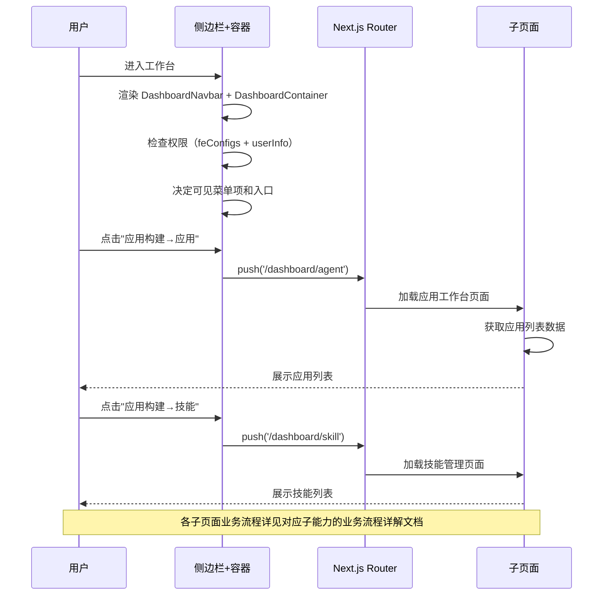

# 工作台 — 业务流程详解

## 子能力业务流程索引

工作台作为分组节点，本身不包含独立的业务流程页面。所有业务流程分散在各子能力模块中。

以下为各子能力的业务流程文档链接：

| 子能力 | 业务描述 | 场景索引 | 流程详解 |
|--------|---------|---------|---------|
| 应用工作台 | 应用列表查看、文件夹管理、搜索筛选、创建入口 | [09-业务流程索引](../应用工作台/业务流程索引.md) | [10-业务流程详解](../应用工作台/业务流程详解.md) |
| 创建应用 | 创建智能问答/Chat Agent/工作流应用的完整交互流程 | [09-业务流程索引](../创建应用/业务流程索引.md) | [10-业务流程详解](../创建应用/业务流程详解.md) |
| 评测 | 评测数据集管理、维度配置、任务执行与结果查看 | [09-业务流程索引](../评测/业务流程索引.md) | [10-业务流程详解](../评测/业务流程详解.md) |
| MCP 服务器 | MCP 服务器连接配置的增删改查流程 | [09-业务流程索引](../MCP%20服务器/业务流程索引.md) | [10-业务流程详解](../MCP%20服务器/业务流程详解.md) |
| 技能管理 | Agent 技能的创建、编辑和启停流程 | [09-业务流程索引](../技能管理/业务流程索引.md) | [10-业务流程详解](../技能管理/业务流程详解.md) |
| 系统工具 | 平台级系统工具的配置管理流程 | [09-业务流程索引](../系统工具/业务流程索引.md) | [10-业务流程详解](../系统工具/业务流程详解.md) |
| 模板市场 | 模板浏览、筛选和基于模板创建应用的流程 | [09-业务流程索引](../模板市场/业务流程索引.md) | [10-业务流程详解](../模板市场/业务流程详解.md) |
| 工具管理 | 系统工具的创建、编辑、启停和删除流程 | [09-业务流程索引](../工具管理/业务流程索引.md) | [10-业务流程详解](../工具管理/业务流程详解.md) |

## 公共业务流程

工作台公共流程由 `DashboardContainer` 组件统一承载，各子页面嵌套其中。

### 步骤 1：侧边栏导航

| 用户操作 | 触发 API | 分支条件 | 页面变化 |
|---------|---------|---------|---------|
| 页面加载，侧边栏渲染 | 无（纯前端路由） | 系统初始化完成后渲染侧边栏 | 侧边栏展示 Logo、导航菜单项；折叠/展开按钮可见 |
| 点击导航菜单项 | 无（前端路由跳转） | 点击可展开分组（应用构建/设置）→ 展开/收起子菜单；点击直接链接 → 路由跳转 | 应用构建子菜单展示：应用/技能/工具/MCP；设置子菜单展示：用量/模型/团队等 |
| 点击折叠按钮 | 无 | 侧边栏状态切换 | 侧边栏宽度从展开态变为折叠态（仅显示图标），内容区域左 padding 同步调整 |
| 折叠态点击图标 | 无 | 折叠态下点击导航项 → 跳转到该分组的第一个子页面 | 路由跳转到对应页面，侧边栏保持折叠 |

### 步骤 2：页面内容加载

| 用户操作 | 触发 API | 分支条件 | 页面变化 |
|---------|---------|---------|---------|
| 路由进入 dashboard 子页面 | 各子页面自行发起数据请求 | 进入 `/dashboard/agent` → 加载应用列表；进入 `/dashboard/templateMarket` → 加载模板列表 | 内容区域展示 Loading 状态（MyBox isLoading），加载完成后渲染子页面内容 |
| PC 端页面背景渲染 | 无 | 当前路由在 dashboard 路径列表中时 → 渲染 `BgDecoration` 装饰背景 | 内容区域显示渐变背景（#F2F8FF → #F7F9FC）+ 装饰性背景图 |

### 步骤 3：权限控制渲染

| 用户操作 | 触发 API | 分支条件 | 页面变化 |
|---------|---------|---------|---------|
| 页面加载 | 无 | `feConfigs?.show_evaluation` + `hasEvaluationCreatePer` → 显示评测入口 | 评测入口可见或隐藏 |
| 页面加载 | 无 | `userInfo?.username === 'root'` → 显示系统工具管理入口 | 设置菜单中额外出现"系统工具管理"项 |
| 页面加载 | 无 | `feConfigs?.isPlus` → 显示用量、团队、通知、自定义域名等菜单项 | 设置菜单项动态增减 |

## Mermaid 附录

