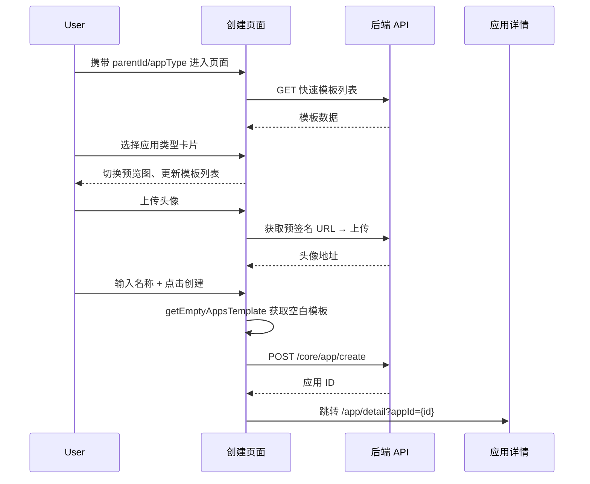
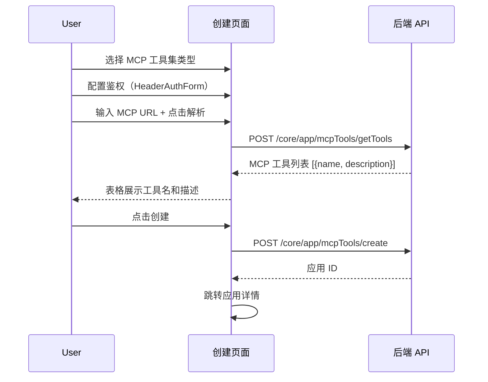
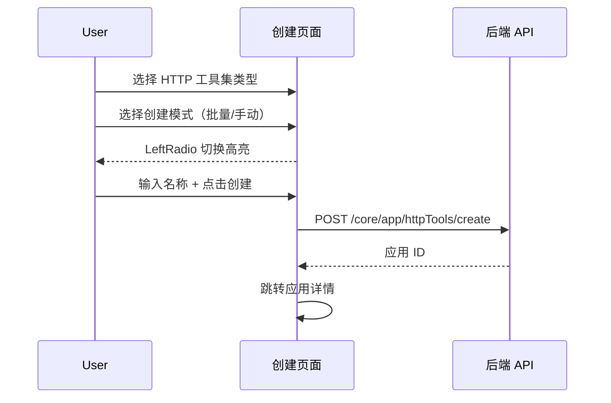
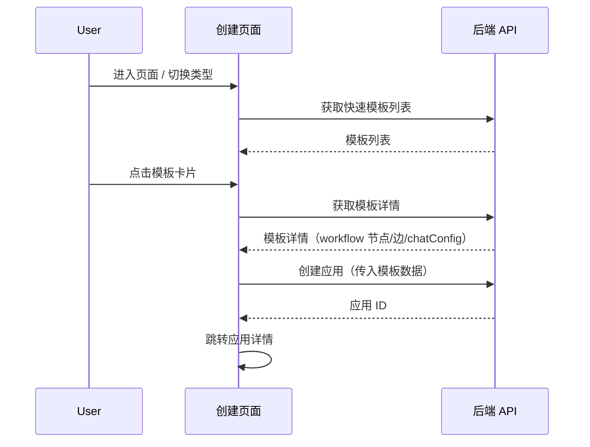
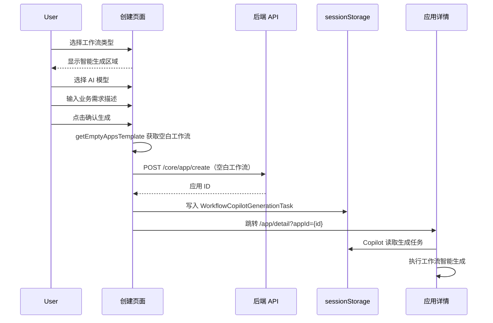

# 创建应用 — 业务流程详解

## 页面总览

创建应用页面采用左右分栏布局（PC 端），左侧为创建表单区（固定宽度，可滚动），右侧为类型预览图区。页面顶部有返回按钮，根据入口类型（Agent/工具）返回工作台或工具管理页面。表单区自上而下依次展示：应用类型选择卡片、图标与名称编辑、条件表单区域（工作流/模板/MCP/HTTP 按选中类型展示）。

### S01：创建 Agent 应用（空白模板）

> 用户从空白模板创建 Agent 类应用（Agent 对话助手 / 简单对话机器人 / 工作流编排 / 工作流工具）。

#### 步骤 1：页面初始化

| 用户操作 | 触发 API | 分支条件 | 页面变化 |
|---------|---------|---------|---------|
| 从工作台/工具管理页面点击创建，携带 `parentId` 和 `appType` query 参数进入页面 | `getTemplateMarketItemList({ isQuickTemplate: true, type })` 获取当前类型的快速模板列表 | — | 渲染创建页面：根据 `appType` 预选类型（默认为 `chatAgent`）；根据 `ToolTypeList.includes(appType)` 判断是否工具创建模式 |

- **入口分支**：`appType` 为工具类型（`mcpToolSet`/`httpToolSet`/`workflowTool`）时，`isToolType=true`，页面标题显示"创建工具"，返回按钮指向 `/dashboard/tool`；否则显示"创建 Agent"，返回按钮指向 `/dashboard/agent`。

#### 步骤 2：选择应用类型

| 用户操作 | 触发 API | 分支条件 | 页面变化 |
|---------|---------|---------|---------|
| 浏览应用类型卡片网格（3 列） | — | Agent 入口过滤出非工具类型卡片（`!ToolTypeList.includes`）；工具入口过滤出工具类型卡片（`ToolTypeList.includes`） | 当前选中卡片蓝色边框高亮（`borderColor: 'primary.300'`）；点击卡片后：切换 `selectedAppType`，模板列表按新类型刷新，预览图切换，图标重置为选中类型默认图标 |

- **类型卡片数据源**：从 `createAppTypeMap` 常量中遍历，按入口类型过滤。每张卡片显示图标、标题、简介。卡片组件为 `AppTypeCard`。

#### 步骤 3：配置图标与名称

| 用户操作 | 触发 API | 分支条件 | 页面变化 |
|---------|---------|---------|---------|
| 点击头像区域 | `getUploadAvatarPresignedUrl` → 获取预签名 URL → 上传文件 | — | 打开文件选择器，上传成功后更新头像预览 |
| 输入应用名称 | — | 名称为空时默认使用「未命名应用」 | Input 框实时更新；非 MCP 类型时名称框右侧显示「创建」按钮 |

- **头像上传**：使用 `useUploadAvatar` hook 配合 `getUploadAvatarPresignedUrl` API 上传。上传成功后回调 `setValue('avatar', avatar)` 更新表单状态。
- **即时创建**：非 MCP 工具集类型时，名称输入框右侧有「创建」按钮，点击直接以空白模板创建。

#### 步骤 4：提交创建

| 用户操作 | 触发 API | 分支条件 | 页面变化 |
|---------|---------|---------|---------|
| 点击「创建」按钮 | `getEmptyAppsTemplate(t)` 获取空白模板 → `postCreateApp` 创建应用 | `appType` 决定模板类型（`simple`/`chatAgent`/`workflow`/`workflowTool`） | 按钮显示 loading；创建成功 toast "创建成功"；自动跳转 `/app/detail?appId=${id}` |

- **空白模板结构**：`getEmptyAppsTemplate` 返回按 `AppTypeEnum` 分组的预设模板，每种类型包含初始工作流节点（如系统配置节点、工作流开始节点、AI 对话节点等）和边定义。

### S02：创建工具应用（空白模板）

> 工具类创建的基本流程与 S01 一致，区别在于类型过滤和跳转入口。

| 用户操作 | 触发 API | 分支条件 | 页面变化 |
|---------|---------|---------|---------|
| 选择工具类型卡片（`mcpToolSet`/`httpToolSet`/`workflowTool`）→ 填写名称 → 点击创建 | 根据具体类型分支调用不同 API（见 S03/S04 或 `postCreateApp`） | `appType=workflowTool` 走空白模板创建；`appType=mcpToolSet` 走 S03 流程；`appType=httpToolSet` 走 S04 流程 | 与 S01 第 4 步一致 |

### Mermaid 附录（S01/S02）

### S03：创建 MCP 工具集

> 用户选择 MCP 工具集类型，配置 MCP 服务 URL 和鉴权信息，解析工具列表后创建。

#### 步骤 1：配置鉴权

| 用户操作 | 触发 API | 分支条件 | 页面变化 |
|---------|---------|---------|---------|
| 在 HeaderAuthForm 中选择鉴权类型（None/Bearer/Basic/Custom）→ 输入对应凭证 | — | 选择 None：清空鉴权配置；选择 Bearer/Basic：显示 Value 输入框；选择 Custom：显示 Key/Value 键值对列表，可添加/删除多组 | 鉴权类型下拉切换时重置对应字段；已有 secret 的字段显示"已配置"状态，可点击编辑 |

- **鉴权组件**：使用 `HeaderAuthForm` 组件，支持 4 种鉴权类型切换。鉴权数据通过 `headerValue2StoreHeader` 转换为后端存储格式。

#### 步骤 2：解析 MCP 工具

| 用户操作 | 触发 API | 分支条件 | 页面变化 |
|---------|---------|---------|---------|
| 输入 MCP 服务 URL → 点击「解析」按钮 | `getMCPTools({ url, headerSecret })` | URL 为空时按钮无响应；解析失败 toast "MCP 工具解析失败" | 按钮显示 loading（`isGettingMCPTools`）；解析成功后工具列表填充到 `mcpToolList`，以表格展示工具名和描述 |

#### 步骤 3：提交创建

| 用户操作 | 触发 API | 分支条件 | 页面变化 |
|---------|---------|---------|---------|
| 确认工具列表 → 点击「创建」按钮 | `postCreateMCPTools({ parentId, avatar, name, url, headerSecret, toolList })` | 工具列表为空时按钮禁用 | 按钮显示 loading；创建成功 toast 后跳转 |

### Mermaid 附录（S03）

### S04：创建 HTTP 工具集

> 用户选择 HTTP 工具集类型，选择创建模式后直接创建。

#### 步骤 1：选择创建模式

| 用户操作 | 触发 API | 分支条件 | 页面变化 |
|---------|---------|---------|---------|
| 浏览 HTTP 工具创建模式（批量创建 / 手动创建） | — | — | `LeftRadio` 单选组件展示两种模式，附带说明文字；选中项蓝色高亮 |

- **批量创建（batch）**：通过导入 OpenAPI Schema 批量生成 HTTP 工具。
- **手动创建（manual）**：手动配置单个 HTTP 工具的请求参数。

#### 步骤 2：提交创建

| 用户操作 | 触发 API | 分支条件 | 页面变化 |
|---------|---------|---------|---------|
| 填写名称 → 点击「创建」 | `postCreateHttpTools({ parentId, avatar, name, createType })` | — | 按钮显示 loading；创建成功 toast 后跳转 |

### Mermaid 附录（S04）

### S05：从快速模板创建

> 用户通过模板卡片一键创建应用，模板包含完整的工作流节点、边和对话配置。

#### 步骤 1：加载模板列表

| 用户操作 | 触发 API | 分支条件 | 页面变化 |
|---------|---------|---------|---------|
| 页面加载 / 切换应用类型 | `getTemplateMarketItemList({ isQuickTemplate: true, type: selectedAppType })` | 模板列表为空时不渲染模板区域 | `templateData.list` 填充；`isLoadingTemplates` 控制 loading 状态 |

- **模板过滤**：请求参数 `isQuickTemplate: true` 仅返回快速模板，`type` 按当前选中类型过滤。切换 `selectedAppType` 时通过 `refreshDeps` 自动重新请求。

#### 步骤 2：浏览与选择模板

| 用户操作 | 触发 API | 分支条件 | 页面变化 |
|---------|---------|---------|---------|
| 浏览模板卡片网格（3 列） | — | 模板区域标题显示"从模板创建"，右侧链接跳转至完整模板市场 | 每张卡片显示模糊背景头像、居中图标、模板名称、简介；鼠标悬停显示蓝色边框和阴影 |

#### 步骤 3：从模板创建

| 用户操作 | 触发 API | 分支条件 | 页面变化 |
|---------|---------|---------|---------|
| 点击模板卡片 | 先调 `getTemplateMarketItemDetail(templateId)` 获取模板详情；再调 `postCreateApp({ ..., modules, edges, chatConfig, templateId })` | 其他创建正在进行时忽略点击（`!creatingTemplateId` 守卫） | 卡片显示 loading 状态（`isLoading`）；成功后跳转 |

- **模板创建 vs 空白创建**：模板路径调用 `postCreateApp` 时传入 `templateDetail.workflow.nodes`、`templateDetail.workflow.edges`、`templateDetail.workflow.chatConfig` 和 `templateId` 字段，替换空白模板的默认节点。

### Mermaid 附录（S05）

### S06：智能生成工作流

> 仅在选中工作流类型（`AppTypeEnum.workflow`）时显示。用户输入业务需求描述，选择 AI 模型，系统创建空白工作流并将生成任务写入 sessionStorage，跳转后由 Copilot 执行生成。

#### 步骤 1：配置生成参数

| 用户操作 | 触发 API | 分支条件 | 页面变化 |
|---------|---------|---------|---------|
| 选择智能生成模型 | — | 模型列表为空时不显示选择器 | `AIModelSelector` 组件显示，默认选中 `defaultModels.llm` 或列表第一项 |
| 输入业务需求描述 | — | 描述为空时「确认生成」按钮禁用 | 多行文本输入框，placeholder 提示输入业务背景、核心流程、具体要求 |

- **模型选择器**：使用 `AIModelSelector` 组件，列表来自 `useSystemStore.llmModelList`，以单行下拉模式展示，显示模型图标和名称。

#### 步骤 2：创建并存储生成任务

| 用户操作 | 触发 API | 分支条件 | 页面变化 |
|---------|---------|---------|---------|
| 点击「确认生成」 | 先调 `getEmptyAppsTemplate` → `postCreateApp` 创建空白工作流；然后将 `WorkflowCopilotGenerationTask` 写入 `sessionStorage` | 描述为空或模型未选时按钮禁用 | 按钮显示 loading（`isCreatingSmartWorkflow`）；成功后跳转应用详情 |

- **生成任务结构**（`WorkflowCopilotGenerationTask`）：包含 `appId`（新创建的应用 ID）、`requirement`（用户输入的需求描述）、`model`（选中的 AI 模型 ID）、`createdAt`（时间戳）。存入 `sessionStorage` 的 key 为 `WORKFLOW_COPILOT_TASK_STORAGE_KEY`。应用详情页的 Copilot 模块读取此任务并执行工作流生成。

### Mermaid 附录（S06）

