# 工具管理 — 业务流程详解

## 页面总览

工具管理页面是用户查看、创建和管理 AI 工具的统一入口。页面按三行布局组织：第一行为面包屑导航和工具类型总切换（我的工具/系统工具），第二行为类型筛选栏、搜索框和操作按钮，第三行为工具卡片列表和文件夹详情侧边面板。页面通过 `AppListContextProvider` 提供统一的分页、搜索和文件夹管理上下文，ToolModal 处理三种工具类型的差异化创建流程。

---

### S01：查看工具列表

> 用户进入工具管理页面，查看当前层级（根目录或某个文件夹下）的所有工具。列表以卡片网格形式展示，采用无限滚动分页加载。

#### 步骤 1：进入页面，加载初始数据

| 用户操作 | 触发 API | 分支条件 | 页面变化 |
|---------|---------|---------|---------|
| 点击侧边导航栏"工具管理"或直接在浏览器输入 `/dashboard/tool` | POST /core/app/list（第1页，parentId=路由query中的parentId，type=全量工具类型） | — | 页面框架渲染，显示 DashboardContainer 侧边栏和背景装饰；AppListContextProvider 开始加载数据，List 区域显示加载中的 Spinner |

#### 步骤 2：数据加载完成，渲染工具卡片

| 用户操作 | 触发 API | 分支条件 | 页面变化 |
|---------|---------|---------|---------|
| 等待加载完成 | — | myApps 非空 → 渲染工具卡片网格；myApps 为空且不在文件夹中 → 根据权限显示"暂无工具"空状态提示；myApps 为空且在文件夹中 → 显示空状态 | Spinner 消失，工具卡片以 CSS Grid 布局展示，每张卡片显示工具头像、名称、简介；若用户有创建权限，网格首项显示"新建"入口卡片 |

#### 步骤 3：滚动到底部，触发翻页

| 用户操作 | 触发 API | 分支条件 | 页面变化 |
|---------|---------|---------|---------|
| 向下滚动列表至底部 | POST /core/app/list（pageNum+1，其他参数不变） | hasMore=true → 追加下一页数据；hasMore=false → 不再触发请求 | 底部显示加载 Spinner，新数据追加到列表末尾，Spinner 消失。若已无更多数据，底部不再显示加载指示器 |

#### 步骤 4：存在文件夹时，加载文件夹详情

| 用户操作 | 触发 API | 分支条件 | 页面变化 |
|---------|---------|---------|---------|
| （自动触发）进入 URL 带 parentId 的页面 | GET /core/app/detail?appId={parentId}；GET /core/app/folder/path?parentId={parentId} | parentId 存在 → 并行请求详情和面包屑；parentId 为空 → 不发起请求 | 面包屑导航栏显示完整路径（根→...→当前文件夹）；PC 端右侧展示 FolderSlideCard 面板，含文件夹名称/简介/操作按钮/协作者列表 |

#### 数据加载详情

| 加载阶段 | API | 关键参数 | 数据处理 | 渲染结果 |
|---------|-----|---------|---------|---------|
| 首次加载 | POST /core/app/list | parentId, type: [toolFolder, workflowTool, mcpToolSet, httpToolSet], pageNum=1, pageSize=默认 | 按创建时间排序 | 工具卡片网格第一页 |
| 翻页 | POST /core/app/list | pageNum=N, 其他同上 | 追加到现有列表 | 追加第N页卡片 |
| 文件夹详情 | GET /core/app/detail | appId=parentId | 提取 name/intro/permission 等字段 | 右侧面板展示 |
| 面包屑路径 | GET /core/app/folder/path | parentId | 转换为 {parentId, parentName}[] 数组 | 顶部面包屑导航 |

- 分页参数：通过 useInfiniteScroll 管理，默认每页数量由后端控制
- 筛选条件：搜索关键词和类型筛选均作为 API 参数传递，搜索词经 500ms 防抖后发送
- 轮询刷新：无自动轮询，仅用户主动操作（创建/编辑/删除后）触发 loadMyApps 刷新

#### Mermaid 附录

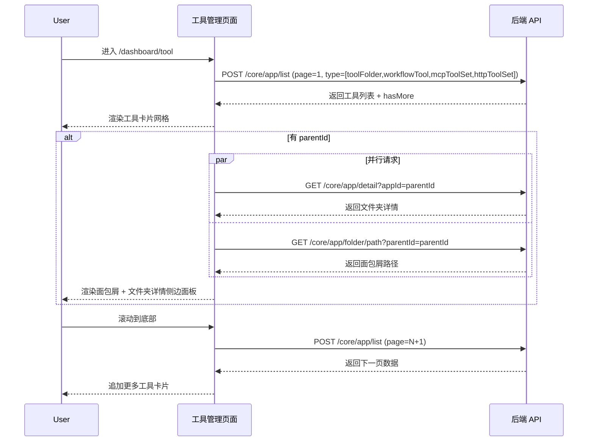

---

### S02：切换工具类型筛选

> 用户在工具列表页通过 MyTabBar 切换类型筛选标签（全部 / 工作流工具 / HTTP 工具集 / MCP 工具集），列表刷新显示对应类型的工具。

#### 步骤 1：点击类型筛选标签

| 用户操作 | 触发 API | 分支条件 | 页面变化 |
|---------|---------|---------|---------|
| 点击类型筛选标签（如"工作流工具"） | POST /core/app/list（type=选中的工具类型，pageNum=1，重置列表） | 选择"全部" → type 不传具体过滤器，覆盖全部工具类型；选择具体类型 → type 传单一类型值 | 当前标签变为激活态（蓝色边框+背景），之前的列表清空，显示加载 Spinner，加载完成后展示筛选后的工具卡片 |

#### Mermaid 附录

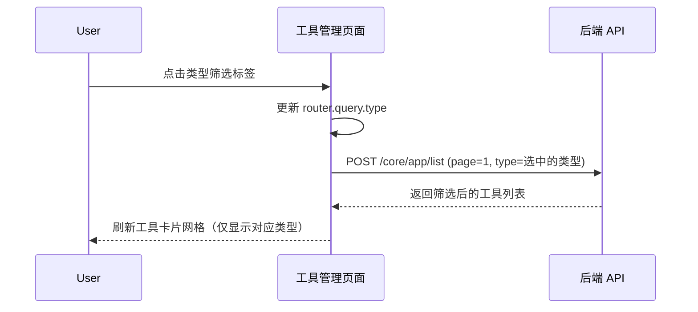

---

### S03：搜索工具

> 用户在搜索框输入工具名称关键词，页面自动触发服务端搜索，结果实时更新。

#### 步骤 1：输入搜索关键词

| 用户操作 | 触发 API | 分支条件 | 页面变化 |
|---------|---------|---------|---------|
| 在搜索框中输入关键词（如"客服"） | POST /core/app/list（searchKey=输入值，pageNum=1） | 防抖 500ms → 关键词变化后等待 500ms 才发请求；关键词为空 → 恢复显示全部工具；连续输入 → 每次输入重置防抖计时 | 输入过程中不立即搜索；500ms 无输入后发送请求，列表显示加载状态，完成后展示匹配工具。空结果时显示"未找到相关工具"空状态提示 |

#### Mermaid 附录

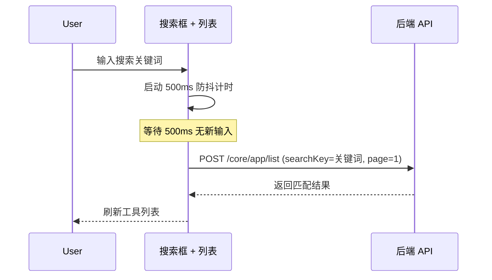

---

### S04：创建文件夹

> 用户创建新文件夹用于组织管理工具。需要填写名称和简介，支持上传自定义头像。

#### 步骤 1：打开创建文件夹弹窗

| 用户操作 | 触发 API | 分支条件 | 页面变化 |
|---------|---------|---------|---------|
| 点击"新建文件夹"按钮 | — | 当前为根目录且 userInfo.team.permission.hasAppCreatePer 为 true → 按钮可见；在文件夹中且 folderDetail.permission.hasWritePer 为 true → 按钮可见；权限不足 → 按钮隐藏 | 弹出 EditFolderModal，包含名称输入框、简介输入框、头像上传区域 |

#### 步骤 2：填写文件夹信息并提交

| 用户操作 | 触发 API | 分支条件 | 页面变化 |
|---------|---------|---------|---------|
| 输入文件夹名称（必填）、简介（选填）；可选点击头像上传自定义图片；点击"确认"按钮 | POST /core/app/folder/create（name, intro, avatar, parentId, type='toolFolder'） | 名称为空 → 提示必填；名称合法 → 提交请求；请求失败 → 显示错误 Toast（"Error"） | 确认按钮显示加载状态（isLoading）；成功后关闭弹窗，列表自动刷新显示新文件夹 |

#### 表单字段清单

| 字段名 | 控件类型 | 必填 | 默认值 | 可选值/约束 | 编辑时只读 | 说明 |
|--------|---------|------|--------|------------|-----------|------|
| 名称 | 文本输入 | 是 | — | 最大长度有限制 | 否 | 文件夹显示名称 |
| 简介 | 文本输入 | 否 | — | — | 否 | 文件夹描述，显示在详情面板 |
| 头像 | 图片上传 | 否 | 默认文件夹图标 | 通过预签名 URL 上传 | 否 | 文件夹头像，点击触发文件选择器 |

#### 校验规则

| 规则 | 触发时机 | 错误提示文案 |
|------|---------|-------------|
| 名称必填 | 提交时 | 根据组件校验提示 |

#### Mermaid 附录

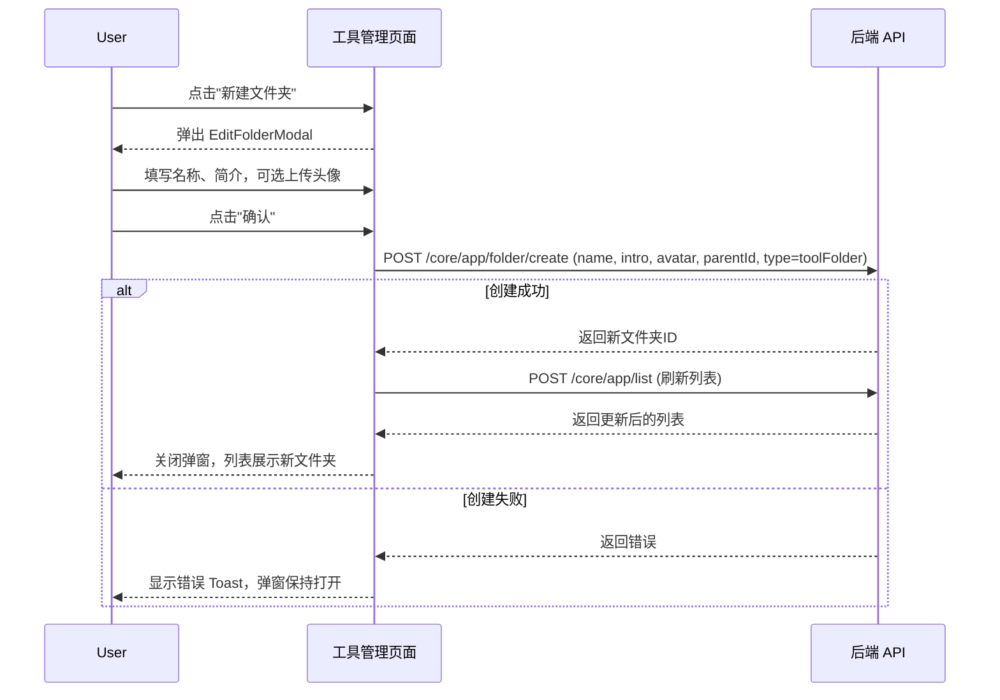

---

### S05：创建工具

> 用户创建新的 AI 工具，支持三种类型：工作流工具、HTTP 工具集、MCP 工具集。每种类型有不同的创建流程和表单字段。

#### 步骤 1：打开创建工具菜单

| 用户操作 | 触发 API | 分支条件 | 页面变化 |
|---------|---------|---------|---------|
| 点击"新建工具"下拉按钮（主按钮，蓝色） | — | 有创建权限时按钮可见（同 S04 权限判断）；无权限 → 按钮隐藏 | 弹出 MyMenu 下拉菜单，显示三个工具类型选项和导入 JSON 选项 |

#### 步骤 2：选择工具类型，弹出创建弹窗

| 用户操作 | 触发 API | 分支条件 | 页面变化 |
|---------|---------|---------|---------|
| 在下拉菜单中选择一种工具类型（工作流工具/HTTP工具集/MCP工具集） | — | 选择工作流工具 → 显示模板列表 + "空白创建"入口；选择 HTTP 工具集 → 显示创建类型选择（批量/手动）；选择 MCP 工具集 → 显示 MCP URL 输入 + 工具列表解析 | 弹出 ToolModal，根据所选类型渲染不同的表单内容 |

#### 步骤 3A：创建工作流工具

| 用户操作 | 触发 API | 分支条件 | 页面变化 |
|---------|---------|---------|---------|
| 输入工具名称；可选选择模板列表中的模板卡片，或点击"空白创建"卡片 | 选择模板后 → GET /core/app/template/detail（获取模板详情）；确认后 → POST /core/app/create（含 modules/edges/chatConfig） | 选择模板 → 使用模板的工作流节点和边创建；空白创建 → 使用空工作流模板 | 确认按钮显示加载状态；创建成功后自动跳转到 /app/detail?appId=新工具ID 进行工作流编排 |

#### 步骤 3B：创建 HTTP 工具集

| 用户操作 | 触发 API | 分支条件 | 页面变化 |
|---------|---------|---------|---------|
| 输入工具名称；选择创建类型（批量导入/手动编写） | POST /core/app/httpTool/create（name, avatar, parentId, createType） | 选择批量 → createType='batch'；选择手动 → createType='manual' | 确认按钮显示加载；成功后跳转应用详情页 |

#### 步骤 3C：创建 MCP 工具集

| 用户操作 | 触发 API | 分支条件 | 页面变化 |
|---------|---------|---------|---------|
| 输入工具名称；填写 MCP 服务器 URL；可选配置认证头；点击"解析"按钮获取工具列表 | 解析 → POST /core/app/mcpTool/list（url, headerSecret）；创建 → POST /core/app/mcpTool/create（url, headerSecret, toolList） | MCP URL 为空 → 确认按钮不可点击；工具列表为空 → 确认按钮置灰（isDisabled）；解析失败 → 显示错误 Toast（"MCP 工具解析失败"）；解析成功 → 表格列出工具名称和描述 | 点击"解析"→ 按钮显示加载；解析成功后工具列表表格填充数据；确认按钮在工具列表为空时禁用 |

#### 表单字段清单（工作流工具）

| 字段名 | 控件类型 | 必填 | 默认值 | 可选值/约束 | 说明 |
|--------|---------|------|--------|------------|------|
| 名称 | 文本输入 | 是 | — | 名称不可为空 | 工具显示名称 |
| 头像 | 图片上传 | 否 | 类型默认图标 | 通过预签名 URL 上传 | 可自定义头像 |
| 模板 | 模板卡片选择 | 否 | — | 从模板市场快速模板列表选择 | 选择模板后使用模板的工作流结构 |

#### 表单字段清单（HTTP 工具集）

| 字段名 | 控件类型 | 必填 | 默认值 | 可选值/约束 | 说明 |
|--------|---------|------|--------|------------|------|
| 名称 | 文本输入 | 是 | — | — | 工具集名称 |
| 创建类型 | 单选按钮组 | 是 | 批量 | 批量 / 手动 | 批量通过 URL 导入，手动逐条编写 |

#### 表单字段清单（MCP 工具集）

| 字段名 | 控件类型 | 必填 | 默认值 | 可选值/约束 | 说明 |
|--------|---------|------|--------|------------|------|
| 名称 | 文本输入 | 是 | — | — | 工具集名称 |
| MCP URL | 文本输入 | 是 | — | 有效 MCP 服务地址 | 点击"解析"后连接 MCP 服务获取工具列表 |
| 认证头 | 键值对配置 | 否 | {} | 通过 HeaderAuthForm 组件配置 | MCP 服务的认证信息 |
| 工具列表 | 只读表格 | 自动填充 | [] | 解析后自动填充 | 显示 name 和 description |

#### 字段联动（MCP 工具集）

- 当 MCP URL 已填写时，"解析"按钮才可点击
- 解析成功后，工具列表表格自动填充数据
- 工具列表为空时，确认创建按钮置灰不可点击

#### 校验规则

| 规则 | 触发时机 | 错误提示文案 |
|------|---------|-------------|
| 名称必填 | 提交时（所有类型）| "应用名称不能为空" |
| MCP URL 必填 | 提交时（MCP 类型）| "MCP 工具 URL 不能为空" |
| MCP 工具解析失败 | 解析时 | "MCP 工具解析失败" |
| 创建失败 | 提交后 | "创建失败" |

#### Mermaid 附录

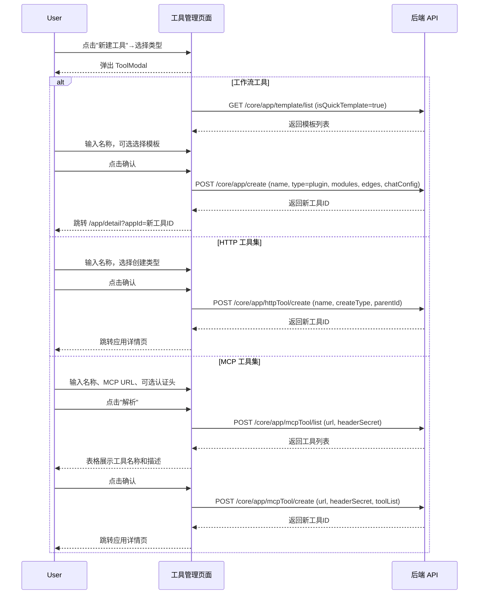

---

### S06：编辑工具/文件夹信息

> 用户修改工具或文件夹的名称、简介和头像。

#### 步骤 1：打开编辑弹窗

| 用户操作 | 触发 API | 分支条件 | 页面变化 |
|---------|---------|---------|---------|
| 操作工具 → 工具卡片更多菜单（⋮）→ 点击"编辑"；操作文件夹 → 文件夹详情面板 → 点击编辑按钮 | — | 权限不足 → 编辑选项隐藏 | 弹出 EditResourceModal（工具）或 EditFolderModal（文件夹），表单预填当前名称、简介、头像 |

#### 步骤 2：修改并保存

| 用户操作 | 触发 API | 分支条件 | 页面变化 |
|---------|---------|---------|---------|
| 修改名称/简介/头像 → 点击保存 | PUT /core/app/update?appId={id}（name, intro, avatar） | 名称未修改 → 仍提交原值；上传新头像 → 先获取预签名 URL 上传图片，再提交更新 | 保存按钮显示加载状态；成功后关闭弹窗，列表和详情面板自动刷新显示新信息 |

#### 校验规则

| 规则 | 触发时机 | 错误提示文案 |
|------|---------|-------------|
| 名称不可为空 | 提交时 | "应用名称不能为空" |

#### Mermaid 附录

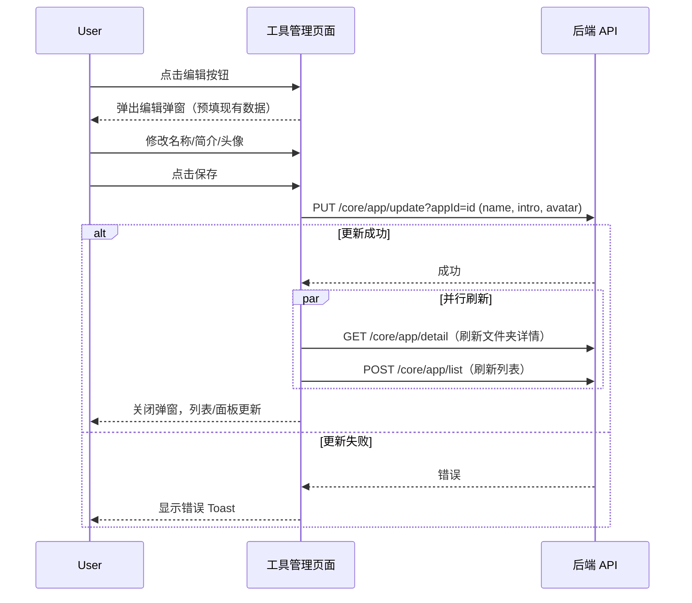

---

### S07：移动工具/文件夹

> 用户将工具或文件夹移动到另一个目标文件夹。

#### 步骤 1：打开移动弹窗

| 用户操作 | 触发 API | 分支条件 | 页面变化 |
|---------|---------|---------|---------|
| 工具卡片更多菜单 → 点击"移动"；或文件夹详情面板 → 点击移动按钮 | — | 权限不足 → 移动选项隐藏 | 弹出 MoveModal，显示文件夹树供选择目标位置 |

#### 步骤 2：选择目标文件夹并确认

| 用户操作 | 触发 API | 分支条件 | 页面变化 |
|---------|---------|---------|---------|
| 在文件夹树中选择目标文件夹 → 点击确认 | PUT /core/app/update?appId={id}（parentId=目标文件夹ID） | 目标与当前位置相同 → 无变化；目标不同 → 发起移动请求 | 确认按钮显示加载状态；成功后关闭弹窗，列表从当前位置移除该条目，若在详情面板打开状态则跳转回上级 |

#### Mermaid 附录

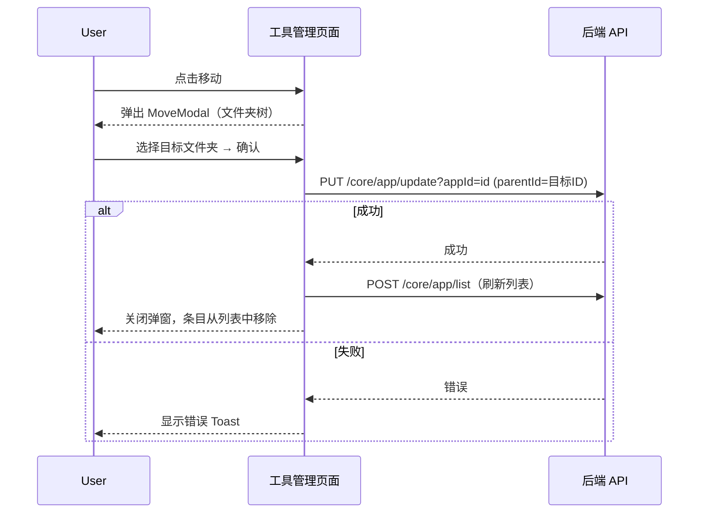

---

### S08：删除工具/文件夹

> 用户删除指定工具或文件夹。

#### 步骤 1：触发删除确认

| 用户操作 | 触发 API | 分支条件 | 页面变化 |
|---------|---------|---------|---------|
| 工具卡片更多菜单 → 点击"删除"；或文件夹详情面板 → 点击删除按钮 | — | 仅拥有者或管理员可见删除选项；无权限 → 隐藏 | 弹出确认弹窗（DelConfirmModal / PopoverConfirm），显示删除提示文案 |

#### 步骤 2：确认删除

| 用户操作 | 触发 API | 分支条件 | 页面变化 |
|---------|---------|---------|---------|
| 在确认弹窗中点击"确认删除" | DELETE /core/app/del?appId={id} | 删除文件夹 → 同时清除该文件夹下所有子项的 localStorage 缓存（app_log_keys_{appId}）；在当前文件夹详情面板中删除且文件夹有父级 → 删除后跳转到上级文件夹 | 确认按钮显示加载；成功后弹窗关闭，列表刷新，条目消失。若当前处于被删除文件夹的详情面板且为 PC 端 → 自动路由跳转到上级文件夹 |

#### 删除链路详情

- **确认弹窗**：PopoverConfirm 组件，提示文案通过 `deleteTip` prop 传入（如"确认删除此文件夹？"）
- **单条删除**：调用 delAppById 传入 appId，成功后清除 localStorage 中的日志缓存
- **级联影响**：删除文件夹后，文件夹下的所有工具和子文件夹一同删除；详情面板自动收起，路由回退到上级文件夹

#### Mermaid 附录

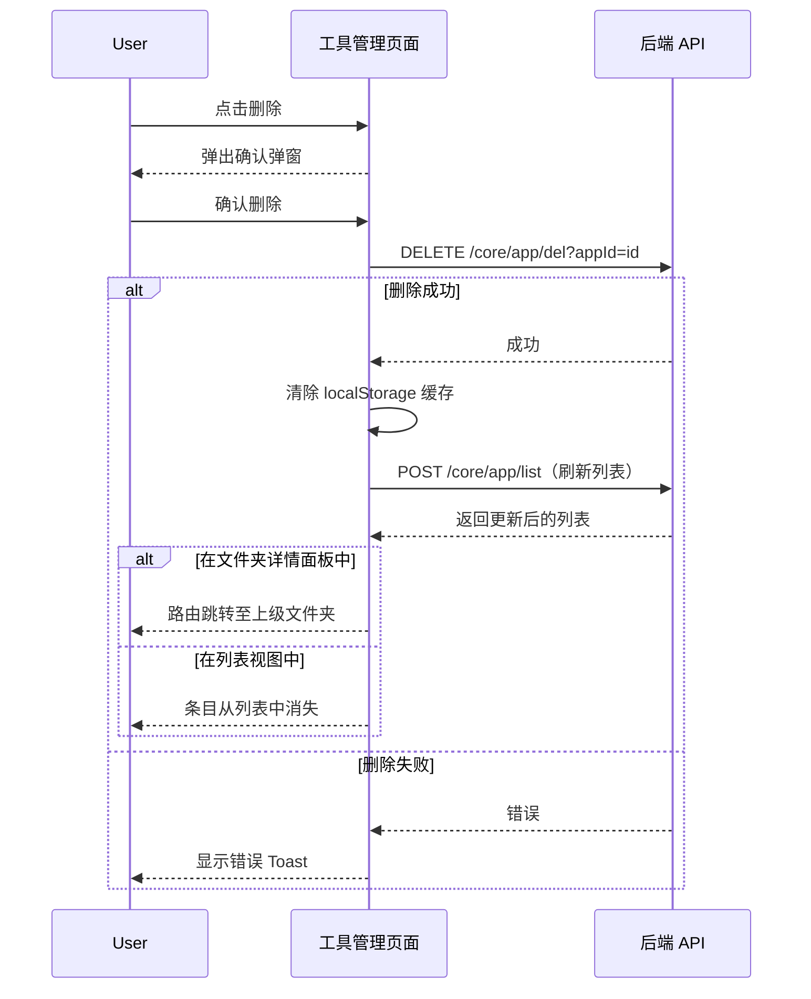

---

### S09：管理协作者权限

> 用户为文件夹或工具配置协作者及其权限级别，或恢复权限继承。

#### 步骤 1：查看和修改协作者

| 用户操作 | 触发 API | 分支条件 | 页面变化 |
|---------|---------|---------|---------|
| 在文件夹详情面板 → 协作者区域 → 点击设置按钮 | POST /proApi/core/app/collaborator/list（appId） | feConfigs.isPlus 为 false → 协作者区域不显示；无管理权限 → 设置按钮隐藏 | 弹出 ConfigPerModal，显示现有协作者列表（MemberListCard），每项显示用户名和权限级别 |

#### 步骤 2：添加或修改协作者

| 用户操作 | 触发 API | 分支条件 | 页面变化 |
|---------|---------|---------|---------|
| 搜索用户 → 选择权限级别（只读/编辑/管理）→ 添加 | POST /proApi/core/app/collaborator/update（appId, members） | — | 新协作者出现在列表中 |

#### 步骤 3：移除协作者

| 用户操作 | 触发 API | 分支条件 | 页面变化 |
|---------|---------|---------|---------|
| 点击协作者旁的删除按钮 | DELETE /proApi/core/app/collaborator/delete（appId, memberId） | — | 该协作者从列表中移除 |

#### 步骤 4：恢复权限继承

| 用户操作 | 触发 API | 分支条件 | 页面变化 |
|---------|---------|---------|---------|
| 点击"恢复权限继承"按钮 | GET /core/app/resumeInheritPermission?appId={id} | isInheritPermission 为 true → 不显示该按钮（已处于继承状态）；hasParent 为 false → 不显示（根级无父级可继承） | 成功后权限恢复为从父文件夹继承，协作者列表更新 |

#### Mermaid 附录

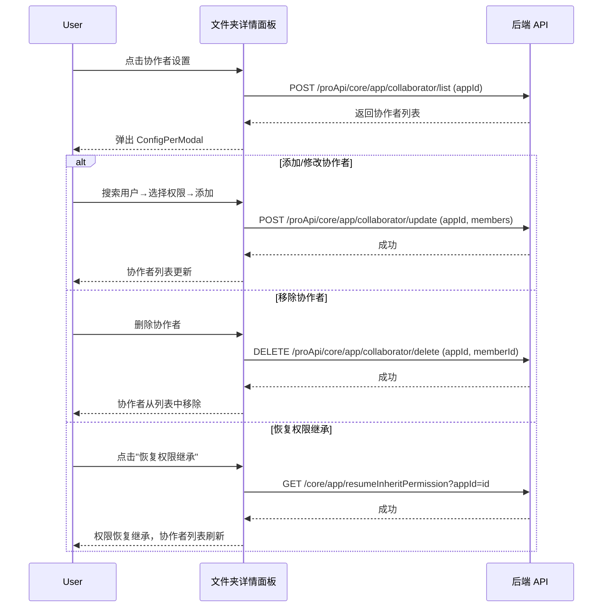

---

### S10：复制工具

> 用户创建工具的完整副本。

#### 步骤 1：触发复制

| 用户操作 | 触发 API | 分支条件 | 页面变化 |
|---------|---------|---------|---------|
| 工具卡片更多菜单 → 点击"复制" | — | — | 弹出确认弹窗（ConfirmCopyModal） |

#### 步骤 2：确认复制

| 用户操作 | 触发 API | 分支条件 | 页面变化 |
|---------|---------|---------|---------|
| 确认复制 | POST /core/app/copy（appId） | — | 按钮显示加载；成功后弹窗关闭，列表刷新，新工具副本出现在列表中 |

#### Mermaid 附录

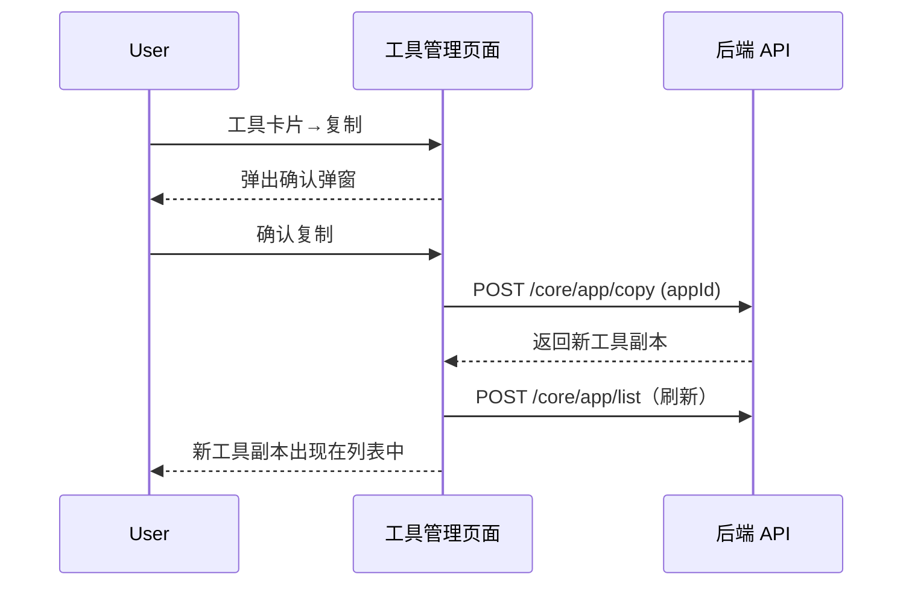

---

### S11：导入 JSON 配置

> 用户从 JSON 文件导入工作流配置创建新工具。

#### 步骤 1：打开导入弹窗

| 用户操作 | 触发 API | 分支条件 | 页面变化 |
|---------|---------|---------|---------|
| "新建工具"下拉 → "导入 JSON 配置"；或页面加载时检测到会话存储中的工作流 URL | — | 有工作流 URL → 挂载时自动打开弹窗（useMount 内 getUtmWorkflow() 检测）；无 → 手动点击触发 | 弹出 JsonImportModal，提供 JSON 配置导入界面 |

#### 步骤 2：选择/上传 JSON 配置文件

| 用户操作 | 触发 API | 分支条件 | 页面变化 |
|---------|---------|---------|---------|
| 选择本地 JSON 配置文件并确认导入 | 内部调用 postCreateApp（传入从 JSON 解析的 modules, edges, chatConfig） | JSON 格式无效 → 提示格式错误；有效 → 提交创建 | 创建成功后自动跳转到应用详情页 |

#### Mermaid 附录

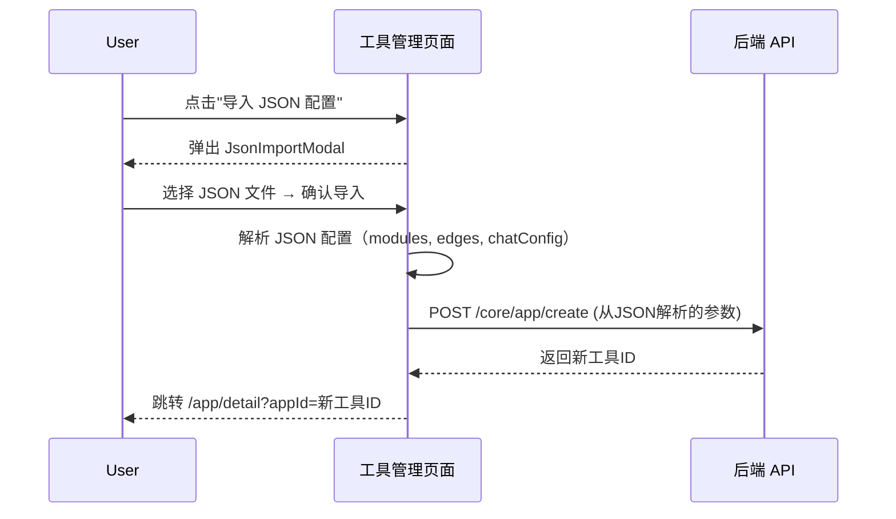

---

### S12：导航到文件夹

> 用户通过面包屑导航进入特定文件夹，查看该文件夹下的工具。

#### 步骤 1：点击面包屑路径

| 用户操作 | 触发 API | 分支条件 | 页面变化 |
|---------|---------|---------|---------|
| 点击面包屑路径中某一级（如"根 → 我的工具集"中的"根"） | POST /core/app/list（parentId=点击层级的ID）；GET /core/app/detail（新的 parentId）；GET /core/app/folder/path（新的 parentId） | 点击最后一级（当前文件夹）→ forbidLastClick=true，不可点击；点击中间级 → 跳转到对应层级 | 路由 query 更新 parentId → AppListContextProvider 检测变化后发起新请求 → 列表和详情面板刷新。面包屑中超过3级则中间部分折叠为"..."，hover 展开下拉菜单 |
