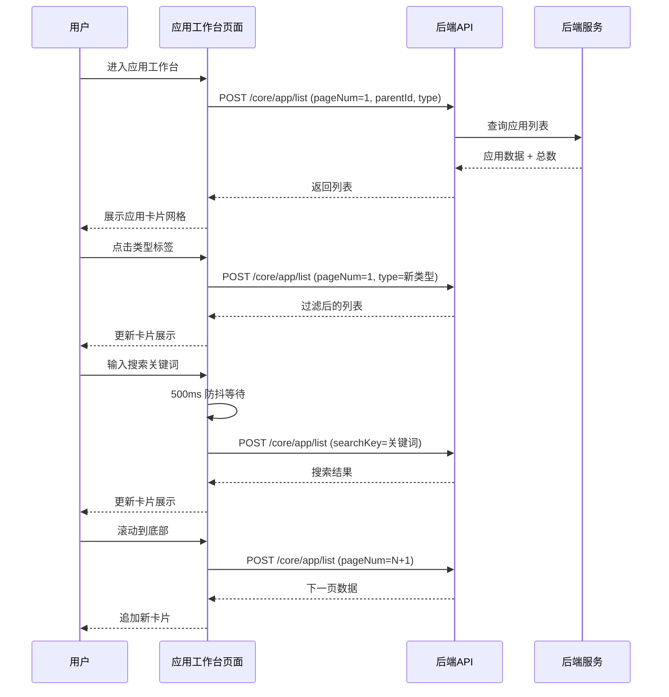
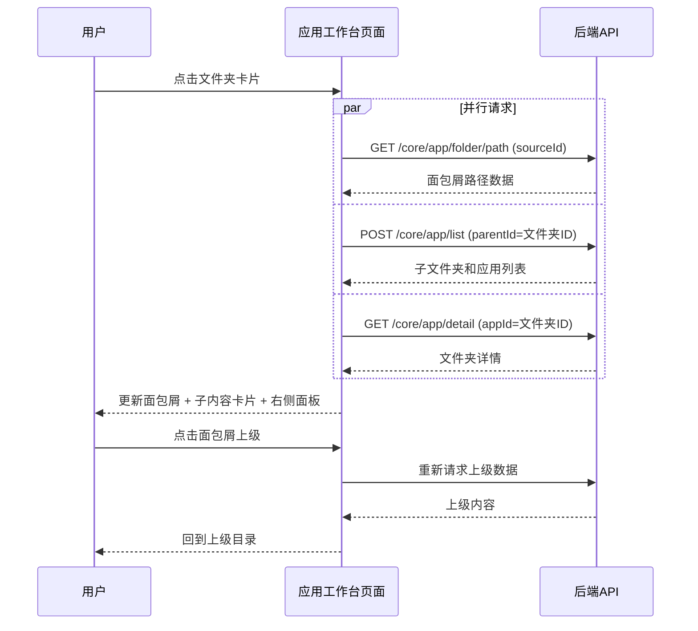
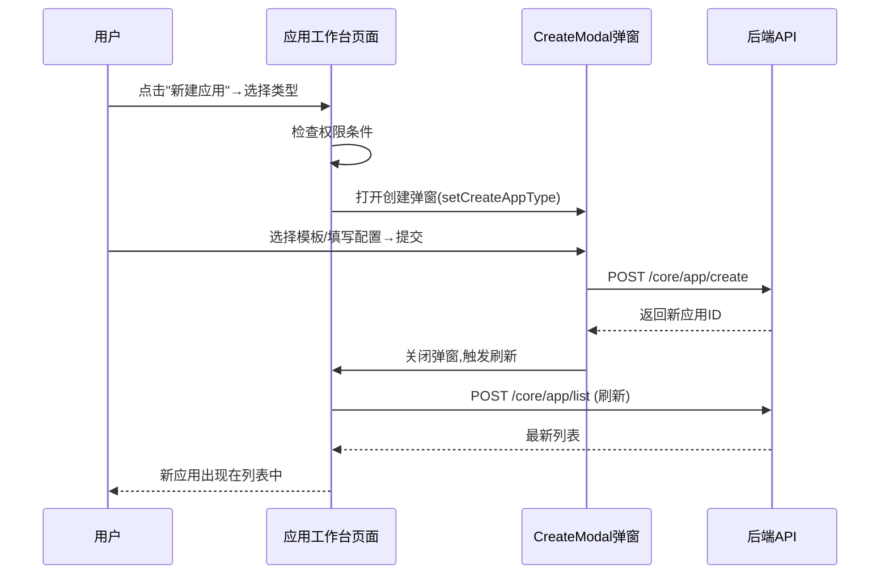
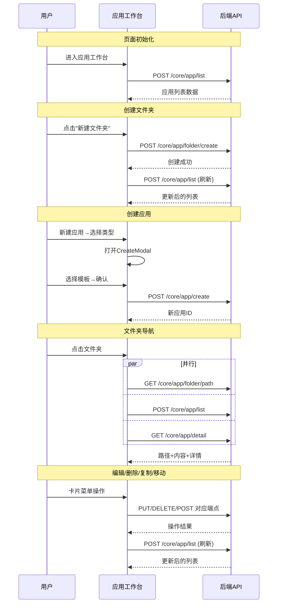

# 应用工作台 — 业务流程详解

## 页面总览

应用工作台是用户管理所有 AI 应用的中心页面。页面左侧为 DashboardContainer 提供的侧边栏导航，主内容区默认展示应用卡片网格，顶部提供类型筛选标签、搜索框和操作按钮（新建文件夹、新建应用）。进入文件夹后，右侧滑出文件夹详情面板。

本页面无 Tab 子页面拆分——所有功能在单一页面内通过弹窗和路由参数切换完成。

---

## 浏览和筛选应用列表

> **业务描述**: 用户进入应用工作台后查看当前层级下的应用列表，可通过类型标签筛选和名称搜索定位目标应用。

### 步骤 1：页面初始化加载

| 用户操作 | 触发 API | 分支条件 | 页面变化 |
|---------|---------|---------|---------|
| 通过侧边栏点击"应用"或直接访问 `/dashboard/agent` | POST `/core/app/list`（getMyAppsPaginated） | parentId 从 URL query 中读取，默认 null；type 默认 'all' | 页面显示背景装饰，应用列表区域显示加载中状态（MyBox 的 isLoading），加载完成后展示应用卡片网格；若无应用且不在文件夹内，显示创建引导卡片 |

**数据加载详情**：

| 加载阶段 | API | 关键参数 | 数据处理 | 渲染结果 |
|---------|-----|---------|---------|---------|
| 首次加载 | POST /core/app/list | pageNum=1, pageSize=默认分页, parentId, type=formatType, searchKey | useInfiniteScroll 管理列表与分页 | 应用卡片网格 |
| 滚动加载更多 | POST /core/app/list | pageNum=N+1, pageSize=默认分页, 其余参数同上 | 追加到现有列表末尾 | 列表底部显示 Spinner 加载指示器 |
| 刷新列表 | POST /core/app/list | pageNum=1（重置） | 完全替换列表数据 | 列表重新渲染 |

- 分页机制：基于 IntersectionObserver 的无限滚动（useInfiniteScroll），底部哨兵元素触发自动加载
- 排序规则：默认由服务端排序
- 筛选条件：类型标签（type 参数）过滤；搜索词经 500ms 防抖后生效

### 步骤 2：类型筛选

| 用户操作 | 触发 API | 分支条件 | 页面变化 |
|---------|---------|---------|---------|
| 点击顶部 MyTabs 标签（全部/智能问答/Chat Agent/工作流） | POST `/core/app/list`（自动触发） | 选择非"全部"时，formatType 变为 `[AppTypeEnum.folder, 所选type]` | URL query 更新 `type` 参数；列表重新加载，仅显示对应类型的应用；当前标签高亮 |

### 步骤 3：搜索应用

| 用户操作 | 触发 API | 分支条件 | 页面变化 |
|---------|---------|---------|---------|
| 在搜索框中输入应用名称 | POST `/core/app/list`（500ms 防抖后触发） | searchKey 非空时作为请求参数发送 | 输入过程中列表不变；防抖等待结束后重新加载列表；搜索无结果时显示空状态提示 |

### Mermaid 附录

---

## 文件夹导航

> **业务描述**: 用户点击文件夹卡片进入子文件夹，通过面包屑路径导航层级。

### 步骤 1：进入文件夹

| 用户操作 | 触发 API | 分支条件 | 页面变化 |
|---------|---------|---------|---------|
| 点击文件夹类型应用卡片 | GET `/core/app/folder/path`（并行）；POST `/core/app/list`（并行）；GET `/core/app/detail`（仅 parentId 存在时） | 应用 type 属于 AppFolderTypeList | URL 更新 parentId 参数；面包屑路径更新；应用列表重新加载当前文件夹内容；右侧滑出文件夹详情面板 |

### 步骤 2：通过面包屑返回上级

| 用户操作 | 触发 API | 分支条件 | 页面变化 |
|---------|---------|---------|---------|
| 点击面包屑中的上级路径 | 同上（重新加载） | 目标 parentId 不等于当前 | URL 更新为上级 parentId；面包屑缩短；列表刷新；若返回根级，文件夹详情面板消失 |

### Mermaid 附录

---

## 创建应用

> **业务描述**: 用户通过新建应用菜单选择类型后，弹出创建弹窗，选择模板后创建应用。

### 步骤 1：选择应用类型

| 用户操作 | 触发 API | 分支条件 | 页面变化 |
|---------|---------|---------|---------|
| 点击"新建应用"下拉按钮，从菜单中点击具体类型（智能问答/Chat Agent/工作流） | 无 | 在文件夹内时：folderDetail.permission.hasWritePer 为 true 且 folderDetail.type 非 httpPlugin；在根级时：userInfo.team.permission.hasAppCreatePer 为 true | 按钮可用状态取决于权限条件；点击后设置 createAppType 状态，触发 CreateModal 弹窗 |

### 步骤 2：在创建弹窗中完成创建

| 用户操作 | 触发 API | 分支条件 | 页面变化 |
|---------|---------|---------|---------|
| 在 CreateModal 中选择模板/输入配置并提交 | 由 CreateModal 内部触发创建 API | 根据选择的 appType 不同，创建不同类型的应用 | 弹窗关闭；调用 loadMyApps 刷新列表；新创建的应用出现在列表中 |

**后置影响**: 新应用创建成功，可能跳转到应用详情页，列表自动刷新。

### Mermaid 附录

---

## 创建文件夹

> **业务描述**: 用户创建新文件夹来组织应用。

### 步骤 1：打开创建弹窗并提交

| 用户操作 | 触发 API | 分支条件 | 页面变化 |
|---------|---------|---------|---------|
| 点击"新建文件夹"按钮 | 无 | 权限判断同创建应用 | 打开 EditFolderModal 弹窗，空表单 |
| 填写文件夹名称、描述，上传头像（可选），点击确认 | POST `/core/app/folder/create` | — | 弹窗显示提交中状态；成功后弹窗关闭，列表刷新 |

**表单字段清单**：

| 字段名 | 控件类型 | 必填 | 默认值 | 可选值/约束 | 编辑时只读 | 说明 |
|--------|---------|------|--------|------------|-----------|------|
| 名称 | 文本输入 | ✅ | — | — | 否 | 文件夹显示名称 |
| 描述 | 文本输入 | 否 | — | — | 否 | 文件夹说明文字 |
| 头像 | 图片上传 | 否 | 默认图标 | 通过 getUploadAvatarPresignedUrl 获取上传 URL | 否 | 文件夹封面图 |

**后置影响**: 新文件夹创建成功，列表自动刷新，新文件夹卡片出现在当前位置。

---

## 编辑应用信息

> **业务描述**: 修改应用的基本信息（名称、头像、描述）。

### 步骤 1：打开编辑弹窗

| 用户操作 | 触发 API | 分支条件 | 页面变化 |
|---------|---------|---------|---------|
| 悬停应用卡片，点击更多菜单 → "编辑信息" | 无 | 应用 type 为 httpPlugin 时 toast 警告提示已废弃；菜单按钮可见条件：AppFolderTypeList 类型需 hasManagePer，否则需 hasWritePer 或 hasReadChatLogPer | 菜单打开；点击后打开 EditResourceModal，预填当前名称、头像、描述 |

### 步骤 2：修改并提交

| 用户操作 | 触发 API | 分支条件 | 页面变化 |
|---------|---------|---------|---------|
| 修改字段后点击确认 | PUT `/core/app/update`（通过 onUpdateApp → putAppById） | 仅修改发生变化的字段 | 弹窗关闭；列表自动刷新（loadMyApps、refetchFolderDetail、refetchPaths 并行刷新） |

---

## 复制应用

> **业务描述**: 创建应用的完整副本。

| 用户操作 | 触发 API | 分支条件 | 页面变化 |
|---------|---------|---------|---------|
| 点击卡片菜单 → "复制应用" | 弹出确认弹窗（ConfirmCopyModal），提示文案为"确认复制该应用？" | 应用不能是文件夹/MCP工具集/HTTP工具集/HTTP插件 | 确认弹窗打开 |
| 确认复制 | POST `/core/app/copy` | — | 成功后自动跳转至新应用详情页 `/app/detail?appId={newAppId}` |

---

## 删除应用/文件夹

> **业务描述**: 删除应用或文件夹。文件夹删除会级联删除所有子内容。需要用户输入确认文本。

### 删除链路详情

- **引用检查**: 工具类应用（非文件夹）删除前检查 `relatedAppCount`（关联应用数）是否为 0。若 > 0，删除按钮置灰并提示"该工具被 N 个应用引用，无法删除"。文件夹删除无引用检查。
- **确认弹窗**: 弹窗类型为 `delete`（useConfirm）。Agent 类应用提示"确认删除该应用？将同时删除关联的对话记录和配置"；文件夹提示"确认删除该文件夹？文件夹内所有应用和子文件夹将被一并删除"。需在输入框中输入应用/文件夹名称以确认。
- **级联影响**: 删除后从 localStorage 移除对应的 `app_log_keys_{appId}` 缓存；若删除的是文件夹，URL 自动跳转到上级 parentId。
- **后置影响**: 列表刷新，删除的应用卡片消失。

---

## 导出应用为 Skill

| 用户操作 | 触发 API | 分支条件 | 页面变化 |
|---------|---------|---------|---------|
| 点击卡片菜单 → "导出为 Skill" | 无 | 应用类型属于 AppTypeList（Agent 类） | 关闭菜单，打开 ExportSkillModal |
| 在弹窗中设置 Skill 名称和描述 → 确认导出 | POST `/core/app/exportSkill`（以 Blob 形式下载） | — | 触发浏览器下载 .zip 文件 |

---

## 移动应用

| 用户操作 | 触发 API | 分支条件 | 页面变化 |
|---------|---------|---------|---------|
| 点击卡片菜单 → "移动到" | 无 | 需 hasManagePer 权限；文件夹类型需 hasManagePer | 设置 moveAppId，打开 MoveModal 弹窗 |
| 在弹窗中选择目标文件夹 → 确认移动 | PUT `/core/app/update`（更新 parentId） | — | 弹窗关闭；列表和路径刷新 |

---

## 导入 JSON 配置

| 用户操作 | 触发 API | 分支条件 | 页面变化 |
|---------|---------|---------|---------|
| 通过菜单点击"导入 JSON 配置"或页面加载时检测到 sessionStorage 中的工作流 URL | 无 | URL 中有 utm_workflow 参数时自动弹出 | 打开 JsonImportModal 弹窗 |
| 在弹窗中粘贴 JSON 或上传文件 → 确认导入 | 弹窗内部调用导入 API | — | 弹窗关闭；列表刷新 |

---

## 权限管理

| 用户操作 | 触发 API | 分支条件 | 页面变化 |
|---------|---------|---------|---------|
| 点击卡片菜单 → "权限管理" | GET `/core/app/getPermission`（获取协作者列表） | 需 hasManagePer | 打开 ConfigPerModal，展示当前协作者列表和权限配置 |
| 添加/修改协作者 | POST `/core/app/collaborator/update` | — | 协作者列表更新 |
| 删除协作者 | DELETE `/core/app/collaborator/delete` | — | 协作者从列表中移除 |
| 恢复权限继承 | GET `/core/app/resumeInheritPermission` | 文件夹有 parentId 且 inheritPermission 为 false | 恢复到与父文件夹一致的权限设置 |
| 转让所有者 | POST `/proApi/core/app/changeOwner` | 当前用户为 isOwner | 所有者变更，权限面板关闭 |

---

## Mermaid 附录（总览）

