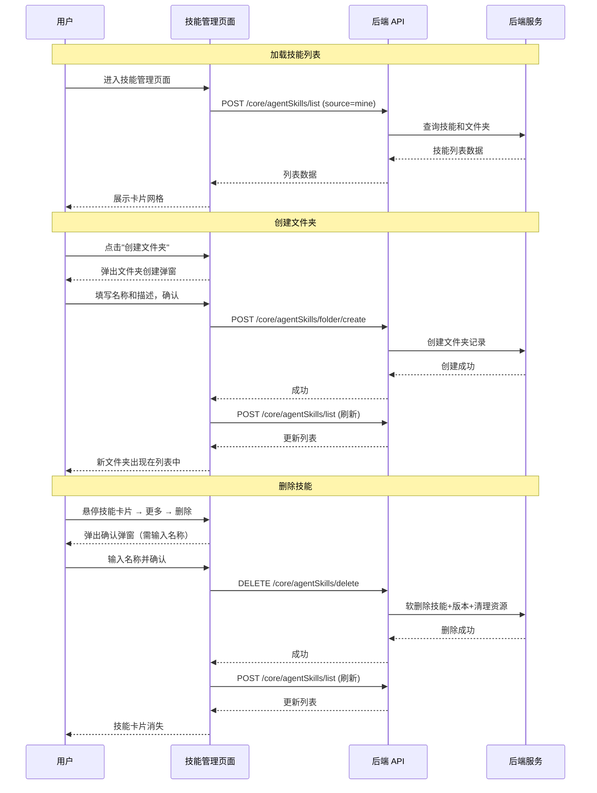

# 技能管理 — 业务流程详解

## 页面总览

技能管理页面是工作台中管理 Agent 技能的中心入口，以文件夹树形层级组织技能，通过卡片网格展示每个技能/文件夹的基本信息。页面顶部提供搜索、创建文件夹、创建技能、导入技能等操作入口，每个技能卡片支持编辑、移动、权限管理、导出、复制、删除等生命周期操作。

## 加载技能列表

> 业务描述: 用户进入技能管理页面或切换文件夹时，系统加载当前目录下的技能和文件夹列表。

### 步骤 1：页面初始化

| 用户操作 | 触发 API | 分支条件 | 页面变化 |
|---------|---------|---------|---------|
| 从工作台左侧导航点击"技能管理" Tab | POST /core/agentSkills/list（参数: source=mine, searchKey="", parentId=null） | — | 页面显示技能容器框架，卡片区域显示加载中（MyBox 加载态），加载完成后显示技能/文件夹卡片网格 |

系统同时从 URL 读取 `parentId` 查询参数。若 `parentId` 存在且有值，则加载该文件夹下的内容；否则加载根目录。

### 步骤 2：面包屑路径加载（仅文件夹内）

| 用户操作 | 触发 API | 分支条件 | 页面变化 |
|---------|---------|---------|---------|
| —（自动触发） | GET /core/agentSkills/folder/path（参数: sourceId=parentId, type=current） | parentId 非空时触发；parentId 为空时不请求 | 顶部显示面包屑导航路径（FolderPath 组件），可逐级返回 |

**数据加载详情**：

| 加载阶段 | API | 关键参数 | 数据处理 | 渲染结果 |
|---------|-----|---------|---------|---------|
| 首次加载 | POST /core/agentSkills/list | source=mine, parentId="" | 日期字符串转 Date 对象，权限数据构造为 SkillPermission 实例 | 技能/文件夹卡片网格 |
| 进入文件夹 | POST /core/agentSkills/list | source=mine, parentId={id} | 同上 | 子目录技能/文件夹卡片网格 |

- **搜索防抖**: 500ms，输入即触发请求
- **刷新依赖**: `searchKey` 和 `parentId` 变化时自动重新请求
- **空状态**: 无技能时显示 EmptyTip 组件，提示"暂无技能"

## 搜索技能

> 业务描述: 用户在当前文件夹下输入关键词搜索技能和文件夹。

### 步骤 1：输入搜索关键词

| 用户操作 | 触发 API | 分支条件 | 页面变化 |
|---------|---------|---------|---------|
| 在搜索框中输入关键词 | POST /core/agentSkills/list（参数更新 searchKey） | 输入后 500ms 防抖触发 | 搜索过程中保持当前列表可见，请求返回后列表更新为搜索结果 |

- **搜索范围**: 当前文件夹（含 parentId 过滤）
- **搜索字段**: 技能/文件夹名称
- **空结果**: 搜索有结果时正常展示，无结果时列表为空但不显示 EmptyTip（与无数据时的空状态区分）

## 文件夹钻取导航

> 业务描述: 用户点击文件夹卡片进入子目录，通过面包屑导航返回上级。

### 步骤 1：进入文件夹

| 用户操作 | 触发 API | 分支条件 | 页面变化 |
|---------|---------|---------|---------|
| 点击文件夹卡片 | POST /core/agentSkills/list（参数: parentId={folderId}）+ GET /core/agentSkills/folder/path | 文件夹类型（type=folder） | URL 更新为 `?parentId={folderId}`，面包屑替换标题文本，列表刷新为子目录内容 |

### 步骤 2：返回上级

| 用户操作 | 触发 API | 分支条件 | 页面变化 |
|---------|---------|---------|---------|
| 点击面包屑中的某一级路径 | POST /core/agentSkills/list（参数: parentId={目标ID}） | — | 列表切换为该层级内容，面包屑截断到该层级 |

- **面包屑末级**: 不可点击（forbidLastClick）
- **根目录**: 面包屑消失，显示"Skill"标题

## 创建文件夹

> 业务描述: 用户在当前目录下创建新的技能文件夹。

### 步骤 1：打开创建弹窗

| 用户操作 | 触发 API | 分支条件 | 页面变化 |
|---------|---------|---------|---------|
| 点击"创建文件夹"按钮 | — | hasCreatePer 为 true 时按钮可见；为 false 时按钮隐藏 | 弹出 EditFolderModal，标题为创建文件夹，表单包含名称（必填）和描述 |

### 步骤 2：提交创建

| 用户操作 | 触发 API | 分支条件 | 页面变化 |
|---------|---------|---------|---------|
| 填写名称和描述，点击确认 | POST /core/agentSkills/folder/create（参数: name, description, parentId） | — | 弹窗关闭，列表自动刷新（loadSkills），新文件夹出现在列表中 |

**表单字段清单**：

| 字段名 | 控件类型 | 必填 | 默认值 | 可选值/约束 | 编辑时只读 | 说明 |
|--------|---------|------|--------|------------|-----------|------|
| 名称 | 文本输入 | ✅ | — | — | 否 | 文件夹名称 |
| 描述 | 文本输入 | 否 | — | — | 否 | 文件夹描述 |

**后置影响**: 创建成功后列表刷新，新文件夹出现在当前目录的卡片网格中。

**失败场景**: 网络异常时显示错误 Toast "Error"。

## 创建技能

> 业务描述: 用户创建新的自定义 Agent 技能。

### 步骤 1：打开创建弹窗

| 用户操作 | 触发 API | 分支条件 | 页面变化 |
|---------|---------|---------|---------|
| 点击"创建技能"按钮（Hover 触发下拉菜单）→ 选择"自定义技能" | — | hasCreatePer 为 true 时按钮可见 | 弹出 CreateSkillModal |

### 步骤 2：填写技能信息并提交

| 用户操作 | 触发 API | 分支条件 | 页面变化 |
|---------|---------|---------|---------|
| 填写技能名称、描述，选择图标，点击确认 | POST /core/agentSkills/create（参数: name, description, avatar, parentId, ...） | — | 创建成功后弹窗关闭，跳转到技能详情页 `/skill/detail?skillId={newSkillId}` |

**后置影响**: 创建成功后跳转技能详情页而非刷新列表，用户可在详情页编辑 SKILL.md 和文件树。

## 导入技能

> 业务描述: 用户从 ZIP/TAR 压缩包导入技能。

### 步骤 1：打开导入弹窗

| 用户操作 | 触发 API | 分支条件 | 页面变化 |
|---------|---------|---------|---------|
| 点击"创建技能"→ 选择"导入压缩包" | — | hasCreatePer 为 true | 弹出 ImportSkillModal，显示拖拽上传区域 |

### 步骤 2：选择/拖拽文件

| 用户操作 | 触发 API | 分支条件 | 页面变化 |
|---------|---------|---------|---------|
| 点击上传区域选择文件 或 拖拽文件到上传区 | — | 文件格式校验 → 非 .zip/.tar/.tar.gz → Toast 警告"不支持的文件格式 {ext}" | 拖拽悬停时边框变为主色调 |
| 文件格式通过校验 | — | 文件大小校验 → 超过 50MB → Toast 警告"部分文件大小超过 {maxSize} 限制" | 上传区域替换为文件信息卡片（名称、大小、删除按钮） |

### 步骤 3：确认导入

| 用户操作 | 触发 API | 分支条件 | 页面变化 |
|---------|---------|---------|---------|
| 点击确认按钮 | POST /core/agentSkills/import（FormData: file + parentId?） | — | 按钮显示加载态（isImporting），成功后弹窗关闭，列表刷新。失败时显示错误 Toast |

**校验规则**：

| 规则 | 触发时机 | 错误提示文案 |
|------|---------|-------------|
| 文件格式校验 | 文件选择/拖拽释放时 | "不支持的文件格式 {ext}"（i18n: skill:unsupported_file_format） |
| 文件大小校验（≤50MB） | 文件选择/拖拽释放时 | "部分文件大小超过 {maxSize} 限制"（i18n: file:some_file_size_exceeds_limit） |

**前置条件**: 文件格式为 .zip/.tar/.tar.gz；文件大小 ≤ 50MB。

**后置影响**: 后端在事务中创建技能记录、上传 ZIP 到 MinIO、创建 v0 版本记录。

## 编辑技能信息

> 业务描述: 用户修改技能的名称、头像和描述。

### 步骤 1：打开编辑弹窗

| 用户操作 | 触发 API | 分支条件 | 页面变化 |
|---------|---------|---------|---------|
| 悬停技能卡片 → 更多菜单出现 → 点击"编辑信息" | — | 仅个人技能（source=personal）的更多菜单可见，系统技能不显示 | 弹出 EditResourceModal，预填当前名称、头像、描述 |

### 步骤 2：修改并提交

| 用户操作 | 触发 API | 分支条件 | 页面变化 |
|---------|---------|---------|---------|
| 修改名称/头像/描述，点击确认 | POST /core/agentSkills/update（参数: skillId, name, avatar, description） | — | 弹窗关闭，列表刷新（loadSkills），卡片信息更新 |

**表单字段清单**：

| 字段名 | 控件类型 | 必填 | 默认值 | 可选值/约束 | 编辑时只读 | 说明 |
|--------|---------|------|--------|------------|-----------|------|
| 名称 | 文本输入 | ✅ | 当前名称 | — | 否 | 技能/文件夹名称 |
| 头像 | 图标选择 | 否 | 当前头像 | 预设图标库 | 否 | 技能图标 |
| 描述 | 文本输入 | 否 | 当前描述 | — | 否 | 技能描述 |

## 移动技能/文件夹

> 业务描述: 用户将技能或文件夹移动到其他文件夹。

### 步骤 1：打开移动弹窗

| 用户操作 | 触发 API | 分支条件 | 页面变化 |
|---------|---------|---------|---------|
| 卡片悬停 → 更多菜单 → 点击"移动到" | — | 仅个人技能可见 | 弹出 MoveModal，显示可用文件夹列表 |

### 步骤 2：选择目标并确认

| 用户操作 | 触发 API | 分支条件 | 页面变化 |
|---------|---------|---------|---------|
| 在文件夹列表中选择目标文件夹（或根目录），点击确认 | POST /core/agentSkills/update（参数: skillId, parentId） | targetId="root" 时 parentId=null | 弹窗关闭，列表刷新 |

- **文件夹列表来源**: GET /core/agentSkills/list（source=mine, type=folder），以树形展示
- **移动提示**: 显示"移动技能提示"文案（i18n: skill:move_skill_hint）

## 权限设置

> 业务描述: 用户管理技能的协作者权限和所有者。

### 步骤 1：打开权限弹窗

| 用户操作 | 触发 API | 分支条件 | 页面变化 |
|---------|---------|---------|---------|
| 卡片悬停 → 更多菜单 → 点击"权限设置" | — | 仅个人技能可见 | 弹出 ConfigPerModal，显示当前权限配置 |

### 步骤 2：权限管理操作

ConfigPerModal 内部提供以下操作：

| 操作 | 触发 API | 说明 |
|------|---------|------|
| 添加/修改协作者 | POST `/core/agentSkills/collaborator/update`（通过 collaborator.ts） | 设置协作者角色权限 |
| 删除协作者 | DELETE `/core/agentSkills/collaborator/delete`（通过 collaborator.ts） | 移除协作者 |
| 转让所有者 | POST /proApi/core/agentSkills/changeOwner（参数: skillId, ownerId） | 将技能所有权转给其他团队成员 |
| 恢复权限继承 | GET /core/agentSkills/resumeInheritPermission（参数: skillId） | 当技能在文件夹内时，可恢复继承父文件夹的权限设置 |

**前置条件**（恢复权限继承）: 技能有父文件夹（hasParent=true）且当前未继承权限（isInheritPermission=false）。

**后置影响**: 所有权限操作后自动刷新列表。

## 导出技能

> 业务描述: 用户将技能配置打包下载为 ZIP 文件。

| 用户操作 | 触发 API | 分支条件 | 页面变化 |
|---------|---------|---------|---------|
| 卡片悬停 → 更多菜单 → 点击"导出配置" | GET /api/core/agentSkills/export?skillId={id} | 仅非文件夹的技能可见此菜单项 | 浏览器触发文件下载，文件名为 `{技能名}.zip`。导出前显示全局加载遮罩 |

**前置条件**: 技能类型非文件夹（type≠folder）；技能来源为个人（source=personal）。

**失败场景**: 导出失败时显示错误 Toast "导出失败"（i18n: skill:export_failed）。

## 复制技能

> 业务描述: 用户创建技能的完整副本。

### 步骤 1：确认复制

| 用户操作 | 触发 API | 分支条件 | 页面变化 |
|---------|---------|---------|---------|
| 卡片悬停 → 更多菜单 → 点击"复制技能" | — | 仅非文件夹的个人技能可见 | 弹出确认弹窗，内容为"确认复制此技能？"（i18n: skill:copy_skill_confirm） |

### 步骤 2：执行复制

| 用户操作 | 触发 API | 分支条件 | 页面变化 |
|---------|---------|---------|---------|
| 点击确认 | POST /core/agentSkills/copy（参数: skillId） | — | 弹窗关闭，列表刷新，副本技能出现在同一目录下 |

## 删除技能/文件夹

> 业务描述: 用户删除个人技能或文件夹。

### 步骤 1：检查可删除条件

删除按钮的可用性取决于关联应用数量：

| 条件 | 按钮状态 | 提示 |
|------|---------|------|
| 关联应用数 > 0（文件夹） | 置灰（disabled） | "文件夹内有应用引用的技能，无法删除"（i18n: skill:folder_delete_disabled_tip） |
| 关联应用数 > 0（技能） | 置灰（disabled） | "技能被应用引用，无法删除"（i18n: skill:delete_disabled_tip） |
| 关联应用数 = 0 | 可点击 | — |

### 步骤 2：二次确认

| 用户操作 | 触发 API | 分支条件 | 页面变化 |
|---------|---------|---------|---------|
| 点击"删除"菜单 | — | — | 弹出删除确认弹窗，需输入技能名称确认（inputConfirmText），显示自定义内容"确认删除提示"（i18n: skill:confirm_delete_tip） |

### 步骤 3：执行删除

| 用户操作 | 触发 API | 分支条件 | 页面变化 |
|---------|---------|---------|---------|
| 输入技能名称并确认 | DELETE /core/agentSkills/delete（参数: skillId） | — | 弹窗关闭，列表刷新（loadSkills），技能/文件夹卡片消失 |

**前置条件**: 技能来源为个人（source=personal）；关联应用数为 0。

**后置影响（后端）**:
1. 文件夹类型 → 递归查找所有子节点（findSkillAndAllChildren）
2. 批量软删除技能记录（设置 deleteTime）
3. 批量软删除版本记录（设置 isDeleted=true）
4. 异步清理 MinIO 包文件 + 技能头像文件
5. 异步清理关联沙箱资源

**失败场景**: 网络异常时显示错误 Toast "删除失败"（i18n: skill:delete_failed）；技能不存在时后端抛出 "Skill not found"。

## Mermaid 附录

