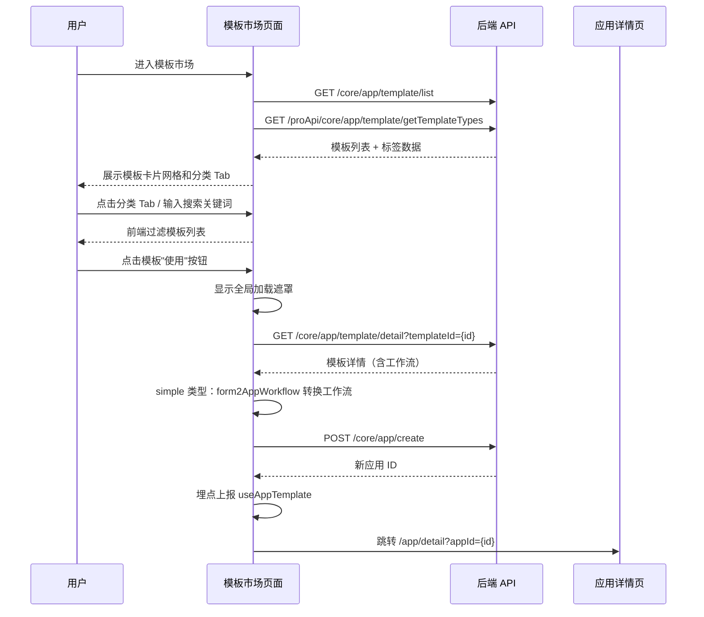

# 模板市场 — 业务流程详解

## 页面总览

模板市场是工作台中的一个独立页面，用户在此浏览和选用预构建的 AI 应用模板。页面顶部为分类筛选 Tab 栏和搜索框，主体区域为模板卡片网格。用户可按分类筛选、关键词搜索来定位目标模板，点击"使用"按钮即可一键将模板创建为自己的应用。

## S01：浏览模板市场

> 用户从工作台侧边栏导航进入模板市场页面，首次加载展示全部模板卡片。

### 步骤 1：进入模板市场页面

| 用户操作 | 触发 API | 分支条件 | 页面变化 |
|---------|---------|---------|---------|
| 在工作台侧边栏点击"模板市场"导航项 | — | 点击导航项时若侧边栏处于收起状态，直接跳转 | 页面路由切换到 /dashboard/templateMarket，显示页面加载骨架 |

### 步骤 2：页面数据加载

| 用户操作 | 触发 API | 分支条件 | 页面变化 |
|---------|---------|---------|---------|
| —（自动触发） | GET /core/app/template/list（获取全部模板列表） | 无 | 模板卡片网格渲染，每个卡片显示模板头像、名称、简介、作者、标签和"使用"按钮 |
| —（自动触发） | GET /proApi/core/app/template/getTemplateTypes（Plus 版）或使用默认标签（社区版） | 系统为 Plus 版时调 API 获取自定义标签；社区版使用默认标签 | 顶部分类 Tab 栏渲染，包含"全部"标签和各类别标签，每个标签显示对应模板数量 |

### 步骤 3：浏览模板卡片

| 用户操作 | 触发 API | 分支条件 | 页面变化 |
|---------|---------|---------|---------|
| 滚动鼠标查看模板卡片 | — | 无 | 卡片网格随滚动展示更多模板。响应式网格列数随屏幕宽度变化（1~5列） |
| 鼠标悬停在卡片上 | — | 无 | 卡片显示"使用"按钮悬浮层 |
| 点击模板卡片的体验链接 | — | 模板有 `experienceUrl` 时显示体验入口 | 新窗口打开体验链接 |

#### 数据加载详情

| 加载阶段 | API | 关键参数 | 数据处理 | 渲染结果 |
|---------|-----|---------|---------|---------|
| 首次加载 | GET /core/app/template/list | type: undefined（获取全部） | 前端过滤隐藏指定模板（ID 以 -assistant 结尾的模板） | 模板卡片网格 |
| 标签加载 | GET /proApi/core/app/template/getTemplateTypes 或默认标签 | — | 前端注入推荐标签（推荐/企业微信专区），按 typeOrder 排序 | 分类 Tab 栏 |

## S02：按分类筛选模板

> 用户在分类 Tab 栏中点击某个类别标签，模板卡片列表只展示属于该类别的模板。

### 步骤 1：点击分类标签

| 用户操作 | 触发 API | 分支条件 | 页面变化 |
|---------|---------|---------|---------|
| 点击顶部分类 Tab（如"对话"） | —（纯前端过滤，不调用 API） | 无 | 被点击的 Tab 高亮为蓝色激活态。模板卡片列表即时过滤，只显示 tags 属性包含该分类 ID 的模板卡片 |

### 步骤 2：切换分类

| 用户操作 | 触发 API | 分支条件 | 页面变化 |
|---------|---------|---------|---------|
| 点击"全部" Tab 或另一个分类 Tab | — | 无 | 激活态切换到新 Tab，模板列表按新分类重新过滤。若搜索框中有关键词，分类过滤和关键词搜索叠加生效 |

## S03：搜索模板

> 用户在搜索框中输入关键词，模板列表实时按模板名称和简介进行模糊匹配过滤。

### 步骤 1：输入搜索关键词

| 用户操作 | 触发 API | 分支条件 | 页面变化 |
|---------|---------|---------|---------|
| 在搜索框中输入关键词（如"客服"） | —（纯前端过滤） | 无 | 搜索框显示输入内容。模板卡片列表即时过滤，仅显示名称或简介中包含关键词的模板。过滤与当前选中的分类 Tab 叠加生效 |

### 步骤 2：搜索结果为空

| 用户操作 | 触发 API | 分支条件 | 页面变化 |
|---------|---------|---------|---------|
| —（自动） | — | `filteredList.length === 0` | 页面中央显示空数据提示："暂无可用模板" |

### 步骤 3：清除搜索

| 用户操作 | 触发 API | 分支条件 | 页面变化 |
|---------|---------|---------|---------|
| 清空搜索框内容 | — | 无 | 模板列表恢复为仅按当前分类 Tab 过滤的完整结果 |

## S04：使用模板创建应用

> 用户点击模板卡片上的"使用"按钮，系统获取模板详情构建工作流，创建新应用并跳转到应用详情页。

### 步骤 1：点击"使用"按钮

| 用户操作 | 触发 API | 分支条件 | 页面变化 |
|---------|---------|---------|---------|
| 鼠标悬停模板卡片 → 点击"使用"按钮 | — | 无 | "使用"按钮冒泡阻止，不触发卡片的其它点击事件。页面显示全局加载遮罩（MyBox isLoading） |

### 步骤 2：获取模板详情

| 用户操作 | 触发 API | 分支条件 | 页面变化 |
|---------|---------|---------|---------|
| —（自动触发） | GET /core/app/template/detail?templateId={id} | 无 | 遮罩显示中，获取模板完整工作流数据 |

### 步骤 3：处理简单应用模板

| 用户操作 | 触发 API | 分支条件 | 页面变化 |
|---------|---------|---------|---------|
| —（自动） | — | 模板类型为 simple 时，调用 form2AppWorkflow 将表单配置转为工作流节点和边；其他类型直接使用模板的 workflow 数据 | 同步骤 2，加载遮罩显示中 |

### 步骤 4：创建应用

| 用户操作 | 触发 API | 分支条件 | 页面变化 |
|---------|---------|---------|---------|
| —（自动触发） | POST /core/app/create | 无 | 遮罩持续显示。参数包含：parentId（从 URL 查询参数获取）、avatar、name、type、modules（工作流节点）、edges（工作流边）、chatConfig、templateId |

### 步骤 5：创建成功跳转

| 用户操作 | 触发 API | 分支条件 | 页面变化 |
|---------|---------|---------|---------|
| —（自动） | webPushTrack 埋点上报 | 创建成功时触发 | 显示"创建成功"成功提示 Toast。页面路由跳转到 /app/detail?appId={新应用ID} |

### 步骤 6：创建失败

| 用户操作 | 触发 API | 分支条件 | 页面变化 |
|---------|---------|---------|---------|
| —（自动） | — | API 调用失败 | 显示"创建失败"错误提示 Toast。遮罩解除，用户停留在模板市场页面可重试 |

#### 前后置条件

- **前置条件**：用户已登录且有创建应用的权限（后端校验）；URL 中可携带 parentId 参数指定应用的父目录
- **后置影响**：创建成功后生成新应用，归属于当前 parentId 目录下；应用工作流结构继承自模板配置；模板使用事件被埋点记录
- **失败场景**：API 调用失败时显示"创建失败"提示，用户可重试；后端权限校验不通过时返回错误

### Mermaid 附录

