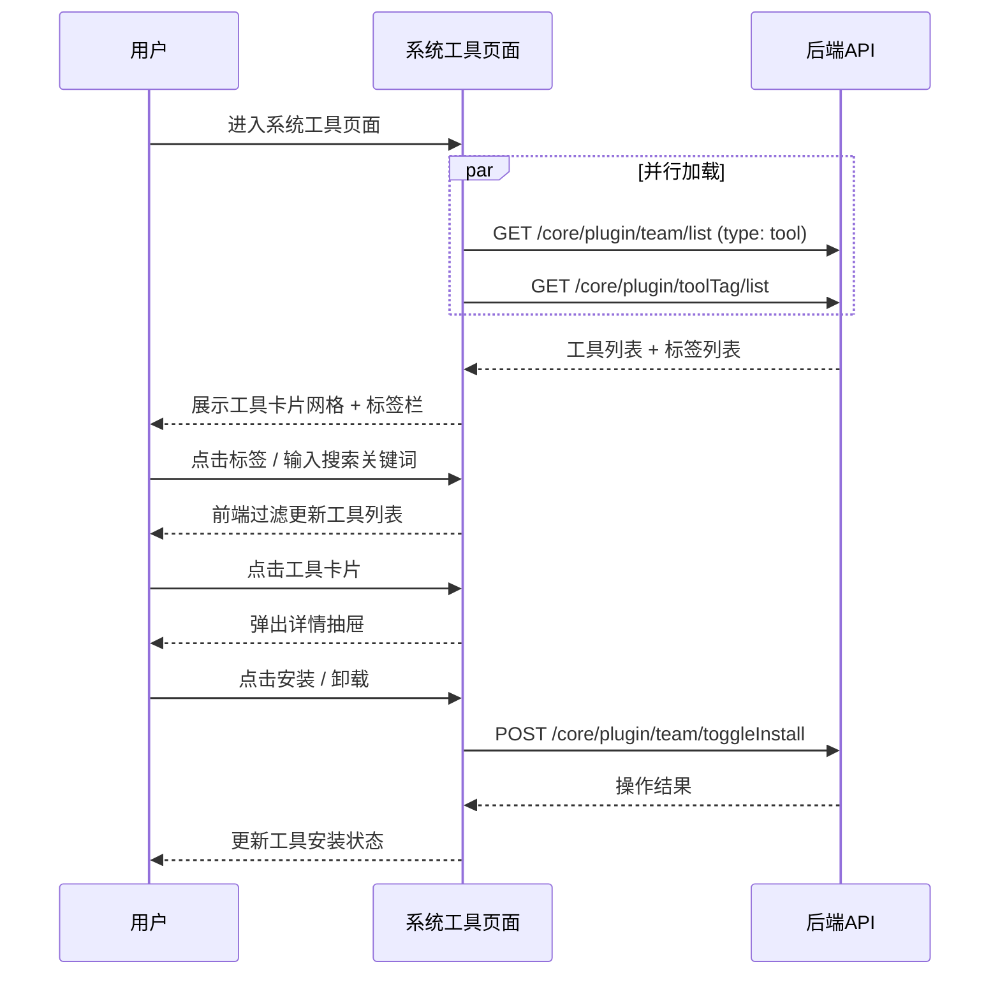

# 系统工具 — 业务流程详解

## 页面总览

系统工具市场是工作台中供用户浏览和安装系统预置工具的统一入口。页面以卡片网格的形式展示工具，支持标签筛选和关键词搜索。用户可在此完成工具的发现、查看、安装和卸载全流程。页面由 DashboardContainer 提供统一的工作台布局（侧边栏导航 + 背景装饰）。

---

### 浏览与筛选系统工具

> 页面加载后默认展示全部系统工具。用户可通过标签筛选和搜索缩小范围。

#### 步骤 1：页面加载

| 用户操作 | 触发 API | 分支条件 | 页面变化 |
|---------|---------|---------|---------|
| 从工作台侧边栏进入「工具」→ 选择「系统工具」标签页 | GET `/core/plugin/team/list`（参数 `type: 'tool'`） | 无 | 页面显示加载状态，MyBox 显示骨架屏加载动画 |
| 等待工具列表数据返回 | — | 工具列表有数据 | 加载状态消失，展示工具卡片网格（响应式 1~4 列） |
| 等待工具列表数据返回 | — | 工具列表为空 且 用户为 root | 展示空状态提示（EmptyTip 组件）+ 「点击配置」按钮 |
| 等待工具列表数据返回 | — | 工具列表为空 且 用户非 root | 仅展示空状态提示 |
| 页面同时加载标签列表 | GET `/core/plugin/toolTag/list` | 无 | 标签筛选栏渲染标签选项（首个为「全部」） |

#### 数据加载详情

| 加载阶段 | API | 关键参数 | 数据处理 | 渲染结果 |
|---------|-----|---------|---------|---------|
| 首次加载 | GET `/core/plugin/team/list` | `type: 'tool'` | 无额外处理，直接写入 state | 卡片网格展示所有系统工具 |
| — | GET `/core/plugin/toolTag/list` | 无 | 无额外处理 | 标签筛选栏展示所有标签 |

- 工具列表不支持分页，一次性加载全部工具
- 标签筛选和搜索均为前端过滤，不触发额外 API 请求
- 工具卡片展示：名称、简介、图标、作者、标签、状态、安装状态

#### 步骤 2：按标签筛选

| 用户操作 | 触发 API | 分支条件 | 页面变化 |
|---------|---------|---------|---------|
| 点击标签筛选栏中的某个标签 | 无（前端过滤） | 选中"全部"标签 | 显示所有工具 |
| 点击标签筛选栏中的某个标签 | 无（前端过滤） | 选中特定标签 | 仅显示含该标签的工具；如结果为空则展示空状态 |

- 标签数据通过 `parseI18nString` 根据当前语言解析标签名称
- 标签筛选与搜索可叠加使用

#### 步骤 3：搜索工具

| 用户操作 | 触发 API | 分支条件 | 页面变化 |
|---------|---------|---------|---------|
| 在搜索框输入关键词 | 无（前端过滤） | 关键词匹配工具名称或简介 | 实时过滤工具列表，仅显示匹配项 |
| 清空搜索框 | 无 | — | 恢复显示当前标签下的全部工具 |

- 搜索为前端模糊匹配，匹配字段为工具名称（`name`）和简介（`intro`），不区分大小写
- 搜索结果叠加标签筛选条件

---

### 安装系统工具

> 用户将系统预置工具安装到当前团队。

#### 步骤 1：触发安装

| 用户操作 | 触发 API | 分支条件 | 页面变化 |
|---------|---------|---------|---------|
| 点击工具卡片上的「安装」按钮 | POST `/core/plugin/team/toggleInstall`（参数 `pluginId`, `installed: true`, `type: 'tool'`） | 该工具当前未处于安装/卸载中的状态 | 按钮进入 loading 状态（置灰不可点击），防止重复操作 |
| 等待 API 返回 | — | 安装成功 | 按钮恢复可用，工具状态变为「已安装」，卡片显示卸载操作 |
| 等待 API 返回 | — | 安装失败 | 按钮恢复可用，工具状态不变，显示错误提示 |

- 安装操作有防重复点击保护：同一工具正在处理时，新的安装请求会等待当前操作完成
- 使用 Promise 引用 Map 管理并发操作，确保同一工具不会同时处理两个安装/卸载请求

#### 步骤 2：安装后影响

- **后置影响**：工具安装后，该工具的应用版本和输入输出定义可在应用工作流的「工具」节点中使用
- **失败场景**：网络异常时显示网络错误提示；后端返回错误码时显示对应错误信息

---

### 卸载系统工具

#### 步骤 1：触发卸载

| 用户操作 | 触发 API | 分支条件 | 页面变化 |
|---------|---------|---------|---------|
| 点击工具卡片上的「卸载」按钮 | POST `/core/plugin/team/toggleInstall`（参数 `pluginId`, `installed: false`, `type: 'tool'`） | 该工具当前未处于安装/卸载中的状态 | 按钮进入 loading 状态 |
| 等待 API 返回 | — | 卸载成功 | 按钮恢复可用，工具状态变为「未安装」，卡片显示安装操作 |
| 等待 API 返回 | — | 卸载失败 | 按钮恢复可用，工具状态不变，显示错误提示 |

- 卸载与安装共用同一 API，通过 `installed` 字段区分操作类型

---

### 查看工具详情

> 用户点击工具卡片查看工具的完整信息。

#### 步骤 1：打开详情抽屉

| 用户操作 | 触发 API | 分支条件 | 页面变化 |
|---------|---------|---------|---------|
| 点击工具卡片 | 无（ToolCard 的 onClickCard 回调） | — | 右侧滑出 ToolDetailDrawer 详情抽屉 |
| 用户点击工具版本查看详情 | GET `/core/plugin/team/toolDetail`（参数 `toolId`） | 工具有关联的子应用（`associatedPluginId` 存在） | 加载工具详情后展示版本输入输出参数列表 |
| 用户点击工具版本查看详情 | GET `/core/plugin/team/toolDetail`（参数 `toolId`） | 工具为文件夹或普通工具 | 加载工具详情，展示工具基础信息 + 子工具列表（如有） |

#### 步骤 2：详情抽屉内操作

| 用户操作 | 触发 API | 分支条件 | 页面变化 |
|---------|---------|---------|---------|
| 在详情抽屉中点击安装/卸载按钮 | POST `/core/plugin/team/toggleInstall` | 同安装/卸载场景 | 按钮 loading → 状态更新，抽屉内按钮状态同步变化 |
| 点击关闭或遮罩区域 | 无 | — | 抽屉关闭，返回工具列表 |

- 详情抽屉中使用 `useToolDetail` hook 管理工具详情数据加载
- 详情中展示工具的 readme 说明文档、输入参数定义（key/label/description/valueType）、输出参数定义

---

### 跳转工具配置（仅 root）

> root 管理员在工具列表为空时可配置工具。

#### 步骤 1：点击配置入口

| 用户操作 | 触发 API | 分支条件 | 页面变化 |
|---------|---------|---------|---------|
| 点击「点击配置」按钮 | 无（前端路由跳转） | 当前用户为 root | 页面跳转至 `/config/tool` 工具配置页面 |

- **前置条件**：系统工具列表为空 且 `userInfo.username === 'root'`
- **后置影响**：跳转至工具配置管理页面，可添加/管理团队工具

---

### Mermaid 附录

