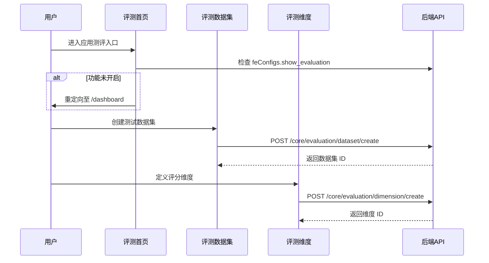
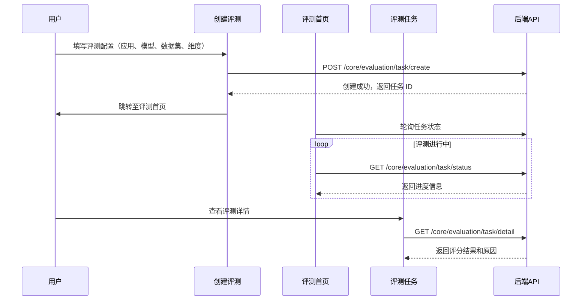

# 评测 — 业务流程详解

> 评测模块为分组节点，详细业务流程由各子能力独立承载。本文档提供评测流程的全局视图。

## 评测总流程

评测模块的完整业务流程分为准备和执行两大阶段：

### 准备阶段

### 执行阶段

## 子能力场景关联

各子能力的详细业务流程见对应文档：

| 子能力 | 文档 | 说明 |
|--------|------|------|
| 评测首页 | [业务流程详解](../评测首页/业务流程详解.md) | 评测入口的三 Tab 聚合展示 |
| 创建评测 | [业务流程详解](../创建评测/业务流程详解.md) | 评测任务创建流程 |
| 评测数据集 | [业务流程详解](../评测数据集/业务流程详解.md) | 数据集管理和导入 |
| 评测维度 | [业务流程详解](../评测维度/业务流程详解.md) | 评分维度管理 |
| 评测任务 | [业务流程详解](../评测任务/业务流程详解.md) | 任务执行和结果查看 |

## API 调用汇总

| API 路径 | 方法 | 用途 | 页面 |
|---------|------|------|------|
| `/core/evaluation/task/list` | GET | 获取评测任务列表 | 评测首页（评测任务 Tab） |
| `/core/evaluation/dataset/list` | GET | 获取评测数据集列表 | 评测首页（评测数据集 Tab） |
| `/core/evaluation/dimension/list` | GET | 获取评测维度列表 | 评测首页（评测维度 Tab） |
| `/core/evaluation/task/create` | POST | 创建评测任务 | 创建评测 |
| `/core/evaluation/dataset/create` | POST | 创建评测数据集 | 评测数据集 |
| `/core/evaluation/dimension/create` | POST | 创建评测维度 | 评测维度 |
| `/core/evaluation/task/detail` | GET | 获取评测任务详情 | 评测任务 |
