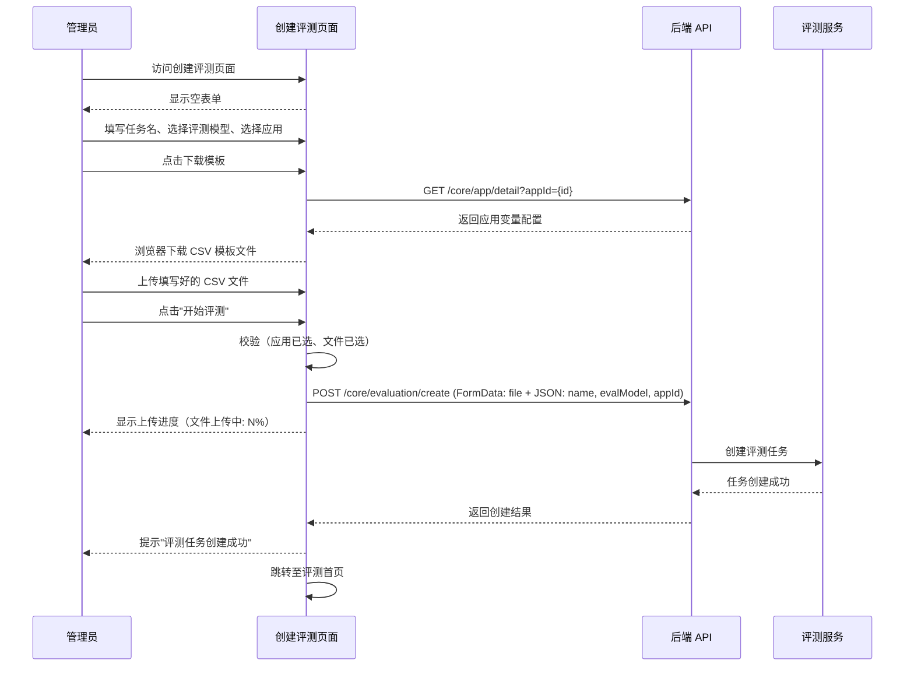

# 创建评测 — 业务流程详解

## 页面总览

创建评测页面是一个单页表单，管理员在此填写评测任务的基本信息并上传 CSV 评测文件。页面左侧为 Dashboard 侧边导航栏，右侧为表单区域。顶部有"退出"按钮可返回评测首页。

## 创建评测任务

> 管理员选择待评测应用、指定评测模型、上传 CSV 评测文件，创建一条评测任务。

### 步骤 1：进入创建页面

| 用户操作 | 触发 API | 分支条件 | 页面变化 |
|---------|---------|---------|---------|
| 在评测首页点击"新建任务"按钮 | — | — | 路由跳转至 /dashboard/evaluation/create，显示创建表单页面 |

### 步骤 2：填写任务名称

| 用户操作 | 触发 API | 分支条件 | 页面变化 |
|---------|---------|---------|---------|
| 在"任务名"输入框中输入名称 | — | 名称为空时，提交按钮置灰不可点击 | 输入框自动聚焦，显示用户输入内容 |

### 步骤 3：选择评测模型

| 用户操作 | 触发 API | 分支条件 | 页面变化 |
|---------|---------|---------|---------|
| 点击评测模型下拉框，从 LLM 模型列表中选择一个模型 | — | 默认选中模型列表第一个；模型列表为空时无可选项 | 下拉框展示当前团队可用的 LLM 模型列表，选中后显示模型名称 |

### 步骤 4：选择评测应用与下载模板

| 用户操作 | 触发 API | 分支条件 | 页面变化 |
|---------|---------|---------|---------|
| 点击应用选择器，搜索并选择一个应用 | — | 未选择应用时，"评测文件"区域显示提示"请选择评测应用" | 选中应用后，出现"点击下载该应用的 CSV 模板"按钮 |
| 点击"点击下载该应用的 CSV 模板"按钮 | GET /core/app/detail?appId={id}（获取应用变量配置） | 应用无变量时，模板仅含 `*q,*a,history` 三列；应用有变量时，模板额外包含变量列，必填变量前加 `*` | 按钮进入加载态，获取应用详情后触发浏览器下载 CSV 文件（文件名格式：`{应用名}_evaluation.csv`） |

### 步骤 5：上传评测文件

| 用户操作 | 触发 API | 分支条件 | 页面变化 |
|---------|---------|---------|---------|
| 点击或拖拽上传 CSV 文件（仅允许 .csv，最多 1 个） | — | 未选择应用时，文件上传区域不可用 | 文件选择器高亮，选中文件后显示文件图标、文件名和删除按钮 |
| 点击文件旁的删除按钮 | — | — | 该文件从列表中移除，错误提示清除 |

### 步骤 6：提交创建任务

| 用户操作 | 触发 API | 分支条件 | 页面变化 |
|---------|---------|---------|---------|
| 点击"开始评测"按钮 | POST /core/evaluation/create（FormData 上传文件 + JSON 参数） | 未选应用：提示"请选择评测应用"；未选文件：提示"请选择评测文件"；任一必填项为空：按钮置灰 | 按钮进入加载态，显示上传进度百分比（"文件上传中: N%"） |
| 等待文件上传完成 | — | 上传完成（100%）→ 显示"正在创建任务"；上传中 → 持续显示进度 | 按钮文案切换为"正在创建任务" |
| 创建成功 | — | — | 弹出成功提示"评测任务创建成功"，自动跳转至评测首页 /dashboard/evaluation |
| 文件校验失败 | — | 错误码匹配 evaluationFileErrors（表头缺失/无数据/格式无效）：显示红色错误卡片，列出格式校验失败原因及修复指引 | 文件卡片边框变红，下方展示 Markdown 格式的错误提示 |
| AI 积分不足 | — | 错误码匹配 TeamErrEnum.aiPointsNotEnough | 弹出积分不足弹窗 |
| 其他错误 | — | 其他异常 | 弹出通用错误提示 |

#### 数据加载详情

本页面在初始化时不会主动发起列表请求。仅在下载模板时才调用应用详情接口获取变量信息。

| 加载阶段 | API | 关键参数 | 数据处理 | 渲染结果 |
|---------|-----|---------|---------|---------|
| 下载模板 | GET /core/app/detail | appId={选中的应用ID} | 提取 chatConfig.variables，拼接 CSV 表头 | 浏览器下载 CSV 文件 |

#### 表单与交互详情

**表单字段清单**：

| 字段名 | 控件类型 | 必填 | 默认值 | 可选值/约束 | 编辑时只读 | 说明 |
|--------|---------|------|--------|------------|-----------|------|
| 任务名 | 文本输入 | 是 | — | 无特殊约束 | 否 | 评测任务名称 |
| 评测模型 | 下拉选择 | 否（默认选中第一个） | LLM 模型列表第一项 | 当前团队可用的 LLM 模型 | 否 | 用于评测的 AI 模型 |
| 评测应用 | 搜索选择 | 是 | — | 当前团队已创建的应用 | 否 | 被评测的目标应用 |
| 评测文件 | CSV 文件上传 | 是 | — | .csv 格式，最多 1 个文件，需符合模板格式 | 否 | 包含问题和参考答案的评测数据 |

**字段联动**：
- 选择应用后，"评测文件"区域从不显示变为可用，同时出现"下载模板"按钮
- 选择应用后，下载的 CSV 模板列会根据应用配置的变量动态变化

**校验规则**：

| 规则 | 触发时机 | 错误提示文案 |
|------|---------|-------------|
| 应用未选择 | 提交时 | "请选择评测应用" |
| 文件未选择 | 提交时 | "请选择评测文件" |
| 按钮置灰条件 | 实时 | 任一必填项为空、存在文件校验错误时置灰 |
| CSV 文件表头不匹配 | 提交后（服务端校验） | 文件卡片变红，显示格式校验失败详情及修复指引 |
| CSV 文件无数据 | 提交后（服务端校验） | 文件卡片变红，显示无数据错误 |
| CSV 文件格式无效 | 提交后（服务端校验） | 文件卡片变红，显示格式无效错误 |
| AI 积分不足 | 提交后（服务端校验） | 弹出积分不足弹窗 |

**前后置条件**：
- **前置条件**：已登录团队管理员账号；团队下已有至少一个应用；团队下无正在运行的评测任务（否则提示等待）
- **后置影响**：创建成功后生成一条评测任务记录，系统自动解析 CSV 文件并开始评测；页面跳转至评测首页
- **失败场景**：文件校验失败时留在当前页面，用户可删除错误文件重新上传；积分不足时需先充值

### Mermaid 附录

