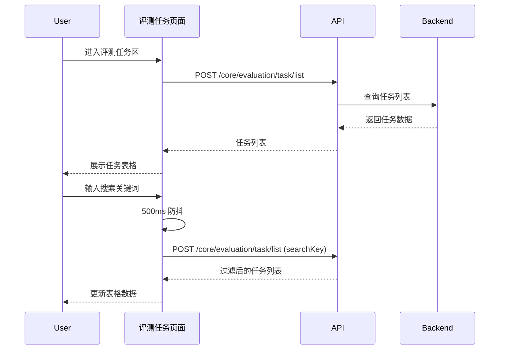

# 评测任务 — 业务流程详解

## 子能力业务流程索引

本模块为分组节点，包含以下子能力，各子能力的详细业务流程请参见对应文档：

| 子能力 | 业务描述 | 业务流程索引 | 业务流程详解 |
|--------|---------|------------|------------|
| 评测任务首页 | 评测任务列表、搜索筛选、创建任务、任务操作 | [业务流程索引](../评测任务首页/业务流程索引.md) | [业务流程详解](../评测任务首页/业务流程详解.md) |
| 任务详情 | 评测数据列表、评测维度结果、综合评分、数据编辑、配置参数 | [业务流程索引](../任务详情/业务流程索引.md) | [业务流程详解](../任务详情/业务流程详解.md) |

## 公共业务流程

以下公共流程适用于评测任务模块的全部子能力页面。

| 步骤 | 用户操作 | 触发 API | 分支条件 | 页面变化 |
|------|---------|---------|---------|---------|
| 1. 进入评测任务区 | 在工作台点击"评测"→ 切换到"评测任务"标签页 | GET /core/evaluation/task/list（加载任务列表） | 无 | 显示任务列表页面，展示分页表格 |
| 2. 搜索任务 | 在搜索框中输入关键词（500ms 防抖） | POST /core/evaluation/task/list（携带 searchKey 参数） | 搜索值为空时显示全部 | 表格数据按搜索条件实时刷新 |
| 3. 应用筛选 | 从应用下拉框中选择目标应用或"全部应用" | POST /core/evaluation/task/list（携带 appId 参数） | 选择"全部应用"时不传 appId | 表格数据按应用筛选条件刷新 |
| 4. 翻页浏览 | 点击分页控件切换页码 | POST /core/evaluation/task/list（携带 pageNum/pageSize） | 无 | 表格加载对应页数据 |

### Mermaid 附录

> 各子能力（评测任务首页、任务详情）的详细交互流程、API 调用链、分支条件、表单字段和校验规则请参见对应的子能力文档。
