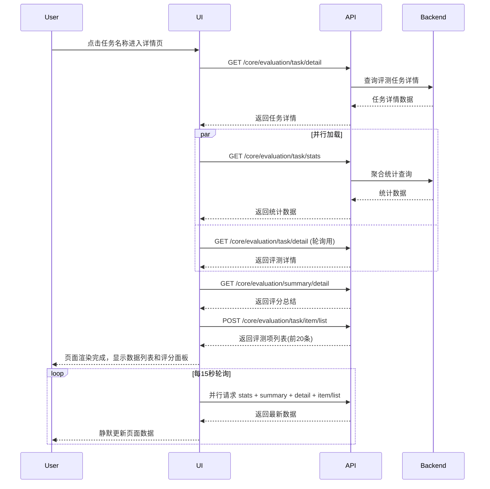
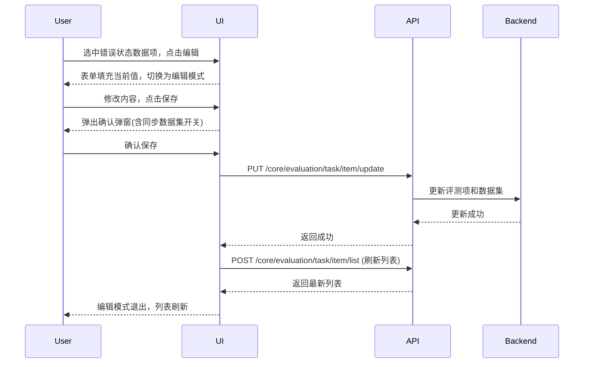
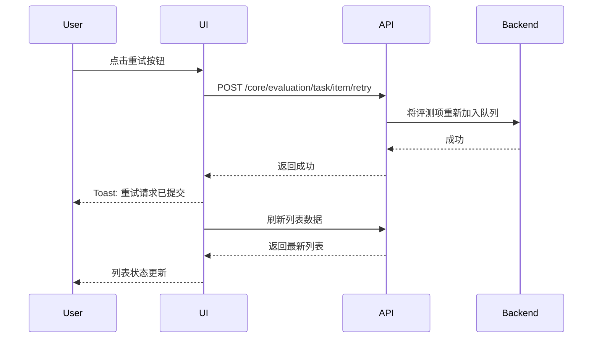
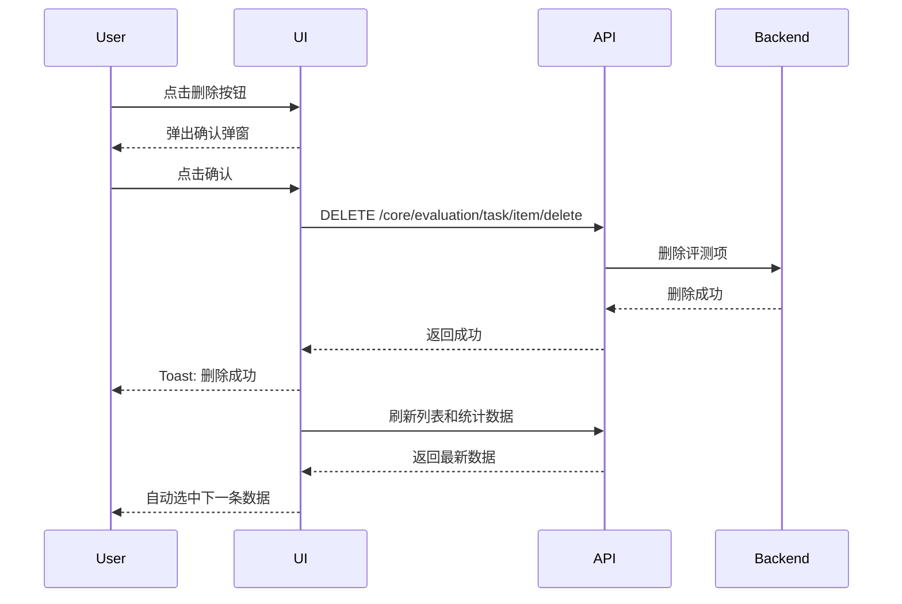
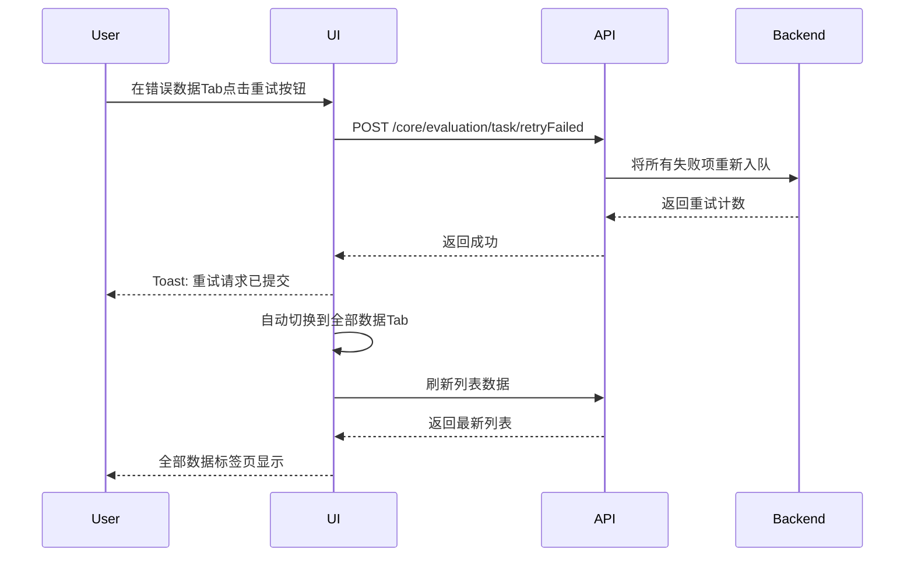
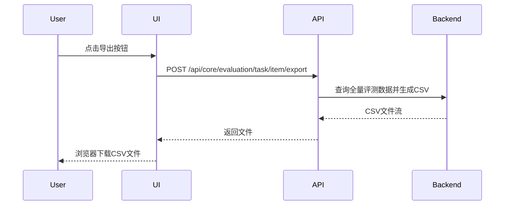
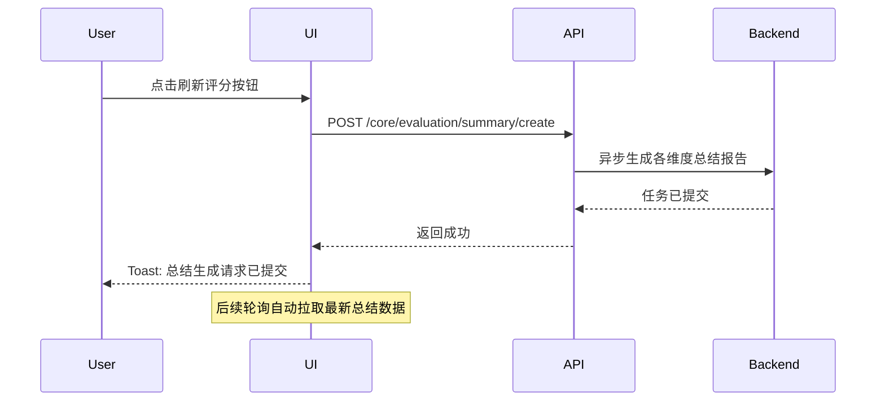
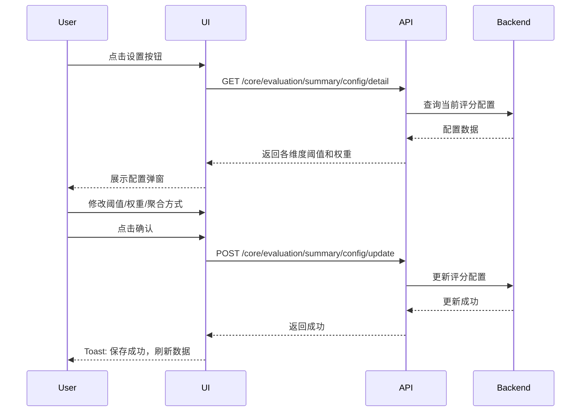
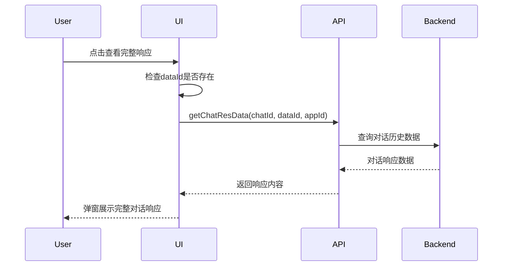

# 任务详情 — 业务流程详解

## 页面总览

评测任务详情页是评测结果的核心查看与操作界面。页面采用三栏布局：左侧 40% 为数据列表（支持搜索、分页、Tab 过滤），中间 60% 为数据详情（展示问题、参考答案、实际回答、评测维度评分），右侧 17rem 固定宽度面板展示综合评分和任务基本信息。评测执行中或排队中时，页面每 15 秒自动轮询刷新数据。

## 查看评测结果

> 用户从评测任务列表进入详情页，加载并查看评测任务的完整执行结果。

### 步骤 1：页面初始化与数据加载

| 用户操作 | 触发 API | 分支条件 | 页面变化 |
|---------|---------|---------|---------|
| 从评测任务列表点击任务名称，浏览器导航至 `/dashboard/evaluation/task/detail?taskId={id}` | GET `/core/evaluation/task/detail`（获取任务详情） | 任务不存在或无权访问 → 跳转回评测任务列表并提示"加载失败" | 页面开始加载，右侧面板显示加载状态（MyBox 的 isLoading），数据列表区域显示加载动画 |

### 步骤 2：并行加载统计和详情数据

| 用户操作 | 触发 API | 分支条件 | 页面变化 |
|---------|---------|---------|---------|
| 无需操作（自动触发） | GET `/core/evaluation/task/stats`（获取统计信息）+ GET `/core/evaluation/task/detail`（获取评测详情） — 并行请求 | 无 | 统计数据和评测详情加载完成，NavBar 中显示数据计数标签 |

### 步骤 3：加载评分总结和应用信息

| 用户操作 | 触发 API | 分支条件 | 页面变化 |
|---------|---------|---------|---------|
| 无需操作（自动触发） | GET `/core/evaluation/summary/detail`（获取总结报告） | 无 | 右侧面板加载评分仪表盘和维度得分条 |
| 无需操作（自动触发） | GET 应用详情接口（通过 getAppDetailById，仅在有 appId 时调用） | `evaluationDetail.target.config.appId` 存在 | 基本信息面板中的应用名称可点击跳转 |

### 步骤 4：加载评测项列表

| 用户操作 | 触发 API | 分支条件 | 页面变化 |
|---------|---------|---------|---------|
| 无需操作（自动触发） | POST `/core/evaluation/task/item/list`（获取评测项列表，pageSize=20） | 无搜索关键词 → 不带 userInput 过滤；当前 Tab 为 questionData → 带 `belowThreshold: true`；当前 Tab 为 errorData → 带 `status: EvaluationStatusEnum.error` | 左侧列表加载首批 20 条数据，列表表头根据评测维度数量动态生成 |

### 步骤 5：实时轮询刷新

| 用户操作 | 触发 API | 分支条件 | 页面变化 |
|---------|---------|---------|---------|
| 无需操作（页面停留） | 每 15 秒自动调用：GET stats（轮询）+ GET summary（轮询）+ GET detail（轮询）+ POST item/list（智能刷新，仅加载到当前选中项所在页码） | 评测任务状态为排队中或评测中 → 右侧面板显示"排队中..."或"评测中..."的渐变加载动画；评测完成 → 面板切换显示评分仪表盘和各维度得分条 | 数据静默更新（无加载遮罩），列表数据直接替换 |

### 步骤 6：切换标签页过滤

| 用户操作 | 触发 API | 分支条件 | 页面变化 |
|---------|---------|---------|---------|
| 点击 NavBar 中的"问题数据"或"错误数据"标签 | 浏览器 URL query 更新 `currentTab`，触发 useScrollPagination 自动重新请求 POST `/core/evaluation/task/item/list`（携带对应过滤参数） | 问题数据 Tab：`belowThreshold > 0` 才显示标签，API 参数带 `belowThreshold: true`；错误数据 Tab：`error > 0` 才显示标签，API 参数带 `status: EvaluationStatusEnum.error`；错误数据 Tab → 显示"重试"按钮 | 数据列表按过滤条件刷新，标签高亮切换，错误数据 Tab 下显示批量重试按钮 |

### 步骤 7：点击数据项查看详情

| 用户操作 | 触发 API | 分支条件 | 页面变化 |
|---------|---------|---------|---------|
| 点击左侧列表中的某条数据 | 无额外 API 调用（数据已有） | 选中项状态为"已完成"且有 evaluatorOutputs → 中间详情区域显示评测维度标签和评分；选中项状态为"错误" → 显示错误信息红色提示框 + 编辑/重试/删除按钮；选中项状态为"已完成" → 显示"查看完整响应"按钮 + 删除按钮；选中项状态为"排队中"或"评测中" → 不显示操作按钮 | 中间详情区刷新：问题、参考答案、实际回答区域更新；评测维度评分标签更新；操作按钮根据状态动态显示 |

### 步骤 8：滚动加载更多数据

| 用户操作 | 触发 API | 分支条件 | 页面变化 |
|---------|---------|---------|---------|
| 滚动数据列表到底部 | POST `/core/evaluation/task/item/list`（offset=当前已加载数量，pageSize=20） | 无更多数据 → 不发起请求 | 列表追加新数据，滚动条位置保持 |

### 数据加载详情

| 加载阶段 | API | 关键参数 | 数据处理 | 渲染结果 |
|---------|-----|---------|---------|---------|
| 首次加载（任务详情） | GET /core/evaluation/task/detail | evalId | 合并 status 和 stats 字段 | 任务名称显示在面包屑和页面标题 |
| 首次加载（统计） | GET /core/evaluation/task/stats | evalId | total/completed/error/belowThreshold 计数 | NavBar 标签上显示计数 |
| 首次加载（评分） | GET /core/evaluation/summary/detail | evalId | data 数组（每项含 metricName、metricScore、threshold、weight） | 右侧评分仪表盘/得分条 |
| 首次加载（列表） | POST /core/evaluation/task/item/list | evalId, offset=0, pageSize=20, 可选的 status/userInput/belowThreshold | 按 evaluatorOutputs 计算显示得分 | 列表展示前 20 条 |
| 翻页 | POST /core/evaluation/task/item/list | offset=N, pageSize=20 | 无额外处理 | 列表第 N 页数据 |
| 轮询刷新 | GET stats + GET summary + GET detail + POST item/list（并行） | 同上 | 静默替换已有数据 | 数据实时更新 |

- 分页参数：默认每页 20 条，通过滚动自动加载下一页
- 排序规则：按数据库默认排序（评测项创建顺序）
- 筛选条件：搜索框按 `userInput` 字段模糊匹配（500ms 防抖）；Tab 切换按状态/阈值过滤
- 表头动态生成：评测维度 < 3 个时显示每个维度名称作为列头；≥ 3 个时只显示"综合评分"列

### Mermaid 附录

---

## 编辑评测数据

> 用户对执行失败的评测项修改问题或参考答案内容，可选择是否同步更新原始数据集。

### 步骤 1：进入编辑模式

| 用户操作 | 触发 API | 分支条件 | 页面变化 |
|---------|---------|---------|---------|
| 选中错误状态的评测项，点击编辑按钮 | 无 | 选中项有数据 → 表单填充当前问题和参考答案值 | 问题和参考答案区域切换为可编辑的 Textarea，顶部操作栏显示"取消"和"保存"按钮 |

### 步骤 2：修改内容并保存

| 用户操作 | 触发 API | 分支条件 | 页面变化 |
|---------|---------|---------|---------|
| 修改问题或参考答案文本，点击"保存"按钮 | 无（弹出 Popover） | 无 | 弹出确认保存弹窗，包含"是否同步修改数据集"开关（默认开启） |

### 步骤 3：确认保存

| 用户操作 | 触发 API | 分支条件 | 页面变化 |
|---------|---------|---------|---------|
| 确认弹窗中点击"确认" | PUT `/core/evaluation/task/item/update`（含 evalItemId、userInput、expectedOutput、modifyDataset） | modifyDataset=true → 后端同步修改原始数据集中的对应数据；modifyDataset=false → 仅修改评测任务中的数据 | 弹窗关闭，编辑模式退出，列表刷新显示更新后的数据 |

### 步骤 4：取消编辑

| 用户操作 | 触发 API | 分支条件 | 页面变化 |
|---------|---------|---------|---------|
| 点击"取消"按钮 | 无 | 无 | 编辑模式退出，表单重置为原始值 |

### 表单字段清单

| 字段名 | 控件类型 | 必填 | 默认值 | 可选值/约束 | 编辑时只读 | 说明 |
|--------|---------|------|--------|------------|-----------|------|
| 问题（question） | 多行文本输入（Textarea） | 否 | 当前数据项的 userInput | — | 否 | 修改后影响重新评测的输入 |
| 参考答案（expectedResponse） | 多行文本输入（Textarea） | 否 | 当前数据项的 expectedOutput | — | 否 | 修改后影响重新评测的对比基准 |

### 字段联动

- 无字段联动

### 校验规则

| 规则 | 触发时机 | 错误提示文案 |
|------|---------|-------------|
| 无前端校验 | — | 提交错误由后端返回并通过 Toast 提示 |

### 前后置条件

- **前置条件**：选中的数据项状态为"错误"（`EvaluationStatusEnum.error`）
- **后置影响**：如果 `modifyDataset=true`，同步修改原始数据集中的数据；列表自动刷新
- **失败场景**：API 调用失败时 Toast 提示"保存失败"（已在 Context 中统一处理），编辑模式保持

### Mermaid 附录

---

## 重试单条评测

> 对执行失败的单条评测项发起重新评测。

### 步骤 1：触发重试

| 用户操作 | 触发 API | 分支条件 | 页面变化 |
|---------|---------|---------|---------|
| 选中错误状态的评测项，点击重试按钮 | POST `/core/evaluation/task/item/retry`（含 evalItemId） | 无 | Toast 提示"重试请求已提交" |

### 步骤 2：刷新列表

| 用户操作 | 触发 API | 分支条件 | 页面变化 |
|---------|---------|---------|---------|
| 无需操作（自动触发） | 列表自动刷新 | 无 | 列表中该评测项状态更新为"排队中" |

### 前后置条件

- **前置条件**：选中的数据项状态为"错误"
- **后置影响**：评测项重新进入评测队列，状态变为"排队中"
- **失败场景**：API 调用失败 Toast 提示"重试失败"

### Mermaid 附录

---

## 删除评测数据

> 从评测任务中删除单条评测数据。

### 步骤 1：触发删除确认

| 用户操作 | 触发 API | 分支条件 | 页面变化 |
|---------|---------|---------|---------|
| 点击删除按钮（红色图标） | 无 | 无 | 弹出确认弹窗，提示内容为"确认删除该条数据？" |

### 步骤 2：确认删除

| 用户操作 | 触发 API | 分支条件 | 页面变化 |
|---------|---------|---------|---------|
| 点击弹窗确认 | DELETE `/core/evaluation/task/item/delete`（含 evalItemId） | 无 | Toast 提示"删除成功"，列表刷新，自动选中下一条数据（若是最后一条则选新列表的最后一条） |

### 步骤 3：取消删除

| 用户操作 | 触发 API | 分支条件 | 页面变化 |
|---------|---------|---------|---------|
| 点击弹窗取消或关闭 | 无 | 无 | 弹窗关闭，无变化 |

### 删除链路详情

- **确认弹窗**：使用 PopoverConfirm 组件，type="delete"，确认文案为"确认删除该条数据？"
- **批量与单条差异**：当前仅支持单条删除，无批量删除功能
- **级联影响**：删除后自动刷新统计数据（stats 和列表）

### 前后置条件

- **前置条件**：选中的数据项状态为"错误"或"已完成"
- **后置影响**：评测项从任务中移除；统计数据刷新
- **失败场景**：API 调用失败 Toast 提示"删除失败"

### Mermaid 附录

---

## 批量重试失败项

> 在错误数据标签页下，一键重试所有执行失败的评测项。

### 步骤 1：触发批量重试

| 用户操作 | 触发 API | 分支条件 | 页面变化 |
|---------|---------|---------|---------|
| 在错误数据标签页，点击"重试"按钮 | POST `/core/evaluation/task/retryFailed`（含 evalId） | 无 | Toast 提示"重试请求已提交" |

### 步骤 2：自动切换标签

| 用户操作 | 触发 API | 分支条件 | 页面变化 |
|---------|---------|---------|---------|
| 无需操作（自动触发） | URL query 更新 `currentTab=allData`，触发列表刷新 | 无 | 页面自动切换回"全部数据"标签页，列表刷新 |

### 前后置条件

- **前置条件**：当前位于错误数据标签页（`currentTab=errorData`）；存在错误状态的评测项
- **后置影响**：所有失败项重新入队评测；自动跳转到全部数据标签页
- **失败场景**：API 调用失败 Toast 提示"重试失败"

### Mermaid 附录

---

## 导出评测数据

> 将当前筛选条件下的评测数据导出为 CSV 文件。

### 步骤 1：触发导出

| 用户操作 | 触发 API | 分支条件 | 页面变化 |
|---------|---------|---------|---------|
| 点击顶部"导出"按钮 | POST `/api/core/evaluation/task/item/export`（含 evalId、filters、headers、metricColumns、statusLabelMap）— 通过 downloadFetch 下载文件 | 导出过程中无特殊 UI 变化 | 浏览器开始下载 CSV 文件，文件名格式为 `evaluation_{任务名}_{日期}.csv` |

### 前后置条件

- **前置条件**：评测任务已加载；summaryData 和 evaluationDetail 可用（用于构建导出列）
- **后置影响**：无，仅下载文件
- **失败场景**：导出失败 Toast 提示"导出失败"

### Mermaid 附录

---

## 刷新评分

> 手动触发重新生成各维度的评分总结报告。

### 步骤 1：触发刷新

| 用户操作 | 触发 API | 分支条件 | 页面变化 |
|---------|---------|---------|---------|
| 点击右侧评分面板的刷新按钮 | POST `/core/evaluation/summary/create`（含 evalId 和所有 metricIds — 从 summaryData 中提取） | summaryData 为空 → Toast 提示"无维度数据，无法生成总结"；有维度数据 → 正常提交 | Toast 提示"总结生成请求已提交"，刷新按钮仅在非排队/评测中状态下显示 |

### 前后置条件

- **前置条件**：评测任务不在排队或评测中状态；summaryData 存在且 data 数组非空
- **后置影响**：触发后端异步生成评分总结，轮询会自动拉取最新总结数据
- **失败场景**：生成失败 Toast 提示"生成总结失败"

### Mermaid 附录

---

## 配置评分参数

> 调整评测维度的判定阈值、权重和分数聚合方式。

### 步骤 1：打开配置弹窗

| 用户操作 | 触发 API | 分支条件 | 页面变化 |
|---------|---------|---------|---------|
| 点击右侧评分面板的设置按钮 | GET `/core/evaluation/summary/config/detail`（获取当前配置） | 无 | 弹窗打开，显示加载状态，加载完成后展示各维度配置表 |

### 步骤 2：修改评分参数

| 用户操作 | 触发 API | 分支条件 | 页面变化 |
|---------|---------|---------|---------|
| 修改判定阈值（1-100 的整数，仅允许数字输入）| 无 | 无 | 阈值数值实时更新 |
| 修改权重（1-100 的整数，步长 5，支持上下键微调），维度数 ≥ 3 时才显示权重列 | 无 | 权重总和 ≠ 100 → 确认按钮置灰，底部显示红色百分比；权重总和 = 100 → 确认按钮可用，底部显示正常颜色 | 权重数值实时更新 |

### 步骤 3：切换聚合方式

| 用户操作 | 触发 API | 分支条件 | 页面变化 |
|---------|---------|---------|---------|
| 在下拉框中选择"均值"或"中位数" | 无 | 无 | 聚合方式选中值更新 |

### 步骤 4：确认保存

| 用户操作 | 触发 API | 分支条件 | 页面变化 |
|---------|---------|---------|---------|
| 点击"确认"按钮 | POST `/core/evaluation/summary/config/update`（含 evalId、calculateType、metricsConfig） | 有权重列且权重总和 ≠ 100 → 按钮置灰不可点击 | Toast 提示"保存成功"，弹窗关闭，触发数据刷新 |

### 表单字段清单

| 字段名 | 控件类型 | 必填 | 默认值 | 可选值/约束 | 编辑时只读 | 说明 |
|--------|---------|------|--------|------------|-----------|------|
| 分数聚合方式 | 下拉选择 | 是 | 均值 | 均值 / 中位数 | 否 | 多维度综合评分的计算方式 |
| 判定阈值 | 数字输入 | 是 | 80（80%） | 1-100 的整数 | 否 | 每个维度的通过阈值 |
| 权重 | 数字输入 | 是（维度 ≥ 3 时） | 配置中的原始值 | 1-100 的整数，步长 5 | 否 | 仅维度 ≥ 3 时显示，总和须为 100 |

### 校验规则

| 规则 | 触发时机 | 错误提示文案 |
|------|---------|-------------|
| 权重总和必须为 100 | 实时校验 | 底部百分比数字变红，确认按钮置灰 |
| 阈值范围 1-100 | 输入时 | 自动修正为 1-100 的最近有效值 |
| 权重范围 1-100 | 输入时/失焦时 | 自动修正为 1-100 的最近有效值 |

### 前后置条件

- **前置条件**：评测任务详情已加载
- **后置影响**：保存成功后触发 `loadAllData` 刷新所有相关数据
- **失败场景**：保存失败 Toast 提示"保存失败"

### Mermaid 附录

---

## 查看完整响应

> 查看评测项关联的 AI 对话完整响应内容。

### 步骤 1：触发查看

| 用户操作 | 触发 API | 分支条件 | 页面变化 |
|---------|---------|---------|---------|
| 选中已完成状态的评测项，点击"查看完整响应"按钮 | 无（检查 dataId） | dataId 为空 → Toast 提示"dataId is Required"；dataId 存在 → 打开弹窗 | 弹窗打开 |

### 步骤 2：加载响应数据

| 用户操作 | 触发 API | 分支条件 | 页面变化 |
|---------|---------|---------|---------|
| 无需操作（弹窗自动加载） | 调用 getChatResData（含 chatId、dataId、appId） | 响应数据为空 → 显示空状态提示；有数据 → 渲染 ResponseBox 组件 | 弹窗内显示加载状态，加载完成后展示完整对话响应 |

### 前后置条件

- **前置条件**：选中的数据项状态为"已完成"；数据项有关联的 AI 对话数据（`targetOutput.aiChatItemDataId` 非空）
- **后置影响**：无
- **失败场景**：数据加载失败时弹窗内显示加载状态或空提示

### Mermaid 附录

