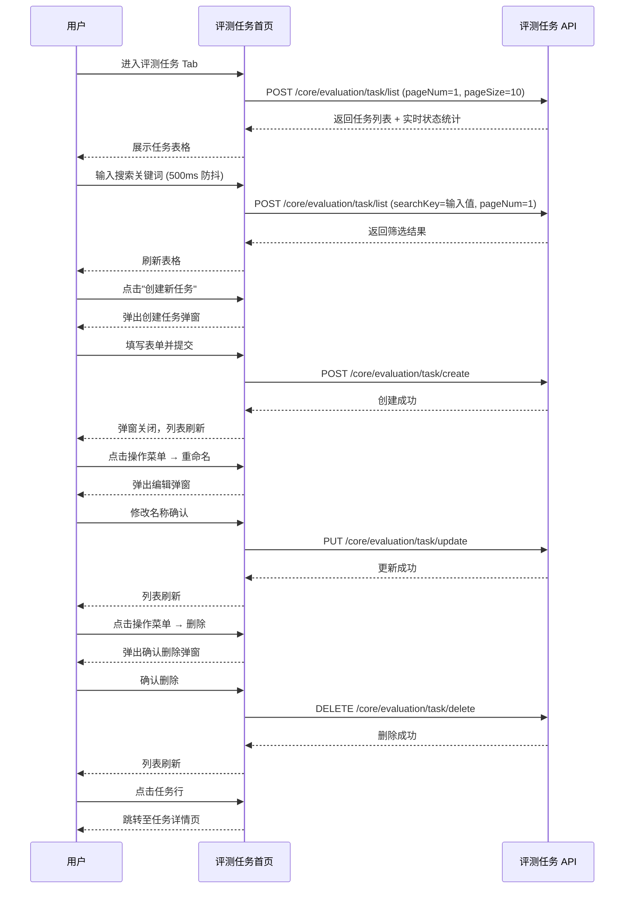

# 评测任务首页 — 业务流程详解

## 页面总览

评测任务首页是评测系统的核心管理页面，以数据表格形式展示团队内所有评测任务。页面顶部提供应用筛选、关键词搜索和创建入口；表格展示每项任务的关键信息（名称、进度、关联应用、版本、结果、时间、执行者）；每行右侧提供操作菜单（重试失败项、重命名、删除）。点击行可跳转至任务详情页。

本页面为单页列表视图，无嵌套子 Tab。

---

### 进入评测任务首页

> 用户通过评测首页的 FillRowTabs 切换到"评测任务"Tab 进入此页面。

#### 步骤 1：页面初始化与权限校验

| 用户操作 | 触发 API | 分支条件 | 页面变化 |
|---------|---------|---------|---------|
| 通过导航进入评测首页 `/dashboard/evaluation` | 无（前端路由） | — | 加载 DashboardContainer 布局 |
| 页面渲染时，`useEffect` 检查 `feConfigs.show_evaluation` | 无 | 若 `show_evaluation === false`：自动重定向到 `/dashboard` | 若无权限：页面不显示，跳转回工作台首页 |
| 页面渲染 `FillRowTabs`，默认激活 `evaluationTab=tasks` | 无 | `evaluationTab` 取 URL query 参数，无参数时默认 `'tasks'` | 显示 3 个 Tab（评测任务、评测数据集、评测维度），默认激活"评测任务" |
| 条件渲染命中 `evaluationTab === 'tasks'` | 无 | 仅当激活"评测任务"Tab 时渲染 | 渲染 `<EvaluationTasks Tab={Tab}>` 组件 |

#### 步骤 2：首次加载任务列表

| 用户操作 | 触发 API | 分支条件 | 页面变化 |
|---------|---------|---------|---------|
| 页面组件挂载 | `POST /core/evaluation/task/list`（通过 getEvaluationList 封装） | 默认参数：`pageNum=1, pageSize=10`；searchKey 为空；appFilter 为空 | 表格区域显示加载状态（`isLoading`），Pagination 组件初始化 |
| API 返回列表数据 | — | 若 `total === 0`：显示空数据提示"暂无数据" | 加载完成：表格展示任务数据；若数据为空：居中显示空数据提示 |

**数据加载详情**：

| 加载阶段 | API | 关键参数 | 数据处理 | 渲染结果 |
|---------|-----|---------|---------|---------|
| 首次加载 | POST /core/evaluation/task/list | pageNum=1, pageSize=10 | 后端聚合查询关联的 app/appVersion/datasetCollection 数据；实时计算各任务的状态和统计信息 | 表格展示前 10 条任务 |
| 翻页 | POST /core/evaluation/task/list | pageNum=N, pageSize=10 | 同首次 | 表格展示第 N 页数据 |
| 刷新（搜索/筛选/CRUD后） | POST /core/evaluation/task/list | pageNum 重置为 1，携带最新 searchKey/appFilter | 依赖 `refreshDeps` 变化自动触发 | 表格展示最新第 1 页数据 |

- **分页参数**: 默认每页 10 条
- **排序规则**: 后端按 `createTime` 降序排列（最新创建的任务在前）
- **筛选条件**: 搜索框（按任务名称模糊搜索）、应用选择器（按 appId 精确匹配）
- **特殊列的渲染逻辑**:
  - **进度列**: 排队中显示状态文字；已完成显示绿色文字；其他状态显示 `已完成数/总数`，有失败项时在数字旁显示红色 info 图标
  - **评测结果列**: error 且全部失败→红色"异常"；排队/评测中→灰色"评测中"；summaryConfigs≥3→显示综合分数百分比；summaryConfigs<3→分别显示各维度分数百分比；无数据→显示"-"
  - **菜单"重试失败项"**: 仅当 `statistics.error > 0` 时显示

---

### 搜索评测任务

> 用户在搜索框输入关键词，系统按任务名称模糊匹配并刷新列表。

#### 步骤 1：输入搜索关键词

| 用户操作 | 触发 API | 分支条件 | 页面变化 |
|---------|---------|---------|---------|
| 在搜索框输入文字 | 无（仅更新本地状态 `localSearchValue`） | — | 输入框内容即时更新 |

#### 步骤 2：防抖搜索触发

| 用户操作 | 触发 API | 分支条件 | 页面变化 |
|---------|---------|---------|---------|
| 停止输入 500ms 后自动触发 | `POST /core/evaluation/task/list` | 携带 `searchKey=输入值`，pageNum 重置为 1，appFilter 保持原值 | 列表刷新为搜索结果；无匹配结果时显示空数据提示 |

---

### 按应用筛选任务

> 用户通过应用下拉选择器筛选特定应用的评测任务。

#### 步骤 1：选择筛选应用

| 用户操作 | 触发 API | 分支条件 | 页面变化 |
|---------|---------|---------|---------|
| 点击应用选择器（AppSelectWithAll），选择某个应用或"全部应用" | 无 | — | 下拉选择器显示选中值 | 无 |
| `appFilter` 状态变更 → `refreshDeps` 触发 | `POST /core/evaluation/task/list` | 携带 `appFilter=选中appId`（"全部"时为空），pageNum 重置为 1 | 列表刷新为筛选结果 |

---

### 创建评测任务

> 用户点击"创建新任务"按钮，弹出创建任务弹窗，填写表单后提交。

#### 步骤 1：打开创建弹窗

| 用户操作 | 触发 API | 分支条件 | 页面变化 |
|---------|---------|---------|---------|
| 点击"创建新任务"按钮 | 无 | `isCreateModalOpen` 设为 `true` | 弹出 `CreateModal` 弹窗，显示创建表单 |

#### 步骤 2：选择目标应用

| 用户操作 | 触发 API | 分支条件 | 页面变化 |
|---------|---------|---------|---------|
| 在"评测应用"下拉中选择一个应用 | 无（前端选择，触发版本列表加载） | `watchedValues.appId` 变更 | 应用版本下拉启用并加载该应用的版本列表 |

#### 步骤 3：选择应用版本

| 用户操作 | 触发 API | 分支条件 | 页面变化 |
|---------|---------|---------|---------|
| 在"评测应用版本"下拉中选择一个版本 | 触发 `getAppVersionDetail(versionId, appId)` | 版本列表加载完成后自动选中最新版本 | — |
| API 返回版本详情（含 nodes 信息） | — | 分析 nodes 中的节点类型： - 含 chatNode + datasetSearchNode → 推荐 3 个维度（正确性+忠实度+召回率） - 仅含 chatNode → 推荐 1 个维度（正确性） - 仅含 datasetSearchNode → 推荐 2 个维度（忠实度+召回率） - 均不含 → 无推荐，自动展开维度区域 | 显示推荐维度说明文案，维度列表自动勾选推荐维度 |
| 同时异步获取该应用最近使用的数据集 | `POST /core/evaluation/task/list`（pageSize=1, appId=选中应用） | 若最近任务存在数据集：自动选中该数据集 | 数据集下拉自动填充最近使用的数据集 |

#### 步骤 4：选择/创建评测数据集

| 用户操作 | 触发 API | 分支条件 | 页面变化 |
|---------|---------|---------|---------|
| 在"评测数据集"下拉中选择已有数据集 | 无 | — | 选中数据集 |
| 点击"创建/导入数据集"按钮 → 选择"智能生成" | 无 | 打开智能生成数据集弹窗 | 弹窗展示 |
| 点击"创建/导入数据集"按钮 → 选择"文件导入" | 无 | 新标签页打开 `/dashboard/evaluation/dataset/fileImport?scene=evaluationDatasetList` | 跳转至导入页 |

#### 步骤 5：配置评测维度

| 用户操作 | 触发 API | 分支条件 | 页面变化 |
|---------|---------|---------|---------|
| 展开/折叠维度配置区域 | 无 | — | 维度列表展开/收起 |
| 勾选/取消勾选维度 | 无 | 内置维度需填写评估模型和索引模型 | 维度卡片显示/移除 |
| 为维度配置评估模型（LLM） | 无 | 若维度 `llmRequired=true`：必填 | 模型下拉选择 |
| 为维度配置索引模型（Embedding） | 无 | 若维度 `embeddingRequired=true`：必填 | 模型下拉选择 |

#### 步骤 6：提交创建

**表单字段清单**：

| 字段名 | 控件类型 | 必填 | 默认值 | 可选值/约束 | 编辑时只读 | 说明 |
|--------|---------|------|--------|------------|-----------|------|
| 任务名称 | 文本输入 | ✅ | — | 不超过 100 字符 | 否 | 评测任务的显示名称 |
| 评测应用 | 下拉选择 | ✅ | — | 从应用列表中选择 | 否 | 要评测的目标 AI 应用 |
| 应用版本 | 下拉选择 | ✅ | — | 选中应用下的版本列表 | 否 | 评测针对的特定应用版本 |
| 评测数据集 | 下拉选择 | ✅ | — | 已有数据集列表 | 否 | 用于评测的测试数据 |
| 评测维度 | 多选+配置 | ✅ | 自动推荐 | 内置维度（正确性/相似度/相关性/忠实度/召回率/精确度）+ 自定义维度 | 否 | 每维度需配置评估模型（LLM）和索引模型（Embedding） |

**校验规则**：

| 规则 | 触发时机 | 错误提示文案 |
|------|---------|-------------|
| 任务名称为空 | 提交时 | 输入框聚焦，提示必填 |
| 维度缺少模型配置 | 提交时（前端校验） | "评测维度配置不完整"（warning），附缺失模型的维度名称列表 |
| 任务名称超长 | 失焦 | 前端限制 100 字符 |

| 用户操作 | 触发 API | 分支条件 | 页面变化 |
|---------|---------|---------|---------|
| 校验通过后提交 | `POST /core/evaluation/task/create`（postCreateEvaluation） | — | 显示创建中状态（按钮 loading），成功后弹窗关闭，列表自动刷新 |

**前置条件**: 用户登录且有团队归属；系统中有可评测的应用和应用版本；系统中存在评测数据集
**后置影响**: 创建新评测任务记录，自动创建对应的评测项（从数据集的每条数据生成），若 `autoStart=true` 则自动启动评测队列

---

### 重命名评测任务

#### 步骤 1：触发重命名

| 用户操作 | 触发 API | 分支条件 | 页面变化 |
|---------|---------|---------|---------|
| 点击任务行操作菜单 → "重命名" | 无 | — | 弹出编辑标题弹窗（EditTitleModal），标题为"重命名"，输入框预填当前任务名 |

#### 步骤 2：确认修改

| 用户操作 | 触发 API | 分支条件 | 页面变化 |
|---------|---------|---------|---------|
| 修改名称后确认 | `PUT /core/evaluation/task/update`（putUpdateEvaluation，传 evalId + name） | — | 成功提示"更新成功"，列表自动刷新 |
| | | API 返回错误 | 错误提示"更新失败"，弹窗保持打开 |

---

### 删除评测任务

#### 步骤 1：触发删除

| 用户操作 | 触发 API | 分支条件 | 页面变化 |
|---------|---------|---------|---------|
| 点击任务行操作菜单 → "删除" | 无 | — | 弹出确认删除弹窗，文案："确认删除该任务?" |

#### 步骤 2：确认删除

| 用户操作 | 触发 API | 分支条件 | 页面变化 |
|---------|---------|---------|---------|
| 点击确认 | `DELETE /core/evaluation/task/delete`（deleteEvaluation，传 evalId） | — | 成功提示"删除成功"，列表自动刷新 |
| 点击取消 | 无 | — | 弹窗关闭，无变化 |

**删除链路详情**:
- **确认弹窗**: 使用 `useConfirm({type: 'delete'})` 生成，类型为 `'delete'`（红色警告样式），自定义内容："确认删除该任务?"
- **级联影响**: 后端在事务中执行：先清理评测项队列和总结报告队列中的相关任务 → 删除所有评测项 → 删除评测任务。删除成功后自动刷新列表

---

### 重试失败评测项

#### 步骤 1：触发重试

| 用户操作 | 触发 API | 分支条件 | 页面变化 |
|---------|---------|---------|---------|
| 点击任务行操作菜单 → "重试失败项" | 无 | 菜单项仅当 `statistics.error > 0` 时可见 | 无立即变化 |

#### 步骤 2：执行重试

| 用户操作 | 触发 API | 分支条件 | 页面变化 |
|---------|---------|---------|---------|
| 菜单项 onClick 触发 | `POST /core/evaluation/task/retryFailed`（postRetryFailedEvaluationItems，传 evalId） | — | 列表自动刷新 |
| | | API 失败 | 控制台打印错误日志，列表不刷新 |

---

### 跳转任务详情

#### 步骤 1：点击任务行

| 用户操作 | 触发 API | 分支条件 | 页面变化 |
|---------|---------|---------|---------|
| 点击表格中任意任务行 | 无（前端路由跳转） | — | 路由跳转至 `/dashboard/evaluation/task/detail?taskId={task._id}`，进入任务详情页 |

> 注意：行内操作菜单区域的点击事件已通过 `e.stopPropagation()` 阻止冒泡，不会触发行跳转。

---

### Mermaid 附录

