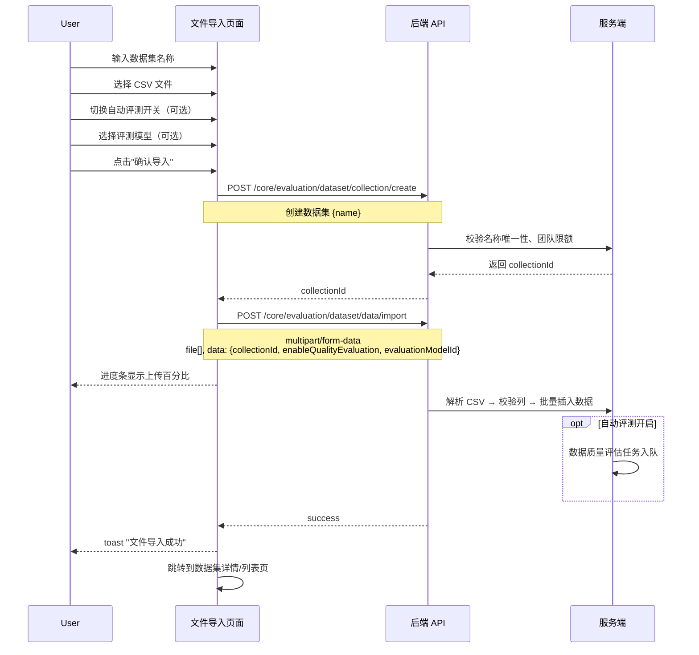
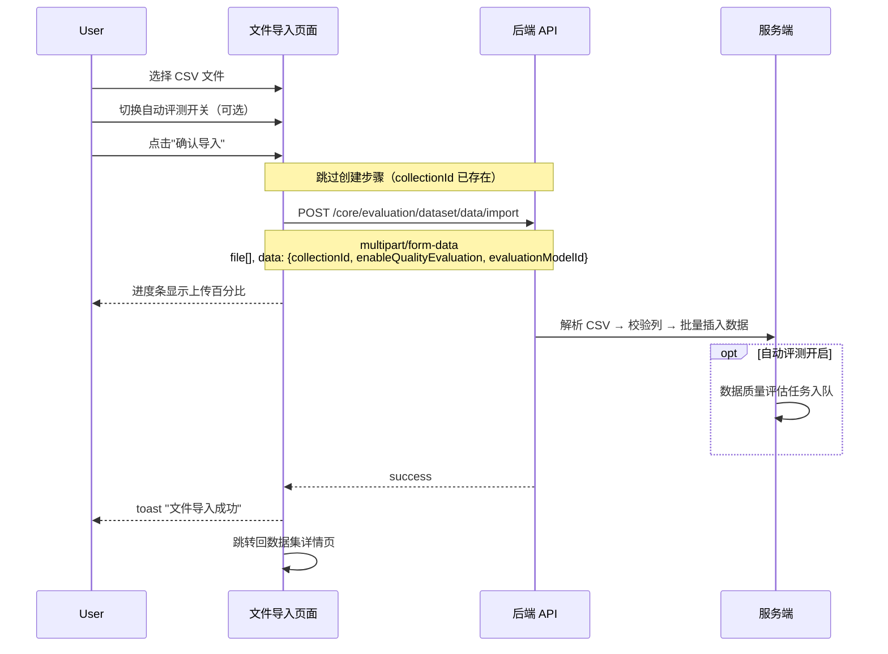

# 文件导入 — 业务流程详解

## 页面总览

文件导入页面是一个单页表单，提供数据集名称输入（新建模式）、CSV 文件选择上传、CSV 模板下载、自动评测开关和评测模型选择功能。页面通过 URL 参数区分新建/追加两种模式。

---

### S01：新建数据集并导入文件

> 业务描述：用户从评测数据集列表页进入此页面，输入数据集名称并上传 CSV 文件，系统创建新数据集并将文件数据导入。

#### 步骤 1：进入页面并初始化

| 用户操作 | 触发 API | 分支条件 | 页面变化 |
|---------|---------|---------|---------|
| 从评测数据集列表页点击"导入文件"按钮 | 无（路由跳转，不携带 `collectionId`） | `router.query.collectionId` 为空 → 进入新建模式 | 页面加载，显示"返回"按钮、名称输入框（含 placeholder "请输入数据集名称"）、文件上传区、自动评测开关（默认开启）、提交按钮 |

- **前置条件**: 侧边栏显示评测入口（`show_evaluation` 开启且用户有 `hasEvaluationCreatePer` 权限）
- **名称输入框校验**: 必填字段，`required: true`

#### 步骤 2：下载 CSV 模板（可选）

| 用户操作 | 触发 API | 分支条件 | 页面变化 |
|---------|---------|---------|---------|
| 点击"下载模板"按钮 | 无（前端生成 Blob 触发浏览器下载） | — | 浏览器下载 `evaluation_template.csv`，包含 `userInput,expectedOutput,actualOutput,context,retrievalContext` 表头及示例行 |

- 模板内容为 UTF-8 BOM 编码的 CSV 文本，通过 `fileDownload` 工具函数触发下载
- 模板提示（QuestionTip）展示表结构说明：`userInput`（用户输入）和 `expectedOutput`（预期输出）为示例列

#### 步骤 3：选择 CSV 文件

| 用户操作 | 触发 API | 分支条件 | 页面变化 |
|---------|---------|---------|---------|
| 点击文件上传区 或 拖拽 CSV 文件到上传区 | 无（前端 File API） | 文件扩展名非 `.csv` → toast 警告"不支持的文件格式"；文件重复（基于名称+大小+修改时间）→ toast 提示"文件已上传" | 通过格式校验后，文件显示在已选列表中（含图标、文件名、大小、删除按钮）；`selectFiles` 更新后表单有效性重新评估 |

- **文件过滤**: `fileType=".csv"`，`autoFilterOverSize=true`
- **重复检测**: 基于文件名、大小和最后修改时间的组合键去重
- **表单有效性**: 名称非空（新建模式）且已选文件数 > 0 时，提交按钮可用

#### 步骤 4：配置自动评测

| 用户操作 | 触发 API | 分支条件 | 页面变化 |
|---------|---------|---------|---------|
| 切换"自动评测"开关 | 无（前端状态更新） | 开关打开 → 显示评测模型选择器；开关关闭 → 隐藏模型选择器 | 模型选择器显示/隐藏 |
| 从模型下拉列表选择评测模型 | 无（前端状态更新） | 默认选中 `evalModelList[0]`（首个可用于评测的模型） | 模型选择器显示选中模型名称和头像 |

- **评测模型列表**: 从 `llmModelList` 中过滤出 `useInEvaluation` 为 `true` 的模型
- **自动评测默认值**: `true`

#### 步骤 5：提交导入

| 用户操作 | 触发 API | 分支条件 | 页面变化 |
|---------|---------|---------|---------|
| 点击提交按钮 | **(1) POST `/api/core/evaluation/dataset/collection/create`** — `{name}` | 串行依赖：创建成功返回 `collectionId` | 提交按钮文案从"确认导入"变为上传进度百分比（如"上传中 45%"） |
| — | **(2) POST `/api/core/evaluation/dataset/data/import`** (multipart/form-data) — `{file[], data: {collectionId, enableQualityEvaluation, evaluationModelId}}` | 串行依赖：使用步骤 (1) 返回的 `collectionId`；自动评测关闭时 `enableQualityEvaluation=false` 且 `evaluationModelId` 为 `undefined` | 进度条随上传进度百分比更新；达到 100% 后按钮文案变为"数据解析中" |

- **后端处理流程（API 侧）**:
  - Multer 接收多文件
  - 校验文件扩展名为 `.csv`
  - Papa Parse 解析 CSV 内容，校验必填列 `user_input`、`expected_output`
  - 检查团队数据集数量限制（`checkTeamEvalDatasetLimit`）
  - 创建评测数据集 Collection（如为新建模式）
  - 批量插入数据记录到 MongoDB
  - 如开启自动评测，将数据质量评估任务加入消息队列（`addEvalDatasetDataQualityBulk`）
  - 清理上传的临时文件

#### 步骤 6：导入完成跳转

| 用户操作 | 触发 API | 分支条件 | 页面变化 |
|---------|---------|---------|---------|
| 无（自动跳转） | 无 | 根据 `scene` 参数分流：`evaluationDatasetDetail` → 跳转到数据集详情页；`evaluationDatasetList` → 跳转到数据集列表；默认 → 跳转到数据集列表 | `router.push(getRedirectUrl())` |

- **成功提示**: toast 显示"文件导入成功"（i18n key: `file_import_success`）

---

### S02：向已有数据集追加文件数据

> 业务描述：用户从数据集详情页跳转进入，直接上传 CSV 文件追加到当前数据集中，无需输入数据集名称。

#### 步骤 1：进入页面并初始化

| 用户操作 | 触发 API | 分支条件 | 页面变化 |
|---------|---------|---------|---------|
| 从数据集详情页点击"追加数据" | 无（路由跳转，携带 `collectionId` 和 `collectionName`） | `router.query.collectionId` 存在 → 进入追加模式 | 页面加载，名称输入框隐藏，仅显示文件上传区、自动评测开关和提交按钮 |

- **前置条件**: 来源数据集已存在且用户对其有操作权限

#### 步骤 2-5：同 S01 步骤 2-5

追加模式与新建模式的核心差异仅在于：
- **跳过创建数据集 API**：提交时 `collectionId` 已存在，直接调用数据导入 API
- **表单校验差异**：不再校验名称是否为空，仅校验已选文件数 > 0

#### 步骤 6：导入完成跳转

| 用户操作 | 触发 API | 分支条件 | 页面变化 |
|---------|---------|---------|---------|
| 无（自动跳转） | 无 | `scene=evaluationDatasetDetail` → `router.push(/dashboard/evaluation/dataset/detail?collectionId=xxx&collectionName=xxx)` | 返回数据集详情页，新导入的数据出现在数据列表中 |

---

### 表单字段清单（新建模式）

| 字段名 | 控件类型 | 必填 | 默认值 | 可选值/约束 | 说明 |
|--------|---------|------|--------|------------|------|
| 数据集名称 | 文本输入 | ✅（新建模式） | — | 最长 30 字符 | 仅新建模式显示；追加模式下由 `collectionId` 确定数据集 |
| 文件 | 文件选择器 | ✅ | — | 仅 `.csv` 文件，支持多文件 | 通过 `FileSelector` 组件选择，含拖拽、去重 |
| 自动评测 | 开关 | 否 | `true` | — | 开启后显示评测模型选择器 |
| 评测模型 | 下拉选择 | 条件必填（自动评测开启时） | `evalModelList[0]` 的 ID | 仅可选 `useInEvaluation: true` 的模型 | 自动评测关闭时隐藏 |

### 校验规则

| 规则 | 触发时机 | 错误提示文案 |
|------|---------|-------------|
| 数据集名称必填（新建模式） | 提交时 | "请输入数据集名称" |
| 至少选择一个文件 | 提交时 | "请选择文件" |
| CSV 文件格式校验 | 选择文件时 | "不支持的文件格式"（弹出具体后缀） |
| 文件必填列校验（user_input、expected_output） | 服务端解析时 | 服务端返回 CSV 解析错误 |
| 数据集名称重复 | 服务端创建时 | 服务端返回数据集名称重复错误 |

### 前后置条件

- **前置条件**: 
  - 团队已开启评测功能（`feConfigs.show_evaluation`）
  - 用户具有评测创建权限（`hasEvaluationCreatePer`）
  - 追加模式：目标数据集存在且有写入权限
  - 自动评测：团队 AI 积分余额充足
- **后置影响**: 
  - 新建模式：创建新数据集及其中所有数据记录
  - 追加模式：向已有数据集追加数据记录
  - 自动评测开启：数据记录质量评估任务进入消息队列
- **失败场景**:
  - CSV 必填列缺失 → toast 错误提示
  - 数据集创建失败（名称重复/超出限额）→ toast 错误提示
  - 文件上传超时（timeout: 600000ms）→ 请求失败
  - 权限不足 → 接口返回权限错误

---

### Mermaid 附录

#### S01：新建数据集并导入文件

#### S02：向已有数据集追加文件数据

