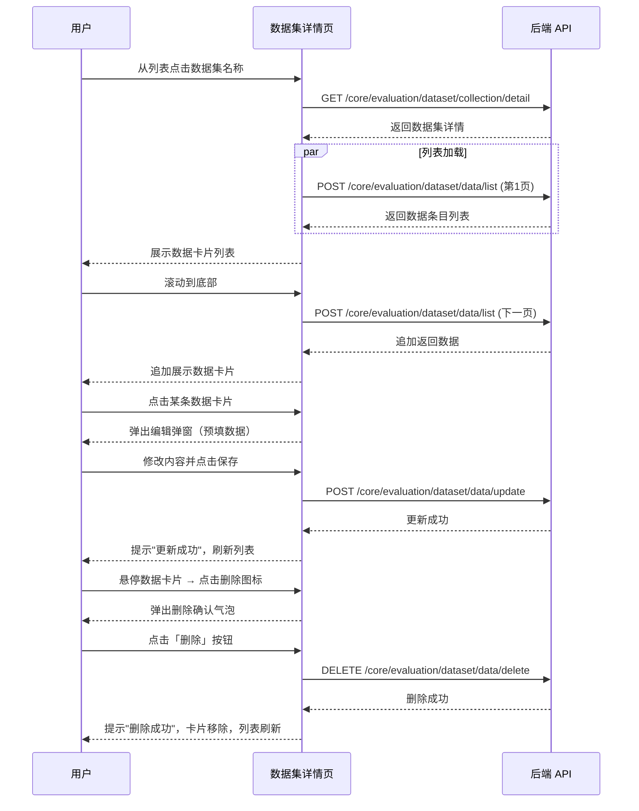
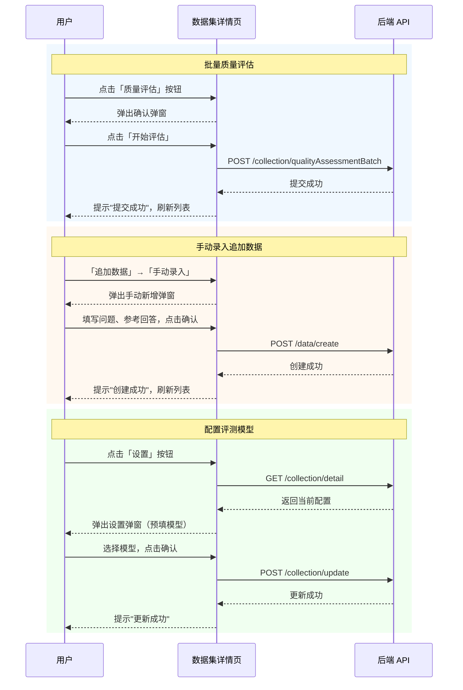

# 评测数据集详情 — 业务流程详解

## 页面总览

评测数据集详情页是一个单页数据管理视图，用户在此页面对单个评测数据集的全部数据条目进行查看、搜索、筛选、编辑、删除、质量评估和追加数据等操作。页面由顶部面包屑导航和数据卡片列表组成，无 Tab 结构。

### 查看数据集数据列表

> **业务描述**: 用户从评测数据集列表页点击某个数据集名称进入详情页，查看该数据集下的所有数据条目，通过滚动自动加载更多数据。

#### 步骤 1：进入详情页

| 用户操作 | 触发 API | 分支条件 | 页面变化 |
|---------|---------|---------|---------|
| 在评测数据集列表中点击某个数据集名称 | GET `/core/evaluation/dataset/collection/detail?collectionId={id}` | 无 | 页面跳转到数据集详情页，显示面包屑导航"评测数据集 > 数据集名称"，数据列表区域展示加载状态 |

#### 步骤 2：加载数据列表

| 用户操作 | 触发 API | 分支条件 | 页面变化 |
|---------|---------|---------|---------|
| 页面自动加载（无需用户操作） | POST `/core/evaluation/dataset/data/list`（参数：searchKey、status、qualityResult、collectionId） | 无 | 列表区域显示数据卡片，每条卡片显示序号、用户问题文本、期望回答（无回答时显示"暂无回答"）和质量状态标签 |

#### 步骤 3：滚动加载更多

| 用户操作 | 触发 API | 分支条件 | 页面变化 |
|---------|---------|---------|---------|
| 向下滚动列表到底部 | POST `/core/evaluation/dataset/data/list`（带分页偏移参数） | 还有更多数据时 | 列表底部追加加载更多数据卡片；无更多数据时停止加载 |

##### 数据加载详情

| 加载阶段 | API | 关键参数 | 数据处理 | 渲染结果 |
|---------|-----|---------|---------|---------|
| 首次加载 | POST /core/evaluation/dataset/data/list | collectionId, searchKey, status, qualityResult, pageSize=15 | 按默认排序返回 | 列表前 15 条数据卡片 |
| 滚动加载 | POST /core/evaluation/dataset/data/list | 同上，带 offset 分页 | 追加到现有列表 | 追加 15 条数据卡片 |
| 搜索刷新 | POST /core/evaluation/dataset/data/list | searchKey 更新，重置分页 | 重置列表重新加载 | 匹配搜索关键字的新列表 |

### 搜索过滤数据

> **业务描述**: 用户通过搜索框和状态筛选器对数据列表进行过滤。

#### 步骤 1：关键字搜索

| 用户操作 | 触发 API | 分支条件 | 页面变化 |
|---------|---------|---------|---------|
| 在搜索框输入关键字 | POST `/core/evaluation/dataset/data/list`（参数更新 searchKey，500ms 防抖后触发） | 无 | 列表过滤为匹配关键字的数据条目，总数更新 |

#### 步骤 2：状态筛选

| 用户操作 | 触发 API | 分支条件 | 页面变化 |
|---------|---------|---------|---------|
| 点击状态下拉选择器，选择目标状态 | POST `/core/evaluation/dataset/data/list`（参数更新 status 或 qualityResult） | 选择「全部」：status=''，qualityResult=''；选择「优质」或「待优化」：按 qualityResult 筛选；选择其他状态：按 status 筛选 | 列表按选中状态过滤更新 |

- 筛选状态选项：全部、待评估、排队中、评估中、已完成、优质、待优化、异常

### 编辑数据条目

> **业务描述**: 用户点击某条数据卡片后打开编辑弹窗，可修改该条数据的问题和参考回答。

#### 步骤 1：打开编辑弹窗

| 用户操作 | 触发 API | 分支条件 | 页面变化 |
|---------|---------|---------|---------|
| 点击某条数据卡片 | 无（弹窗直接使用当前选中数据） | 无 | 屏幕中央弹出编辑弹窗，标题显示为数据序号和数据集名称，表单中预填当前数据的问题（用户输入）和参考回答（期望输出） |

#### 步骤 2：修改并保存

| 用户操作 | 触发 API | 分支条件 | 页面变化 |
|---------|---------|---------|---------|
| 修改表单中问题/参考回答字段内容，点击「保存」/「保存并下一条」 | POST `/core/evaluation/dataset/data/update`（参数：dataId, userInput, expectedOutput） | 保存成功后 | 弹窗关闭（或自动切换到下一条数据），列表刷新；保存失败时显示错误提示 |

##### 表单与交互详情

**表单字段清单**：

| 字段名 | 控件类型 | 必填 | 默认值 | 可选值/约束 | 编辑时只读 | 说明 |
|--------|---------|------|--------|------------|-----------|------|
| 用户问题 | 文本输入 | 是 | 当前数据的问题内容 | — | 否 | 评测数据中的用户输入问题 |
| 参考回答 | 文本输入 | 否 | 当前数据的期望输出内容 | — | 否 | 评测数据中的期望输出回答 |

**前后置条件**：
- **前置条件**：数据集中有至少一条数据条目
- **后置影响**：更新数据条目内容，如果设置了「同步修改数据集」则会同步更新原始数据集
- **失败场景**：网络异常或数据已被删除时，提示错误信息

### 删除数据条目

> **业务描述**: 用户悬停数据卡片时点击删除图标，确认后删除该数据条目。

#### 步骤 1：删除确认

| 用户操作 | 触发 API | 分支条件 | 页面变化 |
|---------|---------|---------|---------|
| 鼠标悬停在数据卡片上，点击出现的删除图标 | 无 | 无 | 卡片右侧弹出删除确认气泡，显示警告图标和「确认删除数据？」提示，以及取消和删除两个按钮 |

#### 步骤 2：确认删除

| 用户操作 | 触发 API | 分支条件 | 页面变化 |
|---------|---------|---------|---------|
| 点击气泡中的「删除」按钮 | DELETE `/core/evaluation/dataset/data/delete`（参数：dataId） | 删除成功 | 删除操作中按钮显示加载状态；删除成功后该卡片从列表移除，列表总数更新，提示"删除成功"；删除失败显示错误提示 |

##### 删除链路详情

- **引用检查**：无（直接删除，不做引用校验）
- **确认弹窗**：气泡型确认，标题为警告图标 + "确认删除数据？"
- **级联影响**：删除后列表总数减一，当前选中的编辑状态重置

### 批量质量评估

> **业务描述**: 用户发起对整个数据集的批量质量评估。

#### 步骤 1：打开确认弹窗

| 用户操作 | 触发 API | 分支条件 | 页面变化 |
|---------|---------|---------|---------|
| 点击「质量评估」按钮 | 无 | 无 | 弹出确认弹窗，显示提示文案「确认对全部 {total} 条数据进行质量评估？」，底部有「取消」和「开始评估」两个按钮 |

#### 步骤 2：启动评估

| 用户操作 | 触发 API | 分支条件 | 页面变化 |
|---------|---------|---------|---------|
| 点击「开始评估」按钮 | POST `/core/evaluation/dataset/collection/qualityAssessmentBatch`（参数：collectionId） | 提交成功 | 按钮显示加载状态；成功后弹窗关闭，提示"提交成功"，列表刷新（数据状态变为排队中/评估中） |

### AI 智能生成追加数据

> **业务描述**: 用户通过 AI 从知识库智能生成新数据并追加到当前数据集中。

#### 步骤 1：打开智能生成弹窗

| 用户操作 | 触发 API | 分支条件 | 页面变化 |
|---------|---------|---------|---------|
| 点击「追加数据」按钮，在下拉菜单中选择「AI生成」 | 无 | 无 | 弹出智能生成弹窗，用户可配置生成参数（如知识库选择、生成数量等） |

#### 步骤 2：确认生成

| 用户操作 | 触发 API | 分支条件 | 页面变化 |
|---------|---------|---------|---------|
| 配置参数后点击确认 | POST `/core/evaluation/dataset/data/create/smartGenerate` | 生成成功 | 弹窗关闭，列表刷新，新增数据出现在列表中 |

### 文件导入追加数据

> **业务描述**: 用户通过上传文件将外部数据导入到当前数据集。

#### 步骤 1：跳转导入页

| 用户操作 | 触发 API | 分支条件 | 页面变化 |
|---------|---------|---------|---------|
| 点击「追加数据」按钮，在下拉菜单中选择「文件导入」 | 无 | 无 | 页面跳转到文件导入页 `/dashboard/evaluation/dataset/fileImport?collectionId={id}&collectionName={name}&scene=evaluationDatasetDetail` |

#### 步骤 2：上传并导入

| 用户操作 | 触发 API | 分支条件 | 页面变化 |
|---------|---------|---------|---------|
| 选择文件上传并确认导入 | POST `/core/evaluation/dataset/data/import`（FormData，含文件和数据集参数） | 导入成功 | 导入进度显示；完成后可返回详情页查看新增数据 |

### 手动录入追加数据

> **业务描述**: 用户手动填写问题和参考回答，向当前数据集追加单条数据。

#### 步骤 1：打开手动录入弹窗

| 用户操作 | 触发 API | 分支条件 | 页面变化 |
|---------|---------|---------|---------|
| 点击「追加数据」按钮，在下拉菜单中选择「手动录入」 | 无 | 无 | 弹出手动新增弹窗，包含问题输入、参考回答输入和是否自动评估开关 |

#### 步骤 2：提交录入

| 用户操作 | 触发 API | 分支条件 | 页面变化 |
|---------|---------|---------|---------|
| 填写表单后点击确认 | POST `/core/evaluation/dataset/data/create` | 创建成功 | 弹窗关闭，提示"创建成功"，列表刷新显示新数据 |

##### 表单字段清单

| 字段名 | 控件类型 | 必填 | 默认值 | 可选值/约束 | 编辑时只读 | 说明 |
|--------|---------|------|--------|------------|-----------|------|
| 问题 | 文本输入 | 是 | — | — | 否 | 评测数据中的用户输入问题 |
| 参考回答 | 文本输入 | 否 | — | — | 否 | 评测数据中的期望输出回答 |
| 自动评估 | 开关 | 否 | 开启 | 开启/关闭 | 否 | 是否在创建后自动进行质量评估 |

### 配置评测模型

> **业务描述**: 用户在设置弹窗中为当前数据集选择和配置用于质量评估的 AI 模型。

#### 步骤 1：打开设置弹窗

| 用户操作 | 触发 API | 分支条件 | 页面变化 |
|---------|---------|---------|---------|
| 点击「设置」按钮 | GET `/core/evaluation/dataset/collection/detail?collectionId={id}`（获取当前配置） | 无 | 弹出设置弹窗，显示提示信息"更改评测模型后，重新评测将使用新的模型"，模型选择器中预填当前使用的评测模型 |

#### 步骤 2：选择模型并保存

| 用户操作 | 触发 API | 分支条件 | 页面变化 |
|---------|---------|---------|---------|
| 从下拉列表中选择评测模型，点击「确认」 | POST `/core/evaluation/dataset/collection/update`（参数：collectionId, evaluationModelId） | 未选择模型时确认按钮置灰；选择模型后按钮可用 | 保存中确认按钮显示加载状态；保存成功后提示"更新成功"，弹窗关闭 |

- 模型列表中仅显示可用于评测的模型（`useInEvaluation` 为 true）

## Mermaid 附录

### 查看数据列表 + 编辑 + 删除

### 质量评估 + 追加数据

