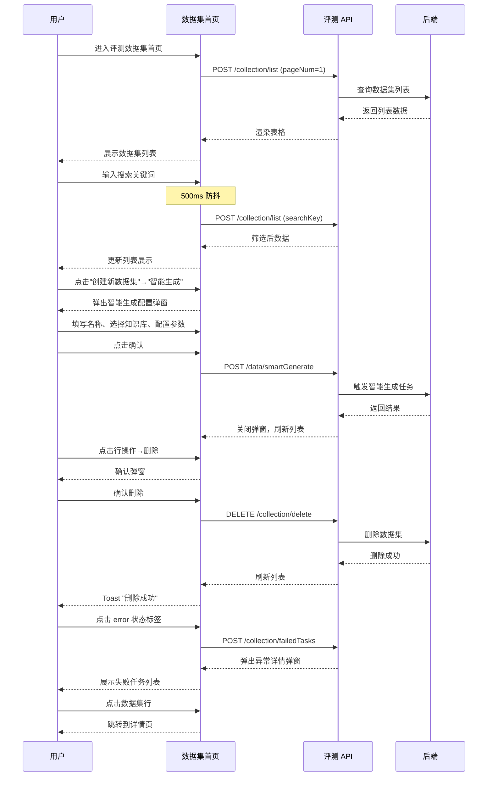

# 评测数据集首页 — 业务流程详解

## 页面总览

评测数据集首页是评测系统的数据管理入口，提供数据集列表的查看、搜索、创建和管理功能。页面顶部为操作栏（搜索框 + 创建按钮），主体为数据集表格，底部为分页器。创建数据集支持"智能生成"和"文件导入"两种方式。

### 查看数据集列表

> 用户进入页面后，系统自动加载第一页数据集列表数据，以表格形式展示每个数据集的名称、数据量、创建/更新时间、状态和创建者信息。

#### 步骤 1：页面加载，获取数据集列表

| 用户操作 | 触发 API | 分支条件 | 页面变化 |
|---------|---------|---------|---------|
| 进入 /dashboard/evaluation/dataset 路由 | POST /core/evaluation/dataset/collection/list（参数：pageNum=1, pageSize=10, searchKey=""） | 无 | 页面显示 MyBox 加载遮罩，表格区域展示加载中状态 |

#### 步骤 2：列表渲染

| 用户操作 | 触发 API | 分支条件 | 页面变化 |
|---------|---------|---------|---------|
| 无（系统自动） | 无（数据已返回） | 数据返回后 | 加载遮罩消失，表格渲染数据集列表，每行显示：名称、数据量、创建/更新时间、状态标签、创建者头像和名称、操作按钮（更多菜单）。列表为空时显示 EmptyTip 空状态提示 |

#### 步骤 3：分页操作

| 用户操作 | 触发 API | 分支条件 | 页面变化 |
|---------|---------|---------|---------|
| 点击分页器切换页码或修改每页条数 | POST /core/evaluation/dataset/collection/list（参数：pageNum=N, pageSize=M, searchKey=当前搜索值） | 无 | 表格数据更新为新页数据，分页器状态同步变化 |

**数据加载详情**：

| 加载阶段 | API | 关键参数 | 数据处理 | 渲染结果 |
|---------|-----|---------|---------|---------|
| 首次加载 | POST /core/evaluation/dataset/collection/list | pageNum=1, pageSize=10 | 无额外处理 | 表格前10条 |
| 翻页 | POST /core/evaluation/dataset/collection/list | pageNum=N, pageSize=10 | 无额外处理 | 表格第N页 |
| 搜索触发刷新 | POST /core/evaluation/dataset/collection/list | pageNum=1, pageSize=10, searchKey=搜索词 | 重置到第1页 | 过滤后的表格数据 |

- 分页参数：默认每页 10 条
- 排序规则：按创建时间降序（默认）
- 筛选条件：搜索框支持按名称搜索，500ms 防抖后触发

**特殊列的渲染**：
- **状态列**：显示彩色标签（绿色=ready 就绪、蓝色=processing 生成中、灰色=queuing 排队中、红色=error 生成异常）。error 状态时标签可点击，打开异常详情弹窗，hover 提示"点击查看详情"
- **时间列**：显示两行，首行为创建时间（yyyy-MM-dd HH:mm:ss），次行为更新时间
- **创建者列**：显示用户头像 + 名称

### 搜索数据集

> 用户在搜索框中输入数据集名称关键词，系统在 500ms 防抖后自动发起查询，列表展示匹配结果。

#### 步骤 1：输入搜索关键词

| 用户操作 | 触发 API | 分支条件 | 页面变化 |
|---------|---------|---------|---------|
| 在搜索框中输入关键词 | 无（仅更新本地状态） | 无 | 输入框内容实时更新 |

#### 步骤 2：防抖触发搜索

| 用户操作 | 触发 API | 分支条件 | 页面变化 |
|---------|---------|---------|---------|
| 停止输入 500ms 后 | POST /core/evaluation/dataset/collection/list（参数：pageNum=1, pageSize=10, searchKey=输入值） | 无 | 表格加载遮罩出现，数据刷新为搜索结果第1页 |

### 智能生成数据集

> 用户点击"创建新数据集"→"智能生成"，打开智能生成弹窗。配置数据集名称、选择知识库、设置数据量和生成模型后，提交由 AI 生成评测数据集。

#### 步骤 1：打开智能生成弹窗

| 用户操作 | 触发 API | 分支条件 | 页面变化 |
|---------|---------|---------|---------|
| 点击"创建新数据集"按钮，选择"智能生成" | 无 | 无 | 弹出智能生成配置弹窗，标题"智能生成数据集" |

#### 步骤 2：配置生成参数

| 用户操作 | 触发 API | 分支条件 | 页面变化 |
|---------|---------|---------|---------|
| 在弹窗中填写数据集名称 | 无 | scene=database 时必填 | 名称输入框填写状态更新 |
| 点击"选择知识库"按钮 | 无 | 无 | 打开知识库选择弹窗 |
| 在知识库选择器中勾选知识库 | 无 | 仅列出非数据库类型知识库 | 已选知识库以卡片形式展示（头像+名称） |
| 调整数据量数值 | 无 | 最小1，最大值为已选知识库数据总量（至少50）；数据量随知识库选择联动更新上限 | MyNumberInput 数字输入器更新 |
| 选择生成模型 | 无 | 模型列表仅展示 useInEvaluation 的 LLM 模型，默认选中第一个 | 下拉选择器更新 |

#### 步骤 3：提交生成

| 用户操作 | 触发 API | 分支条件 | 页面变化 |
|---------|---------|---------|---------|
| 点击"确认"按钮 | POST /core/evaluation/dataset/data/smartGenerate（参数：name, kbDatasetIds[], intelligentGenerationModelId, count） | 表单校验通过（名称非空、已选知识库、数据量≥1、已选模型）；任一不满足时按钮灰显不可点击 | 按钮进入 loading 状态，弹窗关闭，列表自动刷新 |

**表单字段清单**：

| 字段名 | 控件类型 | 必填 | 默认值 | 可选值/约束 | 说明 |
|--------|---------|------|--------|------------|------|
| 数据集名称 | 文本输入 | 是（scene=dataset时） | "" | — | 仅在"数据集"场景下显示 |
| 生成依据（知识库） | 知识库选择器（弹窗） | 是 | [] | 非数据库类型知识库 | 至少选择一个知识库，已选中以卡片展示 |
| 数据量 | 数字输入器 | 是 | 50 | 1 到已选知识库数据总量 | 选择知识库后自动调整上限 |
| 生成模型 | 下拉选择器 | 是 | 第一个可用模型 | 仅可选 useInEvaluation 的 LLM 模型 | — |

**字段联动**：数据量上限随已选知识库的数据总量联动更新；当知识库选择变化时，若上限低于当前值则自动调整为上限值。

**校验规则**：

| 规则 | 触发时机 | 错误提示文案 |
|------|---------|-------------|
| 数据集名称必填（scene=dataset时） | 提交时 | 表单校验失败，确认按钮灰显 |
| 必须选择知识库 | 提交时 | 确认按钮灰显 |
| 数据量必须≥1 | 提交时 | 确认按钮灰显 |
| 必须选择生成模型 | 提交时 | 确认按钮灰显 |

### 文件导入数据集

> 用户点击"创建新数据集"→"文件导入"，跳转到文件导入页面。

#### 步骤 1：导航到文件导入页

| 用户操作 | 触发 API | 分支条件 | 页面变化 |
|---------|---------|---------|---------|
| 点击"创建新数据集"→"文件导入" | 无 | 无 | 路由跳转到 /dashboard/evaluation/dataset/fileImport?scene=evaluationDatasetList |

### 重命名数据集

> 用户在操作菜单中选择"重命名"，弹出编辑弹窗，修改名称后提交。

#### 步骤 1：打开重命名弹窗

| 用户操作 | 触发 API | 分支条件 | 页面变化 |
|---------|---------|---------|---------|
| 点击行操作菜单（更多按钮）→"重命名" | 无 | 无 | 弹出编辑标题弹窗，预填当前数据集名称 |

#### 步骤 2：提交新名称

| 用户操作 | 触发 API | 分支条件 | 页面变化 |
|---------|---------|---------|---------|
| 修改名称后点击确认 | POST /core/evaluation/dataset/collection/update（参数：collectionId, name） | 无 | 成功后 toast 提示"更新成功"，弹窗关闭，列表刷新 |

### 删除数据集

> 用户删除指定数据集，需在确认弹窗中二次确认。

#### 步骤 1：触发删除

| 用户操作 | 触发 API | 分支条件 | 页面变化 |
|---------|---------|---------|---------|
| 点击行操作菜单→"删除" | 无 | 无 | 弹出确认弹窗，标题"删除"，提示文案为"确认删除该数据集？"，含确认和取消按钮 |

#### 步骤 2：确认删除

| 用户操作 | 触发 API | 分支条件 | 页面变化 |
|---------|---------|---------|---------|
| 点击弹窗"确认"按钮 | DELETE /core/evaluation/dataset/collection/delete（参数：collectionId） | 无 | 成功后 toast 提示"删除成功"，弹窗关闭，列表刷新；失败 toast 提示相应错误 |

**删除链路详情**：
- **确认弹窗**：弹窗标题为"删除"，提示用户确认删除操作。确认文本为"删除"。使用 useConfirm hook 配置类型为 "delete"
- **级联影响**：删除后数据集从列表移除，关联的评测任务可能受影响

### 查看异常任务

> 当数据集状态为"生成异常"时，用户点击红色状态标签，打开异常详情弹窗查看失败任务列表。

#### 步骤 1：打开异常弹窗

| 用户操作 | 触发 API | 分支条件 | 页面变化 |
|---------|---------|---------|---------|
| 点击 error 状态标签 | POST /core/evaluation/dataset/collection/failedTasks（参数：collectionId） | 仅 status=error 时标签可点击 | 弹出异常信息弹窗，加载失败任务列表 |

#### 步骤 2：查看和处理失败任务

| 用户操作 | 触发 API | 分支条件 | 页面变化 |
|---------|---------|---------|---------|
| 查看失败任务列表 | 无（数据已加载） | 任务列表为空时显示 EmptyTip | 表格展示：来源知识库、来源分块、错误信息、操作列（重试+删除按钮） |
| 点击单个任务的"重试"按钮 | POST /core/evaluation/dataset/collection/retryTask（参数：jobId, collectionId） | 无 | 按钮 loading，成功后 toast "重试成功"，任务列表刷新 |
| 点击单个任务的"删除"按钮 | POST /core/evaluation/dataset/collection/deleteTask（参数：jobId, collectionId） | 无 | 按钮 loading，成功后 toast "删除成功"，任务列表刷新 |
| 点击"全部重试"按钮 | POST /core/evaluation/dataset/collection/retryAllTask（参数：collectionId） | 任务列表为空时按钮灰显 | 按钮 loading，成功后 toast "重试成功"，任务列表刷新 |

#### 步骤 3：关闭弹窗

| 用户操作 | 触发 API | 分支条件 | 页面变化 |
|---------|---------|---------|---------|
| 点击取消或关闭按钮 | 无 | 若异常任务数量有变化（处理过任务），传入 isUpdateList=true | 弹窗关闭；若列表有变化则刷新主页列表 |

**状态转换详情**：
- **异常任务状态转换**：error → 点击重试 → 任务重新进入处理队列 → 状态变为 processing/ready 或仍为 error（重试失败）
- **前置检查**：重试前不检查依赖，直接重新提交任务；全部重试按钮在任务列表为空时灰显
- **级联更新**：任务重试/删除成功后自动刷新异常任务列表

### 查看数据集详情

> 用户点击数据集行，导航到数据集详情页。

#### 步骤 1：导航到详情页

| 用户操作 | 触发 API | 分支条件 | 页面变化 |
|---------|---------|---------|---------|
| 点击数据集表格行 | 无 | 无 | 路由跳转到 /dashboard/evaluation/dataset/detail?collectionId={_id}&collectionName={name}。行 hover 时背景变为 myGray.100 |

### Mermaid 附录

