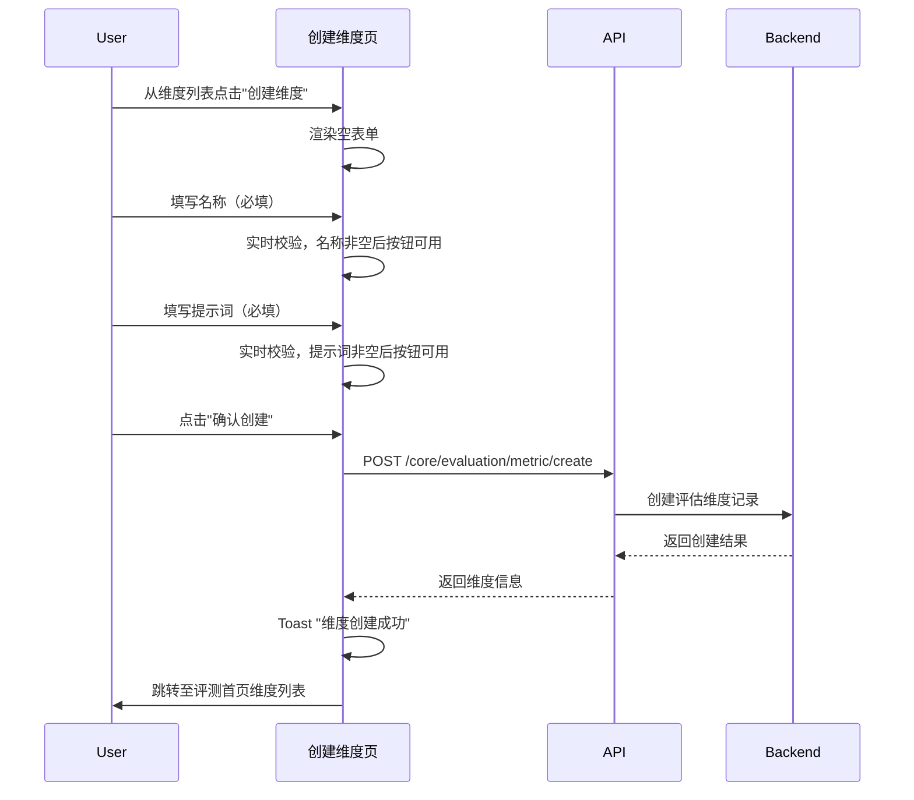
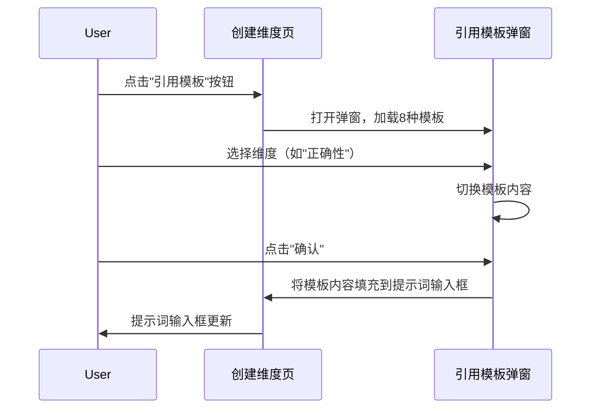
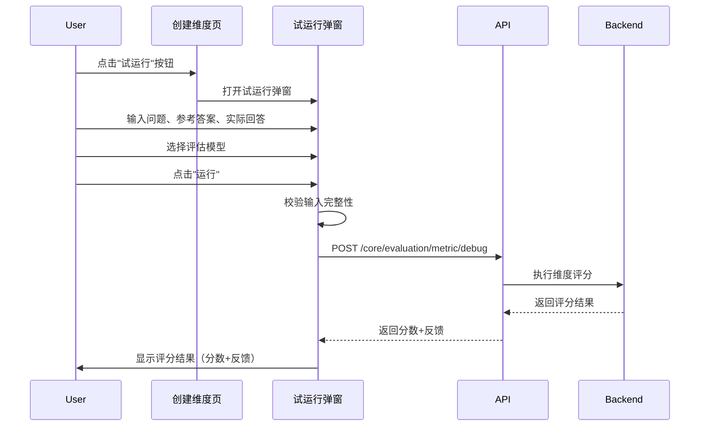

# 创建维度 — 业务流程详解

## 页面总览

创建维度页面是一个单页表单，用户在此定义用于 AI 输出评估的评价维度。页面提供名称、描述、提示词三个核心字段，辅助以模板引用和试运行功能。提交成功后跳转回评测首页维度列表。

### 填写并创建评估维度

> 用户在创建维度页面填写评估维度的基本信息并提交创建。

#### 步骤 1：进入创建维度页面

| 用户操作 | 触发 API | 分支条件 | 页面变化 |
|---------|---------|---------|---------|
| 从评测首页维度列表点击"创建维度"按钮 | 无 | 无 | 页面跳转至 `/dashboard/evaluation/dimension/create`，DashboardContainer 渲染布局框架（侧边栏+背景装饰），加载页面内容：返回按钮、EditForm 空表单、试运行和提交按钮 |

#### 步骤 2：填写维度名称

| 用户操作 | 触发 API | 分支条件 | 页面变化 |
|---------|---------|---------|---------|
| 在"名称"输入框中输入维度名称 | 无 | 实时校验：名称为空时，试运行按钮、提交按钮置灰（`isFormValid: false`） | 输入框获得焦点（`autoFocus`），输入内容后失焦触发 react-hook-form 校验；名称非空后表单有效性检查通过，按钮变为可用状态 |

#### 步骤 3：填写维度描述（可选）

| 用户操作 | 触发 API | 分支条件 | 页面变化 |
|---------|---------|---------|---------|
| 在"描述"文本域中输入维度说明 | 无 | 描述为可选字段，不影响表单有效性 | 文本域接受多行输入（3行高度） |

#### 步骤 4：填写评估提示词

| 用户操作 | 触发 API | 分支条件 | 页面变化 |
|---------|---------|---------|---------|
| 在"提示词"文本域中输入评估提示词内容 | 无 | 实时校验：提示词为空时，试运行按钮、提交按钮置灰；提示词非空且名称非空时，按钮可用 | 文本域接受多行输入（15行高度），支持大段提示词内容 |

#### 步骤 5：提交创建

| 用户操作 | 触发 API | 分支条件 | 页面变化 |
|---------|---------|---------|---------|
| 点击"确认创建"按钮 | `POST /core/evaluation/metric/create`（参数：name, description, prompt） | 名称或提示词为空时：弹 toast 警告"请输入维度名称"或"请输入提示词"并中止提交 | 按钮显示 loading 状态；API 成功 → toast 提示"维度创建成功"，页面跳转至 `/dashboard/evaluation?evaluationTab=dimensions` |

**表单字段清单**：

| 字段名 | 控件类型 | 必填 | 默认值 | 可选值/约束 | 编辑时只读 | 说明 |
|--------|---------|------|--------|------------|-----------|------|
| 名称 | 文本输入 | ✅ | — | 任意文本 | 否 | 维度唯一标识名称 |
| 描述 | 多行文本 | — | — | — | 否 | 维度用途说明 |
| 提示词 | 多行文本（15行） | ✅ | — | 任意文本，支持引用模板填充 | 否 | 用于 AI 评分的评估提示词 |

**校验规则**：

| 规则 | 触发时机 | 错误提示文案 |
|------|---------|-------------|
| 名称不能为空 | 实时（onChange） | 按钮置灰，无文字提示 |
| 提示词不能为空 | 实时（onChange） | 按钮置灰，无文字提示 |
| 名称不能为空 | 提交时 | "请输入维度名称"（toast 警告） |
| 提示词不能为空 | 提交时 | "请输入提示词"（toast 警告） |

**前后置条件**：
- **前置条件**：用户已登录，具有评测模块访问权限
- **后置影响**：创建成功后在数据库新增一条评估维度记录，页面跳转至评测首页维度列表，新维度出现在列表中
- **失败场景**：API 调用失败时，按钮恢复可用状态，提示错误信息

### 引用模板快速填充

> 用户在提示词区域点击"引用模板"按钮，从内置模板中选择并填充提示词。

#### 步骤 1：打开模板弹窗

| 用户操作 | 触发 API | 分支条件 | 页面变化 |
|---------|---------|---------|---------|
| 点击提示词上方的"引用模板"按钮 | 无 | 无 | 弹出 MyModal 弹窗，标题"引用模板"，左侧显示 8 种维度列表（正确性、简洁性、有害性、争议性、创造性、违法性、深度、细节），右侧显示默认选中维度的模板内容 |

#### 步骤 2：选择维度模板

| 用户操作 | 触发 API | 分支条件 | 页面变化 |
|---------|---------|---------|---------|
| 点击左侧维度列表中的某一项（如"正确性"） | 无 | 无 | 选中项高亮（白色背景+蓝色边框+蓝色文字）；右侧文本域内容切换为该维度对应的评分模板（根据当前语言显示中文或英文模板） |

#### 步骤 3：编辑模板内容（可选）

| 用户操作 | 触发 API | 分支条件 | 页面变化 |
|---------|---------|---------|---------|
| 在右侧文本域中修改模板内容 | 无 | 无 | 文本域实时显示修改后的内容 |

#### 步骤 4：确认引用

| 用户操作 | 触发 API | 分支条件 | 页面变化 |
|---------|---------|---------|---------|
| 点击"确认"按钮 | 无 | 模板内容为空时阻止提交 | 弹窗关闭，EditForm 的提示词输入框内容被替换为所选模板内容；取消则关闭弹窗不保存 |

### 试运行测试维度效果

> 用户点击"试运行"按钮，输入测试用例并运行 AI 评估，预览维度评分效果。

#### 步骤 1：打开试运行弹窗

| 用户操作 | 触发 API | 分支条件 | 页面变化 |
|---------|---------|---------|---------|
| 点击页面底部的"试运行"按钮 | 无 | 表单无效（名称或提示词为空）时按钮置灰不可点击 | 弹出 MyModal 弹窗，标题"试运行"，左右分栏布局：左侧为输入区（问题、参考答案、实际回答），右侧为结果区（默认显示空状态） |

#### 步骤 2：输入测试数据

| 用户操作 | 触发 API | 分支条件 | 页面变化 |
|---------|---------|---------|---------|
| 依次填写问题、参考答案、实际回答三个文本域 | 无 | 无 | 文本域接受输入；模型选择器默认选中 LLM 模型列表中的第一个模型 |

#### 步骤 3：选择评估模型

| 用户操作 | 触发 API | 分支条件 | 页面变化 |
|---------|---------|---------|---------|
| 在 AIModelSelector 下拉框中选择用于评分的 LLM 模型 | 无 | 未选择模型时运行按钮置灰 | 选中模型切换，后续评分将使用该模型 |

#### 步骤 4：启动试运行

| 用户操作 | 触发 API | 分支条件 | 页面变化 |
|---------|---------|---------|---------|
| 点击"运行"按钮 | `POST /core/evaluation/metric/debug`（参数：evalCase {用户问题、期望输出、实际输出}, llmConfig {模型ID}, metricConfig {维度名称、类型、提示词}） | 提示词为空 → toast "提示词不能为空"；未选择模型 → toast "请选择模型"；任一输入为空 → 按钮置灰 | 按钮显示 loading 状态和"运行中…"文字；右侧结果区显示运行中状态 |

#### 步骤 5：查看运行结果

| 用户操作 | 触发 API | 分支条件 | 页面变化 |
|---------|---------|---------|---------|
| 等待运行完成 | — | 成功：显示绿色"运行成功"标签 + 分数（百分比）+ AI 反馈内容；失败：显示红色"运行失败"标签 + 错误信息 | 按钮恢复可用；右侧结果区更新为最终状态 |

**前后置条件**：
- **前置条件**：表单名称和提示词已填写；至少选中一个 LLM 模型
- **后置影响**：试运行结果为临时展示，不保存到数据库
- **失败场景**：API 异常 → 红色"运行失败"标签 + 错误信息；超时/网络异常 → 显示"运行失败，请稍后重试"

## Mermaid 附录

### S01：填写并创建评估维度

### S02：引用模板快速填充

### S03：试运行测试维度效果

