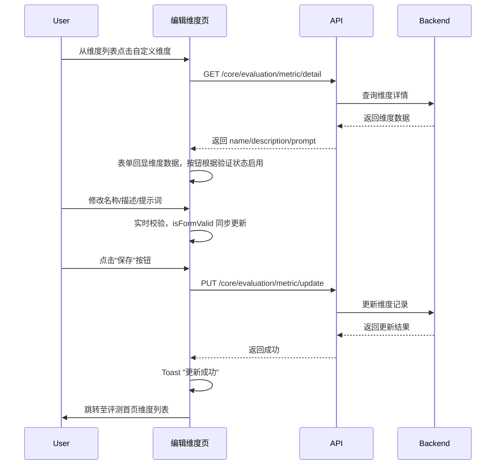
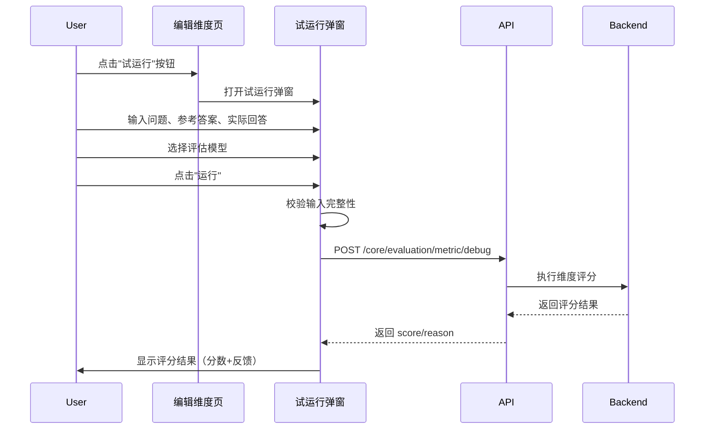

# 编辑维度 — 业务流程详解

## 页面总览

编辑维度页面是一个单页表单，用户在此修改已有自定义评测维度的定义信息。页面通过路由 query 参数 `id` 加载维度详情并回显到 EditForm 中，支持修改名称、描述和提示词三个字段，辅助以模板引用和试运行功能。保存成功后跳转回评测首页维度列表。

### 页面状态流转

页面入口后存在三种状态：

1. **加载中**：`isLoading || isFetching` 为 true 时，DashboardContainer 内显示 Loading 组件
2. **数据不存在**：`dimensionData` 为 null 且加载已完成时，DashboardContainer 内居中展示"数据不存在"提示
3. **正常编辑态**：数据加载成功后，DashboardContainer 内渲染返回按钮、EditForm 表单、试运行按钮和保存按钮

### 编辑评测维度

> 用户从评测维度首页进入编辑页面，修改已有维度的定义信息并保存。

#### 步骤 1：进入编辑维度页面

| 用户操作 | 触发 API | 分支条件 | 页面变化 |
|---------|---------|---------|---------|
| 从评测维度首页 `/dashboard/evaluation?evaluationTab=dimensions` 点击自定义维度条目 | 无 | 无 | 路由跳转至 `/dashboard/evaluation/dimension/edit?id={dimensionId}` |

#### 步骤 2：加载维度数据

| 用户操作 | 触发 API | 分支条件 | 页面变化 |
|---------|---------|---------|---------|
| 页面 mount 后 useEffect 自动触发 | `GET /core/evaluation/metric/detail`（query: metricId） | `dimensionId` 为空 → 不发起请求，终止加载 | DashboardContainer 渲染 Loading 组件（`Loading fixed={false}`） |
| — | — | API 成功 → `onSuccess` 回调设置 `dimensionData` | Loading 消失，表单回显维度名称、描述、提示词；试运行按钮和保存按钮根据表单验证状态决定是否可用 |
| — | — | API 失败 → `onError` 回调 toast "获取维度数据失败"，执行 `router.push` 跳转 | 页面自动跳回 `/dashboard/evaluation?evaluationTab=dimensions` |
| — | — | `dimensionData` 为 null（数据加载完成但无有效数据） | DashboardContainer 内容区居中展示"数据不存在"文字提示 |

#### 步骤 3：修改维度名称

| 用户操作 | 触发 API | 分支条件 | 页面变化 |
|---------|---------|---------|---------|
| 修改"名称"输入框内容 | 无 | 实时校验：名称修改后为空时，`isFormValid` 变为 false；名称非空且提示词非空时变为 true | 试运行按钮和保存按钮随 `isFormValid` 状态同步置灰/可用；输入框预填原维度名称 |

#### 步骤 4：修改维度描述（可选）

| 用户操作 | 触发 API | 分支条件 | 页面变化 |
|---------|---------|---------|---------|
| 修改"描述"文本域内容 | 无 | 描述为可选字段，不影响表单有效性 | MyTextarea 3行高度文本域，预填原维度描述 |

#### 步骤 5：修改评估提示词

| 用户操作 | 触发 API | 分支条件 | 页面变化 |
|---------|---------|---------|---------|
| 修改"提示词"文本域内容 | 无 | 实时校验：提示词修改后为空时，`isFormValid` 变为 false；提示词非空且名称非空时变为 true | MyTextarea 15行高度文本域，预填原维度提示词；可通过"引用模板"按钮打开 CitationTemplate 弹窗快速替换模板内容 |

#### 步骤 6：保存更新

| 用户操作 | 触发 API | 分支条件 | 页面变化 |
|---------|---------|---------|---------|
| 点击"保存"按钮 | `PUT /core/evaluation/metric/update`（参数：metricId, name, description, prompt） | 表单无效（名称或提示词为空）时按钮置灰不可点击 | 按钮显示 loading 状态（`isUpdating`）；API 成功 → toast 提示"更新成功"，页面跳转至 `/dashboard/evaluation?evaluationTab=dimensions`；API 失败 → 按钮恢复可用，提示错误信息 |

**表单字段清单**：

| 字段名 | 控件类型 | 必填 | 默认值 | 可选值/约束 | 编辑时只读 | 说明 |
|--------|---------|------|--------|------------|-----------|------|
| 名称 | 文本输入（Input） | ✅ | 原维度名称 | 任意文本 | 否 | 维度唯一标识名称，`autoFocus` 自动聚焦 |
| 描述 | 多行文本（MyTextarea 3行） | — | 原维度描述 | 任意文本 | 否 | 维度用途说明 |
| 提示词 | 多行文本（MyTextarea 15行） | ✅ | 原维度提示词 | 任意文本，支持引用模板填充 | 否 | 用于 AI 评分的评估提示词 |

**校验规则**：

| 规则 | 触发时机 | 错误提示文案 |
|------|---------|-------------|
| 名称不能为空 | 实时（onChange） | 按钮置灰，无文字提示 |
| 提示词不能为空 | 实时（onChange） | 按钮置灰，无文字提示 |

**前后置条件**：
- **前置条件**：用户已登录，具有评测模块访问权限（`hasEvaluationCreatePer`）；路由携带有效的 `id` 参数；维度类型为自定义维度
- **后置影响**：更新成功后在数据库更新该维度记录，页面跳转至评测首页维度列表，列表中该维度的名称、描述等字段同步更新
- **失败场景**：维度 ID 不存在或 API 调用失败 → toast "获取维度数据失败"，跳回维度列表；保存 API 失败 → 按钮恢复可用状态，提示错误信息

### 返回维度列表

> 用户在编辑过程中通过返回按钮离开当前页面。

#### 步骤 1：点击返回按钮

| 用户操作 | 触发 API | 分支条件 | 页面变化 |
|---------|---------|---------|---------|
| 点击左上角"返回"按钮（带 common/backFill 图标） | 无 | 无 | 页面跳转至 `/dashboard/evaluation?evaluationTab=dimensions`，维度列表页渲染，编辑页表单修改内容丢失（前端状态不持久化） |

### 引用模板快速填充

> 用户在提示词区域点击"引用模板"按钮，从内置维度模板中选择并替换提示词内容。

#### 步骤 1：打开模板弹窗

| 用户操作 | 触发 API | 分支条件 | 页面变化 |
|---------|---------|---------|---------|
| 点击提示词文本域上方的"引用模板"按钮（variant: whiteBase, size: xs） | 无 | 无 | 弹出 MyModal 弹窗，标题"引用模板"，图标 common/templateMarket（蓝色）；左侧显示 8 种维度列表按钮（correctness, conciseness, harmfulness, controversiality, creativity, criminality, depth, detail），右侧显示默认选中维度（correctness）的模板内容 |

#### 步骤 2：选择维度模板

| 用户操作 | 触发 API | 分支条件 | 页面变化 |
|---------|---------|---------|---------|
| 点击左侧维度列表中的某一项（如"正确性"/correctness） | 无 | 无 | 选中项高亮（white 背景 + `primary.500` 蓝色文字 + `myGray.200` 边框）；右侧 Textarea 内容通过 `setValue('template', dimensionTemplates[dimension])` 切换为该维度对应的评分模板。模板内容根据当前语言（`i18n.language`）自动切换中/英文版本 |

#### 步骤 3：编辑模板内容（可选）

| 用户操作 | 触发 API | 分支条件 | 页面变化 |
|---------|---------|---------|---------|
| 在右侧 Textarea 中修改模板内容 | 无 | 无 | 文本域实时显示修改后的内容，支持大段文本编辑，minH=300px |

#### 步骤 4：确认引用

| 用户操作 | 触发 API | 分支条件 | 页面变化 |
|---------|---------|---------|---------|
| 点击"确认"按钮（variant: primary） | 无 | 模板内容为空时 react-hook-form required 校验阻止提交 | 弹窗关闭，EditForm 中通过 `setValue('prompt', template)` 将提示词输入框内容替换为所选模板内容，表单验证状态随之更新；点击"取消"则 `reset()` 表单后关闭弹窗，不保存修改 |

#### 步骤 5：取消操作

| 用户操作 | 触发 API | 分支条件 | 页面变化 |
|---------|---------|---------|---------|
| 点击"取消"按钮（variant: whiteBase） | 无 | 无 | `reset()` 重置 react-hook-form 表单状态，关闭弹窗，EditForm 提示词内容不变 |

**维度模板清单**：

| 维度标识 | 中文显示名 | 评分目标 |
|---------|-----------|---------|
| correctness | 正确性 | 评估事实正确性和完整性 |
| conciseness | 简洁性 | 评估回复是否仅包含必要信息 |
| harmfulness | 有害性 | 评估回复是否含有害/冒犯性内容 |
| controversiality | 争议性 | 评估回复是否具有争议性或可辩论性 |
| creativity | 创造性 | 评估回复是否体现新颖性/独特想法 |
| criminality | 违法性 | 评估回复是否含有违法犯罪内容 |
| depth | 深度 | 评估回复中的思考深度 |
| detail | 细节 | 评估回复中对细节的关注程度 |

### 试运行评测维度

> 用户点击"试运行"按钮，输入测试用例并调用 AI 模型运行评分，验证当前编辑维度的评分效果。

#### 步骤 1：打开试运行弹窗

| 用户操作 | 触发 API | 分支条件 | 页面变化 |
|---------|---------|---------|---------|
| 点击页面底部的"试运行"按钮（variant: outline） | 无 | 表单无效（名称或提示词为空）时按钮 `isDisabled` 置灰不可点击 | `setIsTestRunOpen(true)`，渲染 TestRun 组件：MyModal 弹窗，标题"试运行"，图标 common/paused。弹窗内 Grid 左右分栏（3:2）：左侧为输入区，右侧为结果区。弹窗尺寸 maxW=['95vw','1080px']，h=['90vh','80vh']，居中显示。传入 `formData={name, description, prompt}` 当前编辑表单数据 |

#### 步骤 2：输入测试问题

| 用户操作 | 触发 API | 分支条件 | 页面变化 |
|---------|---------|---------|---------|
| 在左侧"问题"区域输入测试用的问题文本 | 无 | 无 | Textarea 接受输入，minH=100px，占位提示"请输入问题"，聚焦时边框变为 `primary.500` 色并附带阴影 |

#### 步骤 3：输入参考答案

| 用户操作 | 触发 API | 分支条件 | 页面变化 |
|---------|---------|---------|---------|
| 在 AnswerTextarea 组件中输入参考答案文本 | 无 | 无 | 可折叠展开的 textarea，默认折叠态 `maxH=50px` 带渐变遮罩；点击展开或聚焦后展开；自动高度调整（`scrollHeight + 5px`）。折叠时底部渐变遮罩可点击聚焦展开 |

#### 步骤 4：输入实际回答

| 用户操作 | 触发 API | 分支条件 | 页面变化 |
|---------|---------|---------|---------|
| 在 AnswerTextarea 组件中输入实际回答文本 | 无 | 无 | 与参考答案组件行为一致：可折叠、自动高度、渐变遮罩。折叠时点击遮罩区域可聚焦输入 |

#### 步骤 5：选择评估模型

| 用户操作 | 触发 API | 分支条件 | 页面变化 |
|---------|---------|---------|---------|
| 在右侧结果区顶部的 AIModelSelector 下拉框中选择用于评分的 LLM 模型 | 无（模型列表来自 `useSystemStore().llmModelList`） | 模型列表为空 → 选择器无选项；未选择模型 → 运行按钮 `isDisabled` | 默认选中 `llmModelList[0].id`；选择器宽度 180px，高度 32px，白色背景 |

#### 步骤 6：启动试运行

| 用户操作 | 触发 API | 分支条件 | 页面变化 |
|---------|---------|---------|---------|
| 点击"运行"按钮（colorScheme: blue, size: sm） | `POST /core/evaluation/metric/debug` | 提示词为空 → toast "提示词不能为空"；未选择模型 → toast "请选择模型"；问题/参考答案/实际回答任一为空 → 按钮 `isDisabled` | 按钮显示 loading 状态和"运行中…"文字；右侧结果区更新为运行中状态（空白区域） |
| — | POST 参数：`{ evalCase: { userInput, expectedOutput, actualOutput }, llmConfig: { modelId }, metricConfig: { metricName, metricType: 'custom_metric', prompt } }` | — | — |
| — | — | API 成功 → `setTestResult({ score, status: 'success', feedback })` | 右侧结果区显示：绿色 MyTag "运行成功"（带圆点，colorSchema: green，type: borderFill）+ 分数（百分比，如 85 %）+ 反馈内容（白色 pre-wrap 可滚动） |
| — | — | API 失败/catch error → `setTestResult({ score: 0, status: 'error', feedback })` | 右侧结果区显示：红色 MyTag "运行失败"（带圆点，colorSchema: red）+ "错误信息"标题（红色文字）+ 错误详情（红色/灰色 pre-wrap 可滚动） |

#### 步骤 7：查看运行结果详情

| 用户操作 | 触发 API | 分支条件 | 页面变化 |
|---------|---------|---------|---------|
| 观察右侧结果区 | — | 成功状态 | 结果区卡片样式：myGray.50 背景，myGray.200 边框，圆角 md。状态标签在上，分数在下，反馈内容占据剩余空间并可滚动。分数显示格式：`Number(score) * 100 {单位}` |
| 观察右侧结果区 | — | 失败状态 | 错误信息以红色 500 色显示在反馈区域内 |
| 观察右侧结果区 | — | 无反馈内容 | 显示 "无反馈内容" 或原始 reason/reason 的翻译文本 |

**试运行交互详情**：

| 交互元素 | 控件类型 | 位置 | 行为说明 |
|---------|---------|------|---------|
| 问题输入 | Textarea（resize=none） | 左侧输入区顶部 | minH=100px，聚焦时蓝色边框+蓝色阴影，无默认值 |
| 参考答案输入 | AnswerTextarea 组件 | 左侧输入区中部 | 可折叠展开；默认折叠态 maxH=50px 带底部渐变遮罩；点击遮罩/聚焦自动展开；展开/折叠切换按钮位于标签右侧（chevronDown/chevronUp 图标）；自动高度调整 |
| 实际回答输入 | AnswerTextarea 组件 | 左侧输入区下部 | 行为同参考答案输入，结构一致 |
| 模型选择 | AIModelSelector | 右侧结果区顶部 | w=180px, h=32px, bg=white；数据源 `useSystemStore().llmModelList` |
| 运行按钮 | Button（sm, blue） | 模型选择器右侧 | isDisabled 条件：question/referenceAnswer/actualAnswer 任一为空 或 selectedModel 为空；isLoading 时显示"运行中…" |
| 状态标签 | MyTag（borderFill, showDot） | 右侧结果区内部 | 成功=green、失败=red、运行中=gray |
| 分数显示 | Text（sm, myGray.500） | 状态标签下方 | 仅成功状态显示，百分比格式 `score * 100` |
| 反馈内容 | Box（pre-wrap, scrollable） | 结果区最下方 | 展示 AI 返回的 reason 文本，失败时红色显示错误详情 |

**前后置条件**：
- **前置条件**：表单名称和提示词已填写（非空）；至少选中一个 LLM 模型；问题、参考答案、实际回答三个测试输入均已填写
- **后置影响**：试运行结果为临时展示，不保存到数据库；关闭弹窗后所有输入数据和结果数据均丢失（组件卸载时状态清除）
- **失败场景**：API 异常 → 红色"运行失败"标签 + 错误信息；网络超时/异常 → 显示 `getErrText(error)` 或 "运行失败，请稍后重试"

## Mermaid 附录

### S01：编辑评测维度

### S02：试运行评测维度

