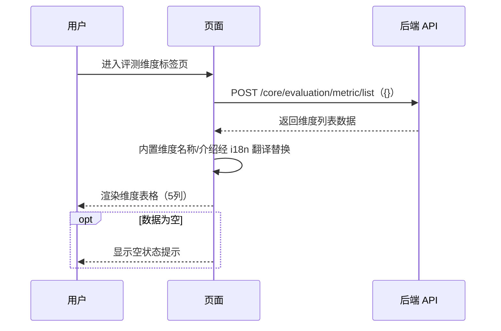
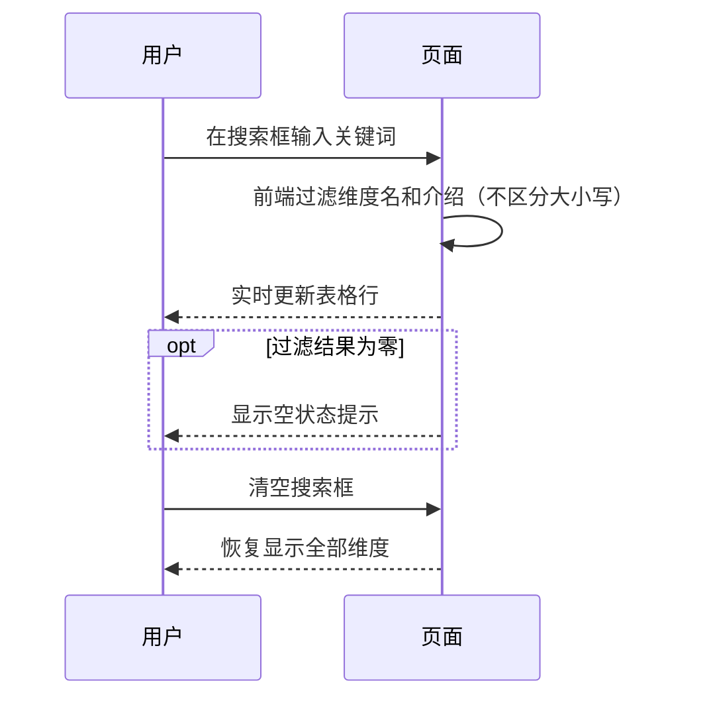
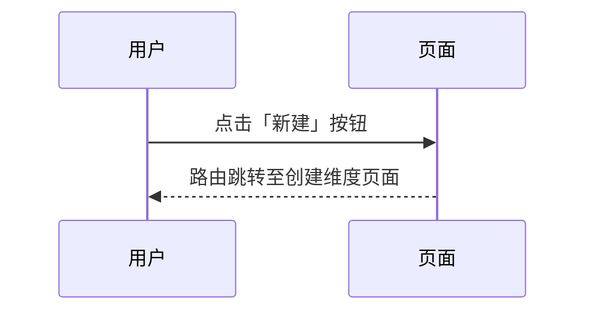
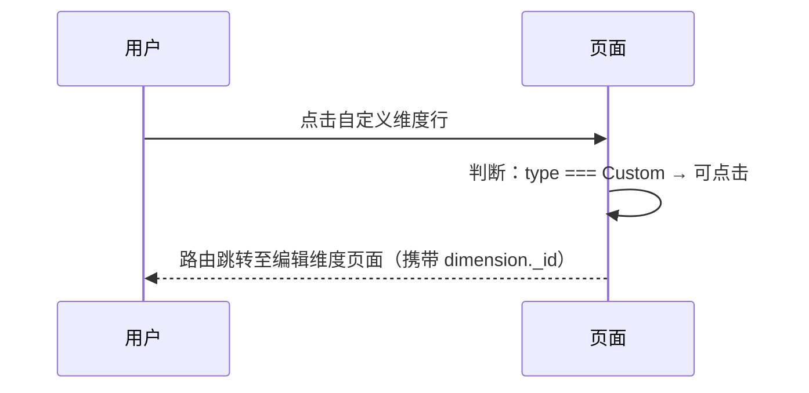
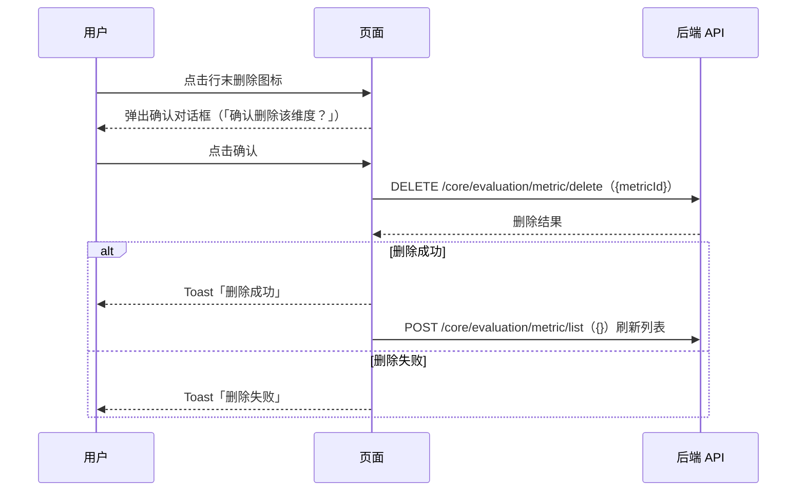

# 评测维度首页 — 业务流程详解

## 页面总览

评测维度首页是评测工作台中维度管理的列表视图，页面由顶部的 Tab 导航栏（由父组件传入）、搜索框与新建按钮，以及下方的维度数据表格组成。表格展示所有评测维度（内置 + 自定义），每行显示维度名、介绍、创建/更新时间、创建人和操作按钮。

维度分为两种类型：
- **内置维度**：系统预置的 6 个评估维度（回答准确度、语义相似度、回答相关度、回答忠诚度、检索匹配度、检索精确度），名称和介绍通过国际化展示，带「内置」标签，行不可点击，无删除按钮。
- **自定义维度**：用户创建的维度，行可点击进入编辑页，行末显示删除按钮。

页面加载时自动请求维度列表数据，使用 `MyBox` 组件包裹表格并提供加载状态（加载中显示遮罩）。数据为空时展示 `EmptyTip` 空状态提示。

---

## S01：查看维度列表

> 进入评测维度标签页后，系统自动加载当前团队的全部评测维度，以表格呈现。

### 步骤 1：页面加载 → 自动获取维度列表

| 用户操作 | 触发 API | 分支条件 | 页面变化 |
|---------|---------|---------|---------|
| 点击「评测维度」标签页或通过 URL 进入 `?evaluationTab=dimensions` | `POST /core/evaluation/metric/list`（参数：`{}`空对象） | 无分支，页面加载即调用 | 表格区域显示 `MyBox` 的加载遮罩（`isLoading: true`），表格处于加载中状态 |

### 步骤 2：数据返回 → 处理并渲染

| 用户操作 | 触发 API | 分支条件 | 页面变化 |
|---------|---------|---------|---------|
| 等待数据加载 | 无（数据处理阶段，无额外 API） | — | 加载遮罩消失，表格渲染维度数据行。内置维度的名称和介绍替换为国际化文案（通过 `BUILTIN_DIMENSION_MAP` 映射），自定义维度显示原始名称和介绍 |

### 步骤 3：列表渲染完成

| 用户操作 | 触发 API | 分支条件 | 页面变化 |
|---------|---------|---------|---------|
| 浏览维度列表 | 无 | 数据为空 → 显示「暂无数据」空状态提示（`EmptyTip` 组件）；数据非空 → 显示完整表格 | 表格 5 列：维度名、介绍、创建/更新时间、创建人、操作（空白列用于删除按钮）。内置维度行显示灰色「内置」标签，行悬停背景不变，光标为 `default`。自定义维度行悬停背景变为 `myGray.100`，光标为 `pointer`。创建/更新时间列对内置维度显示 `-` |

#### 数据加载详情

| 加载阶段 | API | 关键参数 | 数据处理 | 渲染结果 |
|---------|-----|---------|---------|---------|
| 首次加载 | POST `/core/evaluation/metric/list` | `{}`（空对象） | 内置维度名称通过 `getBuiltinDimensionNameFromId`（去除 `builtin_` 前缀）→ `getBuiltinDimensionInfo` 获取国际化 key → `t()` 翻译；自定义维度保持原始值 | 表格所有行 |
| 无数据 | 同一接口 | `{}` | 返回 `list` 为空数组 | `EmptyTip` 组件居中显示"暂无数据" |

- **排序规则**：由后端返回数据顺序决定，前端不做排序
- **筛选条件**：无服务端筛选参数，前端通过 S02 搜索场景做客户端过滤

---

## S02：搜索维度

> 在搜索框输入关键词，实时过滤表格中展示的维度。

### 步骤 1：输入搜索关键词

| 用户操作 | 触发 API | 分支条件 | 页面变化 |
|---------|---------|---------|---------|
| 在顶部搜索框中输入文字（如"准确"） | 无（纯前端过滤） | `searchValue` 为空或仅含空格 → 显示全部维度；`searchValue` 非空 → 执行过滤 | 输入过程中无加载状态，实时过滤结果，不触发额外 API 请求 |

### 步骤 2：过滤逻辑执行

| 用户操作 | 触发 API | 分支条件 | 页面变化 |
|---------|---------|---------|---------|
| 继续输入或修改搜索词 | 无 | 维度名或介绍的文本**不区分大小写**包含搜索词 → 保留；否则 → 从列表中移除 | 表格行数实时变化，匹配的行保留，不匹配的行消失。过滤结果为零时显示「暂无数据」空状态 |

### 步骤 3：清空搜索

| 用户操作 | 触发 API | 分支条件 | 页面变化 |
|---------|---------|---------|---------|
| 清空搜索框内容（删除全部文字） | 无 | `searchValue` 变为空字符串 → 恢复显示全部维度 | 表格恢复显示全部维度 |

---

## S03：创建自定义维度

> 点击「新建」按钮，路由跳转至维度创建页面。

### 步骤 1：点击新建按钮

| 用户操作 | 触发 API | 分支条件 | 页面变化 |
|---------|---------|---------|---------|
| 点击顶部右侧「新建」按钮（带 + 图标） | 无 | 无分支，按钮始终可用 | 浏览器路由跳转至 `/dashboard/evaluation/dimension/create`，页面整体切换至维度创建表单页面 |

> 详细的创建表单交互流程（表单字段、校验规则、试运行、提交流程）见 [创建维度](../创建维度/业务流程详解.md)。

---

## S04：编辑自定义维度

> 点击自定义维度所在表格行，路由跳转至维度编辑页面。

### 步骤 1：点击自定义维度行

| 用户操作 | 触发 API | 分支条件 | 页面变化 |
|---------|---------|---------|---------|
| 点击某个自定义维度所在表格行 | 无（路由跳转） | 目标维度类型为 `custom_metric`（Custom）→ 行可点击，跳转编辑页；目标维度类型为 `builtin_metric`（Builtin）→ 行不可点击，光标为 `default`，无反应 | 浏览器路由跳转至 `/dashboard/evaluation/dimension/edit?id={dimension._id}`，页面整体切换至维度编辑页面 |

> 详细的编辑表单交互流程见 [编辑维度](../编辑维度/业务流程详解.md)。

---

## S05：删除自定义维度

> 点击自定义维度行末的删除图标，弹出确认对话框，确认后删除维度并刷新列表。

### 步骤 1：点击删除图标

| 用户操作 | 触发 API | 分支条件 | 页面变化 |
|---------|---------|---------|---------|
| 点击自定义维度行末的删除图标（红色垃圾桶图标） | 无（弹窗阶段） | 约定制维度行末显示删除图标；内置维度行末空白，无删除图标 | `useConfirm` 弹出确认对话框，标题为删除确认样式 |

### 步骤 2：确认删除弹窗

| 用户操作 | 触发 API | 分支条件 | 页面变化 |
|---------|---------|---------|---------|
| 阅读弹窗内容「确认删除该维度？」 | 无 | — | 弹窗显示确认文案（i18n key: `confirm_delete_dimension`，中文：「确认删除该维度？」），底部有取消和确认两个按钮 |

### 步骤 3：确认删除 → 调用删除 API

| 用户操作 | 触发 API | 分支条件 | 页面变化 |
|---------|---------|---------|---------|
| 点击确认按钮 | `DELETE /core/evaluation/metric/delete`（参数：`{ metricId: dimension._id }`） | — | 弹窗关闭，触发删除请求。成功时 Toast 显示「删除成功」，并自动重新调用 `POST /core/evaluation/metric/list` 刷新列表；失败时 Toast 显示「删除失败」，列表保持不变 |

### 步骤 4：取消删除

| 用户操作 | 触发 API | 分支条件 | 页面变化 |
|---------|---------|---------|---------|
| 点击取消按钮或关闭弹窗 | 无 | — | 弹窗关闭，不执行删除操作，列表保持不变 |

#### 删除链路详情

- **引用检查**：前端未做引用检查（后端校验维度是否被评测任务引用）
- **确认弹窗**：`useConfirm({type: 'delete'})` 生成的删除确认弹窗，文案为「确认删除该维度？」
- **批量与单条差异**：仅支持单条删除，无批量删除操作
- **级联影响**：删除后列表自动刷新，已删除的维度从列表中移除

---

## Mermaid 附录

### S01：查看维度列表

### S02：搜索维度

### S03：创建自定义维度

### S04：编辑自定义维度

### S05：删除自定义维度

