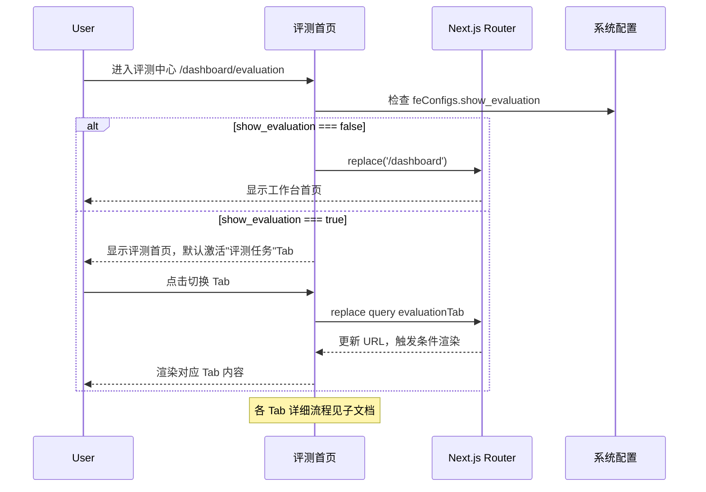

# 评测首页 — 业务流程详解

## 公共业务流程

页面级公共功能（初始化、权限校验、Tab 切换）

### 步骤 1：页面初始化与权限校验

| 用户操作 | 触发 API | 分支条件 | 页面变化 |
|---------|---------|---------|---------|
| 通过侧边栏菜单「应用测评」导航进入评测中心 | 无（客户端路由跳转至 `/dashboard/evaluation`） | `feConfigs.show_evaluation === false` 时执行 `router.replace('/dashboard')` 重定向至工作台首页 | 显示 DashboardContainer 布局框架，默认激活「评测任务」Tab |

**权限模型说明**：
- 侧边栏菜单入口受双重控制：`feConfigs.show_evaluation`（系统级功能开关）和 `userInfo.team.permission.hasEvaluationCreatePer`（团队级权限）
- 页面级守卫在组件 `useEffect` 中检查 `feConfigs.show_evaluation`，若为 `false` 则重定向至 `/dashboard`
- 服务端渲染时通过 `getServerSideProps` 加载 7 个 i18n 命名空间：`dashboard_evaluation`、`evaluation`、`dataset`、`app`、`common`、`account`、`chat`、`file`

### 步骤 2：Tab 切换

| 用户操作 | 触发 API | 分支条件 | 页面变化 |
|---------|---------|---------|---------|
| 页面首次加载 | 无（从 `router.query.evaluationTab` 读取，默认值 `'tasks'`） | 默认激活「评测任务」Tab | 渲染 `<EvaluationTasks Tab={Tab} />` 组件 |
| 点击「评测任务」Tab | 无（`router.replace` 更新 query 中 `evaluationTab` 为 `'tasks'`） | `evaluationTab === 'tasks'` | 条件渲染 `<EvaluationTasks Tab={Tab} />` 组件 |
| 点击「评测数据集」Tab | 无（`router.replace` 更新 query 中 `evaluationTab` 为 `'datasets'`） | `evaluationTab === 'datasets'` | 条件渲染 `<EvaluationDatasets Tab={Tab} />` 组件 |
| 点击「评测维度」Tab | 无（`router.replace` 更新 query 中 `evaluationTab` 为 `'dimensions'`） | `evaluationTab === 'dimensions'` | 条件渲染 `<EvaluationDimensions Tab={Tab} />` 组件 |

**Tab 切换机制说明**：
- 使用 `FillRowTabs<TabType>` 组件渲染三个 Tab 按钮，`py={1}` 设置纵向内边距
- Tab 切换通过 `router.replace({ query: { ...router.query, evaluationTab: e } })` 更新 URL 查询参数，保留其他已有 query 参数
- 各子 Tab 组件通过条件渲染（`{evaluationTab === 'xxx' && <Component Tab={Tab} />}`）实现按需挂载
- Tab 组件按钮通过 `Tab` prop 传递给子组件，子组件可在其页面顶部自行渲染 Tab 导航条

### 步骤 3：布局渲染

| 用户操作 | 触发 API | 分支条件 | 页面变化 |
|---------|---------|---------|---------|
| 页面渲染 | 无 | 始终执行 | `<DashboardContainer>` 包裹整体布局，以 render props 模式传入 `MenuIcon`；内部使用 `Flex` 纵向布局，`h="full"` `p={6}` 全高内边距，子区域 `gap={4}` 间距 |

## Tab 子能力索引

| Tab | 业务描述 | 详细文档 |
|-----|---------|---------|
| 评测任务 | 创建和管理 AI Agent 评测任务，查看评测进度和结果 | [评测任务/业务流程详解](../评测任务/业务流程详解.md) |
| 评测数据集 | 管理评测数据集，支持智能生成和文件导入 | [评测数据集/业务流程详解](../评测数据集/业务流程详解.md) |
| 评测维度 | 管理自定义和内置评测维度（评分标准） | [评测维度/业务流程详解](../评测维度/业务流程详解.md) |

## Mermaid 附录

