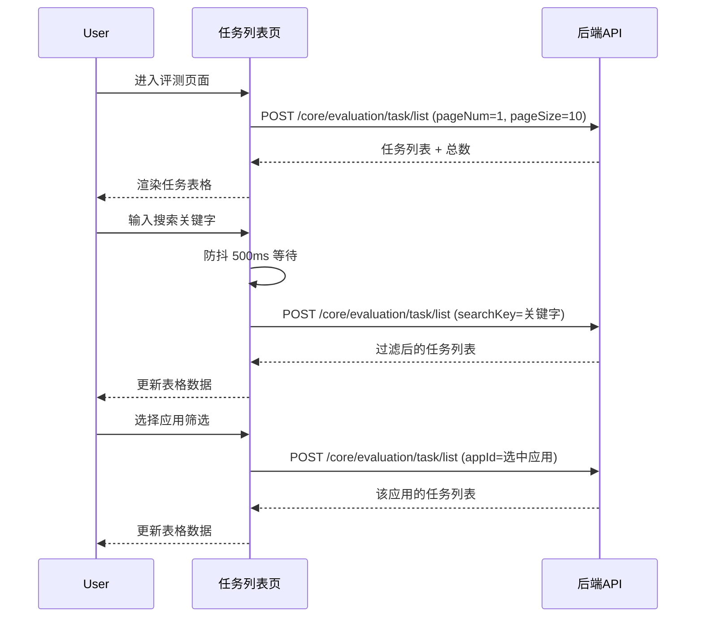
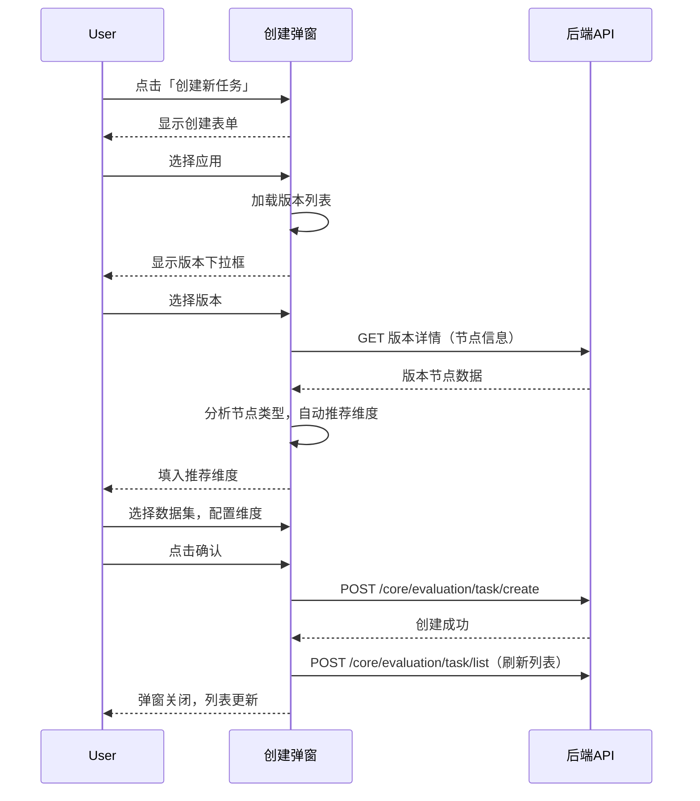
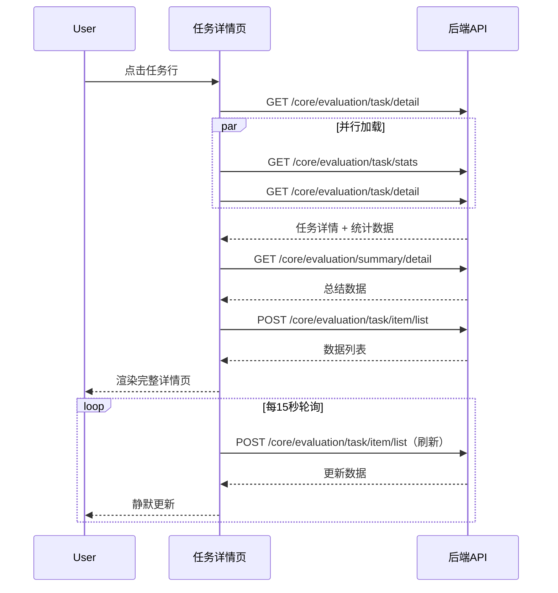
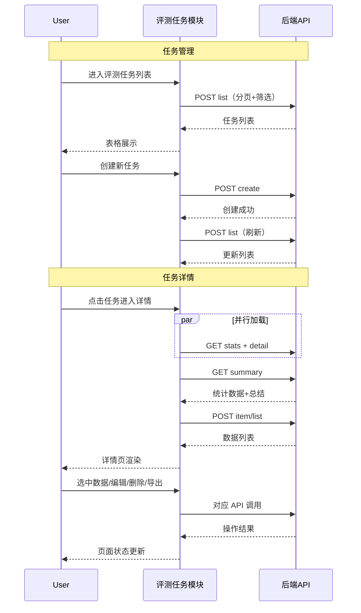

# 评测任务 — 业务流程详解

## 页面总览

评测任务模块是 AI 应用质量评估的核心入口。管理员在此创建评测任务，选择目标应用和维度，系统自动对评测数据进行多维度评分。任务完成后可通过详情页查看逐条数据得分和 AI 生成的评测总结报告。本模块包含任务列表页和任务详情页，无 Tab 嵌套结构。

---

### 查看评测任务列表

> 进入评测页面默认展示评测任务 Tab，以表格形式列出所有已创建的评测任务，支持按应用筛选和关键字搜索。

#### 步骤 1：进入评测任务列表

| 用户操作 | 触发 API | 分支条件 | 页面变化 |
|---------|---------|---------|---------|
| 点击左侧导航「评测」菜单，或直接访问 `/dashboard/evaluation` | 无显示加载 | `feConfigs.show_evaluation === false` 时自动重定向到 `/dashboard` | 评测页面加载，默认激活评测任务 Tab，表格显示骨架屏加载态 |

#### 步骤 2：任务列表加载

| 用户操作 | 触发 API | 分支条件 | 页面变化 |
|---------|---------|---------|---------|
| 页面自动加载任务列表 | `POST /core/evaluation/task/list` 参数：`pageNum=1, pageSize=10` | 搜索关键字为空时传空字符串；appFilter 为空时传 undefined | 表格渲染 10 条任务数据，底部分页器显示总页数；若无数据显示空状态提示 |

#### 步骤 3：按应用筛选

| 用户操作 | 触发 API | 分支条件 | 页面变化 |
|---------|---------|---------|---------|
| 点击应用筛选下拉框，选择某个应用 | `POST /core/evaluation/task/list` 参数：`appId=选中应用ID` | 选择「全部应用」时 `appId` 传空字符串 | 表格重新加载，仅显示该应用的评测任务 |

#### 步骤 4：关键字搜索

| 用户操作 | 触发 API | 分支条件 | 页面变化 |
|---------|---------|---------|---------|
| 在搜索框中输入关键字（实时输入，输入框立即更新） | `POST /core/evaluation/task/list`（防抖 500ms 后触发）参数：`searchKey=输入值` | 无 | 500ms 延迟后触发列表刷新，表格更新为匹配任务名称、描述或版本 ID 的结果 |

#### 步骤 5：分页切换

| 用户操作 | 触发 API | 分支条件 | 页面变化 |
|---------|---------|---------|---------|
| 点击底部分页器的页码或翻页按钮 | `POST /core/evaluation/task/list` 参数：`pageNum=N, pageSize=10` | 无 | 表格切换至第 N 页数据 |

#### 数据加载详情

| 加载阶段 | API | 关键参数 | 数据处理 | 渲染结果 |
|---------|-----|---------|---------|---------|
| 首次加载 | `POST /core/evaluation/task/list` | `pageNum=1, pageSize=10` | 后端聚合查询关联应用和版本信息，前端实时计算各维度得分 | 表格前 10 条 |
| 翻页 | `POST /core/evaluation/task/list` | `pageNum=N, pageSize=10` | 同上 | 表格第 N 页 |
| 筛选/搜索后加载 | `POST /core/evaluation/task/list` | `searchKey/appId + pageNum=1` | 重置到第一页 | 表格首屏 |

- **分页参数**：默认每页 10 条
- **默认排序**：按创建时间倒序（最新任务在前）
- **筛选条件**：应用筛选下拉框（含全部应用选项）、搜索框（按任务名称/描述/版本 ID 模糊匹配）

#### Mermaid 附录

---

### 创建评测任务

> 用户点击「创建新任务」按钮，在弹出的表单中填写任务名称、选择目标应用和版本、选择评测数据集和评测维度后提交创建。

#### 步骤 1：打开创建弹窗

| 用户操作 | 触发 API | 分支条件 | 页面变化 |
|---------|---------|---------|---------|
| 点击右上角「创建新任务」按钮 | 无 | 无 | 居中弹窗打开，显示空白表单 |

#### 步骤 2：选择目标应用

| 用户操作 | 触发 API | 分支条件 | 页面变化 |
|---------|---------|---------|---------|
| 在「评测应用」下拉框中选择一个 AI 应用 | 无（前端组件内部获取应用列表） | 只能选择不含交互节点（hasInteractiveNode=false）的应用 | 应用选中后，版本下拉框和数据集下拉框可操作 |

#### 步骤 3：选择应用版本

| 用户操作 | 触发 API | 分支条件 | 页面变化 |
|---------|---------|---------|---------|
| 在「应用版本」下拉框中选择版本 | 选择后自动调用 `getAppVersionDetail` 获取版本节点信息 | 自动选中最新版本 | 根据版本工作流中是否包含知识库搜索节点和对话节点，自动推荐评测维度 |

#### 步骤 4：选择评测数据集

| 用户操作 | 触发 API | 分支条件 | 页面变化 |
|---------|---------|---------|---------|
| 在「评测数据集」下拉框中选择已有数据集 | `GET` 获取数据集列表 | 可点击「创建/导入数据集」按钮通过智能生成或文件导入创建新数据集 | 数据集选中；若该应用之前有评测记录，自动填入最近使用的数据集 |

#### 步骤 5：管理评测维度

| 用户操作 | 触发 API | 分支条件 | 页面变化 |
|---------|---------|---------|---------|
| 展开评测维度折叠区，点击「管理维度」 | 无（打开维度管理弹窗） | 无 | 弹窗列出可用维度（内置维度 + 自定义维度），可勾选/取消勾选 |

#### 步骤 6：提交创建

| 用户操作 | 触发 API | 分支条件 | 页面变化 |
|---------|---------|---------|---------|
| 点击「确认」按钮 | `POST /core/evaluation/task/create` 参数：`{name, evalDatasetCollectionId, target: {type, config}, evaluators: [...]}` | 若维度缺少必需的评测模型或向量模型，弹窗告警并阻止提交；应用、数据集、维度任一未选中时确认按钮置灰 | 提交成功后弹窗关闭，任务列表自动刷新 |

#### 表单字段清单

| 字段名 | 控件类型 | 必填 | 默认值 | 可选值/约束 | 编辑时只读 | 说明 |
|--------|---------|------|--------|------------|-----------|------|
| 任务名 | 文本输入 | 是 | — | 最多 100 个字符 | 否 | 评测任务的名称 |
| 评测应用 | 下拉选择（AppSelect） | 是 | — | 不含交互节点的普通应用/工作流应用/对话应用/助手应用 | 否 | 被评测的目标 AI 应用 |
| 应用版本 | 下拉选择（滚动分页） | 是 | 自动选最新版本 | 该应用的所有发布版本 | 否 | 评测针对的具体应用版本 |
| 评测数据集 | 下拉选择 | 是 | 自动选最近使用的数据集 | 已创建的评测数据集 | 否 | 包含评测问题和期望回答的数据集 |
| 评测维度 | 多选（维度管理弹窗） | 是 | 根据应用节点自动推荐 | 内置维度 + 自定义维度 | 否 | 评估的维度指标（如答案正确性、忠实度等） |

#### 字段联动

- 选择应用后：版本和数据集下拉框变为可用，自动加载版本列表
- 选择版本后：自动分析该版本工作流中的节点类型（知识库搜索/对话节点），根据分析结果自动推荐评测维度
- 维度配置：每个维度可单独配置评测模型（LLM）和向量模型（Embedding），若维度要求但未配置则阻止提交

#### 校验规则

| 规则 | 触发时机 | 错误提示文案 |
|------|---------|-------------|
| 任务名不能为空 | 提交时 | 聚焦到任务名输入框 |
| 评测应用必须选择 | 提交时 | 确认按钮置灰不可点击 |
| 评测数据集必须选择 | 提交时 | 确认按钮置灰不可点击 |
| 至少选择一个评测维度 | 提交时 | 确认按钮置灰不可点击 |
| 维度的必需模型必须配置 | 提交时 | "评测维度配置不完整，{维度名}缺少模型配置" |

#### Mermaid 附录

---

### 重命名评测任务

> 通过任务列表操作菜单修改已有评测任务的名称。

#### 步骤 1：打开重命名弹窗

| 用户操作 | 触发 API | 分支条件 | 页面变化 |
|---------|---------|---------|---------|
| 点击任务行右侧操作菜单（三点图标），选择「重命名」 | 无 | 无 | 弹窗打开，显示当前任务名称，输入框自动聚焦 |

#### 步骤 2：提交新名称

| 用户操作 | 触发 API | 分支条件 | 页面变化 |
|---------|---------|---------|---------|
| 输入新名称后点击确认 | `PUT /core/evaluation/task/update` 参数：`{evalId, name}` | 无 | 弹窗关闭，列表刷新显示新名称；成功提示"更新成功" |

---

### 删除评测任务

> 从任务列表删除评测任务及其关联的所有评测数据项。

#### 步骤 1：确认删除

| 用户操作 | 触发 API | 分支条件 | 页面变化 |
|---------|---------|---------|---------|
| 点击任务行操作菜单 →「删除」 | 无 | 无 | 确认弹窗打开，显示删除确认文案 |

#### 步骤 2：执行删除

| 用户操作 | 触发 API | 分支条件 | 页面变化 |
|---------|---------|---------|---------|
| 点击确认删除 | `DELETE /core/evaluation/task/delete` 参数：`{evalId}` | 无 | 弹窗关闭，列表刷新；成功提示"删除成功" |

#### 删除链路详情

- **确认弹窗**：弹窗含有确认删除的提示文案，确认按钮执行删除，取消按钮关闭弹窗
- **级联影响**：删除任务会同时清除任务下所有评测数据项（evalItems）和总结报告数据，并从任务队列中移除相关作业

---

### 重试任务失败数据（列表页）

> 当任务存在错误状态的数据项时，可从列表页操作菜单直接重试所有失败项。

#### 步骤 1：触发重试

| 用户操作 | 触发 API | 分支条件 | 页面变化 |
|---------|---------|---------|---------|
| 点击任务行操作菜单 →「重试错误数据」（仅当 `statistics.error > 0` 时显示此项） | `POST /core/evaluation/task/retryFailed` 参数：`{evalId}` | 无错误数据时菜单不显示此项 | 列表刷新，更新任务状态和进度 |

---

### 查看评测任务详情

> 点击任务列表中的任务行，进入任务详情页查看完整的评测结果。

#### 步骤 1：进入详情页

| 用户操作 | 触发 API | 分支条件 | 页面变化 |
|---------|---------|---------|---------|
| 点击任务列表中的任务行 | 路由跳转：`router.push({pathname: '/dashboard/evaluation/task/detail', query: {taskId}})` | 无 | 页面导航到任务详情页 |

#### 步骤 2：加载任务数据

| 用户操作 | 触发 API | 分支条件 | 页面变化 |
|---------|---------|---------|---------|
| 页面自动触发加载 | 并行：`GET` stats、detail；然后 `GET` summary | 加载失败时显示错误提示并返回列表页 | 左侧数据面板显示数据列表，右侧面板显示评分仪表盘和总结卡片 |

#### 步骤 3：自动轮询刷新

| 用户操作 | 触发 API | 分支条件 | 页面变化 |
|---------|---------|---------|---------|
| 页面停留期间自动触发 | 每 15 秒并行轮询：`GET` stats + detail + summary；同时重新加载数据列表（仅加载到当前查看位置） | 任务状态为排队中/评测中时才需要轮询；任务完成/错误时继续轮询以获取最新数据 | 静默更新数据，不显示加载遮罩 |

#### 步骤 4：数据列表导航

| 用户操作 | 触发 API | 分支条件 | 页面变化 |
|---------|---------|---------|---------|
| 点击数据列表行 | 无（本地状态切换） | 无 | 选中行高亮，右侧面板更新为该项的详细信息 |

#### 数据加载详情（数据列表）

| 加载阶段 | API | 关键参数 | 数据处理 | 渲染结果 |
|---------|-----|---------|---------|---------|
| 首次加载 | `POST /core/evaluation/task/item/list` | `evalId, offset=0, pageSize=20` | 按默认排序 | 前 20 条数据 |
| 滚动加载更多 | `POST /core/evaluation/task/item/list` | `evalId, offset=N, pageSize=20` | 追加到现有列表 | 追加 20 条 |
| 轮询刷新 | `POST /core/evaluation/task/item/list` | 与上次请求相同参数 | 覆盖已加载数据 | 更新数据状态 |

- **分页参数**：每页 20 条，滚动底部自动加载更多
- **筛选条件**：搜索框（按用户输入内容模糊搜索）、NavBar 标签筛选（全部/疑问数据/错误数据）
- **排序规则**：默认按创建时间排序

#### Mermaid 附录

---

### 编辑评测数据

> 在详情页编辑单条评测数据的问题和期望回答。

#### 步骤 1：进入编辑模式

| 用户操作 | 触发 API | 分支条件 | 页面变化 |
|---------|---------|---------|---------|
| 选中数据项后点击编辑按钮 | 无 | 无 | 问题和期望回答变为可编辑的输入框，显示保存和取消按钮 |

#### 步骤 2：修改并保存

| 用户操作 | 触发 API | 分支条件 | 页面变化 |
|---------|---------|---------|---------|
| 修改问题和/或期望回答后点击保存 | `PUT /core/evaluation/task/item/update` 参数：`{evalItemId, userInput, expectedOutput, modifyDataset: boolean}` | `modifyDataset` 开关控制是否同步修改数据集中的原始数据 | 退出编辑模式，刷新数据列表，成功提示"保存成功" |

#### 表单字段清单

| 字段名 | 控件类型 | 必填 | 默认值 | 可选值/约束 | 编辑时只读 | 说明 |
|--------|---------|------|--------|------------|-----------|------|
| 问题 | 文本输入 | 是 | 当前数据的问题 | — | 否 | 用户输入的问题 |
| 期望回答 | 文本域 | 是 | 当前数据的期望回答 | — | 否 | 期望的正确回答 |
| 同步修改数据集 | 开关 | 否 | 开启 | — | 否 | 是否将修改同步到数据集原始数据 |

---

### 删除评测数据

> 从详情页删除单条评测数据项。

| 用户操作 | 触发 API | 分支条件 | 页面变化 |
|---------|---------|---------|---------|
| 选中数据项后点击删除按钮 | `DELETE /core/evaluation/task/item/delete` 参数：`{evalItemId}` | 无 | 选中项被删除，自动选择下一个数据项（若删除最后一项则选新列表的最后一项） |

---

### 重试单条评测数据

> 从详情页重新评测单条数据项。

| 用户操作 | 触发 API | 分支条件 | 页面变化 |
|---------|---------|---------|---------|
| 选中数据项后点击刷新按钮 | `POST /core/evaluation/task/item/retry` 参数：`{evalItemId}` | 无 | 刷新数据列表 |

---

### 配置评分参数

> 在详情页弹窗中配置分数聚合方式和各维度的判断阈值与权重。

#### 步骤 1：打开配置弹窗

| 用户操作 | 触发 API | 分支条件 | 页面变化 |
|---------|---------|---------|---------|
| 点击右侧面板的设置按钮 | `GET /core/evaluation/summary/config/detail` 参数：`{evalId}` | 无 | 弹窗打开并加载当前配置，骨架屏加载态 |

#### 步骤 2：配置参数

| 用户操作 | 触发 API | 分支条件 | 页面变化 |
|---------|---------|---------|---------|
| 选择分数聚合方式（均值/中位数）、调整各维度的阈值（1-100）和权重（1-100，键盘上下键步长5） | 无（本地表单编辑） | 当维度数 ≥ 3 时才显示权重列；权重总和必须等于 100% | 权重列实时显示总和 |

#### 步骤 3：保存配置

| 用户操作 | 触发 API | 分支条件 | 页面变化 |
|---------|---------|---------|---------|
| 点击确认 | `POST /core/evaluation/summary/config/update` 参数：`{evalId, calculateType, metricsConfig: [{metricId, thresholdValue, weight}]}` | 权重和不等于 100 时确认按钮置灰 | 弹窗关闭，刷新总结数据 |

#### 表单字段清单

| 字段名 | 控件类型 | 必填 | 默认值 | 可选值/约束 | 编辑时只读 | 说明 |
|--------|---------|------|--------|------------|-----------|------|
| 分数聚合方式 | 下拉选择 | 是 | 均值 | 均值、中位数 | 否 | 综合得分的计算方式 |
| 判断阈值 | 数字输入 | 是 | 80 | 1-100，仅整数 | 否 | 判定该维度是否达标的分数线 |
| 综合评分权重 | 数字输入 | 条件必填 | 由系统计算 | 1-100，仅整数，步长 5；仅 ≥3 个维度时显示 | 否 | 该维度在综合评分中的权重百分比 |

---

### 导出评测数据

> 将当前筛选条件下的评测数据导出为 CSV 文件。

| 用户操作 | 触发 API | 分支条件 | 页面变化 |
|---------|---------|---------|---------|
| 点击顶部导航栏的导出按钮 | `POST /api/core/evaluation/task/item/export` 参数：`{evalId, filters, headers, metricColumns, statusLabelMap}` | 导出范围受当前标签页（全部/疑问/错误）和搜索关键字影响 | 触发文件下载，CSV 文件自动保存 |

- **导出字段**：案例ID、用户输入、期望回答、实际回答、状态、错误信息、各维度得分
- **文件命名**：`evaluation_{任务名}_{日期}.csv`

---

### 生成总结报告

> 触发 AI 重新生成评测维度的总结报告。

| 用户操作 | 触发 API | 分支条件 | 页面变化 |
|---------|---------|---------|---------|
| 点击右侧面板的「刷新评分」按钮 | `POST /core/evaluation/summary/create` 参数：`{evalId, metricIds: [...]}` | 若无维度数据则提示无法生成 | 触发异步生成，15 秒轮询会自动获取生成结果 |

---

### 查看完整AI响应

> 查看评测过程中 AI 应用的完整对话响应。

| 用户操作 | 触发 API | 分支条件 | 页面变化 |
|---------|---------|---------|---------|
| 选中数据后点击「查看完整响应」 | 无（弹窗内展示） | 若选中项无 `aiChatItemDataId` 则提示 dataId 缺失 | 弹窗打开，展示完整的 AI 对话记录 |

---

## Mermaid 附录（全局流程）

