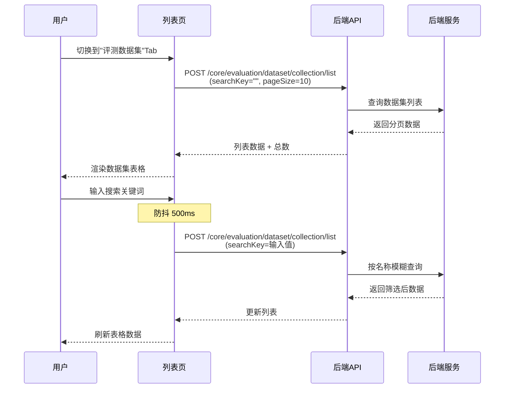
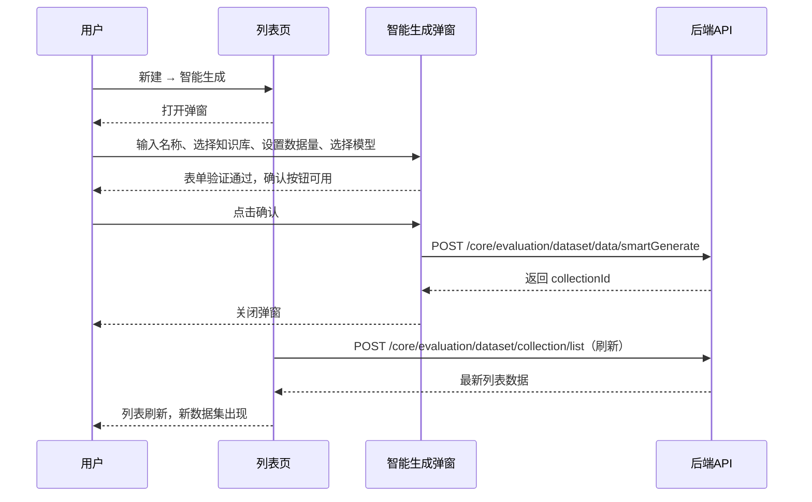
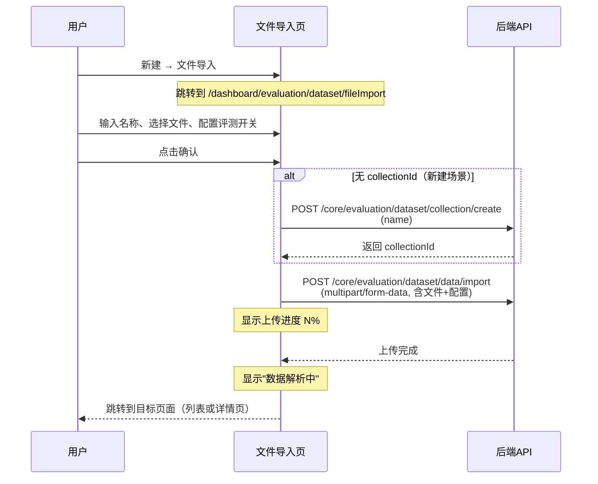
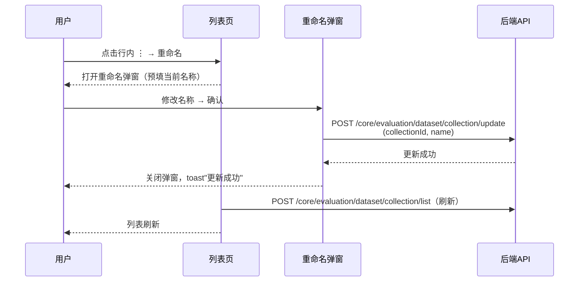
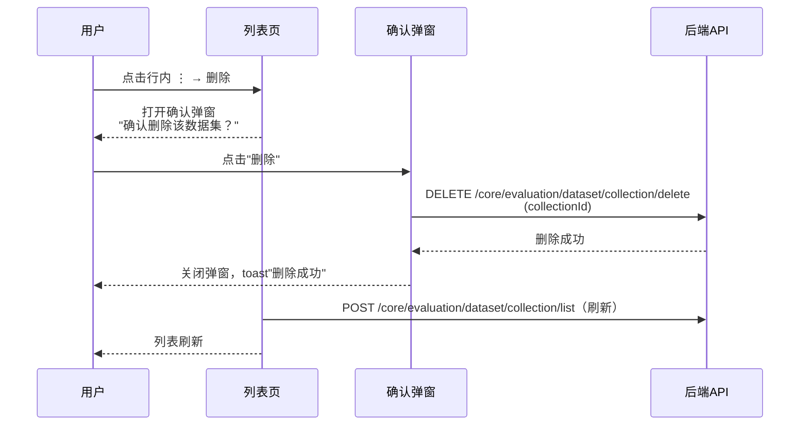
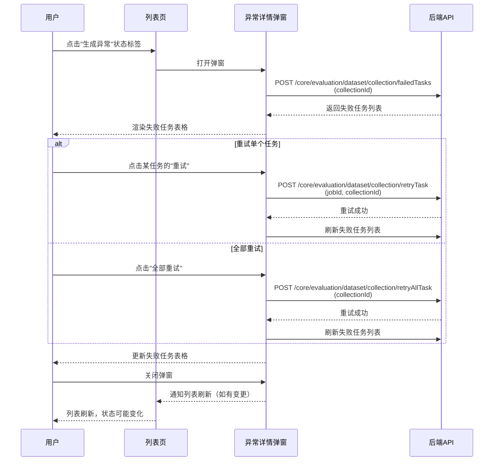

# 评测数据集 — 业务流程详解

## 页面总览

评测数据集模块位于评测首页的第二个 Tab，是评测系统的数据管理中心。用户在此可浏览、创建和管理评测数据集。数据集列表以表格形式展示，支持名称搜索、状态查看和分页浏览。新增数据集有两种途径：基于知识库的智能生成和 CSV 文件导入。

---

### 查看数据集列表

> 业务描述：以分页表格查看团队下所有评测数据集的名称、数据量、创建/更新时间、状态和创建人，支持按名称搜索。

#### 步骤 1：进入数据集列表页

| 用户操作 | 触发 API | 分支条件 | 页面变化 |
|---------|---------|---------|---------|
| 点击评测首页的"评测数据集"Tab | — | 无 | Tab 切换为"评测数据集"，数据集列表区域加载中，显示加载骨架 |

#### 步骤 2：加载数据集列表数据

| 用户操作 | 触发 API | 分支条件 | 页面变化 |
|---------|---------|---------|---------|
| 页面自动加载（无需手动操作） | POST `/core/evaluation/dataset/collection/list`（参数 searchKey 为空字符串，pageSize=10） | 无 | 表格区域结束加载，显示数据集列表或空状态提示 |

#### 步骤 3：搜索数据集

| 用户操作 | 触发 API | 分支条件 | 页面变化 |
|---------|---------|---------|---------|
| 在搜索框中输入名称关键词 | 输入停止 500ms 后触发 POST `/core/evaluation/dataset/collection/list`（参数 searchKey 为输入值） | 输入过程中不触发，防抖延迟后触发 | 输入框内容即时更新，500ms 后列表数据刷新 |

#### 步骤 4：翻页浏览

| 用户操作 | 触发 API | 分支条件 | 页面变化 |
|---------|---------|---------|---------|
| 点击分页器的页码或翻页按钮 | POST `/core/evaluation/dataset/collection/list`（参数 pageNum 为对应页码） | 无 | 列表数据切换为对应页 |

##### 数据加载详情

| 加载阶段 | API | 关键参数 | 数据处理 | 渲染结果 |
|---------|-----|---------|---------|---------|
| 首次加载 | POST `/core/evaluation/dataset/collection/list` | searchKey=""，pageNum=1，pageSize=10 | 服务端分页，前端直接使用返回数据 | 表格前 10 条（或更少） |
| 翻页 | POST `/core/evaluation/dataset/collection/list` | pageNum=N，pageSize=10 | 无额外处理 | 表格第 N 页 |
| 搜索 | POST `/core/evaluation/dataset/collection/list` | searchKey 为用户输入值 | 防抖 500ms 后触发 | 表格数据按名称筛选 |

- 分页参数：默认每页 10 条
- 排序规则：由服务端按创建时间倒序排列
- 筛选条件：支持按名称关键词模糊搜索
- 特殊列渲染：
  - 状态列：根据数据状态显示不同颜色和文案的标签（排队中-灰色、数据生成中-蓝色、已就绪-绿色、生成异常-红色），异常状态可点击
  - 时间列：同时显示创建时间和更新时间，格式为 `yyyy-MM-dd HH:mm:ss`
  - 操作列：鼠标悬停时显示更多操作图标按钮

##### Mermaid 附录

---

### 智能生成数据集

> 业务描述：选择一个或多个知识库作为数据生成依据，配置生成数量，由 AI 模型自动生成包含问题与参考答案的评测数据集。

#### 步骤 1：打开智能生成弹窗

| 用户操作 | 触发 API | 分支条件 | 页面变化 |
|---------|---------|---------|---------|
| 点击"新建"按钮，在弹出的下拉菜单中选择"智能生成" | — | 无 | 打开智能生成弹窗，弹窗标题为"智能生成数据集" |

#### 步骤 2：配置生成参数

| 用户操作 | 触发 API | 分支条件 | 页面变化 |
|---------|---------|---------|---------|
| 输入数据集名称 | — | 名称为必填项 | 输入框显示输入值 |
| 点击"选择知识库"按钮，在弹出的知识库选择器中选择知识库 | — | 至少选择一个知识库 | 已选知识库以卡片形式展示（含头像和名称） |
| 设置数据量 | — | 默认 50，最小 1，最大不超过所选知识库总数据量 | 数字输入框显示当前值 |
| 选择生成模型 | — | 默认选中列表第一个可用于评测的模型 | 模型选择器显示当前模型 |

#### 步骤 3：提交生成

| 用户操作 | 触发 API | 分支条件 | 页面变化 |
|---------|---------|---------|---------|
| 点击"确认"按钮 | POST `/core/evaluation/dataset/data/smartGenerate`（参数 name, count, kbDatasetIds, intelligentGenerationModelId） | 表单验证：名称不为空、已选知识库、数据量≥1、已选模型 → 按钮可用；否则按钮置灰 | 按钮显示加载中状态，提交完成后弹窗关闭，列表自动刷新 |

##### 表单与交互详情

**表单字段清单**：

| 字段名 | 控件类型 | 必填 | 默认值 | 可选值/约束 | 编辑时只读 | 说明 |
|--------|---------|------|--------|------------|-----------|------|
| 数据集名称 | 文本输入 | ✅ | 空 | 任意文本 | 否 | 新建数据集的名称 |
| 生成依据 | 知识库选择器（弹窗） | ✅ | 空 | 从已有知识库中选择，支持多选 | 否 | 选择后以卡片形式展示已选知识库 |
| 数据量 | 数字输入 | ✅ | 50 | 1 ~ 所选知识库总数据量 | 否 | 超过知识库总数据量时自动设为最大值 |
| 生成模型 | 下拉选择 | ✅ | 评测可用模型列表第一项 | 仅显示 useInEvaluation 为 true 的模型 | 否 | 用于生成评测数据的 AI 模型 |

**字段联动**：
- 当选中的知识库总数据量 < 50 时，数据量字段自动调整为该总数据量

**校验规则**：

| 规则 | 触发时机 | 错误提示文案 |
|------|---------|-------------|
| 数据集名称必填 | 提交时 | 表单验证不通过，按钮置灰不可点击 |
| 至少选择一个知识库 | 提交时 | 按钮置灰 |
| 数据量 ≥ 1 | 提交时 | 按钮置灰 |

**前后置条件**：
- **前置条件**：存在可用的知识库数据，存在已配置且 `useInEvaluation` 为 true 的模型
- **后置影响**：创建新数据集，后台异步生成评测数据，数据集初始状态为"排队中"或"数据生成中"
- **失败场景**：提交接口返回错误时，显示错误提示 toast，弹窗不关闭可重试

##### Mermaid 附录

---

### 文件导入数据集

> 业务描述：下载 CSV 模板，按格式填写评测数据，上传文件批量导入，可选开启自动质量评测。

#### 步骤 1：进入文件导入页

| 用户操作 | 触发 API | 分支条件 | 页面变化 |
|---------|---------|---------|---------|
| 点击"新建"按钮，选择"文件导入" | — | 无 | 页面跳转至文件导入页 `/dashboard/evaluation/dataset/fileImport` |

#### 步骤 2：配置导入参数

| 用户操作 | 触发 API | 分支条件 | 页面变化 |
|---------|---------|---------|---------|
| 下载 CSV 模板参考格式 | —（前端生成本地文件） | 无 | 浏览器下载 `evaluation_template.csv` |
| 输入数据集名称 | — | 非详情页追加场景时必须填写 | 输入框显示输入值 |
| 选择 CSV 文件上传 | — | 仅支持 `.csv` 文件 | 已选文件以列表展示（名称、大小），可逐个删除 |

#### 步骤 3：配置质量评测

| 用户操作 | 触发 API | 分支条件 | 页面变化 |
|---------|---------|---------|---------|
| 开启"数据质量评测"开关 | — | 默认开启 | 质量评测模型选择器出现 |
| 选择质量评测模型 | — | 从评测可用模型列表中选择 | 模型选择器显示当前模型 |
| 关闭"数据质量评测"开关 | — | 可选关闭 | 模型选择器隐藏 |

#### 步骤 4：提交导入

| 用户操作 | 触发 API | 分支条件 | 页面变化 |
|---------|---------|---------|---------|
| 点击"确认"按钮 | 1. 如果无 collectionId → POST `/core/evaluation/dataset/collection/create`（参数 name）创建新数据集 2. POST `/core/evaluation/dataset/data/import`（multipart/form-data，含文件和配置参数） | 名称必填（非追加场景）、文件已选择 → 按钮可用；否则置灰 | 按钮显示上传进度百分比（"数据上传中: N%"），上传完成后显示"数据解析中"，解析完成跳转到目标页面 |

##### 表单与交互详情

**表单字段清单**：

| 字段名 | 控件类型 | 必填 | 默认值 | 可选值/约束 | 编辑时只读 | 说明 |
|--------|---------|------|--------|------------|-----------|------|
| 数据集名称 | 文本输入 | 条件必填 | 空 | 非追加场景（无 collectionId）时必填 | 否 | 新建数据集的名称 |
| 文件 | 文件选择器 | ✅ | 空 | 仅 `.csv` 格式，自动过滤超尺寸文件 | 否 | 支持多文件同时上传 |
| 自动质量评测 | 开关 | 否 | 开启（true） | 开启/关闭 | 否 | 开启后导入完成自动进行数据质量评测 |
| 质量评测模型 | 下拉选择 | 条件必填 | 评测可用模型第一项 | 仅显示 useInEvaluation 为 true 的模型 | 否 | 仅在自动质量评测开启时显示 |

**字段联动**：
- 自动质量评测开关关闭时，质量评测模型字段隐藏
- 自动质量评测开关开启时，质量评测模型字段显示且必填

**校验规则**：

| 规则 | 触发时机 | 错误提示文案 |
|------|---------|-------------|
| 数据集名称必填（非追加场景） | 点击确认 | toast 提示"请输入名称" |
| 至少选择一个文件 | 点击确认 | toast 提示"请选择文件" |

**前后置条件**：
- **前置条件**：准备好符合模板格式的 CSV 文件（第一列为提问，第二列为答案，第一行为表头）
- **后置影响**：创建新数据集（如需要）并上传文件数据，可选执行自动质量评测，数据集状态为"文件解析中"或"数据生成中"
- **失败场景**：上传失败时显示错误 toast；可在项目文件记录中查看解析失败的详细原因

##### Mermaid 附录

---

### 管理数据集（重命名）

> 业务描述：修改已有数据集的名称。

#### 步骤 1：打开重命名弹窗

| 用户操作 | 触发 API | 分支条件 | 页面变化 |
|---------|---------|---------|---------|
| 点击数据集行内操作菜单（⋮），选择"重命名" | — | 无 | 打开重命名弹窗，输入框预填当前名称 |

#### 步骤 2：提交新名称

| 用户操作 | 触发 API | 分支条件 | 页面变化 |
|---------|---------|---------|---------|
| 修改名称后点击确认 | POST `/core/evaluation/dataset/collection/update`（参数 collectionId, name） | 名称不为空 | 弹窗关闭，提示"更新成功"，列表自动刷新 |

##### Mermaid 附录

---

### 管理数据集（删除）

> 业务描述：删除一个已有的评测数据集及其包含的所有数据。

#### 步骤 1：触发删除确认

| 用户操作 | 触发 API | 分支条件 | 页面变化 |
|---------|---------|---------|---------|
| 点击数据集行内操作菜单（⋮），选择"删除" | — | 无 | 打开删除确认弹窗 |

#### 步骤 2：确认删除

| 用户操作 | 触发 API | 分支条件 | 页面变化 |
|---------|---------|---------|---------|
| 在确认弹窗中点击"删除" | DELETE `/core/evaluation/dataset/collection/delete`（参数 collectionId） | 无 | 弹窗关闭，提示"删除成功"，列表自动刷新 |
| 在确认弹窗中点击"取消" | — | 无 | 弹窗关闭，不做任何操作 |

##### 删除链路详情

- **确认弹窗**：提示文案为"确认删除该数据集？"，确认按钮文案为"删除"
- **引用检查**：无前端引用检查，后端处理关联数据清理
- **级联影响**：删除数据集会同步删除数据集内所有数据条目、关联的生成任务和异常任务记录

##### Mermaid 附录

---

### 查看异常详情

> 业务描述：当数据集状态为"生成异常"时，查看异步生成任务的失败详情，可对单个或全部失败任务进行重试或删除。

#### 步骤 1：打开异常详情弹窗

| 用户操作 | 触发 API | 分支条件 | 页面变化 |
|---------|---------|---------|---------|
| 点击状态为"生成异常"（红色标签）的数据集状态 | POST `/core/evaluation/dataset/collection/failedTasks`（参数 collectionId） | 仅"生成异常"状态可点击，其他状态不可点击 | 打开异常详情弹窗，标题为"异常信息"，加载失败任务列表 |

#### 步骤 2：查看和处理异常任务

| 用户操作 | 触发 API | 分支条件 | 页面变化 |
|---------|---------|---------|---------|
| 弹窗自动加载 | — | 无 | 显示失败任务表格（来源知识库、来源分块、错误信息、操作列） |
| 点击单个任务的"重试"按钮 | POST `/core/evaluation/dataset/collection/retryTask`（参数 jobId, collectionId） | 仅当未加载其他操作时可点击 | 提示"重试成功"，列表自动刷新 |
| 点击单个任务的"删除"按钮 | POST `/core/evaluation/dataset/collection/deleteTask`（参数 jobId, collectionId） | 仅当未加载其他操作时可点击 | 提示"删除成功"，列表自动刷新 |
| 点击"全部重试"按钮 | POST `/core/evaluation/dataset/collection/retryAllTask`（参数 collectionId） | 仅当有失败任务且未加载其他操作时可点击 | 提示"重试成功"，列表自动刷新 |

#### 步骤 3：关闭弹窗

| 用户操作 | 触发 API | 分支条件 | 页面变化 |
|---------|---------|---------|---------|
| 点击"取消"按钮或关闭弹窗 | — | 如果初始错误任务数和当前不同（有任务被重试/删除），通知父组件刷新列表 | 弹窗关闭，如数据有变化则列表自动刷新 |

##### 状态转换详情

- **状态转换路径**：生成异常 → 重试 → 排队中/数据生成中 → 已就绪（或再次异常）
- **前置检查**：无额外前置检查
- **确认提示**：无二次确认弹窗，操作直接执行
- **级联更新**：重试/删除操作后自动刷新异常任务列表

##### Mermaid 附录

