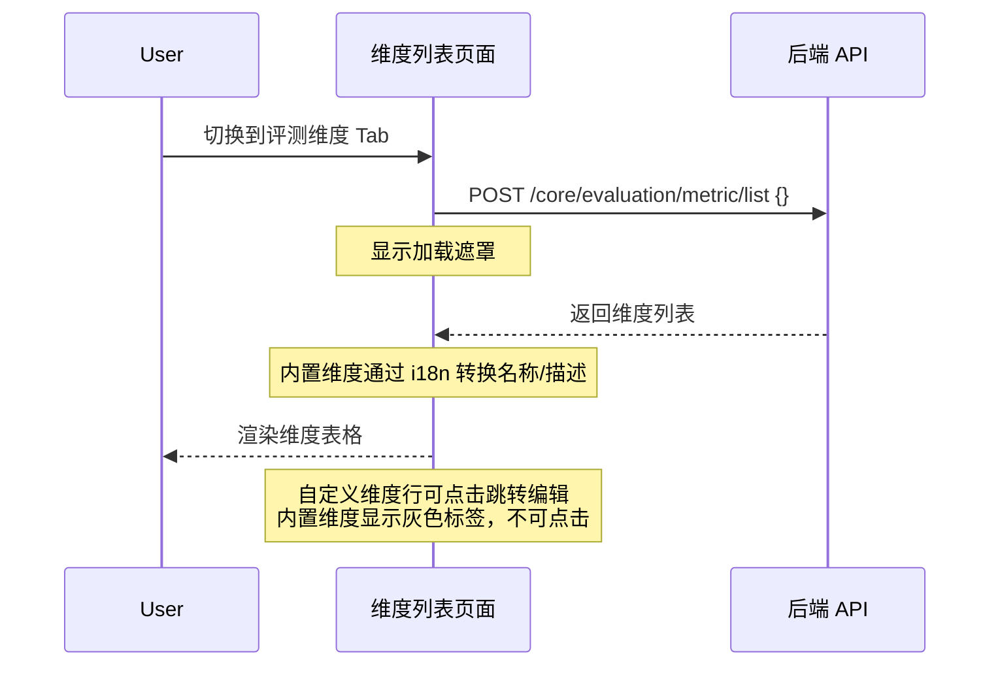
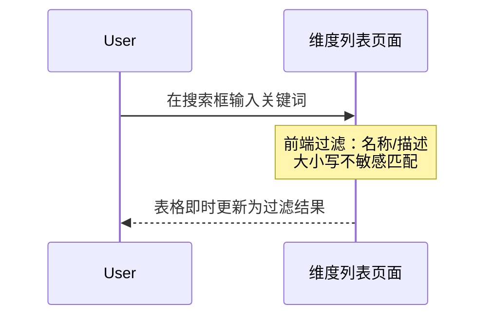
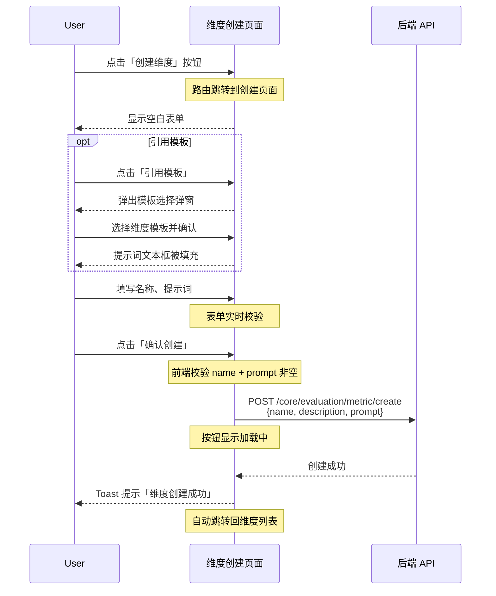
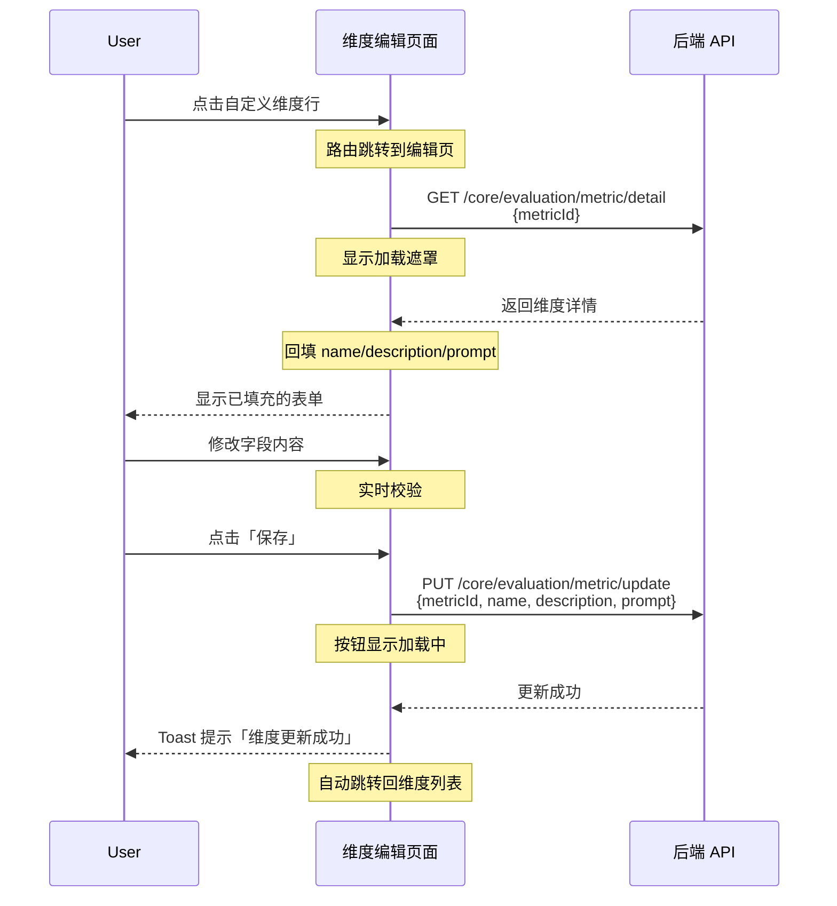
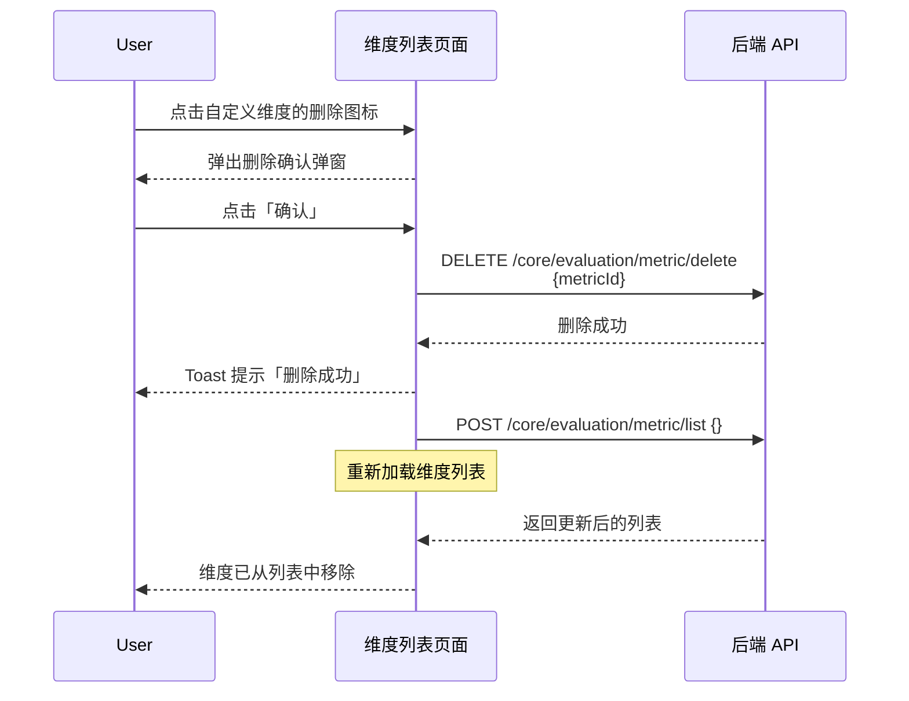
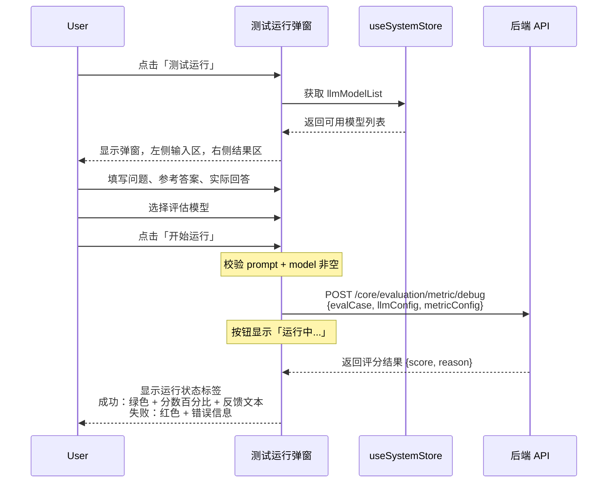
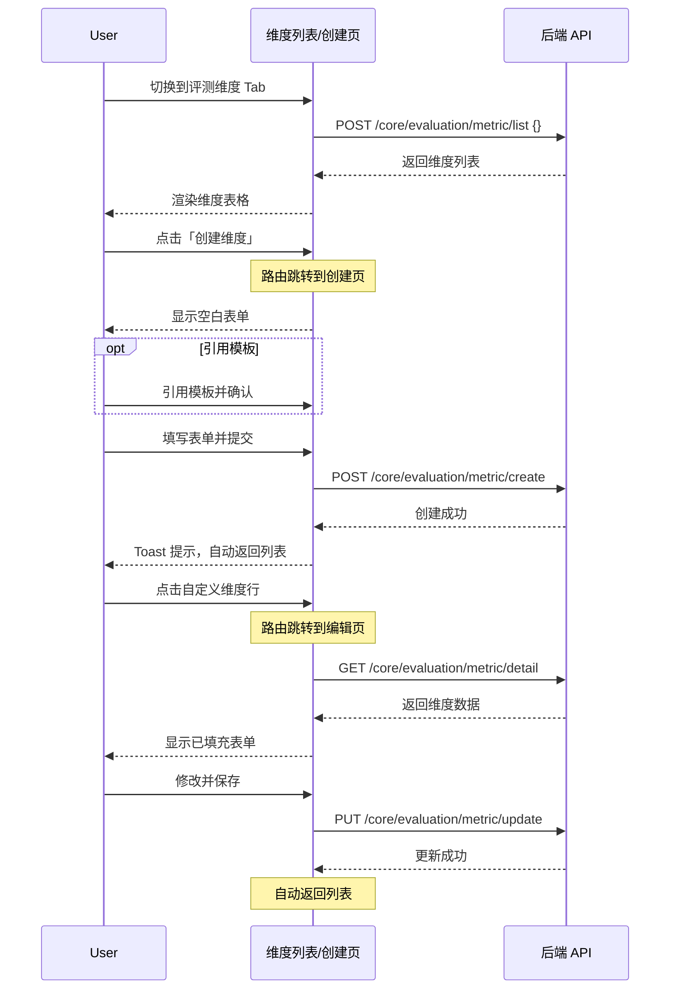

# 评测维度 — 业务流程详解

## 页面总览

评测维度模块是 FastGPT 评测系统的维度管理中心，以 Tab 形式嵌入评测首页页面。用户可在此浏览系统内置和自定义的评估维度，对自定义维度执行完整 CRUD 操作，并支持在创建/编辑维度时进行测试运行以验证评估效果。本模块无嵌套 Tab，所有场景独立执行。

---

### 场景 S01：查看维度列表

> 用户在评测维度 Tab 中浏览内置和自定义维度的完整列表。

#### 步骤 1：进入维度列表

| 用户操作 | 触发 API | 分支条件 | 页面变化 |
|---------|---------|---------|---------|
| 从工作台进入评测页面，切换到「评测维度」Tab | `POST /core/evaluation/metric/list`（参数为空对象 `{}`） | `feConfigs.show_evaluation` 为 `false` 时自动重定向到 `/dashboard`，不发起任何请求 | 「评测维度」Tab 激活，显示 MyBox 加载遮罩，直到 API 返回数据 |

#### 步骤 2：数据加载与渲染

| 用户操作 | 触发 API | 分支条件 | 页面变化 |
|---------|---------|---------|---------|
| 等待加载完成 | 无新请求 | 无 | 加载遮罩消失，维度表格渲染；每条维度显示名称、描述、创建/更新时间、创建者头像和名称；内置维度显示灰色「内置」标签 |

**数据加载详情**：

| 加载阶段 | API | 关键参数 | 数据处理 | 渲染结果 |
|---------|-----|---------|---------|---------|
| 首次加载 | `POST /core/evaluation/metric/list` | `{}` | 内置维度通过 `getBuiltinDimensionNameFromId` 和 `getBuiltinDimensionInfo` 将名称和描述替换为国际化版本 | 表格显示全部维度，内置维度带「内置」标签，自定义维度行可点击 |

- 分页：当前版本为全量加载，无分页参数
- 排序：服务端返回的顺序
- 内置维度特殊渲染：创建时间、更新时间和创建者列显示为 `-`；行不可点击，无删除按钮
- 自定义维度特殊渲染：创建/更新时间格式化为 `yyyy-MM-dd HH:mm:ss`；行可点击跳转编辑；显示删除图标按钮

#### 步骤 3：空数据处理

| 用户操作 | 触发 API | 分支条件 | 页面变化 |
|---------|---------|---------|---------|
| 数据加载完成但维度列表为空 | `POST /core/evaluation/metric/list` 返回空列表 | `allDimensions` 为空数组 → `filteredDimensions` 为空 | 表格区域中央显示空状态提示（EmptyTip 组件），提示文案为"暂无数据"的国际化版本 |

---

### 场景 S02：搜索维度

> 用户在搜索框中输入关键词，实时过滤维度列表。

#### 步骤 1：输入搜索关键词

| 用户操作 | 触发 API | 分支条件 | 页面变化 |
|---------|---------|---------|---------|
| 在搜索框中输入关键词 | 无（前端过滤） | 无 | `searchValue` 状态更新，搜索框中显示输入的文字 |

#### 步骤 2：过滤结果展示

| 用户操作 | 触发 API | 分支条件 | 页面变化 |
|---------|---------|---------|---------|
| 关键词输入后自动过滤 | 无 | 搜索值为空时显示全部维度；搜索值非空时按名称和描述执行大小写不敏感的 `includes` 匹配 | 表格内容即时更新为过滤后的维度列表；无匹配结果时显示空状态 |

- 过滤逻辑：`dimension.name.toLowerCase().includes(searchValue.toLowerCase())` 或 `dimension.description.toLowerCase().includes(searchValue.toLowerCase())`
- 过滤范围：当前已加载的全部维度数据（含内置和自定义）
- 无防抖处理，每次输入即时触发 `useMemo` 重新计算

---

### 场景 S03：创建自定义维度

> 用户新建一个自定义评估维度，填写名称、描述和提示词，确认后创建。

#### 步骤 1：进入创建页面

| 用户操作 | 触发 API | 分支条件 | 页面变化 |
|---------|---------|---------|---------|
| 点击维度列表右上角「创建维度」按钮 | 无 | 无 | 路由跳转到 `/dashboard/evaluation/dimension/create`，页面渲染 DashboardContainer 布局 + 返回按钮 + 空白的 EditForm 表单 |

#### 步骤 2：填写表单

| 用户操作 | 触发 API | 分支条件 | 页面变化 |
|---------|---------|---------|---------|
| 在「名称」输入框输入维度名称 | 无 | `name` 为空时 `isFormValid` 为 `false` | 输入框接收文字输入；必填字段未填写时提交按钮置灰 |
| 在「介绍」输入框输入维度描述（可选） | 无 | 描述字段为可选 | 输入框接收文字输入 |
| 在「提示词」文本框输入评估提示词 | 无 | `prompt` 为空时 `isFormValid` 为 `false` | 文本框接收文字输入；必填字段未填写时提交按钮置灰 |

#### 步骤 2a：引用模板（可选）

| 用户操作 | 触发 API | 分支条件 | 页面变化 |
|---------|---------|---------|---------|
| 点击「引用模板」按钮 | 无 | 无 | 弹出 CitationTemplate 弹窗，左侧显示内置维度模板列表（正确性、简洁性、有害性、争议性、创造性、违法性、深度、详细度），右侧显示所选模板的提示词文本 |
| 在弹窗中切换左侧维度模板 | 无 | 根据当前语言（中文/英文）加载对应的维度模板内容 | 右侧文本区内容切换为所选模板的提示词 |
| 点击弹窗「确认」按钮 | 无 | 无 | 弹窗关闭，表单的提示词文本框被填充为所选模板的内容 |

**模板选择涉及的内置维度**：

| 维度模板 | 国际化 Key | 用途说明 |
|---------|-----------|---------|
| 正确性（correctness） | `dashboard_evaluation:correctness` | 评估答案的事实一致性 |
| 简洁性（conciseness） | `dashboard_evaluation:conciseness` | 评估答案的简洁程度 |
| 有害性（harmfulness） | `dashboard_evaluation:harmfulness` | 检测答案中的有害内容 |
| 争议性（controversiality） | `dashboard_evaluation:controversiality` | 评估答案的争议程度 |
| 创造性（creativity） | `dashboard_evaluation:creativity` | 评估答案的创造性 |
| 违法性（criminality） | `dashboard_evaluation:criminality` | 检测答案中的违法内容 |
| 深度（depth） | `dashboard_evaluation:depth` | 评估答案的深度 |
| 详细度（detail） | `dashboard_evaluation:details` | 评估答案的详细程度 |

#### 步骤 3：测试运行（可选，见 S06）

在提交前可点击「测试运行」按钮打开 TestRun 弹窗验证维度效果。详见场景 S06。

#### 步骤 4：提交创建

| 用户操作 | 触发 API | 分支条件 | 页面变化 |
|---------|---------|---------|---------|
| 点击「确认创建」按钮 | 先执行前端校验：若 `name` 为空则弹出警告 Toast「请输入维度名称」停止提交；若 `prompt` 为空则弹出警告 Toast「请输入提示词」停止提交 | 校验不通过时停止，不发起 API 请求 | 按钮在表单通过校验前保持置灰（`isDisabled={!isFormValid}`） |
| 前端校验通过后提交 | `POST /core/evaluation/metric/create` 参数：`{ name, description, prompt }` | 无 | 按钮显示加载中状态（`isLoading={isCreating}`）；API 调用期间按钮禁止重复点击 |
| 等待 API 响应 | — | API 返回成功 → 弹出成功 Toast「维度创建成功」→ 自动跳转回 `/dashboard/evaluation?evaluationTab=dimensions` 列表页 | 列表页重新加载维度数据，新创建的维度出现在列表中 |

**表单字段清单**：

| 字段名 | 控件类型 | 必填 | 默认值 | 可选值/约束 | 编辑时只读 | 说明 |
|--------|---------|------|--------|------------|-----------|------|
| 名称（name） | 文本输入框 | ✅ | — | 无格式约束 | ❌ | 维度的显示名称 |
| 介绍（description） | 多行文本框（3行） | ❌ | — | 无格式约束 | ❌ | 维度的功能说明 |
| 提示词（prompt） | 多行文本框（15行） | ✅ | — | 无格式约束；可通过引用模板快速填充 | ❌ | 用于指导 LLM 评估的核心指令 |

**校验规则**：

| 规则 | 触发时机 | 错误提示文案 |
|------|---------|-------------|
| 名称不能为空 | 提交时（前端校验） | "请输入维度名称"（i18n key: `dashboard_evaluation:dimension_create_name_required`） |
| 提示词不能为空 | 提交时（前端校验） | "请输入提示词"（i18n key: `dashboard_evaluation:dimension_create_prompt_required`） |
| 表单实时校验 | `onChange` 模式，每次输入变化 | `name` 或 `prompt` 为空时「测试运行」和「确认创建」按钮置灰 |

**前后置条件**：

- **前置条件**：系统功能开关 `show_evaluation` 为 `true`
- **后置影响**：数据库新增一条自定义维度记录；该维度可被评测任务引用
- **失败场景**：API 调用失败时，页面停留在创建表单，提交按钮恢复可用状态，用户可修改后重试

---

### 场景 S04：编辑自定义维度

> 用户点击维度列表中的自定义维度行，修改其名称、描述或提示词后保存。

#### 步骤 1：进入编辑页面

| 用户操作 | 触发 API | 分支条件 | 页面变化 |
|---------|---------|---------|---------|
| 点击维度列表中一个自定义维度行 | 路由跳转到 `/dashboard/evaluation/dimension/edit?id={id}` | 内置维度行不可点击（cursor 为 default，无 onClick 事件） | 进入编辑页面，页面显示全局加载遮罩（Loading 组件，非固定定位） |

#### 步骤 2：加载维度数据

| 用户操作 | 触发 API | 分支条件 | 页面变化 |
|---------|---------|---------|---------|
| 页面加载完成后自动触发 | `GET /core/evaluation/metric/detail` 参数：`{ metricId: dimensionId }`（从路由 query.id 获取） | 无 | 加载遮罩覆盖整个 DashboardContainer 区域 |

#### 步骤 3：数据回填

| 用户操作 | 触发 API | 分支条件 | 页面变化 |
|---------|---------|---------|---------|
| 等待数据加载 | — | API 成功返回 → 将 `name`、`description`、`prompt` 回填到 EditForm 表单；API 失败 → 弹出错误 Toast「获取维度数据失败」，自动返回维度列表页 | 加载遮罩消失，表单三个字段显示数据库中的现有值 |

#### 步骤 4：修改表单

| 用户操作 | 触发 API | 分支条件 | 页面变化 |
|---------|---------|---------|---------|
| 修改名称、描述或提示词字段 | 无 | 同创建场景的校验逻辑（`name` 和 `prompt` 必填） | 表单实时反映修改；按钮在填写完整前保持置灰 |

#### 步骤 5：测试运行（可选，见 S06）

在保存前可点击「测试运行」按钮打开 TestRun 弹窗。详见场景 S06。

#### 步骤 6：保存修改

| 用户操作 | 触发 API | 分支条件 | 页面变化 |
|---------|---------|---------|---------|
| 点击「保存」按钮 | `PUT /core/evaluation/metric/update` 参数：`{ metricId, name, description, prompt }` | 前端校验同创建场景 | 按钮显示加载中状态（`isLoading={isUpdating}`）；API 成功 → 弹出成功 Toast「维度更新成功」→ 自动跳转回列表页；API 失败 → 弹出错误 Toast「更新维度失败」，停留在编辑页 |

**与创建场景的表单差异**：

| 差异点 | 创建 | 编辑 |
|--------|------|------|
| 初始数据 | 空表单 | 从 API 加载已有数据回填 |
| 加载状态 | 无数据加载步骤 | 有独立的加载步骤（Loading 组件 + isFetching 状态） |
| 数据不存在处理 | 不适用 | 若 API 返回空数据，显示「维度数据不存在」提示 |
| 提交 API | `POST /core/evaluation/metric/create` | `PUT /core/evaluation/metric/update` |
| 按钮文案 | 「确认创建」 | 「保存」 |
| 返回按钮文案 | 「返回维度列表」 | 「返回」 |

---

### 场景 S05：删除自定义维度

> 用户从维度列表中删除一个自定义维度，内置维度不支持删除。

#### 步骤 1：点击删除按钮

| 用户操作 | 触发 API | 分支条件 | 页面变化 |
|---------|---------|---------|---------|
| 点击自定义维度行右侧的删除图标按钮 | 无 | 只有自定义维度（`type === EvalMetricTypeEnum.Custom`）才显示删除按钮；内置维度行无删除按钮 | 删除按钮悬停时背景变为红色（`hoverBg="red.50"`），图标变为红色（`hoverColor="red.600"`） |

#### 步骤 2：确认删除

| 用户操作 | 触发 API | 分支条件 | 页面变化 |
|---------|---------|---------|---------|
| 弹出删除确认弹窗（ConfirmModal，类型为 `delete`），弹窗内容为确认删除提示文案 | 无 | 无 | ConfirmModal 显示，包含确认和取消按钮 |

#### 步骤 3：执行删除

| 用户操作 | 触发 API | 分支条件 | 页面变化 |
|---------|---------|---------|---------|
| 点击确认弹窗中「确认」按钮 | `DELETE /core/evaluation/metric/delete` 参数：`{ metricId }` | 无 | 弹窗关闭（`onConfirm` 回调执行） |
| 等待删除完成 | — | API 成功 → 弹出成功 Toast → 自动刷新维度列表（调用 `fetchAllDimensions`，即 `POST /core/evaluation/metric/list`）；API 失败 → 弹出错误 Toast「删除失败」 | 列表重新加载，被删除的维度从列表中消失 |

**删除链路详情**：

- **确认弹窗**：使用通用 `useConfirm` Hook，类型为 `delete`；自定义提示内容通过 `customContent` 传入（i18n key: `dashboard_evaluation:confirm_delete_dimension`）
- **批量与单条差异**：仅支持单条删除，无批量删除功能
- **级联影响**：删除维度后不会自动级联取消已引用该维度的评测任务；任务可能仍会引用已删除的维度 ID
- **撤销机制**：无撤销功能，删除后不可恢复

---

### 场景 S06：测试运行维度

> 在创建或编辑维度时，使用示例数据测试维度的评估效果，验证提示词的有效性。

#### 步骤 1：打开测试运行弹窗

| 用户操作 | 触发 API | 分支条件 | 页面变化 |
|---------|---------|---------|---------|
| 点击创建/编辑页面中的「测试运行」按钮 | 无 | 按钮在表单未通过基本校验（`name` 和 `prompt` 非空）时置灰 | 弹出 TestRun 弹窗，左侧为输入区域（问题、参考答案、实际回答），右侧为运行结果区域 |

#### 步骤 2：填写测试数据

| 用户操作 | 触发 API | 分支条件 | 页面变化 |
|---------|---------|---------|---------|
| 在「问题」文本区输入测试问题 | 无 | 无 | 文本区接收输入，自动调整高度 |
| 在「参考答案」折叠区域输入期望的正确答案 | 无 | 初始状态折叠（最大高度 50px），点击展开后显示完整内容 | 支持折叠/展开切换 |
| 在「实际回答」折叠区域输入 AI 生成的实际回答 | 无 | 初始状态折叠 | 支持折叠/展开切换 |

#### 步骤 3：选择评估模型

| 用户操作 | 触发 API | 分支条件 | 页面变化 |
|---------|---------|---------|---------|
| 在右侧 AI 模型下拉选择器中选择评估模型 | 从 `useSystemStore` 读取 `llmModelList` | 默认选中模型列表中的第一个模型 | 选择器显示当前选中的模型名称 |

#### 步骤 4：运行测试

| 用户操作 | 触发 API | 分支条件 | 页面变化 |
|---------|---------|---------|---------|
| 点击「开始运行」按钮 | 先校验：`formData.prompt` 非空（否则 Toast「提示词不能为空」）；`selectedModel` 非空（否则 Toast「请选择模型」）| 问题、参考答案、实际回答任一为空或未选择模型时按钮置灰（`isDisabled` 为 true） | 按钮显示加载中状态和「运行中...」文字 |
| 校验通过 | `POST /core/evaluation/metric/debug` 参数：`{ evalCase: { userInput: question, expectedOutput: referenceAnswer, actualOutput: actualAnswer }, llmConfig: { modelId: selectedModel }, metricConfig: { metricName: formData.name, metricType: "custom", prompt: formData.prompt } }` | 无 | 右侧结果区域显示「运行中」状态，占位内容显示灰色边框 |

#### 步骤 5：查看结果

| 用户操作 | 触发 API | 分支条件 | 页面变化 |
|---------|---------|---------|---------|
| 等待 API 返回 | — | 成功 → 显示绿色「运行成功」标签 + 分数（百分比格式，乘以 100）+ 详细反馈文本；失败 → 显示红色「运行失败」标签 + 错误信息 | 右侧结果区域变为灰色背景块，显示状态标签（带圆点颜色标记）、分数和反馈内容 |

**测试运行评估用例结构**：

| 字段 | 来源 | 说明 |
|------|------|------|
| `userInput` | 用户在弹窗中输入的问题 | 必填 |
| `expectedOutput` | 用户在弹窗中输入的参考答案 | 必填 |
| `actualOutput` | 用户在弹窗中输入的实际回答 | 必填 |

**API 请求参数详情**：

| 参数项 | 来源 | 说明 |
|--------|------|------|
| `evalCase` | 用户输入的三个字段 | 包含 `userInput`、`expectedOutput`、`actualOutput` |
| `llmConfig.modelId` | 用户选择的模型 | 未选择时按钮禁用 |
| `metricConfig.metricName` | 表单中的 `name` 字段 | 当前编辑的维度名称 |
| `metricConfig.metricType` | 固定值 `EvalMetricTypeEnum.Custom` | 自定义维度 |
| `metricConfig.prompt` | 表单中的 `prompt` 字段 | 当前的评估提示词 |

---

## Mermaid 附录

### 维度列表 → 创建维度 → 返回列表 完整流程

