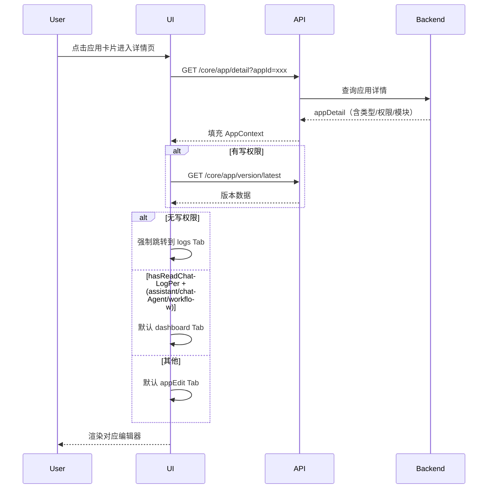
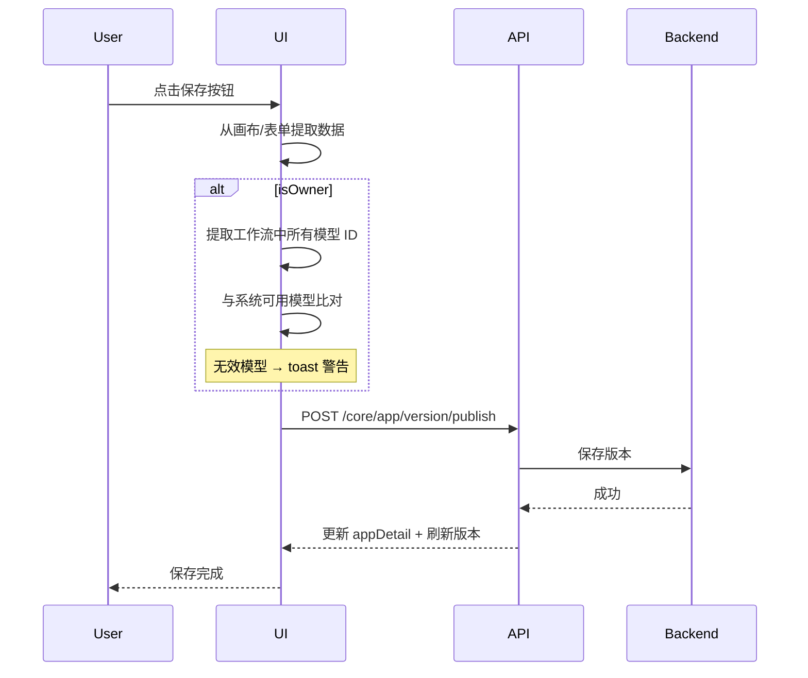
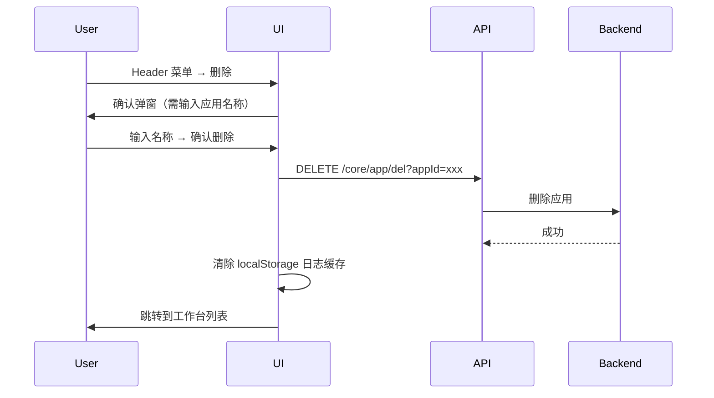
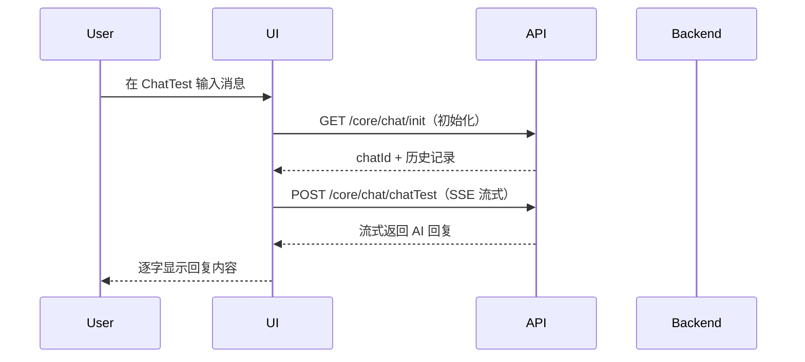

# 应用详情 — 业务流程详解

## 页面总览

应用详情页是 FastGPT 所有 AI 应用的统一编辑与管理入口。页面加载时根据 URL 中的 `appId` 获取应用完整详情（含类型、权限、配置），随后按应用类型分发到对应的子编辑器。编辑器内通过 Tab 系统切换编辑、看板、日志、发布四个功能视图。

## 非 Tab 业务流程

### 页面初始化流程

> 业务描述：用户从工作台点击应用卡片进入详情页后，系统自动完成的初始化过程。

#### 步骤 1：路由进入与参数解析

| 用户操作 | 触发 API | 分支条件 | 页面变化 |
|---------|---------|---------|---------|
| 从工作台点击应用卡片，浏览器导航到 `/app/detail?appId=xxx` | — | URL 含 `currentTab` 参数则优先使用，否则由系统根据应用类型和权限计算默认 Tab | 页面开始加载，显示 Loading 组件 |

#### 步骤 2：加载应用详情

| 用户操作 | 触发 API | 分支条件 | 页面变化 |
|---------|---------|---------|---------|
| 页面自动执行（无需操作） | `GET /api/core/app/detail?appId=xxx`（自动触发，依赖 appId） | appId 无效时 → toast 提示错误并跳转到 `/dashboard/agent` | Loading 组件显示，加载完成后应用信息填充到 AppContext |

#### 步骤 3：加载最新版本（有写权限时）

| 用户操作 | 触发 API | 分支条件 | 页面变化 |
|---------|---------|---------|---------|
| 页面自动执行（无需操作） | `GET /api/core/app/version/latest?appId=xxx`（依赖 hasWritePer） | 仅当 `hasWritePer` 为 true 时触发；无写权限则跳过 | 静默加载，版本数据存入 appLatestVersion |

#### 步骤 4：权限分流与 Tab 定位

| 用户操作 | 触发 API | 分支条件 | 页面变化 |
|---------|---------|---------|---------|
| 无需操作 | — | `!hasWritePer` → 强制跳转到 logs Tab；`hasReadChatLogPer` 且类型为 assistant/chatAgent/workflow → 默认 dashboard Tab；其他 → 默认 appEdit Tab | 根据权限自动定位到对应 Tab，显示对应编辑器 |

**数据加载详情**：

| 加载阶段 | API | 关键参数 | 数据处理 | 渲染结果 |
|---------|-----|---------|---------|---------|
| 首次加载 | GET /core/app/detail | appId | 解析 appDetail 类型、权限、模块配置 | 根据类型渲染对应编辑器 |
| 版本加载 | GET /core/app/version/latest | appId | 存入 context.appLatestVersion | Header 中显示版本状态 |
| 面包屑 | GET /core/app/folder/path | appId | 解析文件夹路径 | Header 中显示面包屑导航 |

### 保存/发布应用流程

> 业务描述：用户在编辑器中修改配置后，点击保存或发布，系统将当前编辑配置持久化为新版本。

#### 步骤 1：点击保存

| 用户操作 | 触发 API | 分支条件 | 页面变化 |
|---------|---------|---------|---------|
| 在编辑器 Header 中点击「保存」按钮（或离开页面触发自动保存） | `POST /api/core/app/version/publish?appId=xxx`（通过 onSaveApp） | `!hasWritePer` → 操作被拒绝，不发起请求 | 保存按钮显示 loading 状态 |

#### 步骤 2：模型引用校验（仅 Owner）

| 用户操作 | 触发 API | 分支条件 | 页面变化 |
|---------|---------|---------|---------|
| 无需操作（保存流程自动执行） | — | `isOwner` 为 true 时，提取工作流中所有模型 ID，与系统可用模型列表比对 | 如有无效模型 → toast 黄色警告提示："模型 {modelIds} 未找到"，不会阻止保存 |

#### 步骤 3：保存完成

| 用户操作 | 触发 API | 分支条件 | 页面变化 |
|---------|---------|---------|---------|
| 等待保存完成 | — | 保存成功 → 更新 appDetail 状态 + 刷新最新版本；保存失败 → toast 错误提示 | 保存按钮恢复，版本状态刷新 |

### 删除应用流程

#### 步骤 1：点击删除

| 用户操作 | 触发 API | 分支条件 | 页面变化 |
|---------|---------|---------|---------|
| 在编辑器中 Header 菜单点击「删除」 | — | 智能客服/Agent/工作流/简单应用 → 提示"确认删除该应用？删除后无法恢复"；工具类应用 → 提示"确认删除该工具？" | 弹出确认弹窗，需输入应用名称进行二次确认 |

#### 步骤 2：确认删除

| 用户操作 | 触发 API | 分支条件 | 页面变化 |
|---------|---------|---------|---------|
| 输入应用名称后点击确认删除 | `DELETE /api/core/app/del?appId=xxx` | 删除成功 → 清除 localStorage 中该应用的日志配置缓存，跳转到 `/dashboard/agent`（AI 应用）或 `/dashboard/tool`（工具）；删除失败 → toast "删除失败" | 确认按钮显示 loading，成功后跳转回列表页 |

### 编辑应用基本信息

#### 步骤 1：打开编辑弹窗

| 用户操作 | 触发 API | 分支条件 | 页面变化 |
|---------|---------|---------|---------|
| 在 Header 中点击「编辑信息」 | — | — | 弹出 InfoModal 弹窗，显示当前应用名称、头像、介绍、权限配置 |

#### 步骤 2：上传头像（可选）

| 用户操作 | 触发 API | 分支条件 | 页面变化 |
|---------|---------|---------|---------|
| 点击头像区域选择本地图片文件 | `POST /api/common/file/presignAvatarPostUrl` | — | 获取预签名 URL 后上传，头像预览更新 |

#### 步骤 3：保存信息

| 用户操作 | 触发 API | 分支条件 | 页面变化 |
|---------|---------|---------|---------|
| 点击弹窗中的「保存」按钮 | `PUT /api/core/app/update?appId=xxx`（通过 updateAppDetail） | 保存成功 → 弹窗关闭，Header 中应用名称/头像刷新；保存失败 → toast 错误提示 | 保存按钮显示 loading |

**表单字段清单**：

| 字段名 | 控件类型 | 必填 | 默认值 | 可选值/约束 | 编辑时只读 | 说明 |
|--------|---------|------|--------|------------|-----------|------|
| 应用名称 | 文本输入 | ✅ | 当前名称 | 长度限制 | 否 | 应用显示名称 |
| 应用头像 | 图片上传 | 否 | 当前头像 | 支持图片格式 | 否 | 通过预签名 URL 上传 |
| 应用介绍 | 多行文本 | 否 | 当前介绍 | — | 否 | 应用描述信息 |
| 权限配置 | 权限选择器 | 否 | 继承父级 | 继承/自定义 | 智能客服类型时隐藏 | 控制应用访问权限 |
| 协作成员 | 成员列表 | 否 | 当前成员 | 含角色选择 | 否 | 管理应用协作者 |

## 各编辑器业务流程

### 编辑简单应用

> 业务描述：通过表单配置简单模式的对话应用，包括提示词、变量、文件选择配置等。

#### 步骤 1：加载编辑表单

| 用户操作 | 触发 API | 分支条件 | 页面变化 |
|---------|---------|---------|---------|
| 页面自动加载 appEdit Tab | — | appDetail.version 为 'v2' → 直接解析 modules；v1 → 通过 v1Workflow2V2 适配器转换 | 左侧显示编辑表单，右侧显示聊天测试面板 |

#### 步骤 2：编辑表单

| 用户操作 | 触发 API | 分支条件 | 页面变化 |
|---------|---------|---------|---------|
| 修改提示词、变量、文件选择等配置项 | — | 编辑过程中每 500ms 自动保存快照到 localStorage | 表单实时响应，Header 中显示快照状态 |

#### 步骤 3：聊天测试

| 用户操作 | 触发 API | 分支条件 | 页面变化 |
|---------|---------|---------|---------|
| 在右侧 ChatTest 面板发送测试消息 | `POST /api/core/chat/chatTest`（SSE 流式） | 需要 chatId 初始化 → `GET /api/core/chat/init` | 消息以流式方式逐字显示，可实时观察 AI 回复效果 |

### 编辑工作流

> 业务描述：在 ReactFlow 可视化画布上编排工作流节点。

#### 步骤 1：加载工作流画布

| 用户操作 | 触发 API | 分支条件 | 页面变化 |
|---------|---------|---------|---------|
| 页面自动加载 | — | 工作流类型时侧栏隐藏（全屏模式），节点和边从 appDetail.modules 加载 | ReactFlow 画布渲染，自动定位到节点区域（仅执行一次） |

#### 步骤 2：编辑节点

| 用户操作 | 触发 API | 分支条件 | 页面变化 |
|---------|---------|---------|---------|
| 从左侧模板面板拖拽节点到画布 / 拖拽连线 / 右键菜单配置节点 | — | `nodesInteractive` 为 false 时所有编辑操作禁用 | 画布实时更新节点位置和连线 |

#### 步骤 3：保存工作流

| 用户操作 | 触发 API | 分支条件 | 页面变化 |
|---------|---------|---------|---------|
| 点击 Header 保存按钮 | `POST /api/core/app/version/publish` | flowData2StoreData 从画布提取节点和边 | 保存按钮 loading，成功后版本状态刷新 |

### 编辑 MCP 工具集

> 业务描述：通过 MCP URL 连接外部工具服务并配置。

#### 步骤 1：配置 MCP 连接

| 用户操作 | 触发 API | 分支条件 | 页面变化 |
|---------|---------|---------|---------|
| 输入 MCP Server URL 和 Header Secret | — | — | URL 输入框和 Secret 输入框实时更新 |

#### 步骤 2：获取工具列表

| 用户操作 | 触发 API | 分支条件 | 页面变化 |
|---------|---------|---------|---------|
| 点击获取工具按钮 | `POST /api/core/app/mcpTools/getTools?appId=xxx` | URL 为空时无法触发 | 工具列表加载，显示工具名称和描述 |

#### 步骤 3：测试工具

| 用户操作 | 触发 API | 分支条件 | 页面变化 |
|---------|---------|---------|---------|
| 选择工具后在右侧 ChatTest 面板运行测试 | `POST /api/core/app/mcpTools/runTool?appId=xxx` | 需要选择具体工具（currentTool 不为空） | 显示工具执行结果 |

#### 步骤 4：保存配置

| 用户操作 | 触发 API | 分支条件 | 页面变化 |
|---------|---------|---------|---------|
| 点击 Header 保存按钮 | `POST /api/core/app/mcpTools/update` | — | 保存按钮 loading，成功后 toast 提示 |

**表单字段清单**：

| 字段名 | 控件类型 | 必填 | 默认值 | 可选值/约束 | 编辑时只读 | 说明 |
|--------|---------|------|--------|------------|-----------|------|
| MCP URL | 文本输入 | ✅ | — | 有效 URL 格式 | 否 | MCP Server 连接地址 |
| Header Secret | 文本输入 | 否 | — | — | 否 | 请求头密钥 |
| 工具列表 | 多选列表 | 否 | — | 从 URL 获取的工具清单 | 否 | 选择要启用的工具 |

### 编辑 HTTP 工具集

> 业务描述：通过 HTTP API URL 定义外部接口并配置 Schema。

#### 步骤 1：配置 HTTP 接口

| 用户操作 | 触发 API | 分支条件 | 页面变化 |
|---------|---------|---------|---------|
| 输入 API URL / 粘贴 Curl 命令导入 | `POST /api/core/app/httpTools/getApiSchemaByUrl` | — | Schema 自动解析，填充到编辑表单 |

#### 步骤 2：编辑 Schema（可选）

| 用户操作 | 触发 API | 分支条件 | 页面变化 |
|---------|---------|---------|---------|
| 在 Schema 配置弹窗中手动调整参数 | — | — | SchemaConfigModal 中实时编辑 |

#### 步骤 3：保存配置

| 用户操作 | 触发 API | 分支条件 | 页面变化 |
|---------|---------|---------|---------|
| 点击保存按钮 | `POST /api/core/app/httpTools/update` | — | 保存按钮 loading |

### 查看对话日志

> 业务描述：查看和筛选应用的对话历史记录。

#### 步骤 1：加载日志

| 用户操作 | 触发 API | 分支条件 | 页面变化 |
|---------|---------|---------|---------|
| 切换到 logs Tab（或无写权限时自动进入） | `POST /api/core/app/logs/list` + `GET /api/core/app/logs/getLogKeys` + `POST /api/core/app/logs/getUsers` | — | 日志列表加载，显示筛选器和表格 |

#### 步骤 2：筛选日志

| 用户操作 | 触发 API | 分支条件 | 页面变化 |
|---------|---------|---------|---------|
| 选择日期范围 / 来源 / 用户进行筛选 | `POST /api/core/app/logs/list`（带筛选参数） | 筛选条件变化时重新请求 | 列表按条件刷新 |

#### 步骤 3：查看日志详情

| 用户操作 | 触发 API | 分支条件 | 页面变化 |
|---------|---------|---------|---------|
| 点击某条日志 | — | — | 弹出 DetailLogsModal 显示完整对话内容 |

**数据加载详情**：

| 加载阶段 | API | 关键参数 | 数据处理 | 渲染结果 |
|---------|-----|---------|---------|---------|
| 首次加载 | POST /core/app/logs/list | appId, 分页参数 | 按时间排序 | 日志表格 |
| 日志配置 | GET /core/app/logs/getLogKeys | appId | 解析显示列配置 | 日志表头 |
| 用户筛选 | POST /core/app/logs/getUsers | appId | 去重排序 | 用户下拉选项 |
| 翻页 | POST /core/app/logs/list | page=N | 无额外处理 | 表格第 N 页 |

### 管理发布渠道

> 业务描述：配置应用的对外发布方式。

#### 步骤 1：进入发布页面

| 用户操作 | 触发 API | 分支条件 | 页面变化 |
|---------|---------|---------|---------|
| 切换到 publish Tab | — | 需 hasManagePer，否则 Tab 不可见 | 显示发布渠道选择页面 |

#### 步骤 2：配置 API Key 发布

| 用户操作 | 触发 API | 分支条件 | 页面变化 |
|---------|---------|---------|---------|
| 在 API 发布页面中查看/新建/编辑 API Key | `GET /api/support/openapi/list`（加载）+ `POST /api/support/openapi/create`（新建）+ `PUT /api/support/openapi/update`（编辑）+ `DELETE /api/support/openapi/delete`（删除） | — | API Key 表格显示，编辑弹窗可设置名称、限额、过期时间 |

#### 步骤 3：配置其他渠道

| 用户操作 | 触发 API | 分支条件 | 页面变化 |
|---------|---------|---------|---------|
| 选择飞书/钉钉/企微/公众号/微信等渠道进行配置 | — | 各渠道有独立的配置页面组件 | 对应渠道配置界面 |

### 查看数据看板

> 业务描述：查看应用的数据统计和图表。

#### 步骤 1：加载看板数据

| 用户操作 | 触发 API | 分支条件 | 页面变化 |
|---------|---------|---------|---------|
| 切换到 dashboard Tab | `GET /api/proApi/core/app/logs/getTotalData`（总览）+ `POST /api/proApi/core/app/logs/getChartData`（图表） | 仅 assistant/chatAgent/workflow 类型 + hasReadChatLogPer 可见 | 显示数据卡片和趋势图表 |

## Mermaid 附录

### 页面初始化流程

### 保存应用流程

### 删除应用流程

### 聊天测试流程

