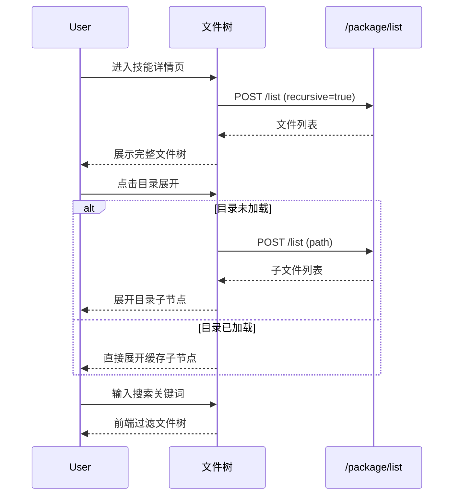
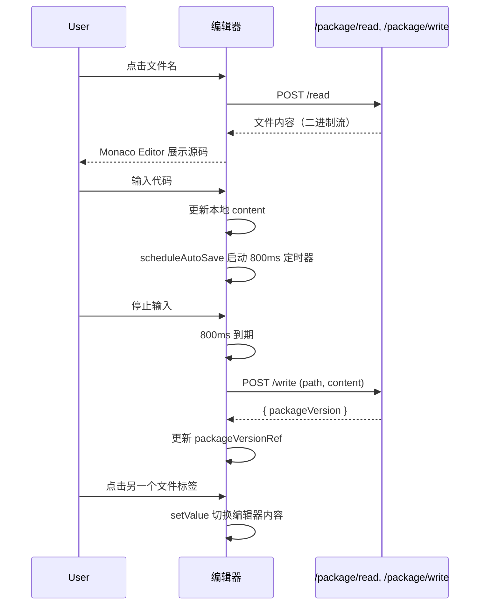
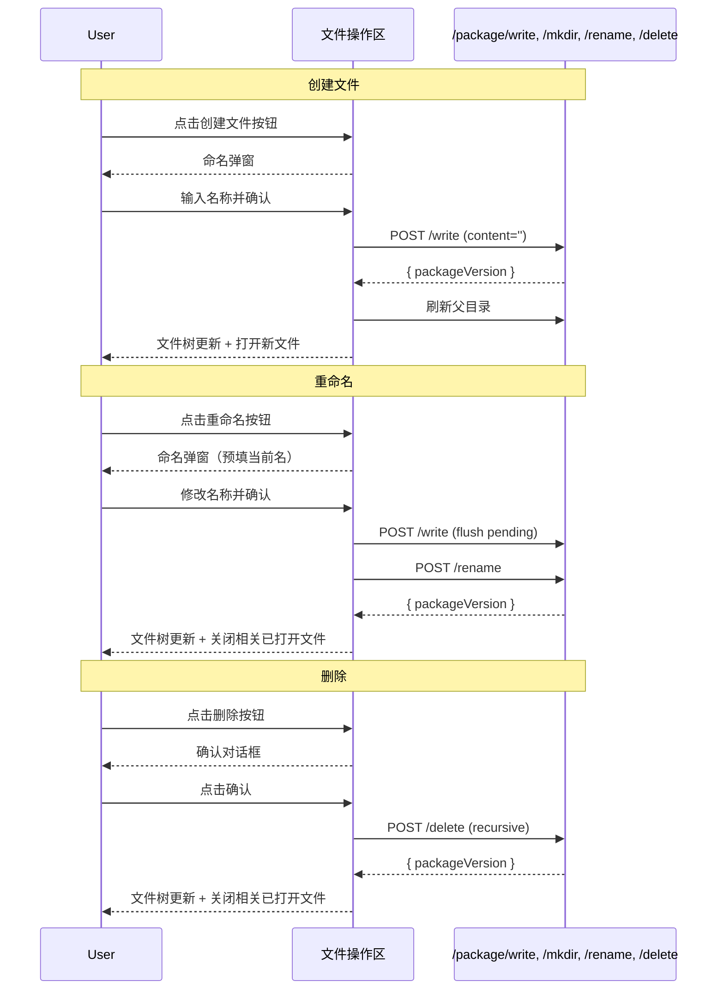
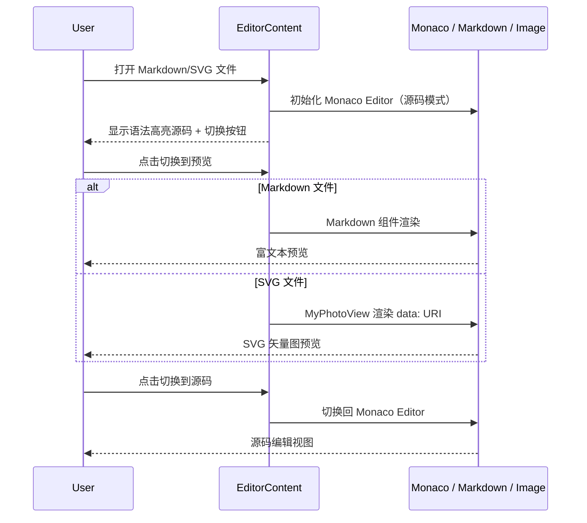
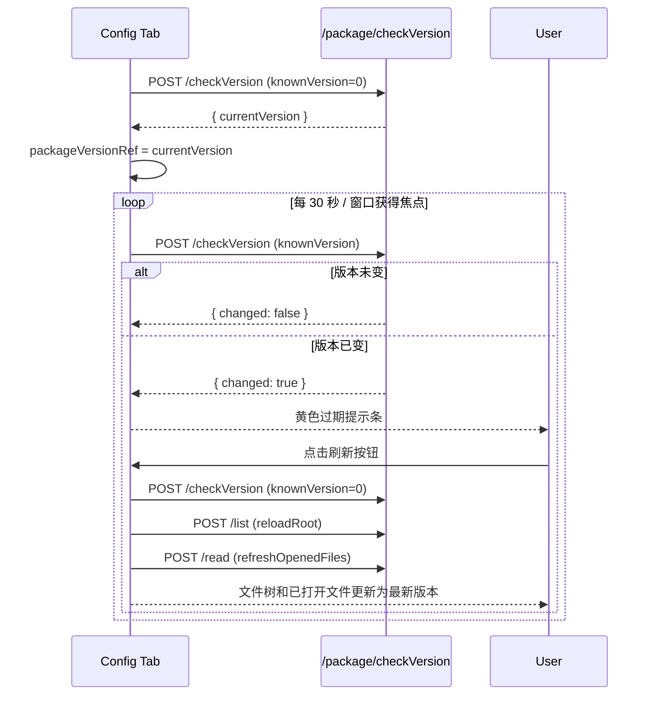

# 技能详情 — Config Tab 业务流程详解

## 页面总览

Config Tab 是技能详情页的代码编辑器区域，基于 Monaco Editor 提供完整的技能包源文件管理能力。页面左侧为可搜索的文件目录树，右侧为代码编辑区（顶部文件标签栏 + Monaco Editor + 底部状态），支持文件 CRUD、自动保存、版本过期检测、Markdown/SVG 预览切换等功能。

---

### 文件浏览与搜索

> 用户在文件树中查看技能包目录结构，搜索定位目标文件。

#### 步骤 1：加载文件树

| 用户操作 | 触发 API | 分支条件 | 页面变化 |
|---------|---------|---------|---------|
| 从技能列表点击技能名称进入详情页，默认展示 Config Tab | `POST /core/agentSkills/package/list`（参数 `path: '.', recursive: true`） | 技能包为空时 | 文件树显示加载中状态（MyBox loading），完成后展示完整文件树；技能包为空时展示空状态提示（EmptyTip："暂无文件"） |

#### 步骤 2：展开目录

| 用户操作 | 触发 API | 分支条件 | 页面变化 |
|---------|---------|---------|---------|
| 点击文件树中的目录节点展开 | 若目录未加载：`POST /core/agentSkills/package/list`（参数 `path: {目录路径}`） | 目录已加载（loaded=true） | 直接展开显示缓存的子节点，无网络请求 |
| — | — | 目录未加载（loaded=false） | 目录节点显示加载 Spinner → API 返回 → 子节点合并到文件树 → 目录展开，Spinner 消失 |
| — | — | API 调用失败 | 弹出错误 Toast："加载目录失败" + 具体错误信息 |

#### 步骤 3：搜索文件

| 用户操作 | 触发 API | 分支条件 | 页面变化 |
|---------|---------|---------|---------|
| 在文件树顶部搜索框输入关键词 | 无（前端本地 filterTree 过滤） | 搜索词非空 | 文件树仅显示名称包含关键词的文件及包含匹配子节点的目录；不匹配的节点隐藏 |
| 清除搜索框内容 | 无 | 搜索词为空 | 恢复显示完整文件树 |

#### 数据加载详情

| 加载阶段 | API | 关键参数 | 数据处理 | 渲染结果 |
|---------|-----|---------|---------|---------|
| 首次加载 | POST /core/agentSkills/package/list | skillId, path='.', recursive=true | itemsToTreeNodes 将后端 PackageFileItem[] 转为 TreeNode[] 树 | 文件树初始展示 |
| 展开未加载目录 | POST /core/agentSkills/package/list | skillId, path={目录路径} | updateTreeNode 将子节点合并到现有树 | 目录展开显示子节点 |
| 刷新目录 | 同上 | 同上，或 POST /core/agentSkills/package/list recursive | 替换指定路径的子节点 | 目录内容更新 |

---

### 文件编辑

> 用户点击文件树中的文件名，在 Monaco Editor 中查看和编辑源码，修改自动保存。

#### 步骤 1：打开文件

| 用户操作 | 触发 API | 分支条件 | 页面变化 |
|---------|---------|---------|---------|
| 在文件树中点击文件名 | `POST /core/agentSkills/package/read`（fetch 二进制流） | 文件已在 openedFiles 中打开 | 仅切换 activeFilePath，激活对应 FileTab，编辑器显示缓存内容 |
| — | — | 文件未打开 + 是二进制文件（image/audio/video） | 加载中状态 → 响应转 Blob → URL.createObjectURL 创建本地 URL → 文件标签和编辑器内容区显示二进制预览（图片/音频/视频播放器） |
| — | — | 文件未打开 + 是文本文件 + UTF-8 解码成功 | 加载中状态 → 内容填充到 Monaco Editor → 语法高亮生效 → 文件标签加入列表 |
| — | — | 文件未打开 + 是文本文件 + UTF-8 解码失败 | isUnknown 标记为 true → 编辑器内容区显示"无法预览此文件"提示 |
| — | — | API 调用失败 | 弹出错误 Toast："打开文件失败" + 具体错误信息 |

#### 步骤 2：编辑源码

| 用户操作 | 触发 API | 分支条件 | 页面变化 |
|---------|---------|---------|---------|
| 在 Monaco Editor 中输入/修改代码 | 无（仅本地状态更新） | canWrite = true | 每输入一个字符 → onChange 触发 → setOpenedFiles 更新对应文件的 content → scheduleAutoSave 调度 |
| — | — | canWrite = false (readOnly) | Monaco Editor 设为只读模式，输入无效 |

#### 步骤 3：自动保存

| 用户操作 | 触发 API | 分支条件 | 页面变化 |
|---------|---------|---------|---------|
| 停止输入 800ms | `POST /core/agentSkills/package/write`（参数 `skillId, path, content`） | 保存成功 | packageVersionRef 更新为最新版本号 → 无 UI 变化（静默保存） |
| 停止输入 800ms | — | 保存失败 | 控制台输出错误（静默失败，不阻塞用户） |
| 继续输入（未满 800ms） | — | 新输入到来 | 清除之前定时器 → 重新计时 800ms，取 openedFilesRef 中最新的 content |

#### 步骤 4：切换已打开文件

| 用户操作 | 触发 API | 分支条件 | 页面变化 |
|---------|---------|---------|---------|
| 在 FileTabs 中点击另一个文件标签 | 无 | 标签存在 | 切换 activeFilePath → useEffect 触发 → editorRef.setValue 将 Monaco Editor 内容替换为新文件内容 |
| 在文件树中点击另一个文件名 | `POST /core/agentSkills/package/read`（如文件未打开） | — | 同"步骤 1：打开文件" |

#### 步骤 5：关闭文件

| 用户操作 | 触发 API | 分支条件 | 页面变化 |
|---------|---------|---------|---------|
| 点击 FileTab 上的关闭按钮 | 若有待保存内容：`POST /core/agentSkills/package/write` | 已打开多个文件 | 从 openedFiles 移除该文件 → 激活列表末尾的文件；若移除的是当前激活文件且列表非空，激活最后一个 |
| — | — | 仅打开一个文件 | 移除后 openedFiles 为空 → 编辑器区显示空状态提示："选择一个文件开始编辑" |
| — | — | 文件为二进制且 content 以 blob: 开头 | URL.revokeObjectURL 释放 blob URL 内存 |

---

### 文件创建

> 用户在指定目录下创建新文件或新目录。

#### 步骤 1：触发创建

| 用户操作 | 触发 API | 分支条件 | 页面变化 |
|---------|---------|---------|---------|
| 在文件树工具栏点击"创建文件"或"创建文件夹"按钮 | 无 | canWrite = true | 弹出命名弹窗（MyModal），标题为"输入新文件名"或"输入新文件夹名" |
| — | — | canWrite = false | 创建按钮不可见或置灰 |

#### 步骤 2：确认名称

| 用户操作 | 触发 API | 分支条件 | 页面变化 |
|---------|---------|---------|---------|
| 在弹窗中输入名称后按 Enter 或点击确认 | 创建文件：`POST /core/agentSkills/package/write`（content 为空字符串）；创建文件夹：`POST /core/agentSkills/package/mkdir` | 输入为空 | 视为取消，关闭弹窗 |
| — | — | 输入有效 + API 成功 | 弹窗关闭 → 刷新父目录文件树 → 创建文件时自动打开新文件进入编辑 |
| — | — | API 失败 | 弹出错误 Toast："创建失败" + 具体错误信息 |
| 点击取消或按 Esc | 无 | — | 弹窗关闭，不执行任何操作 |

#### 表单字段清单

| 字段名 | 控件类型 | 必填 | 默认值 | 可选值/约束 | 编辑时只读 | 说明 |
|--------|---------|------|--------|------------|-----------|------|
| 名称 | 文本输入（Input） | 是（trim 后非空） | — | 文件名/目录名格式 | 否 | 空名称视为取消操作 |

---

### 文件重命名

> 用户对文件树中的文件或目录进行重命名。

#### 步骤 1：触发重命名

| 用户操作 | 触发 API | 分支条件 | 页面变化 |
|---------|---------|---------|---------|
| 在文件树中右键或点击操作菜单选择"重命名" | 无 | canWrite = true | 弹出命名弹窗，标题为"重命名"，输入框预填当前名称 |

#### 步骤 2：确认重命名

| 用户操作 | 触发 API | 分支条件 | 页面变化 |
|---------|---------|---------|---------|
| 修改名称后确认 | 先 `flushPendingForPath`（待保存内容）→ `POST /core/agentSkills/package/rename` | 新名称与旧名称相同 | 视为取消，关闭弹窗 |
| — | — | flushPendingForPath 失败 | 弹出错误 Toast："刷新失败" + 错误信息 → 终止重命名 |
| — | — | API 成功 | 弹窗关闭 → 从 openedFiles 移除原路径及子路径的所有已打开文件 → 如当前激活文件在重命名范围内，清除 activeFilePath → 刷新父目录 |
| — | — | API 失败 | 弹出错误 Toast："重命名失败" + 具体错误信息 |

---

### 文件删除

> 用户删除文件树中的文件或目录。

#### 步骤 1：触发删除确认

| 用户操作 | 触发 API | 分支条件 | 页面变化 |
|---------|---------|---------|---------|
| 在文件树中点击删除按钮 | 无 | canWrite = true | 弹出确认对话框（useConfirm），标题为"确认删除"，内容为"确认删除此文件/文件夹？" |

#### 步骤 2：确认删除

| 用户操作 | 触发 API | 分支条件 | 页面变化 |
|---------|---------|---------|---------|
| 点击确认按钮 | `POST /core/agentSkills/package/delete`（参数 `recursive: 目录为 true`） | 删除目录（recursive=true） | 递归删除目录下所有文件及子目录 |
| — | — | 删除文件（recursive=false） | 仅删除单个文件 |
| — | — | API 成功 | 取消该路径的待保存操作 → 从 openedFiles 移除该路径及子路径文件 → 更新 activeFilePath → 刷新父目录 |
| — | — | API 失败 | 弹出错误 Toast："删除失败" + 具体错误信息 |
| 点击取消 | 无 | — | 对话框关闭，不执行删除 |

---

### 文件上传

> 用户上传本地文件到技能包指定目录。

#### 步骤 1：选择文件

| 用户操作 | 触发 API | 分支条件 | 页面变化 |
|---------|---------|---------|---------|
| 在文件树工具栏点击"上传"按钮 → 选择本地文件 | 无 | canWrite = true | 打开系统文件选择对话框，支持多选 |

#### 步骤 2：上传执行

| 用户操作 | 触发 API | 分支条件 | 页面变化 |
|---------|---------|---------|---------|
| 确认选择文件 | `POST /core/agentSkills/package/upload`（FormData: skillId, path, file）逐文件循环上传 | 全部文件上传成功 | Toast 成功提示："上传成功" → 刷新父目录文件树 |
| — | — | 某个文件上传失败 | 弹出错误 Toast："上传失败" + 具体错误信息 |

---

### 源码/预览切换

> 对 Markdown 和 SVG 文件在源码和预览视图之间切换。

#### 步骤 1：切换视图

| 用户操作 | 触发 API | 分支条件 | 页面变化 |
|---------|---------|---------|---------|
| 打开 Markdown/SVG 文件 → 编辑器顶部显示 FillRowTabs 切换按钮 → 点击"预览"或"源码" | 无 | 当前语言为 markdown 且切换到预览 | Monaco Editor 隐藏 → 显示 Markdown 渲染组件（富文本预览） |
| — | — | 当前语言为 svg 且切换到预览 | Monaco Editor 隐藏 → 显示 data:image/svg+xml URI 的图片预览 |
| — | — | 切换到源码 | 隐藏预览 → 显示 Monaco Editor 源码编辑 |
| — | — | 切换到非 markdown/svg 文件 | viewMode 自动重置为 'source'，不显示切换按钮 |

---

### 版本过期检测与刷新

> 系统轮询检测技能包是否被其他会话修改，提示用户刷新。

#### 步骤 1：初始化版本号

| 用户操作 | 触发 API | 分支条件 | 页面变化 |
|---------|---------|---------|---------|
| Config Tab 加载 | `POST /core/agentSkills/package/checkVersion`（knownVersion=0） | API 成功 | packageVersionRef.current = result.currentVersion |
| — | — | API 失败 | 静默忽略 |

#### 步骤 2：定时轮询

| 用户操作 | 触发 API | 分支条件 | 页面变化 |
|---------|---------|---------|---------|
| 每 30 秒自动触发 或 浏览器窗口获得焦点时 | `POST /core/agentSkills/package/checkVersion`（knownVersion=packageVersionRef.current） | result.changed = true | 文件树上方显示黄色过期提示条（HStack）：信息图标 + "当前 Skill 包已被其他副本修改，请点击刷新获取最新版本" + 刷新按钮 |
| — | — | result.changed = false | 无 UI 变化（静默） |
| — | — | API 失败 | 静默忽略（轮询错误非关键） |

#### 步骤 3：用户刷新

| 用户操作 | 触发 API | 分支条件 | 页面变化 |
|---------|---------|---------|---------|
| 点击过期提示条中的"刷新"按钮 | `POST /core/agentSkills/package/checkVersion`（knownVersion=0）→ `reloadRoot()`→ `refreshOpenedFiles()` | 所有操作成功 | 过期提示条消失 → 文件树重新加载最新目录 → 已打开文件重新加载最新内容 → 所有已修改但未保存的本地更改被覆盖 |

---

### Mermaid 附录

#### 文件浏览与搜索

#### 文件编辑与自动保存

#### 文件创建/重命名/删除

#### 源码/预览切换

#### 版本过期检测与刷新

