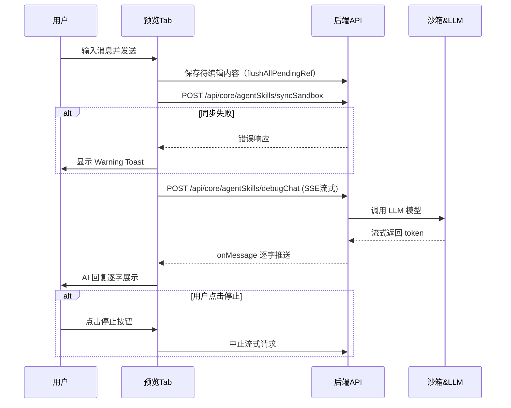
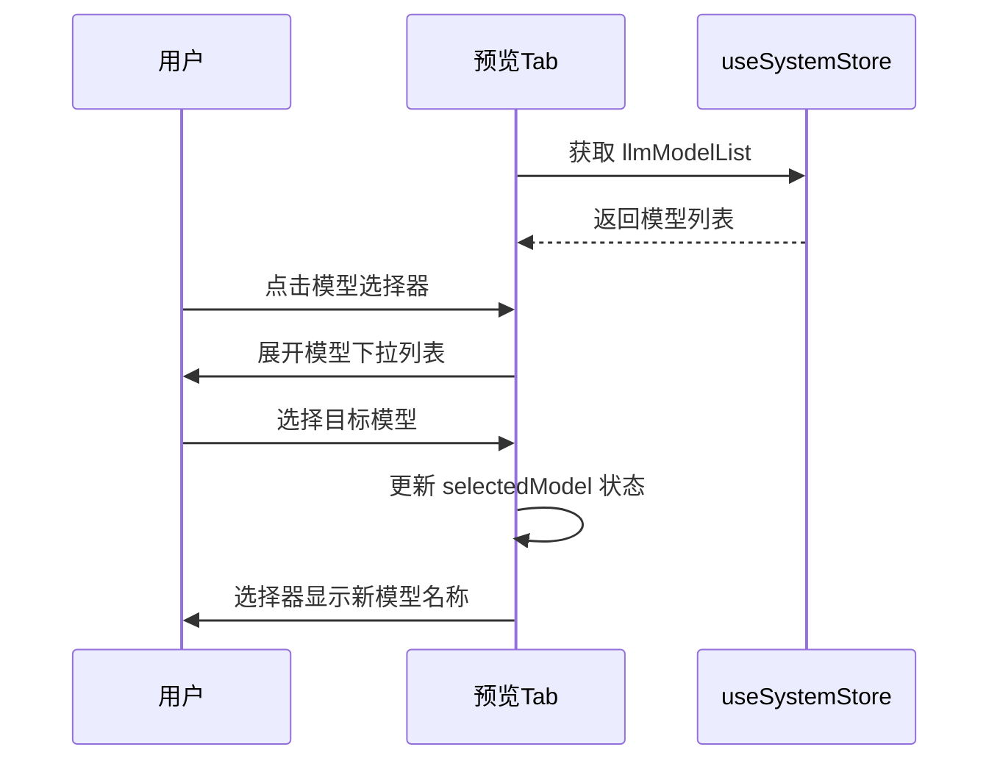
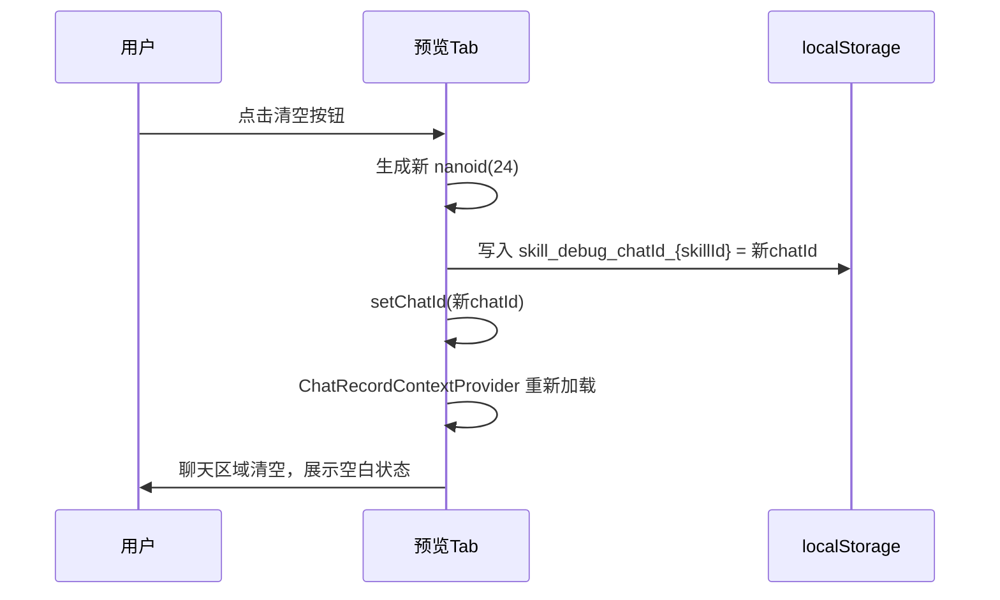
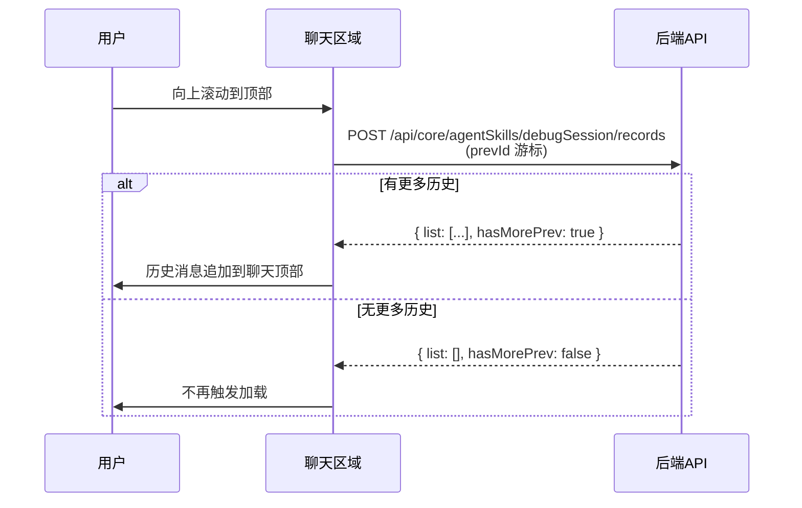

# 预览调试 — 业务流程详解

## 页面总览

预览调试是技能详情页的预览 Tab，提供技能测试的交互式聊天环境。用户在此可以选择 AI 模型、发送测试消息、查看流式 AI 回复、浏览历史对话记录。页面由一个顶部操作栏（模型选择器 + 清空按钮）和一个聊天容器组成。每次进入预览 Tab 或清空对话时，系统会在浏览器本地存储中为该技能生成唯一的调试会话 ID（chatId），用于追踪完整的对话记录。

---

### 发送消息测试技能

> 在预览 Tab 中，用户选择 AI 模型后输入消息发送，系统先同步技能沙箱再发起流式对话请求，实时展示 AI 回复。

#### 步骤 1：进入预览 Tab，系统初始化

| 用户操作 | 触发 API | 分支条件 | 页面变化 |
|---------|---------|---------|---------|
| 从技能详情页点击"预览"Tab | `useSystemStore` 获取 LLM 模型列表（Store 读取，非 HTTP） | 模型列表为空时，模型选择器显示空状态 | 页面切换到预览 Tab，顶部显示"Preview"标题，模型选择器默认选中第一个可用模型，聊天区域展示空白状态（无历史消息时）或加载历史记录 |

**数据加载详情**：

| 加载阶段 | 数据来源 | 关键参数 | 数据处理 | 渲染结果 |
|---------|---------|---------|---------|---------|
| 模型列表加载 | useSystemStore → llmModelList | 无 | 映射为 `{ label: item.name, value: item.id }` 格式 | 模型选择器下拉列表 |
| chatId 初始化 | localStorage | `skill_debug_chatId_{skillId}` | 已有则复用，无则生成新的 nanoid(24) | 作为后续所有聊天请求的会话标识 |
| 历史记录加载 | GET /api/core/agentSkills/debugSession/records（通过 ChatRecordContextProvider） | skillId, chatId | 双向游标分页 | 聊天区域展示历史消息列表 |

#### 步骤 2：用户输入消息并发送

| 用户操作 | 触发 API | 分支条件 | 页面变化 |
|---------|---------|---------|---------|
| 在聊天输入框输入文本 → 点击发送按钮（或按 Enter） | — | 输入为空时发送按钮不可用 | 输入框清空，消息以用户身份出现在聊天区域，发送按钮变为停止按钮（允许中止生成），ChatBox 调用 `onStartChat` 回调 |

#### 步骤 3：沙箱同步

| 用户操作 | 触发 API | 分支条件 | 页面变化 |
|---------|---------|---------|---------|
| （自动触发，用户无感知） | `flushAllPendingRef.current()` — 先执行编辑器中待保存的内容 | — | 无可见变化（后台操作） |
| （自动触发） | POST `/api/core/agentSkills/syncSandbox` — 同步技能配置到沙箱 | 同步失败：显示 Warning Toast，标题"同步技能沙箱失败"，内容为错误详情文本 | 同步中：无加载指示器（静默同步）。失败时：页面顶部出现 Warning Toast 提示，但对话仍继续（不阻断消息发送） |

**错误处理**：
- 沙箱同步失败不会阻止消息发送，用户仍然可以测试技能（但可能使用的是旧版配置）
- Toast 错误信息来自 `getErrText(err)`，展示服务端返回的错误文本

#### 步骤 4：发送消息获取流式回复

| 用户操作 | 触发 API | 分支条件 | 页面变化 |
|---------|---------|---------|---------|
| （自动触发，步骤 3 完成后） | POST `/api/core/agentSkills/debugChat`（流式 SSE） | — | 发起流式请求，聊天区域出现 AI 消息气泡，内容逐字流式展示 |

**API 调用详情**：

| 项目 | 说明 |
|------|------|
| 请求方法 | POST（流式 SSE） |
| 请求路径 | `/api/core/agentSkills/debugChat` |
| 关键参数 | `skillId`（技能 ID）、`chatId`（会话 ID）、`messages`（取最近一条用户消息）、`modelId`（当前选中的模型 ID）、`responseChatItemId`（响应消息 ID） |
| 流式处理 | `onMessage: generatingMessage` — 每收到一个 token 即更新聊天区域的 AI 回复内容 |
| 中止控制 | `abortCtrl: controller` — 用户点击停止按钮时中止流式请求 |
| 并行/串行 | 串行：沙箱同步 → debugChat。沙箱同步完成后才发起 debugChat |

#### 步骤 5：中止生成

| 用户操作 | 触发 API | 分支条件 | 页面变化 |
|---------|---------|---------|---------|
| 在 AI 回复过程中点击停止按钮 | 中止 `abortCtrl` 控制器 | 仅在 AI 正在生成回复时可操作 | 流式输出停止，AI 消息保留已生成的部分内容，停止按钮恢复为发送按钮 |

#### 步骤 6：重新生成某条消息

| 用户操作 | 触发 API | 分支条件 | 页面变化 |
|---------|---------|---------|---------|
| 在已有 AI 回复上点击"重新生成" | POST `/api/core/agentSkills/debugSession/chatItem/delete` — 删除旧消息 | — | 旧 AI 消息被移除，按步骤 3-4 流程重新发起对话 |
| （自动触发） | 同步骤 3-4 | — | 新的 AI 回复流式展示 |

### Mermaid 附录

---

### 切换调试模型

> 用户在顶部模型选择器中切换 AI 模型，后续发送的消息将使用新选中的模型。

#### 步骤 1：打开模型选择器

| 用户操作 | 触发 API | 分支条件 | 页面变化 |
|---------|---------|---------|---------|
| 点击顶部的模型选择器下拉框 | 无（模型列表已在页面加载时获取） | 模型列表为空时下拉无选项 | 下拉框展开，显示所有可用 LLM 模型列表（含模型名称） |

#### 步骤 2：选择新模型

| 用户操作 | 触发 API | 分支条件 | 页面变化 |
|---------|---------|---------|---------|
| 在下拉列表中点击目标模型 | 无 | — | 下拉框关闭，模型选择器显示新选中的模型名称。`selectedModel` 状态更新，后续发送消息时将使用新模型 ID |

### Mermaid 附录

---

### 清空对话重新开始

> 用户点击清空按钮，生成全新的聊天会话 ID，清空当前聊天区域的对话记录。

#### 步骤 1：点击清空按钮

| 用户操作 | 触发 API | 分支条件 | 页面变化 |
|---------|---------|---------|---------|
| 点击顶部工具栏右侧的清空图标按钮（垃圾桶图标） | 无 | — | 触发 `restartChat` 回调 |

#### 步骤 2：生成新会话 ID

| 用户操作 | 触发 API | 分支条件 | 页面变化 |
|---------|---------|---------|---------|
| （自动触发） | 无 | — | 生成新的 `nanoid(24)` 作为 chatId，写入 `localStorage` 的 `skill_debug_chatId_{skillId}` 键，旧 chatId 被覆盖 |

#### 步骤 3：聊天区域重置

| 用户操作 | 触发 API | 分支条件 | 页面变化 |
|---------|---------|---------|---------|
| （自动触发，chatId 变化后） | ChatRecordContextProvider 使用新 chatId 重新加载历史记录 | 新 chatId 无历史记录，返回空列表 | 聊天区域清空，展示空白状态，等待用户输入新消息 |

### Mermaid 附录

---

### 查看历史对话记录

> 在聊天区域向上滚动，加载当前调试会话的更早对话记录。

#### 步骤 1：向上滚动触发分页

| 用户操作 | 触发 API | 分支条件 | 页面变化 |
|---------|---------|---------|---------|
| 在聊天区域向上滚动到顶部 | POST `/api/core/agentSkills/debugSession/records` | `hasMorePrev: false` 时不触发请求 | 聊天区域顶部出现加载指示器 |

**数据加载详情**：

| 加载阶段 | API | 关键参数 | 数据处理 | 渲染结果 |
|---------|-----|---------|---------|---------|
| 首次加载 | POST /api/core/agentSkills/debugSession/records | skillId, chatId | 按时间倒序排列 | 展示最近的对话消息 |
| 向前翻页 | POST /api/core/agentSkills/debugSession/records | skillId, chatId, prevId（上一页游标） | 插入到消息列表头部 | 更早的消息追加到顶部 |
| 向后翻页 | POST /api/core/agentSkills/debugSession/records | skillId, chatId, nextId（下一页游标） | 追加到消息列表尾部 | 更新的消息追加到底部 |

- 分页模式：双向游标分页
- 默认排序：按消息时间顺序排列
- 每条消息含：角色（用户/AI）、内容、时间戳

### Mermaid 附录

