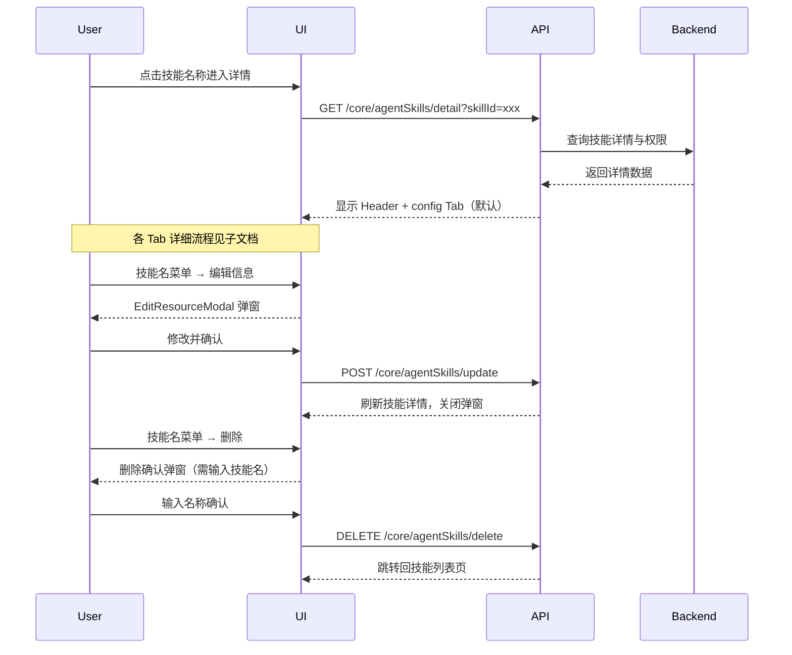

# 技能详情 — 业务流程详解

## Tab 结构索引

本页面包含 2 个 Tab（由 Init 阶段拆分为独立子能力）：

| Tab | 业务描述 | 详细文档 |
|-----|---------|---------|
| config | 在线编辑技能文件（文件树浏览、Monaco 代码编辑器、文件增删改、自动保存、版本冲突检测） | 见 [config 子目录](../config/业务流程详解.md) |
| preview | 选择 AI 模型进行技能调试对话（Agent 沙箱、聊天记录、清空重开） | 见 [preview 子目录](../preview/业务流程详解.md) |

## 公共业务流程

### 页面初始化

> 用户通过技能列表点击技能名称，进入技能详情页。

#### 步骤 1：页面加载与路由解析

| 用户操作 | 触发 API | 分支条件 | 页面变化 |
|---------|---------|---------|---------|
| 在技能列表中点击某个技能名称 | — | — | 路由跳转至 `/skill/detail?skillId=xxx`，页面开始加载 |

#### 步骤 2：技能详情数据获取

| 用户操作 | 触发 API | 分支条件 | 页面变化 |
|---------|---------|---------|---------|
| 页面自动加载 | `GET /core/agentSkills/detail?skillId=xxx` | `skillId` 为空时不发起请求 | 加载中状态，请求完成后显示技能名称、头像；Header 和 Content 区域渲染 |

#### 步骤 3：Context 初始化与权限判定

| 用户操作 | 触发 API | 分支条件 | 页面变化 |
|---------|---------|---------|---------|
| 无（自动完成） | — | 返回数据中 `permission.isOwner` 判断拥有者；`permission.role` 判断权限位 | Context 中注入 `skillDetail`（含 `permission.hasWritePer`），决定 config Tab 是否可编辑 |

#### 步骤 4：Tab 默认激活

| 用户操作 | 触发 API | 分支条件 | 页面变化 |
|---------|---------|---------|---------|
| 无（自动完成） | — | 默认激活 `config` Tab | 显示 AgentSkillEditor 文件编辑器区域；Header 中 Tab 切换器高亮 config |

### Tab 切换

> 用户在 config 和 preview Tab 之间切换。

#### 步骤 1：切换 Tab

| 用户操作 | 触发 API | 分支条件 | 页面变化 |
|---------|---------|---------|---------|
| 点击 Header 中 Tab 切换器的 preview Tab | — | — | Content 区域从编辑器视图切换到预览视图；Header 中 Tab 高亮跟随切换 |
| 点击 config Tab | — | — | Content 区域从预览视图切换回编辑器视图 |

### 编辑技能信息

> 用户通过 Header 中技能名的菜单触发编辑信息弹窗。

#### 步骤 1：打开编辑弹窗

| 用户操作 | 触发 API | 分支条件 | 页面变化 |
|---------|---------|---------|---------|
| 点击技能名右侧图标 → 点击"编辑信息" | — | `skillDetail` 为空时不显示菜单 | 弹出 EditResourceModal，预填充当前头像、名称、简介 |

#### 步骤 2：提交修改

| 用户操作 | 触发 API | 分支条件 | 页面变化 |
|---------|---------|---------|---------|
| 修改名称/描述/头像后点击确认 | `POST /core/agentSkills/update`（skillId, name, avatar, description） | — | 提交中按钮 loading；成功后关闭弹窗，刷新技能详情数据，显示"编辑成功"提示 |

### 权限配置

> 拥有者通过权限设置弹窗管理技能协作者。

#### 步骤 1：打开权限弹窗

| 用户操作 | 触发 API | 分支条件 | 页面变化 |
|---------|---------|---------|---------|
| 点击技能名菜单 → 点击"权限设置" | — | 仅拥有者可见此菜单项 | 弹出 ConfigPerModal，显示当前协作者列表和权限配置 |

#### 步骤 2：管理协作者

| 用户操作 | 触发 API | 分支条件 | 页面变化 |
|---------|---------|---------|---------|
| 添加/修改/删除协作者 | `GET /proApi/core/agentSkill/collaborator/list`（加载列表） | `hasParent` 为 true 时显示"恢复权限继承"按钮 | 协作者列表刷新 |
| 修改协作者权限 | `POST /proApi/core/agentSkill/collaborator/update` | — | 提交后刷新列表 |
| 删除协作者 | `DELETE /proApi/core/agentSkill/collaborator/delete` | — | 提交后刷新列表 |
| 转让所有者 | `POST /proApi/core/agentSkills/changeOwner` | — | 提交后刷新技能详情 |
| 恢复权限继承 | `GET /core/agentSkills/resumeInheritPermission` | `hasParent` 为 true 时可用 | 恢复从父级继承的权限 |

### 导出技能配置

> 拥有者导出技能为 ZIP 压缩包。

| 用户操作 | 触发 API | 分支条件 | 页面变化 |
|---------|---------|---------|---------|
| 点击技能名菜单 → 点击"导出配置" | 触发浏览器下载 `/api/core/agentSkills/export?skillId=xxx` | — | 浏览器下载 `{技能名}.zip` 文件，显示"导出成功"提示 |

### 删除技能

> 拥有者删除技能。

#### 步骤 1：打开删除确认

| 用户操作 | 触发 API | 分支条件 | 页面变化 |
|---------|---------|---------|---------|
| 点击技能名菜单 → 点击"删除" | — | `skillDetail.appCount > 0` 时删除按钮置灰并提示"该技能关联了 N 个应用，无法删除" | 弹出删除确认弹窗，要求输入技能名称以确认 |

#### 步骤 2：确认删除

| 用户操作 | 触发 API | 分支条件 | 页面变化 |
|---------|---------|---------|---------|
| 输入技能名称后点击确认 | `DELETE /core/agentSkills/delete`（skillId） | 名称不匹配时无法确认 | 删除成功后跳转回技能列表页 `/dashboard/skill`，显示"删除成功"提示 |

## Mermaid 附录

