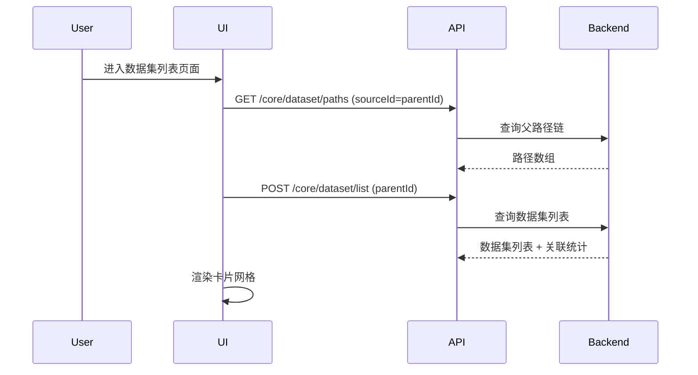
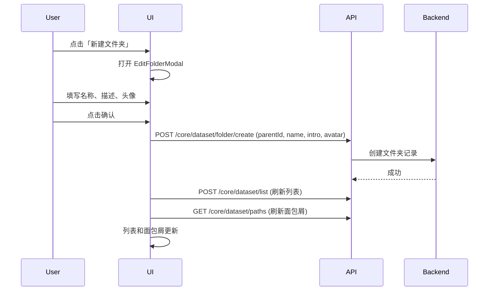
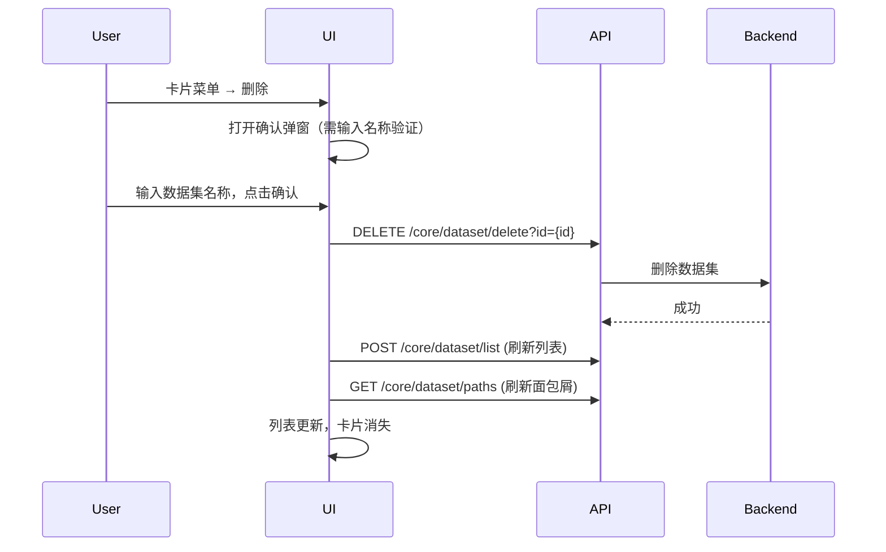
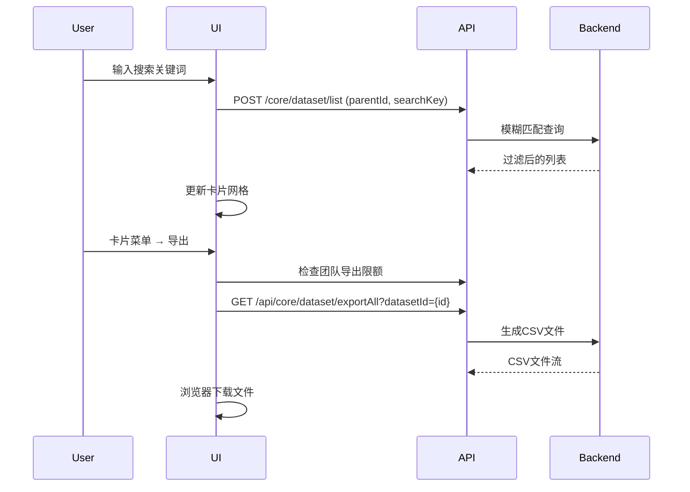

# 数据集列表 — 业务流程详解

## 页面总览

数据集列表页面是知识库管理的核心页面，提供数据集和文件夹的网格卡片展示。页面顶部包含面包屑导航和操作栏（搜索框、新建按钮），主体区域以响应式网格展示数据集卡片，支持无限滚动加载。本页面无 Tab 切换，所有操作通过按钮、菜单和弹窗完成。

---

## 数据加载详情

数据集列表的数据加载流程涉及多个阶段的API调用：

| 加载阶段 | API | 关键参数 | 数据处理 | 渲染结果 |
|---------|-----|---------|---------|---------|
| 首次进入列表 | POST `/core/dataset/list` | `parentId`（根目录为空或从URL参数获取） | 按更新时间降序排列 | 卡片网格展示 |
| 搜索筛选 | POST `/core/dataset/list` | `parentId`, `searchKey` | 按名称和描述模糊匹配，按更新时间降序 | 过滤后的卡片列表 |
| 加载面包屑 | GET `/core/dataset/paths` | `sourceId`（当前 parentId） | 构建从根目录到当前目录的路径数组 | 面包屑导航栏 |
| 获取文件夹详情 | GET `/core/dataset/detail` | `id`（当前 parentId） | 获取文件夹的权限、名称、图标等信息 | 决定操作栏按钮的显示与可用性 |
| 滚动加载更多 | POST `/core/dataset/list` | `parentId`, `pageNum`, `pageSize` | 追加到现有列表 | 追加更多卡片 |
| 获取关联数据 | 聚合查询 | 所有数据集ID | 统计每个数据集的关联应用数、文件数、处理中数量 | 卡片底部显示统计信息 |

- **分页参数**: 通过 `pageNum` 和 `pageSize` 参数分页，支持无限滚动自动加载
- **排序规则**: 默认按 `updateTime` 降序排列
- **筛选条件**: 搜索框支持按名称和描述模糊搜索，最大输入长度30字符

---

## 浏览数据集列表

> **业务描述**: 用户查看当前目录下的数据集和文件夹，以卡片网格形式展示。

### 步骤 1：进入列表页

| 用户操作 | 触发 API | 分支条件 | 页面变化 |
|---------|---------|---------|---------|
| 用户通过左侧导航栏点击"数据集"菜单项，或直接访问 `/dataset/list` URL | GET `/core/dataset/paths`?sourceId=parentId | 无 parentId 参数时请求根目录路径（返回空数组） | 页面加载，显示加载状态（MyBox isLoading） |

### 步骤 2：加载数据集列表

| 用户操作 | 触发 API | 分支条件 | 页面变化 |
|---------|---------|---------|---------|
| 自动触发（组件挂载） | POST `/core/dataset/list` (parentId, pageNum, pageSize) | — | 加载遮罩覆盖卡片区域；加载完成后渲染卡片网格。列表为空时显示空状态提示"还没有数据集" |

### 步骤 3：查看卡片信息

| 用户操作 | 触发 API | 分支条件 | 页面变化 |
|---------|---------|---------|---------|
| 用户浏览卡片网格，每张卡片展示名称、描述、类型标签、统计数据 | — | — | 文件夹卡片显示文件夹图标，数据集卡片显示自定义头像。卡片底部显示关联应用数、文件数、更新时间和创建人 |

### 步骤 4：进入子文件夹

| 用户操作 | 触发 API | 分支条件 | 页面变化 |
|---------|---------|---------|---------|
| 用户点击文件夹卡片 | POST `/core/dataset/list` (新 parentId) + GET `/core/dataset/paths` + GET `/core/dataset/detail` | 仅文件夹卡片可点击（`isFolder === true`） | URL更新为 `?parentId=xxx`；搜索框内容清空；面包屑更新；列表重新加载子目录内容 |

### 步骤 5：滚动加载更多

| 用户操作 | 触发 API | 分支条件 | 页面变化 |
|---------|---------|---------|---------|
| 用户滚动到列表底部 | POST `/core/dataset/list` (parentId, pageNum++, pageSize) | `hasMore` 为 true 时才加载；`isFetchingDatasets` 为 true 时跳过 | 列表底部显示加载旋转器；新数据追加到列表末尾 |

---

## 搜索数据集

> **业务描述**: 用户在搜索框中输入关键词，实时过滤数据集列表。

### 步骤 1：输入搜索关键词

| 用户操作 | 触发 API | 分支条件 | 页面变化 |
|---------|---------|---------|---------|
| 用户在顶部搜索框输入关键词 | POST `/core/dataset/list` (parentId, searchKey) | PC端搜索框在操作栏右侧，移动端搜索框在操作栏下方 | 搜索框内容更新；列表根据关键词过滤，按名称和描述模糊匹配。最大输入30个字符 |

---

## 创建文件夹

> **业务描述**: 用户在数据集列表中创建新文件夹。

### 步骤 1：打开创建弹窗

| 用户操作 | 触发 API | 分支条件 | 页面变化 |
|---------|---------|---------|---------|
| 用户点击操作栏"新建文件夹"按钮 | — | 文件夹详情存在时需 `hasWritePer` 权限；无文件夹详情时需用户团队权限 `hasDatasetCreatePer` | 打开 EditFolderModal 弹窗，表单字段：名称、描述、头像 |

### 步骤 2：填写并提交

| 用户操作 | 触发 API | 分支条件 | 页面变化 |
|---------|---------|---------|---------|
| 用户填写文件夹名称（必填）、描述（可选）、上传头像（可选），点击确认 | POST `/core/dataset/folder/create` (parentId, name, intro, avatar) | 头像上传需先调用 GET 获取预签名URL | 弹窗关闭；列表和面包屑自动刷新 |

**表单字段清单**:

| 字段名 | 控件类型 | 必填 | 默认值 | 可选值/约束 | 编辑时只读 | 说明 |
|--------|---------|------|--------|------------|-----------|------|
| 名称 | 文本输入 | ✅ | — | 最大长度受后端约束 | ❌ | 文件夹名称 |
| 描述 | 文本输入 | ❌ | — | — | ❌ | 文件夹简介 |
| 头像 | 图片上传 | ❌ | — | 支持自定义上传 | ❌ | 文件夹图标 |

---

## 创建数据集

> **业务描述**: 用户通过下拉菜单选择数据集类型，创建不同类型的知识库。

### 步骤 1：展开新建菜单

| 用户操作 | 触发 API | 分支条件 | 页面变化 |
|---------|---------|---------|---------|
| 用户点击操作栏"新建数据集"按钮（蓝色主按钮，带加号图标） | — | 文件夹详情存在时需 `hasWritePer` 权限；无文件夹详情时需用户团队权限 `hasDatasetCreatePer` | 展开下拉菜单，显示可用数据集类型列表 |

### 步骤 2：选择数据集类型

| 用户操作 | 触发 API | 分支条件 | 页面变化 |
|---------|---------|---------|---------|
| 用户从下拉菜单中选择数据集类型 | — | 网站数据集需 `feConfigs.isPlus` 为 true，否则弹出"商业版功能"提示；直接数据库需 `feConfigs.show_direct_database` 为 true | 关闭下拉菜单，打开 CreateModal 弹窗 |

**可用数据集类型:**

| 类型 | 对应常量 | 显示条件 | 说明 |
|------|---------|---------|------|
| 通用数据集 | `DatasetTypeEnum.dataset` | 始终显示 | 支持多种文件上传的通用知识库 |
| 网站数据集 | `DatasetTypeEnum.websiteDataset` | `feConfigs.isPlus` | 自动爬取网站内容构建知识库 |
| 文件数据库 | `DatasetTypeEnum.structureDocument` | `feConfigs.show_direct_database` 或始终显示 | 通过结构化文件导入数据 |
| 直接数据库 | `DatasetTypeEnum.database` | `feConfigs.show_direct_database === true` | 直接连接外部数据库 |
| API文件 | `DatasetTypeEnum.apiDataset` | 始终显示 | 通过 API 接口获取数据 |
| 飞书数据集 | `DatasetTypeEnum.feishu` | `feConfigs.show_dataset_feishu !== false` | 从飞书文档导入 |
| 语雀数据集 | `DatasetTypeEnum.yuque` | `feConfigs.show_dataset_yuque !== false` | 从语雀文档导入 |

### 步骤 3：填写表单并提交

| 用户操作 | 触发 API | 分支条件 | 页面变化 |
|---------|---------|---------|---------|
| 用户在弹窗中填写数据集信息（名称、类型特有配置等），点击确认创建 | POST `/core/dataset/create` 或 POST `/core/dataset/createWithFiles` | 根据选择的数据集类型调用不同的API | 弹窗关闭；列表自动刷新，新数据集卡片出现在列表中 |

> 具体的创建表单字段因数据集类型不同而异，详细字段清单见各数据集类型的独立文档（如通用数据集的创建流程）。

---

## 编辑数据集/文件夹

> **业务描述**: 用户修改已有数据集或文件夹的名称、描述和头像。

### 步骤 1：打开编辑界面

| 用户操作 | 触发 API | 分支条件 | 页面变化 |
|---------|---------|---------|---------|
| 文件夹：鼠标悬浮卡片 → 点击右上角更多按钮 → 选择"编辑信息"；或点击操作栏"编辑"按钮 | — | 文件夹需有 `hasManagePer` 权限 | 打开 EditFolderModal（文件夹）或 CreateModal（数据集） |
| 数据集：鼠标悬浮卡片 → 类型标签切换为更多按钮 → 点击 → "编辑信息" | — | 数据集需有 `hasManagePer` 权限 | 打开 CreateModal 编辑模式 |

### 步骤 2：修改并保存

| 用户操作 | 触发 API | 分支条件 | 页面变化 |
|---------|---------|---------|---------|
| 用户修改名称、描述、头像，点击确认 | PUT `/core/dataset/update` (id, name, intro, avatar) | — | 弹窗关闭；列表数据局部更新 |

---

## 配置权限

> **业务描述**: 用户为数据集或文件夹配置访问权限。

### 步骤 1：打开权限面板

| 用户操作 | 触发 API | 分支条件 | 页面变化 |
|---------|---------|---------|---------|
| 数据集：卡片菜单 → "权限"；文件夹：操作栏"权限"按钮 | GET `/core/dataset/getPermission` + GET 协作者列表 | 需 `hasManagePer` 权限 | 打开 ConfigPerModal 权限配置弹窗 |

### 步骤 2：管理协作者

| 用户操作 | 触发 API | 分支条件 | 页面变化 |
|---------|---------|---------|---------|
| 添加协作者：选择用户/组织/群组 → 设置角色 | POST `/core/dataset/collaborator/update` | — | 协作者列表更新 |
| 移除协作者：点击协作者旁的删除按钮 | DELETE `/core/dataset/collaborator/delete` | — | 协作者从列表中移除 |
| 更改所有者：点击"更改所有者" | POST `/proApi/core/dataset/changeOwner` | — | 所有者变更，列表刷新 |

### 步骤 3：权限继承操作

| 用户操作 | 触发 API | 分支条件 | 页面变化 |
|---------|---------|---------|---------|
| 点击"恢复继承权限" | PUT `/core/dataset/resumeInheritPermission` | 仅当 `hasParent` 为 true（有父文件夹）时显示此按钮 | 权限重置为继承自父文件夹；列表刷新 |

**前后置条件**:
- **前置条件**: 用户对当前数据集/文件夹有管理权限
- **后置影响**: 权限变更后自动刷新列表数据和文件夹详情
- **失败场景**: 网络异常时 toast 错误提示，权限状态不变

---

## 移动数据集

> **业务描述**: 用户将数据集移动到其他文件夹。

### 步骤 1：拖拽移动

| 用户操作 | 触发 API | 分支条件 | 页面变化 |
|---------|---------|---------|---------|
| 用户拖拽数据集卡片到目标文件夹放下 | — | 仅非文件夹的卡片可拖拽（`data-drag-id` 属性仅在 `isFolder` 时设置）；目标必须是文件夹；拖拽ID与目标ID不能相同 | 拖拽时目标文件夹边框高亮（`primary.600`）；松手后弹出确认弹窗 |

### 步骤 2：确认移动

| 用户操作 | 触发 API | 分支条件 | 页面变化 |
|---------|---------|---------|---------|
| 确认弹窗中点击确认 | PUT `/core/dataset/update` (id, parentId) | — | 弹窗关闭；列表刷新 |

### 步骤 3：菜单移动

| 用户操作 | 触发 API | 分支条件 | 页面变化 |
|---------|---------|---------|---------|
| 卡片菜单 → "移动" | — | 需父级数据集管理权限 | 打开文件夹选择弹窗 → 选择目标文件夹 → 确认 → 调用 PUT `/core/dataset/update` |

---

## 删除数据集/文件夹

> **业务描述**: 用户删除数据集或文件夹。

### 步骤 1：触发删除

| 用户操作 | 触发 API | 分支条件 | 页面变化 |
|---------|---------|---------|---------|
| 鼠标悬浮卡片 → 更多按钮 → "删除" | — | 需 `hasManagePer` 权限；`appCount > 0` 时删除按钮禁用，提示"该数据集正被 N 个应用使用，无法删除" 或文件夹提示"文件夹下有数据集被应用引用" | 打开删除确认弹窗 |

### 步骤 2：确认删除

| 用户操作 | 触发 API | 分支条件 | 页面变化 |
|---------|---------|---------|---------|
| 用户在确认弹窗中输入数据集名称以确认删除，点击确认 | DELETE `/core/dataset/delete?id={id}` | 需输入正确名称匹配；倒计时5秒 | 弹窗关闭；列表和面包屑刷新。失败时 toast 错误提示 |

**删除链路详情**:
- **引用检查**: 前端检查 `appCount > 0` 时禁用删除按钮
- **确认弹窗**: 标题"删除警告"，内容为"确认删除该数据集？所有数据将无法恢复"（文件夹）或"确认删除数据集？"（普通数据集）；用户需输入数据集完整名称确认
- **级联影响**: 删除后自动刷新列表和面包屑导航

---

## 导出数据集

> **业务描述**: 用户将数据集内容导出为 CSV 文件。

### 步骤 1：触发导出

| 用户操作 | 触发 API | 分支条件 | 页面变化 |
|---------|---------|---------|---------|
| 卡片菜单 → "导出" | GET `/api/core/dataset/exportAll?datasetId={id}` | 仅非文件夹、非数据库类型显示导出选项 | 显示全局加载遮罩（`setLoading(true)`），成功提示"开始导出" |

### 步骤 2：文件下载

| 用户操作 | 触发 API | 分支条件 | 页面变化 |
|---------|---------|---------|---------|
| 自动触发下载 | — | 导出前需调用 `checkTeamExportDatasetLimit` 检查团队导出限额；超限时提示"导出数据集数量已达上限" | 浏览器下载 CSV 文件；加载遮罩关闭 |

---

## Mermaid 附录

### 数据集列表加载

### 创建文件夹

### 删除数据集

### 搜索 + 导出

