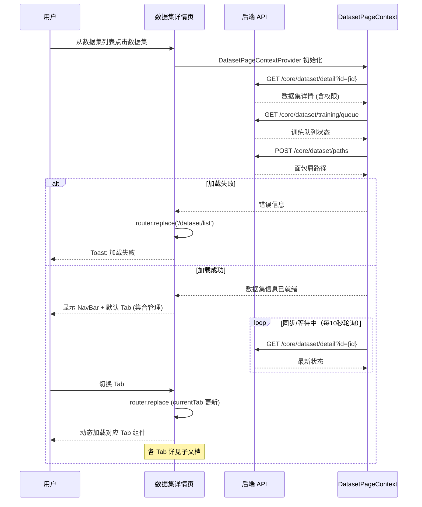

# 数据集详情 — 业务流程详解

> 本节点为父节点（`has_tab_children: true`），各 Tab 的业务流程详解由对应子能力独立管理。本文档只覆盖页面级公共流程。

## 公共业务流程

### 页面初始化与数据集加载

#### 步骤 1：页面渲染入口

| 用户操作 | 触发 API | 分支条件 | 页面变化 |
|---------|---------|---------|---------|
| 从数据集列表点击数据集进入详情页 | GET `/core/dataset/detail?id={id}`（`getDatasetById`） | 无 | 页面显示加载状态，左侧显示工作台导航栏 |

> 页面采用服务端渲染（`getServerSideProps`），首次加载时通过 SSR 获取 `currentTab`、`datasetId` 和 i18n 翻译文件。客户端渲染阶段通过 `DatasetPageContextProvider` 包裹页面组件。

#### 步骤 2：数据集详情加载

| 用户操作 | 触发 API | 分支条件 | 页面变化 |
|---------|---------|---------|---------|
| 页面自动加载（`useRequest` 自动触发） | GET `/core/dataset/detail?id={datasetId}`（`loadDatasetDetail`） | 加载失败时 → 跳转回 `/dataset/list` 并提示错误 | 成功：NavBar 显示数据集名称面包屑，Tab 栏出现；失败：跳转到数据集列表页，toast 显示错误信息 |

#### 步骤 3：训练队列状态获取

| 用户操作 | 触发 API | 分支条件 | 页面变化 |
|---------|---------|---------|---------|
| 页面加载时自动查询 | GET `/core/dataset/training/queue?datasetid={id}`（`getDatasetTrainingQueue`） | 无 | 返回 `rebuildingCount`、`trainingCount`、`errorCount`。`errorCount > 0` 时 `datasetHasError = true`，触发集合管理 Tab 的错误重试按钮显示 |

#### 步骤 4：数据集路径获取

| 用户操作 | 触发 API | 分支条件 | 页面变化 |
|---------|---------|---------|---------|
| 页面加载时自动查询 | POST `/core/dataset/paths`（`getDatasetPaths`） | 无 | 构建面包屑路径（`paths`），用于 NavBar 中面包屑导航展示 |

#### 步骤 5：状态轮询

| 用户操作 | 触发 API | 分支条件 | 页面变化 |
|---------|---------|---------|---------|
| 自动轮询（10 秒间隔） | GET `/core/dataset/detail?id={id}` | 仅 `datasetDetail.status === 'syncing'` 或 `'waiting'` 时轮询 | 静默更新数据集状态，不显示 loading |

#### 步骤 6：PC 端 vs 移动端布局分支

| 用户操作 | 触发 API | 分支条件 | 页面变化 |
|---------|---------|---------|---------|
| 页面加载时判断设备类型 | 无 | `isPc === true`：PC 端布局 | PC 端显示 `DashboardNavbar` 侧边栏，内容区使用 `Flex` 布局，Tab 栏使用 `MyTabs` 组件 |
| | | `isPc === false`：移动端布局 | 移动端使用 `PageContainer` 包裹，Tab 栏使用 `LightRowTabs` 组件，额外显示"配置"Tab（权限允许时） |

#### 步骤 7：Tab 切换

| 用户操作 | 触发 API | 分支条件 | 页面变化 |
|---------|---------|---------|---------|
| 点击 Tab 标签切换视图 | 无（前端路由 replace） | `currentTab === TabEnum.import` → 隐藏 NavBar（全屏导入） | URL 更新 `currentTab` 参数，对应组件按需加载（`dynamic import`）。`collectionCard` Tab 包裹 `CollectionPageContextProvider` |
| | | `currentTab === TabEnum.dataCard` 或 `fileDataCard` → NavBar 使用数据卡片面包屑 | NavBar 隐藏 Tab 栏，显示 `FolderPath` 面包屑 |
| | | 其他 Tab → NavBar 保持 Tab 栏可见 | 对应 Tab 组件渲染 |

### 公共错误处理

- **数据集 ID 无效**：`loadDatasetDetail` 返回错误 → `router.replace('/dataset/list')`，toast 显示 `getErrText(err) || t('common:load_failed')`
- **权限不足**：数据集 API 返回 403 → 页面可能无法加载完整数据，Tab 按权限条件隐藏
- **网络异常**：`useRequest` 默认错误处理 + toast 提示

## Tab 子能力索引

| Tab | 业务描述 | 适用数据集类型 | 详细文档 |
|-----|---------|-------------|---------|
| 集合管理 | 管理数据集的文件和集合，支持文件夹、导入、删除、标签、移动、批量下载等 | 全部类型（不同类型显示不同表头） | [业务流程详解](./集合管理/业务流程详解.md) |
| 同义词管理 | 管理同义词组，提升语义检索的准确率 | 非数据库类型、非结构化文档类型 | [业务流程详解](./同义词管理/业务流程详解.md) |
| 检索测试 | 对数据集执行语义检索测试，验证检索效果 | 全部类型 | [业务流程详解](./检索测试/业务流程详解.md) |
| 数据集配置 | 编辑数据集名称、描述、模型、权限等基础配置 | 全部类型（仅移动端 + 管理员） | [业务流程详解](./数据集配置/业务流程详解.md) |
| 数据卡片 | 查看集合内数据分片详情，支持编辑内容和元数据 | 非数据库、非网站、非 API 类型 | [业务流程详解](./数据卡片/业务流程详解.md) |
| 结构化数据卡片 | 以表格形式查看结构化文档的数据 | 结构化文档类型 | [业务流程详解](./结构化数据卡片/业务流程详解.md) |
| 导入数据 | 向导式多步骤导入数据（文件上传、文本、链接、数据库连接等） | 全部类型（管理员） | [业务流程详解](./导入数据/业务流程详解.md) |

## Mermaid 附录

