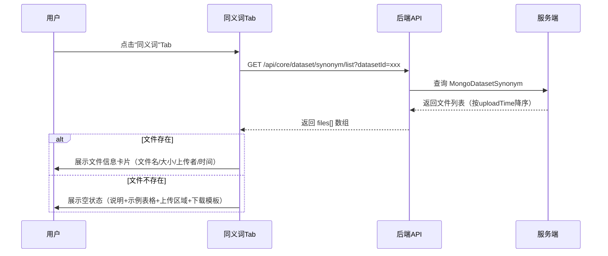
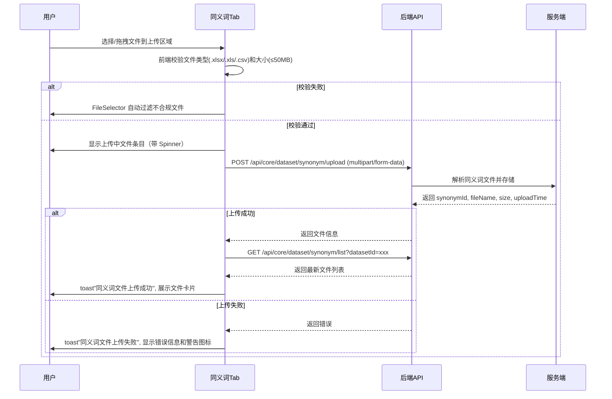
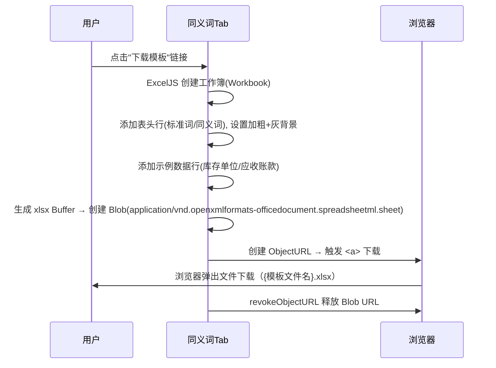
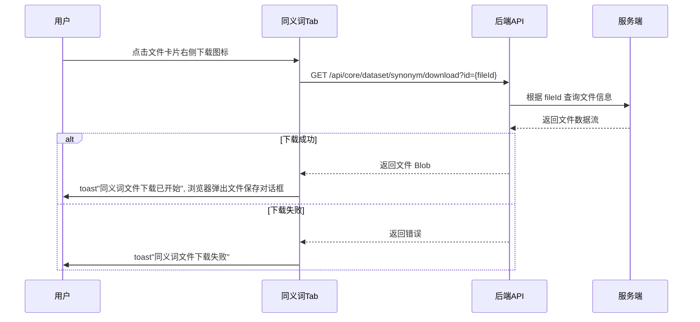
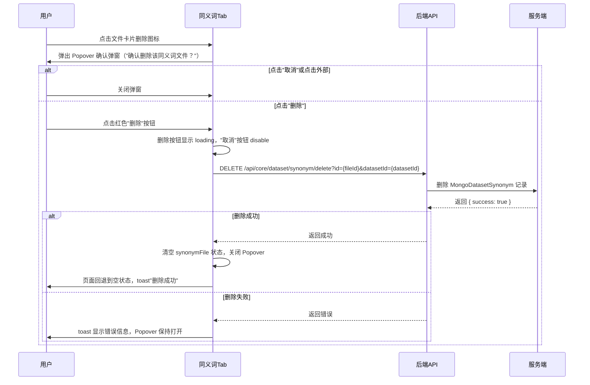

# 同义词管理 — 业务流程详解

## 页面总览

同义词管理 Tab 是数据集详情页的配置子页面。页面核心功能围绕同义词文件的生命周期管理展开：上传映射文件、查看文件信息、下载文件和模板、删除文件。页面根据是否有已上传文件呈现两种不同的 UI 状态（空状态引导上传 / 文件卡片展示）。

### 查看同义词文件

> 进入同义词管理 Tab 后，系统自动查询已上传的同义词文件。如果存在则展示文件信息卡片，否则展示空状态上传引导页面。

#### 步骤 1：页面初始化，加载同义词文件列表

| 用户操作 | 触发 API | 分支条件 | 页面变化 |
|---------|---------|---------|---------|
| 从数据集详情页点击"同义词"Tab | GET `/api/core/dataset/synonym/list?datasetId={id}` | 无分支，组件挂载时必定调用 | 显示 MyBox 的加载动画；API 返回后根据结果切换视图 |

**数据加载详情**：

| 加载阶段 | API | 关键参数 | 数据处理 | 渲染结果 |
|---------|-----|---------|---------|---------|
| 首次加载 | GET /api/core/dataset/synonym/list | datasetId | 取 response.files 数组的第一项 | 有文件→展示文件卡片；无文件→展示空状态 |

- 分页参数：无分页，返回全部同义词文件列表，前端只取第一个
- 排序规则：后端按 uploadTime 降序排序

#### 步骤 2：根据加载结果渲染视图

| 用户操作 | 触发 API | 分支条件 | 页面变化 |
|---------|---------|---------|---------|
| 等待加载完成 | 无 | 加载完成，files 数组为空 | 展示空状态页面：左侧业务说明 + 示例表格（渐变边框）+ "下载模板"链接；右侧 FileSelector 上传区域 |
| 等待加载完成 | 无 | 加载完成，files 数组非空 | 展示文件信息卡片：文件图标 + 文件名 + 大小 + 上传者 + 上传时间 + 操作按钮（下载、删除）；卡片下方显示两条使用提示 |

#### 步骤 3：加载失败处理

| 用户操作 | 触发 API | 分支条件 | 页面变化 |
|---------|---------|---------|---------|
| 进入 Tab | GET /api/core/dataset/synonym/list | API 返回错误 | toast 错误提示"获取同义词文件失败"，显示具体错误描述 |

### Mermaid 附录

---

### 上传同义词文件

> 用户通过拖拽或点击选择 xlsx/xls/csv 格式的同义词文件上传。上传过程中显示实时文件条目和上传进度，上传成功后自动刷新文件列表，失败则显示错误信息。

#### 步骤 1：选择文件并开始上传

| 用户操作 | 触发 API | 分支条件 | 页面变化 |
|---------|---------|---------|---------|
| 将文件拖拽到上传区域 / 点击上传区域选择文件 | 无（前端校验） | 文件类型不在 .xlsx/.xls/.csv 范围内 | FileSelector 自动过滤，不触发后续流程 |
| 将文件拖拽到上传区域 / 点击上传区域选择文件 | 无（前端校验） | 文件大小超过 50MB（autoFilterOverSize=true） | FileSelector 自动过滤超限文件，不触发后续流程 |
| 通过校验的文件被选中 | POST `/api/core/dataset/synonym/upload` | 同时只有一个文件（maxCount=1） | 上传区域切换为文件信息展示；上传区域位置显示文件条目（文件名 + 大小 + 上传时间 + 上传中 Spinner）；按钮区域显示删除 spinner |

**表单字段清单**（上传参数）：

| 字段名 | 控件类型 | 必填 | 默认值 | 可选值/约束 | 编辑时只读 | 说明 |
|--------|---------|------|--------|------------|-----------|------|
| file | 文件选择 | ✅ | — | .xlsx / .xls / .csv，≤ 50MB | — | multipart/form-data 编码 |
| datasetId | 自动填入 | ✅ | 从 Context 获取 | — | ✅ 自动 | 从 DatasetPageContext 获取 |

**前置条件**：已登录且有该数据集的写入权限
**后置影响**：上传成功后自动刷新同义词文件列表

#### 步骤 2：上传处理与结果反馈

| 用户操作 | 触发 API | 分支条件 | 页面变化 |
|---------|---------|---------|---------|
| 等待上传完成 | 同上（POST） | 上传成功 | toast 成功提示"同义词文件上传成功"；自动调用 list API 刷新文件列表；上传状态清除，展示更新后的文件卡片 |
| 等待上传完成 | 同上（POST） | 上传失败 | 文件条目状态变为"失败"（红色警告图标）；显示具体错误信息；toast 错误提示"同义词文件上传失败"；文件条目保留，用户可看到失败原因 |

**校验规则**：

| 规则 | 触发时机 | 错误提示文案 |
|------|---------|-------------|
| 文件大小超过 50MB | 文件选择时（前端校验） | FileSelector 自动过滤 |
| 文件类型不支持 | 文件选择时（前端校验） | FileSelector 自动过滤 |
| 后端处理失败 | 上传时（后端校验） | 显示后端返回的具体错误信息（国际化 key） |

### Mermaid 附录

---

### 下载同义词模板

> 用户点击"下载模板"链接，前端基于 ExcelJS 库实时生成一个 XLSX 格式的模板文件，包含表头和示例数据，通过 Blob URL 触发浏览器下载。

#### 步骤 1：生成并下载模板

| 用户操作 | 触发 API | 分支条件 | 页面变化 |
|---------|---------|---------|---------|
| 点击"下载模板"链接 | 无（纯前端操作） | 无分支 | 浏览器弹出文件下载，文件名格式为 `{翻译后的文件名}.xlsx` |

**前置条件**：页面处于空状态（模板下载链接仅在空状态中可见）

**模板内容**：
- 第一行：表头——"标准词"列（col 1）+ "同义词"列（col 2-6）
- 第二行：示例数据——"库存单位"→"SKU,库存量单位,存货单位"
- 第三行：示例数据——"应收账款"→"应收款,应收票据,应收账"
- 表头样式：加粗、灰色背景

### Mermaid 附录

---

### 下载同义词文件

> 用户点击已上传文件的下载图标，通过后端 API 下载原始同义词文件到本地。

#### 步骤 1：触发文件下载

| 用户操作 | 触发 API | 分支条件 | 页面变化 |
|---------|---------|---------|---------|
| 点击文件卡片右侧的下载图标 | GET `/api/core/dataset/synonym/download?id={fileId}`（通过 downloadFetch 工具函数） | 无分支 | toast 提示"同义词文件下载已开始（文件名）"；浏览器弹出文件下载 |

**前置条件**：存在已上传的同义词文件

#### 步骤 2：下载失败处理

| 用户操作 | 触发 API | 分支条件 | 页面变化 |
|---------|---------|---------|---------|
| 同上 | GET（同上） | 下载失败 | toast 错误提示"同义词文件下载失败" |

### Mermaid 附录

---

### 删除同义词文件

> 用户删除已上传的同义词文件。点击删除图标后弹出 Popover 二次确认弹窗，确认后执行删除，成功后页面回退到空状态。

#### 步骤 1：点击删除按钮，弹出确认弹窗

| 用户操作 | 触发 API | 分支条件 | 页面变化 |
|---------|---------|---------|---------|
| 点击文件卡片右侧删除图标 | 无 | 无分支，必定弹出 | 删除图标左侧弹出 Popover 确认弹窗（宽 318px），显示警告图标 + "确认删除该同义词文件？"（i18n key: dataset:synonym_confirm_delete）+ "取消"按钮 + "删除"按钮（红色） |

#### 步骤 2：用户选择操作

| 用户操作 | 触发 API | 分支条件 | 页面变化 |
|---------|---------|---------|---------|
| 点击"取消"按钮 / 点击 Popover 外部区域 | 无 | — | Popover 关闭，文件卡片恢复原状 |
| 点击"删除"按钮 | DELETE `/api/core/dataset/synonym/delete?id={fileId}&datasetId={datasetId}` | — | "删除"按钮变为 loading 状态（isLoading）；"取消"按钮 disable |

#### 步骤 3：删除结果处理

| 用户操作 | 触发 API | 分支条件 | 页面变化 |
|---------|---------|---------|---------|
| 等待删除完成 | DELETE（同上） | 删除成功 | synonymFile 状态清空（设为 null）；Popover 关闭；页面回退到空状态（展示上传引导页面）；toast 提示"删除成功"（dataset:synonym_delete_success） |
| 等待删除完成 | DELETE（同上） | 删除失败 | Popover 保持打开；useRequest 默认错误处理（toast 显示错误信息） |

**删除链路详情**：
- **引用检查**：无。删除操作直接删除同义词文件记录
- **确认弹窗**：Popover 组件（非 Modal），标题文案来自 `dataset:synonym_confirm_delete`，确认按钮为红色（colorScheme="red"）
- **批量与单条差异**：仅支持单条删除（每次只展示一个文件）
- **级联影响**：删除后知识库将不再应用该同义词映射规则

### Mermaid 附录

