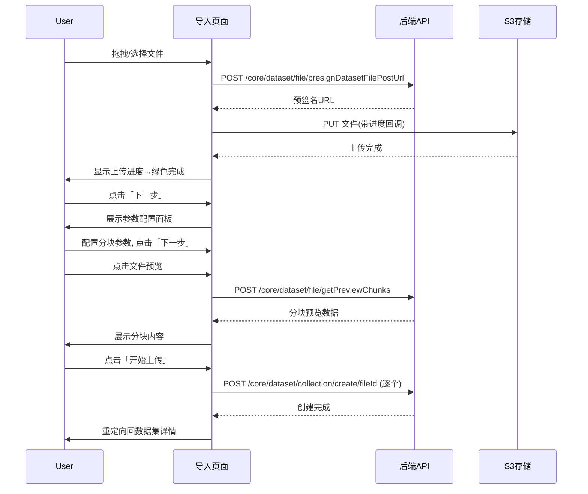
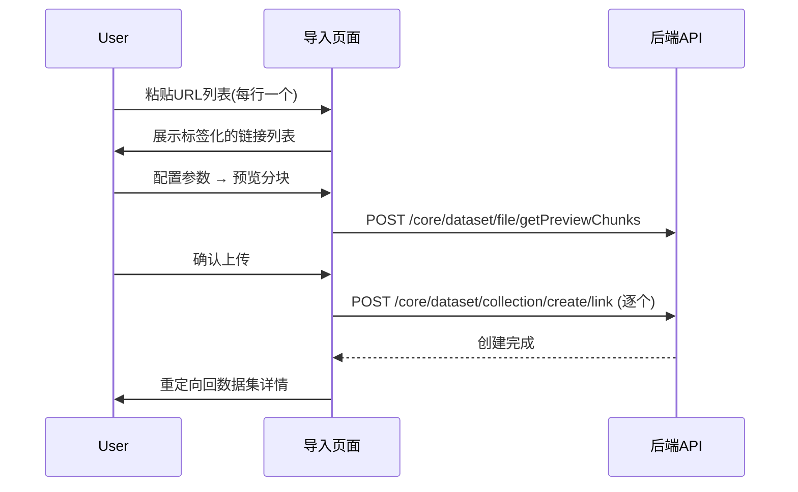
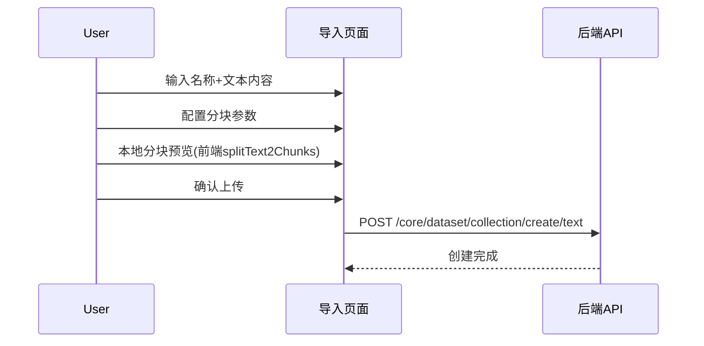
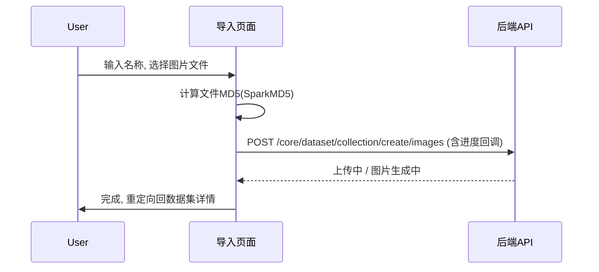
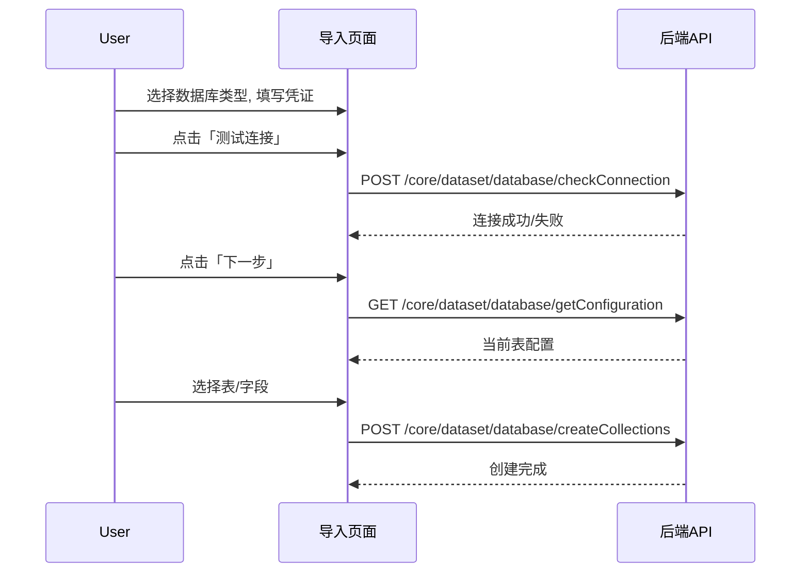
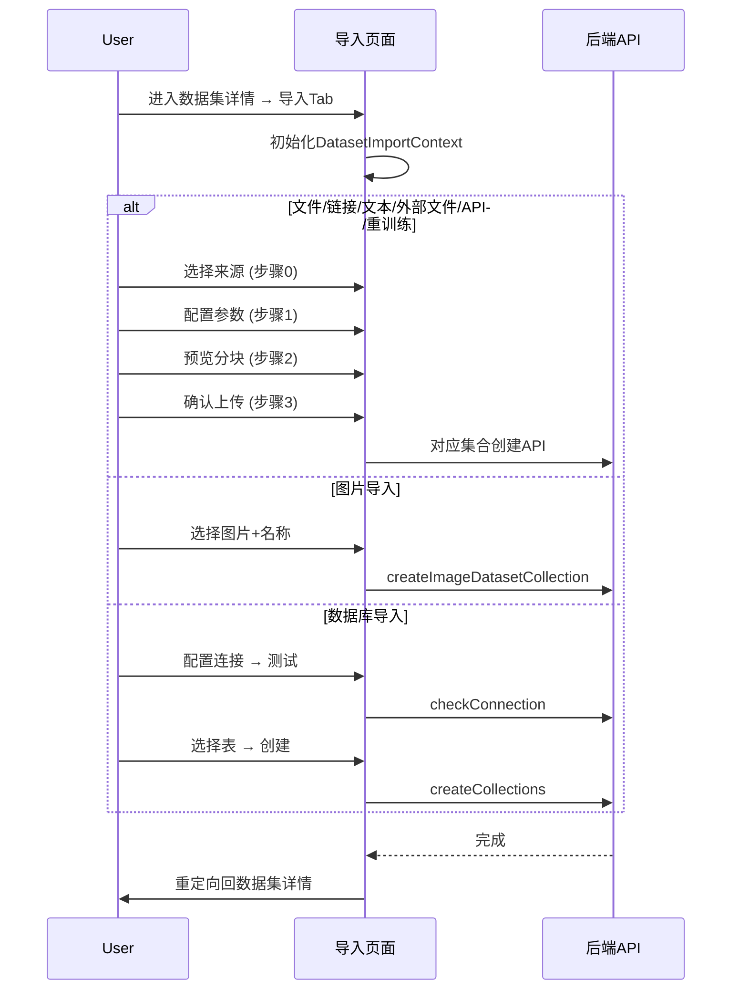

# 导入数据 — 业务流程详解

## 页面总览

导入数据页面采用动态组件渲染模式，根据 URL 参数 `source` 决定当前激活的导入方式。页面外层由 `DatasetImportContextProvider` 提供共享上下文（导入源类型、步骤状态、表单数据、来源列表），内部通过步进式向导引导用户完成"选择来源 → 参数配置 → 数据预览 → 确认上传"的完整流程。

不同导入源的步进步骤数不同（2~4 步），图片导入为简化单页流程，数据库导入有独立的 2 步向导。

---

## 公共业务流程

### 页面初始化

| 步骤 | 用户操作 | 触发 API | 分支条件 | 页面变化 |
|------|---------|---------|---------|---------|
| 1 | 从数据集详情页点击「导入」Tab，或从集合卡片点击「重训练」 | 无 | 若 URL 中有 `source` 参数则直接进入对应导入模式；否则弹出 `FileSourceSelector` 模态框让用户选择（仅列出 fileLocal/fileLink/fileCustom 三种常用模式） | 导航栏隐去其他 Tab，页面切换为导入布局 |
| 2 | 系统初始化 `DatasetImportContext`，根据 `source` 查询参数确定 `modeSteps` 列表 | 无 | `source` 为 `reTraining` 时额外通过 `getDatasetCollectionById` 获取集合详情 | 根据 `source` 展示对应步骤条（3~4 步），底部显示「下一步」按钮 |
| 3 | 若为编辑模式（`mode=edit`），展示 LightRowTabs 横向步骤切换而非纵向步骤条 | 无 | `mode=edit` 时不可回退到上一步 | 步骤切换 UI 展示为横向 Tab 样式 |

### 权限校验

- 页面加载时通过 `DatasetPageContext` 检查当前用户是否具有 `permission.hasManagePer` 权限
- 无权限用户无法看到导入入口（NavBar Tab 列表中不包含 import Tab）
- 上下文初始化从 `router.query` 获取 `source`，未传入时默认值为 `fileLocal`

---

## 本地文件导入

> 业务描述：上传本机文档或图片文件，将其解析并创建为知识库集合。支持批量上传，图片文件走独立的图片创建流程。

### 步骤 1：选择文件

| 用户操作 | 触发 API | 分支条件 | 页面变化 |
|---------|---------|---------|---------|
| 将文件拖拽到上传区域，或点击区域触发系统文件选择器 | 无 | 文件类型不在 `documentAndImageFileType` 允许范围内时，toast 提示不支持的文件格式 | 拖拽区域边框高亮；文件加入待上传列表，每行显示文件名、icon、大小为 0 的进度条 |
| 系统对每个选中文件进行去重（按 name-size-lastModified） | 无 | 若文件已在列表中，跳过不重复添加 | 文件列表动态更新 |
| 点击选择文件区域触发上传（自动） | `getUploadDatasetFilePresignedUrl` (POST) → `putFileToS3` | 图片文件（.jpg/.jpeg/.png）：并行调用 `createImageDatasetCollection` (POST)；文档文件：通过预签名 URL 上传至 S3 | 每个文件行显示上传进度百分比；上传成功后进度条变绿色；失败显示红色标签及错误信息 |
| 上传完成后点击「下一步」 | 无 | 必须至少有一个文档文件上传成功（有 `dbFileId`）才能进入下一步；纯图片文件不满足条件时按钮置灰 | 按钮显示已选文件总数 |

**数据加载详情**：
- 文件大小限制：取 `teamPlanStatus.standard.maxUploadFileSize` 与 `feConfigs.uploadFileMaxSize` 的较大值，默认 500MB
- 图片文件通过 `SparkMD5` 流式计算 MD5 用于去重
- 上传进度通过 `onUploadProgress` 回调实时更新百分比

### 步骤 2：参数配置（DataProcess）

| 用户操作 | 触发 API | 分支条件 | 页面变化 |
|---------|---------|---------|---------|
| 系统展示「数据处理设置」折叠面板 | 无 | `feConfigs.showCustomPdfParse` 为 true 时才显示「文件解析设置」区段 | 展示 PDF 增强解析开关（含价格标签）、数据处理设置面板 |
| 用户勾选「PDF 增强解析」 | 无 | 该开关值被存储到 `localStorage` 的 `dataset_customPdfParse` 键 | 勾选状态更新 |
| 用户配置分块策略、索引设置等 | 无 | 分块参数通过 `CollectionChunkForm` 表单组件配置，支持自动/手动分块模式 | 表单值绑定到 `processParamsForm` |
| 点击「下一步」 | 无 | — | 进入数据预览步骤 |

**表单字段清单**：
| 字段名 | 控件类型 | 必填 | 默认值 | 可选值/约束 | 说明 |
|--------|---------|------|--------|------------|------|
| 训练方式 | 下拉选择 | ✅ | chunk | chunk / qa / auto / image 等 | 决定数据如何处理 |
| 分块触发类型 | 下拉 | ✅ | minSize | minSize / maxSize | 触发分块的条件 |
| 分块触发阈值 | 数字输入 | ✅ | 自动计算值 | — | chunkTriggerMinSize |
| 分块大小 | 数字输入 | ✅ | 自动计算值 | — | chunkSize |
| 分隔符 | 文本输入 | 否 | 空 | 自定义正则 | chunkSplitter |
| 索引大小 | 数字输入 | ✅ | 自动计算值 | — | indexSize |

### 步骤 3：数据预览（PreviewData）

| 用户操作 | 触发 API | 分支条件 | 页面变化 |
|---------|---------|---------|---------|
| 左侧文件列表展示所有选中的文件来源 | 无 | — | 文件列表以卡片形式展示，含文件图标和名称 |
| 点击某个文件 | `getPreviewChunks` (POST) — 传入 `datasetId`、`type=fileLocal`、`sourceId`、分块参数 | 文件夹类型项点击时 toast 警告「不支持预览文件夹」 | 右侧区域加载中动画 → 展示分块预览列表，每块显示内容文本；顶部分块总数更新 |
| 分块为空时 | 同上 | `result.total === 0` 时 toast 提示「预览分块为空」 | 右侧区域无内容或显示空状态 |
| 确认预览结果后点击「下一步」 | 无 | — | 进入上传确认步骤 |

### 步骤 4：上传确认（Upload）

| 用户操作 | 触发 API | 分支条件 | 页面变化 |
|---------|---------|---------|---------|
| 系统展示所有待创建集合的列表 | 无 | 列出所有 `createStatus === 'waiting'` 的来源 | 表格显示：来源名称 + 状态标签（等待中） |
| 点击「开始上传」 | `postCreateDatasetFileCollection` (POST) — 逐个创建，参数含 `fileId`、分块参数、数据集 ID | 每个来源依次处理：`waiting` → `creating` → `finish`；失败则标记 `errorMsg` 并跳过 | 按钮文字变为「继续上传」；状态标签实时更新（等待中/创建中/已完成/错误） |
| 全部处理完成后点击「完成」 | 无 | 所有 `createStatus !== 'waiting'` 时按钮变为「完成」 | 重定向回数据集详情页 `currentTab=collectionCard` |

### Mermaid 附录

---

## 网页链接导入

> 业务描述：通过粘贴网页 URL 导入在线网页内容，系统自动抓取并解析为知识库集合。

### 步骤 1：输入链接

| 用户操作 | 触发 API | 分支条件 | 页面变化 |
|---------|---------|---------|---------|
| 在文本框中粘贴一个或多个 URL（每行一个） | 无 | 非 HTTP/HTTPS 开头的行被忽略 | 有效链接解析为标签展示，每个标签可单独删除 |
| 可选：在 CSS 选择器输入框中填写内容定位规则 | 无 | — | 选择器值存入 `webSelector` 字段 |
| 点击「下一步」 | 无 | 至少要有一个有效链接 | 进入参数配置步骤 |

### 步骤 2~4：参数配置 → 预览 → 上传

后续步骤与本地文件导入的步骤 2~4 相同，上传步骤调用 `postCreateDatasetLinkCollection` (POST) 逐条创建。

### Mermaid 附录

---

## 自定义文本导入

> 业务描述：手动输入文本内容，直接作为知识库数据来源。

### 步骤 1：输入文本

| 用户操作 | 触发 API | 分支条件 | 页面变化 |
|---------|---------|---------|---------|
| 输入集合名称（必填）和文本内容 | 无 | 两者均不能为空 | 输入框和文本域展示 |
| 点击「下一步」 | 无 | — | 进入参数配置步骤 |

### 步骤 2~4：参数配置 → 预览 → 上传

步骤 2（参数配置）中，文本导入的预览步骤在前端本地完成分块（使用 `splitText2Chunks` 函数），无需调用后端 `getPreviewChunks` API。上传步骤调用 `postCreateDatasetTextCollection` (POST)，传入 `rawText` 和分块参数。

### Mermaid 附录

---

## 外部文件导入

> 业务描述：通过外部文件 URL 导入文件，每行填写一个外部文件的信息。

### 步骤 1：输入外部文件信息

| 用户操作 | 触发 API | 分支条件 | 页面变化 |
|---------|---------|---------|---------|
| 在动态表格中填写每行：`externalFileUrl`、`externalFileId`、`filename` | 无 | 末尾行填写后自动新增空行；URL 含扩展名时自动提取文件名 | 表格行动态增减 |
| 点击「下一步」 | 无 | 过滤掉 URL 为空的行后至少有一条有效记录 | 进入参数配置步骤 |

后续步骤调用 `postCreateDatasetExternalFileCollection` (POST) 逐条创建集合。

---

## API 数据集导入

> 业务描述：从已对接的外部 API 数据源浏览并选择文件/文件夹导入。

### 步骤 1：浏览并选择 API 文件

| 用户操作 | 触发 API | 分支条件 | 页面变化 |
|---------|---------|---------|---------|
| 页面加载 | `getApiDatasetFileList` (POST) — 获取当前目录文件列表 | 首次加载默认根目录 | 展示文件/文件夹列表，含 checkbox、类型图标、名称 |
| 点击文件夹行 | `getApiDatasetFileList` (POST) — 传入新的 `parentId` | — | 展开进入子目录，面包屑导航更新 |
| 勾选文件/文件夹 | 无 | 已存在于数据集中的文件标记为禁用（通过 `getApiDatasetFileListExistId` 获取） | checkbox 勾选/取消 |
| 点击面包屑返回上级 | 同点击文件夹 | — | 返回上级目录 |
| 点击「下一步」 | 无 | — | 进入参数配置步骤 |

### 步骤 2~4：参数配置 → 预览 → 上传

上传步骤调用 `postCreateDatasetApiDatasetCollectionV2` (POST)，批量提交选中的 `apiFiles` 数组。

---

## 重训练

> 业务描述：对已有集合重新进行数据处理和训练。

### 步骤 1：加载已有集合

| 用户操作 | 触发 API | 分支条件 | 页面变化 |
|---------|---------|---------|---------|
| 页面加载 | `getDatasetCollectionById` (GET) — 获取指定集合详情 | URL 参数中需传入 `collectionId` | 加载动画覆盖页面 |
| 集合数据返回 | 无 | 将集合的现有训练参数回填到 `processParamsForm` 中（分块设置、索引配置、QA Prompt 等） | 表单值重置为已有集合的配置 |

### 步骤 2~3：参数调整 → 预览 → 上传

重训练为 3 步流程（不含文件选择步骤）。上传步骤调用 `postReTrainingDatasetFileCollection` (POST) 重新创建训练任务。

---

## 图片数据集导入

> 业务描述：上传图片文件，创建图片类型的知识库集合。此流程为简化的单页模式，不经过分步向导。

### 步骤流程

| 用户操作 | 触发 API | 分支条件 | 页面变化 |
|---------|---------|---------|---------|
| 输入集合名称，选择图片文件 | 无 | 仅接受 `.jpg`、`.jpeg`、`.png` 格式 | 文件选择器展示；图片以 100×100 缩略图网格预览，hover 可删除 |
| 实时显示上传进度 | `createImageDatasetCollection` (POST) — 含 `files`、`fileMd5`（SparkMD5 流式计算）、进度回调 | 文件数量不超过团队套餐限制 | 进度文字更新（"上传中 (n/总数)" → "图片生成中"） |
| 上传完成 | 无 | — | 自动重定向回数据集详情页 `currentTab=collectionCard` |

**特点**：图片导入不经过 DataProcess（无分块配置）和 PreviewData（图片无需文本预览）步骤。

### Mermaid 附录

---

## 数据库直连导入

> 业务描述：配置数据库连接，选择表和字段，将结构化数据映射为知识库。

### 步骤 1：数据库连接配置

| 用户操作 | 触发 API | 分支条件 | 页面变化 |
|---------|---------|---------|---------|
| 选择数据库类型（MySQL/PostgreSQL/MSSQL/Oracle） | 无 | 切换类型时自动更新默认端口和数据库名 | 类型卡片高亮选中 |
| 填写 host/port/db/user/password/schema（条件显示）/poolSize | 无 | host 不可为 localhost/127.x.x.x/0.0.0.0/::1（`databaseAddrValidator`）；端口范围 1-65535；poolSize 1-100 | 各字段实时校验 |
| 点击「测试连接」 | `postCheckDatabaseConnection` (POST) — 传入连接参数 | 编辑模式下不显示测试按钮 | 连接成功/失败 toast 提示 |
| 测试通过后点击「下一步」 | 无 | 编辑模式：若在步骤 0，通过 `putDatasetById` (PUT) 更新数据集配置后进入下一步 | 进入表选择步骤 |

**表单字段清单**：
| 字段名 | 控件类型 | 必填 | 默认值 | 约束 | 说明 |
|--------|---------|------|--------|------|------|
| 数据库类型 | 卡片选择 | ✅ | MySQL | MySQL/PostgreSQL/MSSQL/Oracle | 编辑模式下只读 |
| 主机地址 | 文本输入 | ✅ | — | 不可为 localhost 等 | 含格式提示 tooltip |
| 端口 | 数字输入 | ✅ | 随类型自动更新 | 1-65535 | — |
| 数据库名 | 文本输入 | ✅ | — | — | 每种类型默认值不同 |
| 用户名 | 文本输入 | ✅ | — | — | — |
| 密码 | 密码输入 | ✅ | — | — | 可切换可见性 |
| Schema | 文本输入 | 条件 | — | 仅部分数据库类型显示 | — |
| 连接池大小 | 数字输入 | ✅ | — | 1-100 | — |

### 步骤 2：表选择与配置

| 用户操作 | 触发 API | 分支条件 | 页面变化 |
|---------|---------|---------|---------|
| 页面加载 | `postGetDatabaseConfiguration` (GET) — 获取当前已配置的表 | 若无已配置表，展示空状态 | 表配置列表 |
| 选择要导入的表和字段 | `postDetectDatabaseChanges` (POST) — 检测数据库变更 | 编辑模式下检测到变更时高亮提示 | 表/字段选择面板 |
| 确认配置后提交 | `postCreateDatabaseCollections` (POST) 或 `postUpdateDatasetCollectionConfigByDatabase` (POST) — 根据新建/编辑模式 | 新建模式调用 create；编辑模式调用 applyChanges | 创建/更新成功提示 |

### Mermaid 附录

---

## 全局 Mermaid 附录

