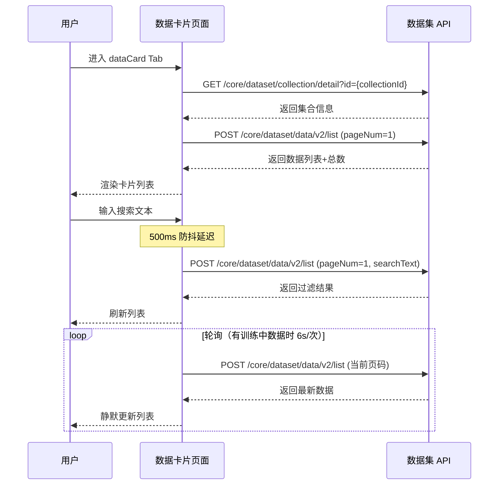
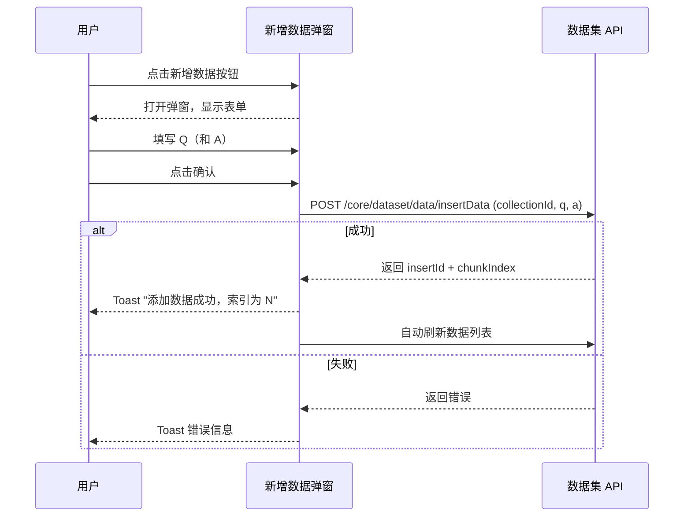
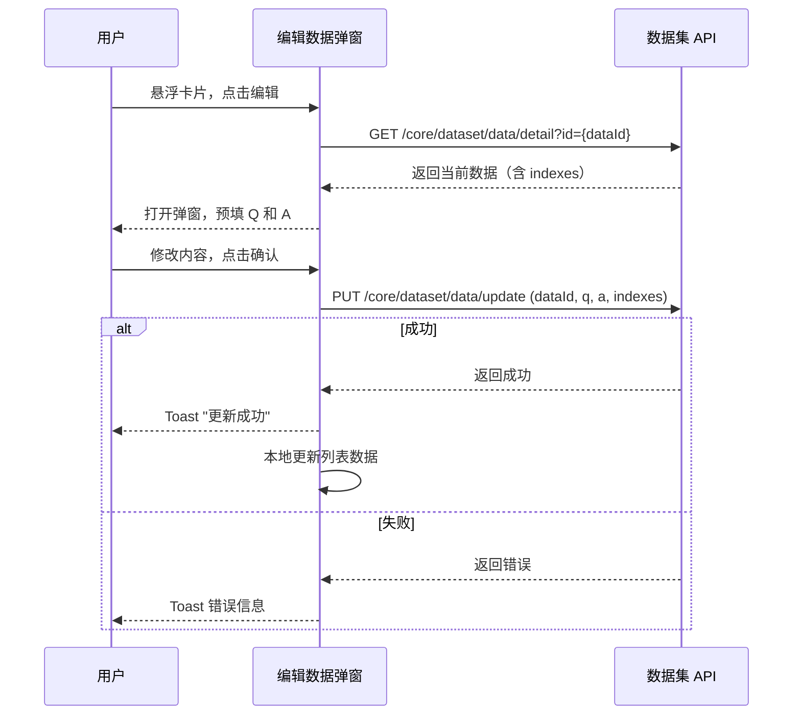
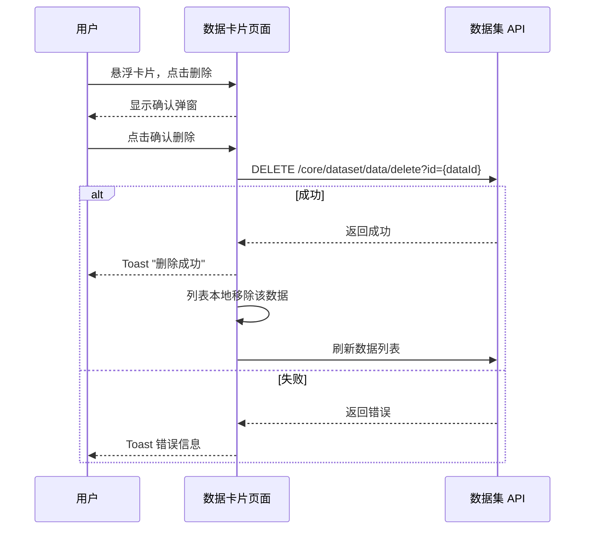
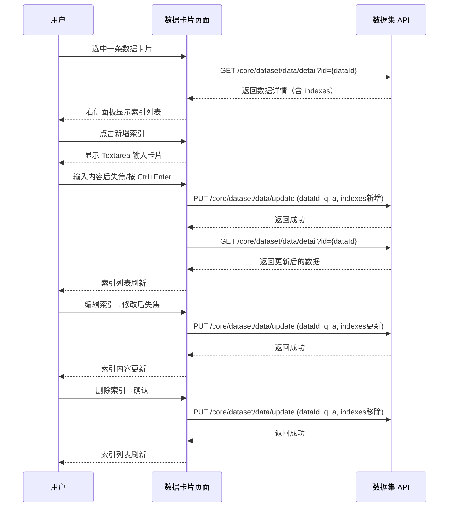
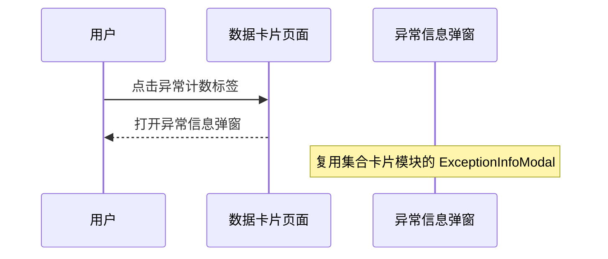
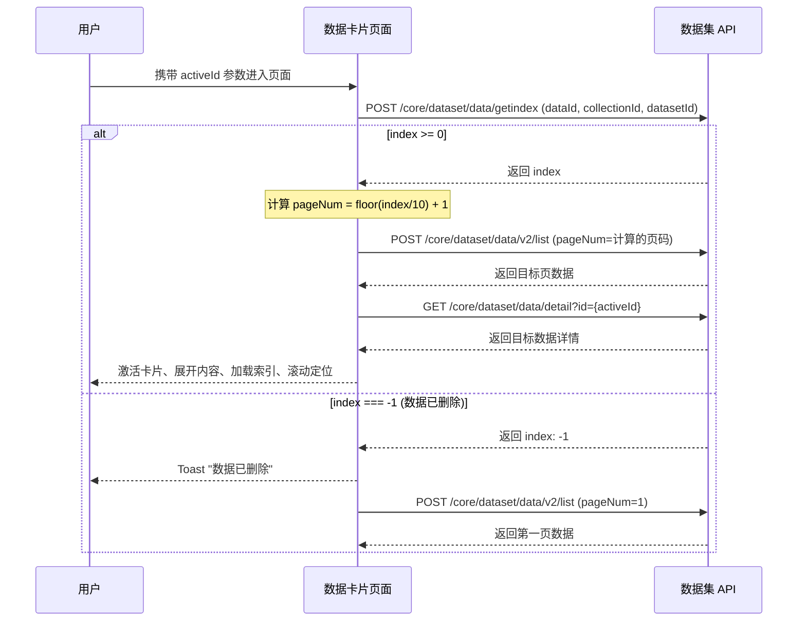
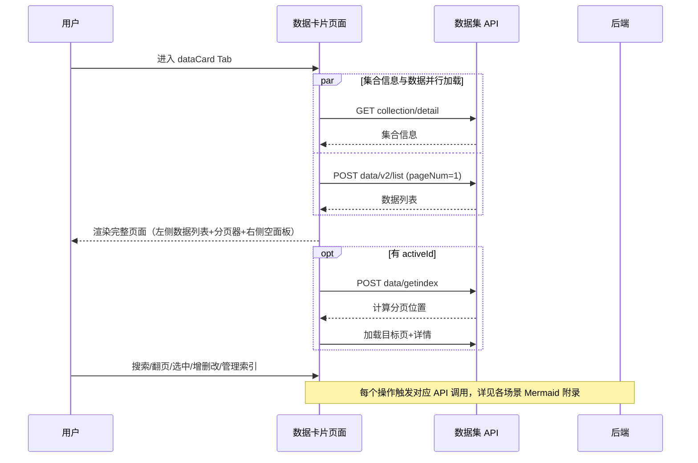

# 数据卡片 — 业务流程详解

## 页面总览

数据卡片页采用**左右分栏布局**：左侧为数据列表区域（搜索栏 + 分页卡片列表），右侧为索引内容面板（固定 470px 宽度，显示选中数据的索引列表）。页面通过路由参数接收 `datasetId`、`collectionId` 和可选的 `activeId`。

数据卡片内部**无嵌套 Tab**，所有功能均在同一页面内通过交互切换完成。

---

## S01：浏览数据列表

> 在数据集详情页中查看当前集合的数据分页列表，支持搜索过滤、卡片折叠展开，以及选中数据项查看详情。

### 步骤 1：页面初始化与数据加载

| 用户操作 | 触发 API | 分支条件 | 页面变化 |
|---------|---------|---------|---------|
| 从集合卡片页点击集合进入 dataCard Tab | `GET /core/dataset/collection/detail?id={collectionId}`（获取集合信息） | — | 页面加载，显示搜索栏骨架 |
| 页面自动触发首次数据加载 | `POST /core/dataset/data/v2/list`（获取数据分页列表，参数含 collectionId、searchText=""、pageNum=1、pageSize=10） | — | 左侧列表区域显示加载中状态，随后渲染数据卡片列表 |
| 查看数据列表 | — | `canWrite` 为 true 时，搜索栏右侧显示"新增数据"按钮；集合训练类型为图片解析时，不显示"新增数据"按钮 | 数据列表以卡片形式展示，每张卡片显示序号、字符数、数据内容 |

### 步骤 2：搜索数据

| 用户操作 | 触发 API | 分支条件 | 页面变化 |
|---------|---------|---------|---------|
| 在搜索框中输入搜索关键字 | — | 输入后有 500ms 防抖延迟 | 搜索框显示输入内容 |
| 防抖结束，搜索文本发生变化 | `POST /core/dataset/data/v2/list`（参数含新 searchText，pageNum 重置为 1） | — | 列表刷新，显示匹配搜索结果；无结果时显示空状态提示 |

### 步骤 3：翻页浏览

| 用户操作 | 触发 API | 分支条件 | 页面变化 |
|---------|---------|---------|---------|
| 点击分页器切换页码或修改每页条数 | `POST /core/dataset/data/v2/list`（参数含新 pageNum / pageSize） | — | 列表刷新，显示新分页数据；页面滚动到列表顶部 |
| 切换每页条数（10/20/50/100） | 同上 | — | 列表按照新条数重新分页展示 |

### 步骤 4：折叠/展开数据卡片

| 用户操作 | 触发 API | 分支条件 | 页面变化 |
|---------|---------|---------|---------|
| 点击已展开卡片的折叠按钮 | — | — | 卡片收起，仅显示序号和字符数行，内容区域隐藏，卡片变为可点击模式 |
| 点击已折叠的卡片 | — | 该卡片非当前激活卡片时，自动激活并展开 | 卡片展开显示完整内容，同时右侧面板加载该数据的索引详情 |

### 步骤 5：选中卡片查看详情

| 用户操作 | 触发 API | 分支条件 | 页面变化 |
|---------|---------|---------|---------|
| 点击未激活的数据卡片 | `GET /core/dataset/data/detail?id={dataId}`（获取数据详情含索引列表） | — | 右侧面板显示加载中状态 → 加载完成后显示索引列表；卡片高亮（蓝色边框+背景色） |
| 点击已激活的折叠卡片 | — | 卡片已折叠时自动展开 | 卡片展开，不重新加载详情 |
| 数据项处于训练中状态 | — | activeDataDetail.trainingStatus === 'training' | 右侧面板显示构建动画和"正在重建索引，暂不可编辑"提示 |

### 步骤 6：训练状态轮询

| 用户操作 | 触发 API | 分支条件 | 页面变化 |
|---------|---------|---------|---------|
| 列表中有数据处于 training 状态 | `POST /core/dataset/data/v2/list`（每 6 秒轮询） | hasTrainingData 为 true 时自动轮询 | 数据静默刷新，不显示加载遮罩；训练完成后卡片恢复编辑按钮可用状态 |
| 当前激活卡片的训练状态变更 | `GET /core/dataset/data/detail?id={activeCardId}` | 列表数据中 activeCardId 对应项的 trainingStatus 发生变化 | 右侧面板重新加载数据详情 |

### 数据加载详情

| 加载阶段 | API | 关键参数 | 数据处理 | 渲染结果 |
|---------|-----|---------|---------|---------|
| 首次加载 | POST /core/dataset/data/v2/list | collectionId, searchText="", pageNum=1, pageSize=10 | 无额外处理 | 数据卡片列表前 10 条 |
| 搜索 | POST /core/dataset/data/v2/list | collectionId, searchText, pageNum=1, pageSize=10 | 重置到第一页 | 过滤后的数据卡片列表 |
| 翻页 | POST /core/dataset/data/v2/list | collectionId, pageNum=N, pageSize=X | 无额外处理 | 第 N 页数据 |
| 轮询刷新 | POST /core/dataset/data/v2/list | 同上一次请求参数 | 静默更新，不显示遮罩 | 数据列表更新 |
| 数据详情 | GET /core/dataset/data/detail | id=dataId | 过滤掉 type 为 'default' 的索引项 | 右侧面板索引列表 |

- **分页参数**：默认每页 10 条，可选 10/20/50/100
- **排序规则**：按插入顺序排列（chunkIndex）
- **筛选条件**：搜索框输入搜索文本，后端全文搜索

### Mermaid 附录

---

## S02：新增数据

> 在当前集合中添加一条新的数据内容（文本或 FAQ 问答对）。

### 步骤 1：打开新增弹窗

| 用户操作 | 触发 API | 分支条件 | 页面变化 |
|---------|---------|---------|---------|
| 点击"新增数据"按钮 | — | canWrite 为 true 且集合训练类型非图片解析 | 弹出编辑内容弹窗 |
| canWrite 为 false 或训练类型为图片解析 | — | 按钮不显示 | 无法触发新增 |

### 步骤 2：填写内容

| 用户操作 | 触发 API | 分支条件 | 页面变化 |
|---------|---------|---------|---------|
| FAQ 模式（template 训练类型）：在 Question 输入框填写问题 | — | — | 输入内容 |
| FAQ 模式：在 Answer 输入框填写回答 | — | — | 输入内容，Answer 为必填 |
| 普通模式：在内容输入框填写文本（支持 Markdown） | — | — | 输入内容，Question 为必填 |
| 图片解析模式（imageParse）：左侧预览图片，右侧填写描述 | — | 此模式下弹窗布局为左右分栏 | 左侧显示图片，右侧为描述输入框 |

### 步骤 3：提交新增

| 用户操作 | 触发 API | 分支条件 | 页面变化 |
|---------|---------|---------|---------|
| 点击确认按钮 | `POST /core/dataset/data/insertData`（参数含 collectionId, q, a） | 表单校验通过 | 确认按钮显示加载中状态 → 成功后弹窗关闭 → 列表自动刷新 |
| 提交失败 | — | 后端返回错误 | 显示错误 Toast 提示，弹窗保持打开 |

### 表单字段清单

| 字段名 | 控件类型 | 必填 | 默认值 | 可选值/约束 | 编辑时只读 | 说明 |
|--------|---------|------|--------|------------|-----------|------|
| q（问题/内容） | Textarea | ✅ | "" | 支持 Markdown | — | FAQ 模式下为问题，普通模式下为内容 |
| a（回答） | Textarea | FAQ 模式下必填 | "" | 支持 Markdown | — | 仅 FAQ 模式显示，普通模式不显示 |

**校验规则**：

| 规则 | 触发时机 | 错误提示文案 |
|------|---------|-------------|
| q 字段必填 | 提交时（react-hook-form required 校验） | 表单校验阻止提交 |
| a 字段 FAQ 模式下必填 | 提交时 | 表单校验阻止提交 |
| 后端插入失败 | 提交时（后端校验） | 对应错误信息 Toast |

### Mermaid 附录

---

## S03：编辑数据

> 编辑已有数据的 Q（问题/内容）和 A（回答）字段。

### 步骤 1：打开编辑弹窗

| 用户操作 | 触发 API | 分支条件 | 页面变化 |
|---------|---------|---------|---------|
| 鼠标悬停数据卡片，点击编辑按钮 | — | canWrite 为 true 且数据非训练中状态 | 弹出编辑内容弹窗，预填当前 Q 和 A |
| 数据正在训练中 | — | trainingStatus === 'training' | 编辑按钮置灰不可点击，Tooltip 提示"训练中不可编辑" |

### 步骤 2：加载当前数据详情

| 用户操作 | 触发 API | 分支条件 | 页面变化 |
|---------|---------|---------|---------|
| 弹窗打开（编辑模式） | `GET /core/dataset/data/detail?id={dataId}`（自动触发） | 仅编辑模式 | 获取当前数据完整信息（含 indexes），用于提交时保留索引 |

### 步骤 3：修改并提交

| 用户操作 | 触发 API | 分支条件 | 页面变化 |
|---------|---------|---------|---------|
| 修改 Q 或 A | — | — | 表单内容变更 |
| 点击确认 | `PUT /core/dataset/data/update`（参数含 dataId, q, a, indexes） | 表单校验通过 | 确认按钮加载中 → 成功后弹窗关闭 → 列表更新本地数据 → 若编辑的是当前激活卡片，右侧详情刷新 |
| 提交失败 | — | 后端返回错误 | 显示错误 Toast，弹窗保持打开 |

### 表单字段清单

同 S02 新增数据的字段清单，编辑模式下 Q 和 A 预填当前值。

### Mermaid 附录

---

## S04：删除数据

> 删除单条数据，删除后自动刷新列表。

### 步骤 1：触发删除确认

| 用户操作 | 触发 API | 分支条件 | 页面变化 |
|---------|---------|---------|---------|
| 鼠标悬停数据卡片，点击删除按钮 | — | canWrite 为 true | 显示删除确认弹窗 |

### 步骤 2：确认删除

| 用户操作 | 触发 API | 分支条件 | 页面变化 |
|---------|---------|---------|---------|
| 在确认弹窗中点击确认 | `DELETE /core/dataset/data/delete?id={dataId}` | — | 删除执行中 → 列表本地移除该项 → 刷新列表数据 |
| 点击取消 | — | — | 弹窗关闭，不执行删除 |

### 删除链路详情

- **确认弹窗**：FAQ 模式下提示文案为"确认删除该 FAQ"，普通模式下为"确认删除该分块"
- **级联影响**：删除后列表从本地状态中过滤掉该项，同时触发列表刷新以同步后端数据；若删除的是当前激活卡片，右侧详情面板自动切换到列表第一条数据

### Mermaid 附录

---

## S05：管理索引内容

> 查看、新增、编辑、删除某条数据关联的内容索引。

### 步骤 1：查看索引列表

| 用户操作 | 触发 API | 分支条件 | 页面变化 |
|---------|---------|---------|---------|
| 选中一条数据卡片 | `GET /core/dataset/data/detail?id={dataId}` | — | 右侧面板显示该数据的索引列表（过滤掉 type 为 'default' 的索引） |
| 索引列表为空 | — | filteredIndexes.length === 0 | 右侧面板显示"暂无索引"空状态提示 |

### 步骤 2：新增索引

| 用户操作 | 触发 API | 分支条件 | 页面变化 |
|---------|---------|---------|---------|
| 点击"新增索引"按钮 | — | canWrite 为 true 且当前数据非训练中状态 | 索引列表顶部出现新的空输入卡片，Textarea 自动聚焦 |
| 输入索引内容后失焦 | `PUT /core/dataset/data/update`（参数含 dataId, q, a, indexes 追加新索引） | 内容非空时自动保存 | 输入卡片显示保存中状态 → 保存成功 Toast → 输入卡片消失 → 索引列表刷新 |
| 输入为空后失焦 | — | 内容为空 | 输入卡片消失，不保存 |
| 按 Escape | — | — | 取消新增，输入卡片消失 |
| 按 Ctrl/Cmd+Enter | `PUT /core/dataset/data/update`（同失焦自动保存） | 内容非空时保存 | 同上自动保存流程 |

### 步骤 3：编辑索引

| 用户操作 | 触发 API | 分支条件 | 页面变化 |
|---------|---------|---------|---------|
| 点击索引卡片的编辑按钮 | — | canWrite 为 true | 索引卡片切换为 Textarea 编辑模式，内容可选 |
| 修改内容后失焦 | `PUT /core/dataset/data/update`（参数含 updatedIndexes） | 内容有变更时保存 | 保存成功后 Textarea 关闭，显示新内容 |
| 修改内容后按 Ctrl/Cmd+Enter | 同上 | 内容有变更时 | 同上 |
| 按 Escape | — | — | 放弃编辑，恢复原内容，退出编辑模式 |

### 步骤 4：删除索引

| 用户操作 | 触发 API | 分支条件 | 页面变化 |
|---------|---------|---------|---------|
| 点击索引卡片的删除按钮 | — | canWrite 为 true | 显示删除确认弹窗 |
| 确认删除 | `PUT /core/dataset/data/update`（参数含移除目标索引后的 indexes） | — | 删除成功 Toast → 索引列表刷新（自动重新加载数据详情） |

### Mermaid 附录

---

## S06：查看异常数据

> 当集合中存在错误数据时，查看异常数据详情。

### 步骤 1：触发异常查看

| 用户操作 | 触发 API | 分支条件 | 页面变化 |
|---------|---------|---------|---------|
| 点击搜索栏中的红色异常计数标签 | — | collection.errorCount > 0 时显示标签 | 打开异常信息弹窗（ExceptionInfoModal） |
| errorCount 为 0 | — | — | 异常标签不显示 |

### Mermaid 附录

---

## S07：通过 activeId 定位数据

> 从其他页面携带 `activeId` 参数进入，自动计算分页位置并定位到目标数据。

### 步骤 1：计算目标分页

| 用户操作 | 触发 API | 分支条件 | 页面变化 |
|---------|---------|---------|---------|
| 从外部入口（如搜索结果）携带 activeId 进入数据卡片页 | `POST /core/dataset/data/getindex`（参数含 dataId, collectionId, datasetId） | activeId 存在时自动触发 | 页面显示加载中状态，计算目标分页 |
| 目标数据已被删除 | — | index 返回 -1 | Toast 警告"数据已删除" → 正常加载第一页 |

### 步骤 2：加载目标页并定位

| 用户操作 | 触发 API | 分支条件 | 页面变化 |
|---------|---------|---------|---------|
| 计算完成后自动执行 | `POST /core/dataset/data/v2/list`（pageNum=计算出的页码） | — | 列表加载目标页数据 |
| 列表加载完成后 | — | 目标数据在当前列表中 | 自动激活该卡片（高亮+展开）→ 加载其详情 → 100ms 后滚动到目标卡片位置 |
| 用户手动选中其他卡片后 | — | hasProcessedActiveId 已设为 true | activeId 不再覆盖用户选择 |

### Mermaid 附录

---

## Mermaid 附录（页面级总览）

