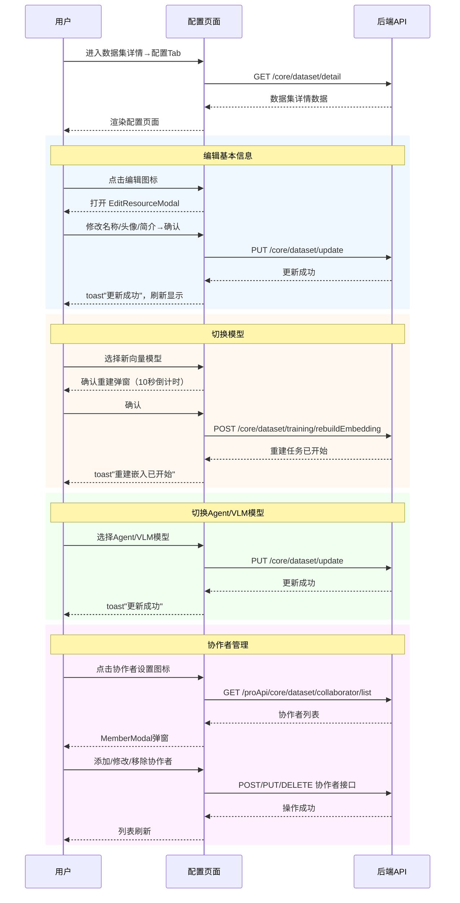

# 数据集配置 — 业务流程详解

## 页面总览

数据集配置页是数据集详情页的核心配置入口。页面加载时从 DatasetPageContext 获取数据集详情数据，渲染一个包含基本信息展示区和可配置参数区的表单。配置项根据数据集类型、系统功能开关和用户权限动态显隐。

---

### S01: 查看数据集配置

> 业务描述：用户进入数据集配置Tab，查看数据集的基本信息、ID、模型配置、同步状态等。

#### 步骤 1：页面加载与数据获取

| 用户操作 | 触发 API | 分支条件 | 页面变化 |
|---------|---------|---------|---------|
| 从数据集详情页切换到"配置"Tab | GET /core/dataset/detail（由 DatasetPageContext 在父级加载） | 无 | 页面渲染数据集名称、头像、简介、类型标签；下方按数据集类型逐步渲染各配置区 |

**数据加载详情**：

| 加载阶段 | API | 关键参数 | 数据处理 | 渲染结果 |
|---------|-----|---------|---------|---------|
| 首次加载 | GET /core/dataset/detail | datasetId | DatasetPageContext 更新 datasetDetail 状态 | Info 组件通过 useContextSelector 获取并渲染 |
| 轮询刷新 | GET /core/dataset/detail | datasetId（状态为 syncing/waiting 时每10秒） | 静默更新 datasetDetail，不显示遮罩 | 页面数据静默刷新 |

#### 步骤 2：分区渲染配置项

| 用户操作 | 触发 API | 分支条件 | 页面变化 |
|---------|---------|---------|---------|
| 滚动浏览配置页 | 无（纯前端渲染） | 数据集类型 = database 且有 clientType → 显示数据库类型行 | 依次展示：数据集ID → 数据库类型（条件） → 向量模型 → Agent模型 → VLM模型 → 同步计划 → 外部读取地址/API配置/语雀/飞书（条件） → 协作者管理（条件） |

---

### S02: 编辑数据集基本信息

> 业务描述：管理员点击编辑图标，在弹出的编辑资源弹窗中修改数据集名称、头像或简介。

#### 步骤 1：打开编辑弹窗

| 用户操作 | 触发 API | 分支条件 | 页面变化 |
|---------|---------|---------|---------|
| 点击名称旁的编辑图标 | 无 | hasManagePer = true 时编辑图标可见 | EditResourceModal 弹窗打开，表单预填当前名称、头像、简介 |

#### 步骤 2：修改并提交

| 用户操作 | 触发 API | 分支条件 | 页面变化 |
|---------|---------|---------|---------|
| 修改名称/头像/简介后点击确认 | PUT /core/dataset/update（通过 updateDataset context 方法） | 无 | 弹窗关闭；成功 toast "更新成功"；页面名称/头像/简介即时更新 |

**表单字段清单**：

| 字段名 | 控件类型 | 必填 | 默认值 | 约束 | 编辑时只读 | 说明 |
|--------|---------|------|--------|------|-----------|------|
| 名称 | 文本输入 | 是 | 当前名称 | — | 否 | 数据集显示名称 |
| 头像 | 图片上传 | 否 | 当前头像 | — | 否 | 数据集头像 |
| 简介 | 文本输入 | 否 | 当前简介 | — | 否 | 数据集描述信息 |

**后置影响**：更新成功后 datasetDetail 状态即时刷新，页面展示更新后的信息。

---

### S03: 切换向量模型并重建索引

> 业务描述：管理员从下拉列表中选择新的向量模型，确认后系统重建数据集的向量嵌入索引。

#### 步骤 1：选择新模型

| 用户操作 | 触发 API | 分支条件 | 页面变化 |
|---------|---------|---------|---------|
| 在向量模型下拉框中点击选择 | 无 | 数据集类型配置 showVectorModel.isHidden = false 且非结构化文档类型时可见 | 下拉框展开，显示可用向量模型列表（已过滤 isTuned=true 的模型） |
| — | — | isTraining = true（有重建或训练任务进行中）| 下拉框置灰，提示"知识库有正在训练或重建的索引" |
| — | — | 非数据库类型 | 显示当前向量模型的 maxToken 信息 |

#### 步骤 2：确认重建

| 用户操作 | 触发 API | 分支条件 | 页面变化 |
|---------|---------|---------|---------|
| 选择新模型后弹出确认弹窗 | — | — | 弹出删除类型确认弹窗，内容为"确认重建嵌入索引"提示，倒计时10秒 |
| 点击确认 | POST /core/dataset/training/rebuildEmbedding（参数：datasetId, vectorModelId） | 无 | 弹窗关闭；成功 toast "重建嵌入已开始"；触发 refetchDatasetTraining 和 loadDatasetDetail 刷新页面状态 |

**前后置条件**：
- **前置条件**：数据集类型支持向量模型配置；数据集当前不在训练/重建中
- **后置影响**：重建任务被加入队列，数据集进入训练状态；训练期间向量模型选择器被禁用
- **失败场景**：网络异常或服务端错误时显示"更新失败"toast

---

### S04: 切换Agent模型

> 业务描述：管理员更换数据集使用的Agent对话模型，选择后即时保存。

#### 步骤 1：选择模型

| 用户操作 | 触发 API | 分支条件 | 页面变化 |
|---------|---------|---------|---------|
| 在Agent模型下拉框中点击选择 | PUT /core/dataset/update（参数：id, agentModelId） | showAgentModelConfig.isHidden = false 时可见 | 选择后即时提交保存；成功 toast "更新成功" |

**后置影响**：保存成功后数据集 agentModel 即时更新。

---

### S05: 切换VLM多模态模型

> 业务描述：管理员配置或清空数据集使用的视觉语言模型。

#### 步骤 1：选择或清除模型

| 用户操作 | 触发 API | 分支条件 | 页面变化 |
|---------|---------|---------|---------|
| 在VLM模型下拉框中点击选择 | PUT /core/dataset/update（参数：id, vlmModelId） | showVlmModel.isHidden = false 时可见 | 选择后即时保存；下拉框支持清除（clearable） |
| 点击清除按钮 | PUT /core/dataset/update（参数：id, vlmModelId=null） | — | vlmModel 被设为 null/undefined |

---

### S06: 配置自动同步

> 业务描述：管理员开启或关闭数据集的自动同步功能，使数据集内容定期自动更新。

#### 步骤 1：切换同步开关

| 用户操作 | 触发 API | 分支条件 | 页面变化 |
|---------|---------|---------|---------|
| 点击同步计划开关 | — | feConfigs.isPlus = true 且非数据库类型数据集时可见 | 弹出确认弹窗，内容为"开启自动同步"或"关闭自动同步" |
| 在弹窗中点击确认 | PUT /core/dataset/update（参数：id, autoSync: true/false） | 无 | 开关状态切换；成功无额外 toast（静默更新） |

**提示信息**：同步计划开关旁有问号提示图标，hover 显示"同步计划说明"。

---

### S07: 配置外部读取地址

> 业务描述：为外部文件类型数据集设置文件读取地址模板，供外部文件访问时使用。

#### 步骤 1：输入地址

| 用户操作 | 触发 API | 分支条件 | 页面变化 |
|---------|---------|---------|---------|
| 在外部读取地址输入框中输入URL | — | datasetDetail.type = externalFile 时显示 | 输入框显示占位提示 "https://test.com/read?fileId={{fileId}}" |
| 输入框失焦 | PUT /core/dataset/update（参数：id, externalReadUrl） | 无 | 失焦时自动提交保存；成功 toast "更新成功" |

---

### S08: 编辑API数据集配置

> 业务描述：管理员编辑API数据集、语雀或飞书类型数据集的服务连接信息。

#### 步骤 1：打开编辑弹窗

| 用户操作 | 触发 API | 分支条件 | 页面变化 |
|---------|---------|---------|---------|
| 点击API配置/语雀配置/飞书配置旁的编辑图标 | 无 | 数据集类型分别 = apiDataset / yuque / feishu | EditAPIDatasetInfoModal 弹窗打开 |

**不同数据集类型的展示差异**：
- **API数据集**：显示 API 服务基础 URL
- **语雀**：显示语雀用户 ID
- **飞书**：显示飞书文件夹 Token

#### 步骤 2：修改并提交

| 用户操作 | 触发 API | 分支条件 | 页面变化 |
|---------|---------|---------|---------|
| 修改配置后点击确认 | PUT /core/dataset/update（参数：id, apiDatasetServer） | 无 | 弹窗关闭；页面显示更新后的配置信息 |

---

### S09: 管理协作者

> 业务描述：管理员管理数据集的协作者及其权限（添加、修改角色、移除）。

#### 步骤 1：查看协作者列表

| 用户操作 | 触发 API | 分支条件 | 页面变化 |
|---------|---------|---------|---------|
| 页面滚动到协作者区域 | GET /proApi/core/dataset/collaborator/list（参数：datasetId） | hasManagePer = true 时协作者区域可见 | 显示协作者成员卡片列表，每条含成员头像、名称、角色标签 |

#### 步骤 2：打开管理弹窗

| 用户操作 | 触发 API | 分支条件 | 页面变化 |
|---------|---------|---------|---------|
| 点击协作者区域的设置图标 | 无 | — | MemberModal 弹窗打开，显示完整的协作者管理界面 |

#### 步骤 3：添加/修改协作者

| 用户操作 | 触发 API | 分支条件 | 页面变化 |
|---------|---------|---------|---------|
| 在管理弹窗中添加成员或修改角色后确认 | POST /proApi/core/dataset/collaborator/update（参数：datasetId, tmbId/groupId/orgId, role） | 无 | 弹窗关闭，协作者列表刷新 |

#### 步骤 4：移除协作者

| 用户操作 | 触发 API | 分支条件 | 页面变化 |
|---------|---------|---------|---------|
| 在管理弹窗中移除某成员 | DELETE /proApi/core/dataset/collaborator/delete（参数：datasetId + tmbId/groupId/orgId 其中之一） | 无 | 该成员从列表中移除 |

**协作者角色类型**：数据集使用 DatasetRoleList（数据集专用角色列表），默认角色为 ReadRoleVal（只读）。

**权限逻辑**：当前用户在协作者列表中的角色通过 tmbId 匹配确定（myRole）；若不在列表中，根据 userInfo.team.permission.isOwner 判断是否为 Owner。

### Mermaid 附录

