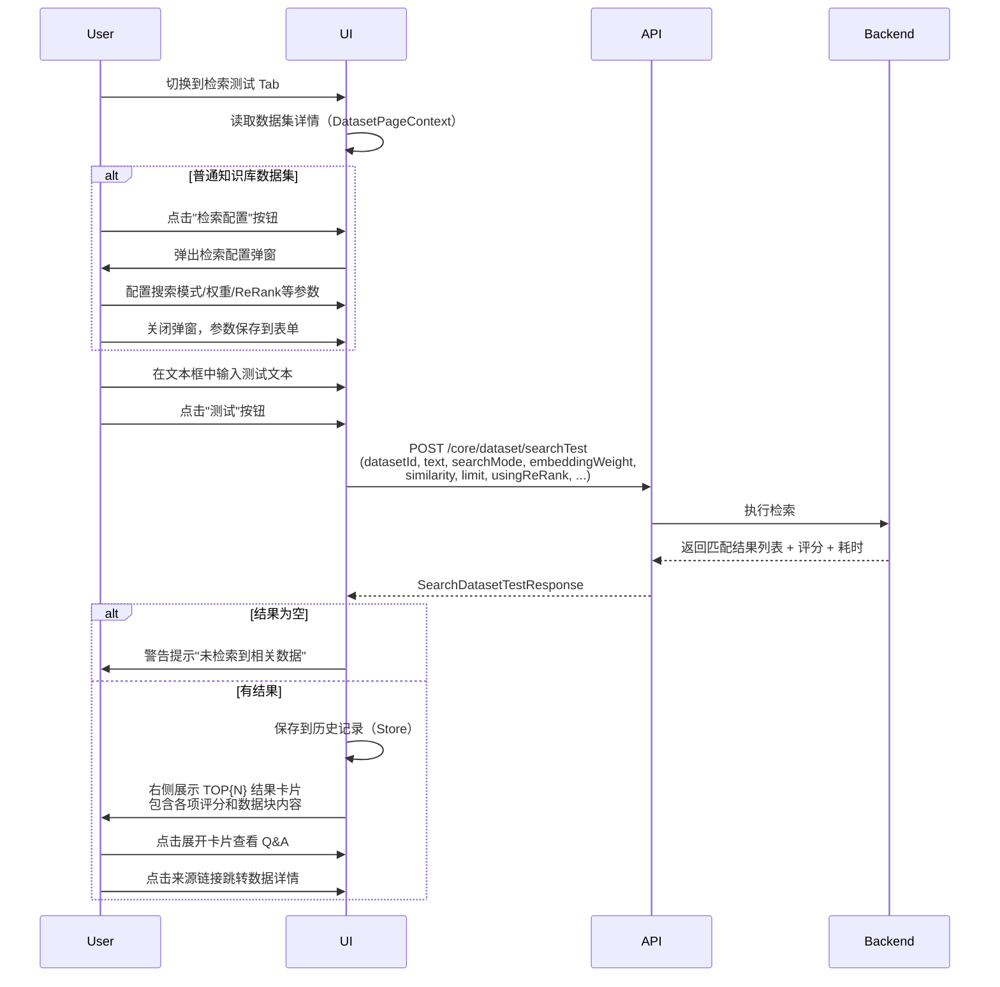
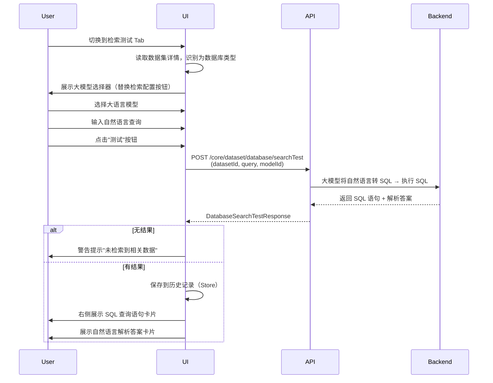
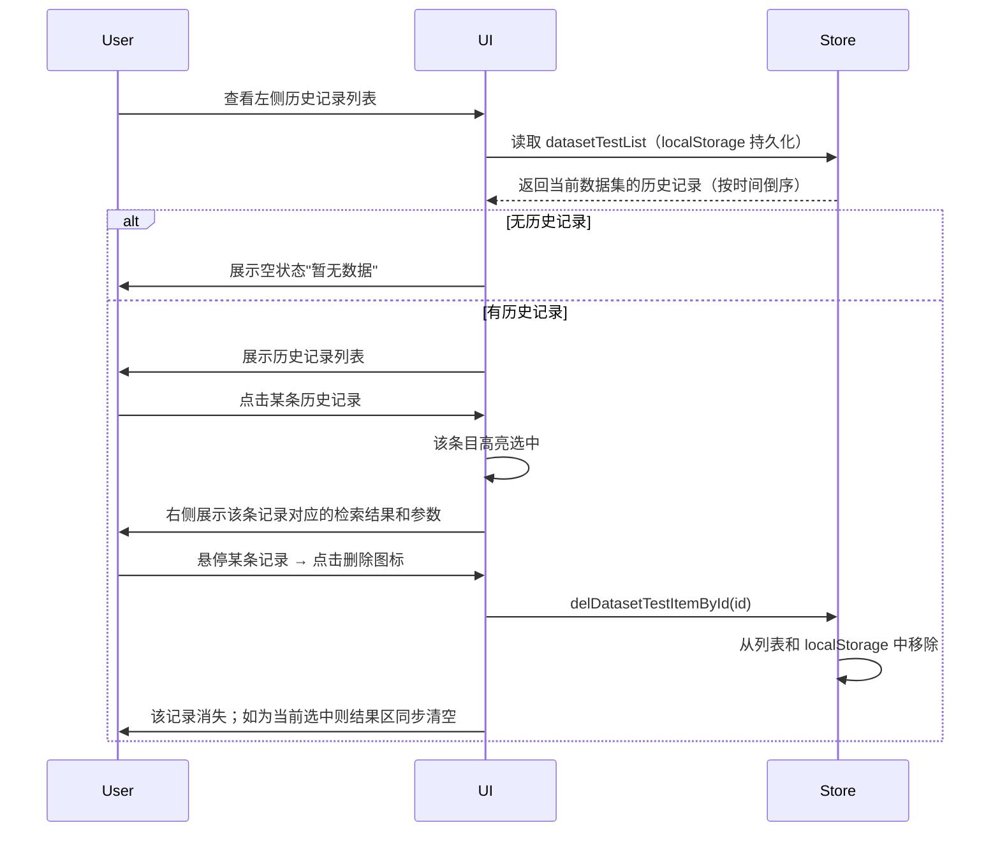

# 检索测试 — 业务流程详解

## 页面总览

检索测试 Tab 采用左右分栏布局：左侧为测试输入区（含测试文本输入框和历史记录列表），右侧为检索结果展示区。根据数据集类型不同，测试方式分为"普通检索测试"和"数据库检索测试"两种模式，由系统自动判断。

---

### S01：普通数据集检索测试

> 适用于向量/全文索引类型的知识库数据集。用户输入测试文本，系统按照配置的搜索模式执行检索，返回匹配度最高的数据块。

#### 步骤 1：配置检索参数

| 用户操作 | 触发 API | 分支条件 | 页面变化 |
|---------|---------|---------|---------|
| 点击"检索配置"按钮 | 无 | 数据集类型为普通知识库（非 database、非 structureDocument）时显示此按钮 | 弹出检索配置弹窗，展示搜索模式、embedding 权重/模型、ReRank 开关/模型/权重、相似度阈值、返回条数上限、问题扩展等参数 |

**表单字段清单**（检索配置弹窗）：

| 字段名 | 控件类型 | 必填 | 默认值 | 可选值/约束 | 说明 |
|--------|---------|------|--------|------------|------|
| 搜索模式 | 下拉选择 | 是 | embedding（向量检索） | embedding / fullText / hybridSearch | 选择检索算法 |
| embedding 权重 | 数值输入 | 否 | 0.5 | 0~1 之间 | 混合检索时 embedding 的权重占比 |
| embedding 模型 | 下拉选择 | 否 | 空 | 数据集关联的向量模型或系统默认 | 用于 embedding 的模型 |
| 使用 ReRank | 开关 | 否 | 开启 | 开启/关闭 | 是否启用重排序 |
| ReRank 模型 | 下拉选择 | 否 | 系统默认 ReRank 模型 ID | 系统已配置的 ReRank 模型 | 重排序使用的模型 |
| ReRank 方式 | 下拉选择 | 否 | content（内容） | content / embedding | 重排序的参照方式 |
| ReRank 权重 | 数值输入 | 否 | 0.5 | 0~1 之间 | ReRank 结果在最终排序中的权重 |
| 相似度阈值 | 数值输入 | 否 | 0 | ≥0 | 低于此阈值的搜索结果被过滤 |
| 返回条数上限 | 数值输入 | 否 | 5000 | 正整数 | 最多返回的数据块数量 |
| 问题扩展 | 开关 | 否 | 关闭 | 开启/关闭 | 是否使用大模型对测试文本进行扩展改写 |
| 扩展模型 | 下拉选择 | 否 | 系统默认 LLM 模型 ID | 可用的大语言模型列表 | 问题扩展时使用的模型（仅问题扩展开启时可见） |
| 扩展背景 | 文本输入 | 否 | 空 | 任意文本 | 问题扩展时的背景提示（仅问题扩展开启时可见） |

**校验规则**：

| 规则 | 触发时机 | 错误提示文案 |
|------|---------|-------------|
| embedding 权重 + ReRank 权重 ≤ 1 | 提交时 | 无前端校验（依赖后端校验） |

#### 步骤 2：输入测试文本并执行检索

| 用户操作 | 触发 API | 分支条件 | 页面变化 |
|---------|---------|---------|---------|
| 在文本框中输入测试文本 | 无 | 无 | 文本框获得焦点时边框高亮为蓝色；失焦后恢复默认边框 |
| 点击"测试"按钮 | POST `/core/dataset/searchTest`（携带 datasetId、text、searchMode、embeddingWeight、similarity、limit、usingReRank 等参数） | 接口返回空列表时触发警告提示"未检索到相关数据" | 按钮显示加载动画（isLoading）；接口成功后：测试结果保存到历史记录，右侧面板展示检索结果，包括每条结果的 TOP 排名、匹配分数（RRF/ReRank/全文/Embedding 各项分数）、数据块内容（Q&A 或文本），同时显示本次检索的耗时和搜索参数摘要 |

#### 步骤 3：查看检索结果详情

| 用户操作 | 触发 API | 分支条件 | 页面变化 |
|---------|---------|---------|---------|
| 查看检索结果卡片 | 无 | 结果数量 > 0 时展示 | 每条结果显示为可展开卡片：标题为 TOP{N} 排名；头部展示各项评分详情；点击展开后显示数据块的 Q（问题）和 A（答案）或纯文本内容 |
| 点击结果链接"来源 / #{chunkIndex}" | 无 | 每条结果均有链接 | 新窗口打开数据详情页，定位到对应数据块 |

---

### S02：数据库数据集检索测试

> 适用于数据库类型数据集。用户输入自然语言查询，系统通过大模型将查询转为 SQL 并执行，返回 SQL 查询语句和自然语言解析结果。

#### 步骤 1：选择检索模型并输入查询

| 用户操作 | 触发 API | 分支条件 | 页面变化 |
|---------|---------|---------|---------|
| 页面上方选择大语言模型 | 无 | 数据集类型为 database 或 structureDocument 时，检索配置按钮被替换为大模型选择器和帮助提示 | 下拉框显示可用的大语言模型列表；旁边展示帮助提示说明"检索模型用于将自然语言转为 SQL 查询" |
| 在文本框中输入自然语言查询 | 无 | 无 | 文本框获得焦点时边框高亮；最大输入长度受数据集向量模型的 maxToken 限制 |

#### 步骤 2：执行数据库检索

| 用户操作 | 触发 API | 分支条件 | 页面变化 |
|---------|---------|---------|---------|
| 点击"测试"按钮 | POST `/core/dataset/database/searchTest`（携带 datasetId、query、modelId） | 接口返回空或 answer 为空时提示警告"未检索到相关数据" | 按钮显示加载动画；接口成功后右侧面板展示两部分内容：生成的 SQL 查询语句和自然语言解析答案 |

#### 步骤 3：查看 SQL 与解析答案

| 用户操作 | 触发 API | 分支条件 | 页面变化 |
|---------|---------|---------|---------|
| 查看 SQL 查询区域 | 无 | 有 sql_result 时展示实际 SQL 语句 | 卡片中展示大模型生成的 SQL 查询语句（等宽字体、保留换行格式） |
| 查看检索结果 | 无 | 有 answer 时展示解析结果 | 卡片中展示大模型对 SQL 执行结果的自然语言解析 |

---

### S03：查看检索测试历史

#### 步骤 1：浏览历史记录

| 用户操作 | 触发 API | 分支条件 | 页面变化 |
|---------|---------|---------|---------|
| 查看左侧历史记录列表 | 无（数据来自 useSearchTestStore，已在本地持久化） | 无历史记录时展示空状态提示"暂无数据" | 历史记录列表按时间倒序展示，每条显示测试文本摘要和时间；每条最多保留 50 条记录 |

#### 步骤 2：回看历史检索结果

| 用户操作 | 触发 API | 分支条件 | 页面变化 |
|---------|---------|---------|---------|
| 点击历史记录条目 | 无 | 切换数据集时会自动清空当前选中结果 | 被选中的条目高亮显示（蓝色背景）；右侧面板展示该条历史记录的完整检索结果和当时使用的检索参数 |

#### 步骤 3：删除历史记录

| 用户操作 | 触发 API | 分支条件 | 页面变化 |
|---------|---------|---------|---------|
| 悬停历史记录条目 → 点击删除图标 | 无（Store 本地操作） | 无 | 悬停时时间文本隐藏，删除图标出现；点击后该条记录从列表和本地持久化存储中移除；如果删除的是当前选中条目，右侧面板结果同步清空 |

---

## Mermaid 附录

### S01：普通数据集检索测试

### S02：数据库数据集检索测试

### S03：查看检索测试历史

