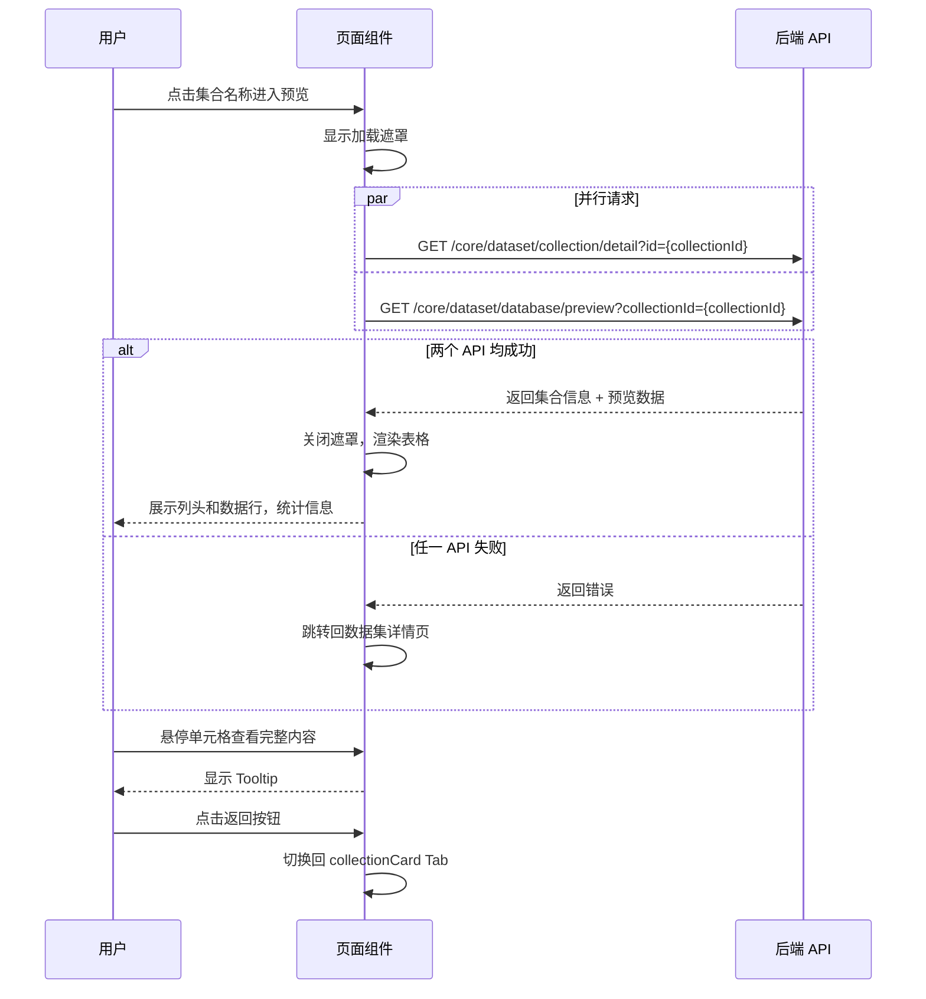

# 结构化数据卡片 — 业务流程详解

## 页面总览

本页面提供文件数据库类型知识库集合的**只读数据预览**功能。页面以表格形式展示集合的列名（表头）和数据行（最多 20 行），同时显示总行数和总列数统计信息。用户可通过返回按钮退出预览，回到集合列表视图。

---

### 查看结构化数据预览

> 用户在数据集详情页中点击某个文件数据库集合后，进入数据预览视图，查看该集合的列结构和前 20 行数据。

#### 步骤 1：进入数据预览页面

| 用户操作 | 触发 API | 分支条件 | 页面变化 |
|---------|---------|---------|---------|
| 在数据集详情页点击集合列表中的某个集合名称 | — | 路由携带 `collectionId` 参数 | 页面切换到 fileDataCard Tab 视图，显示加载状态（MyBox 遮罩层） |

#### 步骤 2：加载集合基本信息

| 用户操作 | 触发 API | 分支条件 | 页面变化 |
|---------|---------|---------|---------|
| 页面自动加载（无用户操作） | `GET /core/dataset/collection/detail?id={collectionId}` — 获取集合详情，与步骤 3 并行发起 | — | 无可见变化（数据用于面包屑文件名显示） |
| — | — | API 请求失败 | 自动跳转回数据集详情页（移除 `collectionId` 参数，回到 collectionCard Tab） |

#### 步骤 3：加载结构化预览数据

| 用户操作 | 触发 API | 分支条件 | 页面变化 |
|---------|---------|---------|---------|
| 页面自动加载（无用户操作） | `GET /core/dataset/database/preview?collectionId={collectionId}` — 获取结构化预览数据，与步骤 2 并行发起 | — | 加载遮罩显示中 |
| — | — | API 请求成功，返回列和数据 | 加载遮罩消失，展示列头和数据表格，显示统计信息"共 N 行，M 列，仅支持预览前 20 行" |
| — | — | API 请求成功，但返回空数据（无列或无行） | 显示空状态提示"这个集合还没有数据~" |
| — | — | API 请求失败 | 自动跳转回数据集详情页 |

#### 步骤 4：查看表格数据

| 用户操作 | 触发 API | 分支条件 | 页面变化 |
|---------|---------|---------|---------|
| 鼠标悬停在列头或单元格上 | — | 文本内容超出列宽 | 显示 Tooltip 完整内容 |
| 滚动表格区域 | — | 数据行超过可视区域高度 | 表格区域滚动，表头固定 |
| 查看列头信息 | — | — | 每列宽度均分（`100% / 列数`），列头背景为 myGray.100，首列左侧圆角、末列右侧圆角 |

#### 步骤 5：返回上级页面

| 用户操作 | 触发 API | 分支条件 | 页面变化 |
|---------|---------|---------|---------|
| 点击左上角返回按钮（圆形箭头图标 + 文件名）| — | — | 路由切换回 `currentTab=collectionCard`，导航栏恢复显示 Tab 列表和操作按钮 |

#### 数据加载详情

| 加载阶段 | API | 关键参数 | 数据处理 | 渲染结果 |
|---------|-----|---------|---------|---------|
| 首次加载 | GET /core/dataset/collection/detail | `id={collectionId}` | 提取 `sourceName` 用于面包屑显示 | 返回按钮旁显示文件名 |
| 首次加载 | GET /core/dataset/database/preview | `collectionId={collectionId}` | 取 `cols` 作为表头，`data` 的前 20 行作为表格行，`columnCount` 和 `rowCount` 用于统计信息 | 表格展示列头和数据行，顶部显示总行列统计 |

- **分页**: 无分页，仅展示前 20 行
- **排序**: 不支持用户排序
- **筛选**: 不支持筛选
- **特殊列的渲染**: 所有列以纯文本渲染，空值显示 `-`

### Mermaid 附录

