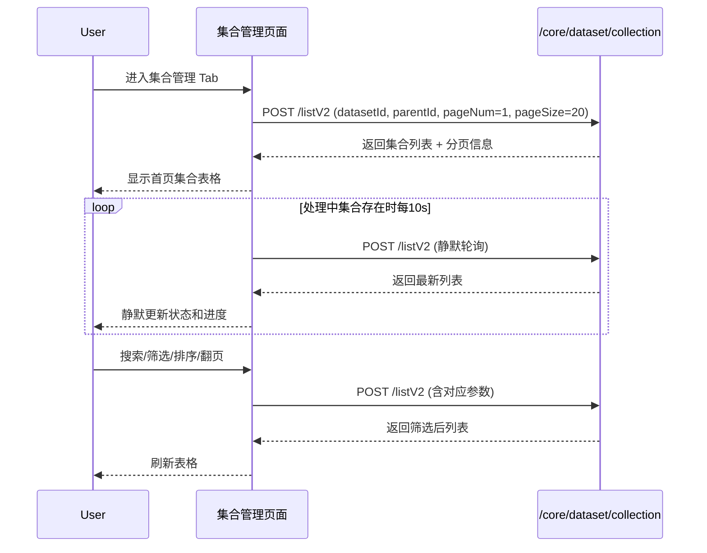
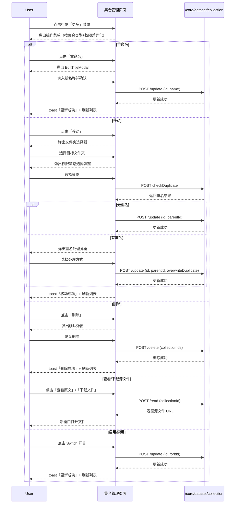
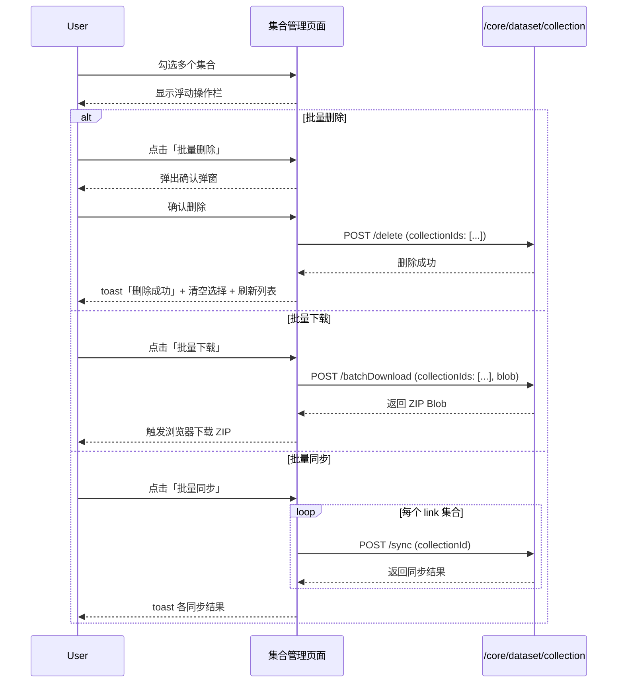
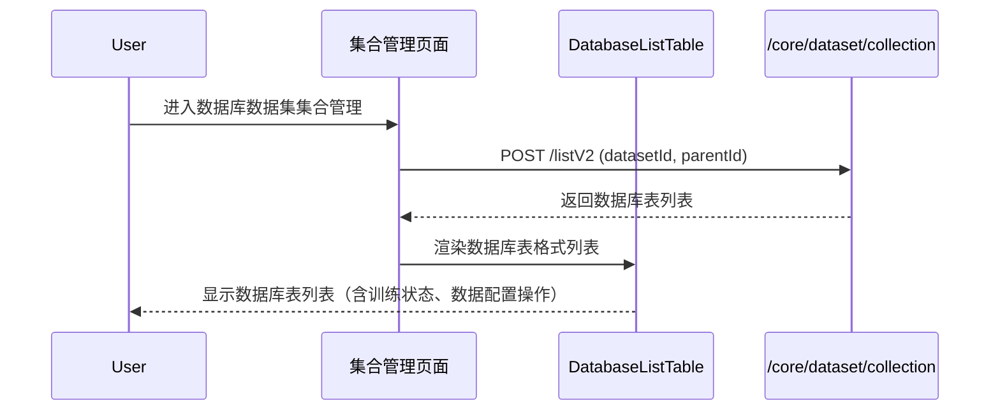

# 集合管理 — 业务流程详解

## 页面总览

集合管理页面是数据集详情页的核心 Tab，以表格形式展示数据集内所有集合。页面根据数据集类型自适应：普通/链接/API/结构化文档数据集使用通用表格视图，数据库数据集使用 DatabaseListTable 专用表格视图。页面集成分页、搜索、筛选、排序、轮询刷新、拖拽移动、权限控制等能力。

---

### S01 集合列表浏览

> 用户进入数据集详情页的集合管理 Tab，浏览数据集内的所有集合，支持分页浏览、搜索、按状态筛选、按标签筛选、按字段排序。

#### 步骤 1：页面初始化与首次加载

| 用户操作 | 触发 API | 分支条件 | 页面变化 |
|---------|---------|---------|---------|
| 进入数据集详情页（默认 Tab 为 collectionCard），或从其他 Tab 切换到集合管理 Tab | `POST /core/dataset/collection/listV2`（参数：datasetId, parentId, pageNum=1, pageSize=20） | 数据集类型为 database → 渲染 DatabaseListTable 组件；非 database → 渲染通用 Table 组件 | 显示 MyBox 加载遮罩 → 表格数据加载完成后显示集合列表；如果是数据库数据集，顶部显示蓝色 Info Alert 提示「数据库结构变更提示」 |

#### 步骤 2：分页浏览

| 用户操作 | 触发 API | 分支条件 | 页面变化 |
|---------|---------|---------|---------|
| 点击 Pagination 分页组件的页码或上一页/下一页 | `POST /core/dataset/collection/listV2`（参数：pageNum=N, 保持其他参数） | 无 | 显示加载遮罩 → 表格切换到第 N 页数据；分页组件更新当前页码 |

#### 步骤 3：搜索

| 用户操作 | 触发 API | 分支条件 | 页面变化 |
|---------|---------|---------|---------|
| 在搜索框中输入文本（搜索框在父组件 Header 中，通过 CollectionPageContext 共享 searchText 状态） | `POST /core/dataset/collection/listV2`（参数：searchText 更新后自动触发，reset 到 pageNum=1） | searchText 为空 → 恢复正常列表；有匹配结果 → 显示筛选后列表；无匹配结果 → 显示空状态 EmptyCollectionTip | 表格数据按搜索关键词过滤后刷新 |

#### 步骤 4：状态筛选

| 用户操作 | 触发 API | 分支条件 | 页面变化 |
|---------|---------|---------|---------|
| 点击表头「状态」列的 StatusFilter 下拉器，选择状态值（queued/parsing/indexing/active/error） | `POST /core/dataset/collection/listV2`（参数：status 更新后自动触发，reset 到 pageNum=1） | 数据集有异常集合 → 状态列旁显示「全部重试」蓝色链接 | 表格数据按状态过滤后刷新；选中状态值高亮显示 |

#### 步骤 5：标签筛选

| 用户操作 | 触发 API | 分支条件 | 页面变化 |
|---------|---------|---------|---------|
| 仅在 feConfigs.isPlus 为真时可见。点击表头「标签」列的 TagFilter 筛选器 | `POST /core/dataset/collection/listV2`（参数：filterTags 更新后自动触发） | isPlus 为假 → 不显示标签列和标签筛选器 | 表格数据按标签过滤后刷新 |

#### 步骤 6：排序

| 用户操作 | 触发 API | 分支条件 | 页面变化 |
|---------|---------|---------|---------|
| 点击表头可排序列（名称、数据量、创建时间、更新时间）的排序图标 | `POST /core/dataset/collection/listV2`（参数：sortBy + sortOrder） | 点击同一列 → 升序/降序切换；点击不同列 → 默认升序 | 排序图标切换（未排序列显示灰色双向箭头，排序列显示蓝色单向箭头）；表格按排序列和方向重新请求并刷新 |

#### 步骤 7：轮询刷新

| 用户操作 | 触发 API | 分支条件 | 页面变化 |
|---------|---------|---------|---------|
| 无用户操作，系统自动触发 | `POST /core/dataset/collection/listV2`（静默轮询，不显示加载遮罩） | 存在处理中集合（queued/parsing/indexing）→ 每 10s 轮询一次；存在训练数据（trainingAmount > 0）或数据集状态为 active → 每 10s 轮询一次（带重试间隔） | 不显示加载遮罩（isPollingRef 控制），表格数据静默更新；无处理中集合或训练数据后停止轮询 |

#### 数据加载详情

| 加载阶段 | API | 关键参数 | 数据处理 | 渲染结果 |
|---------|-----|---------|---------|---------|
| 首次加载 | POST /core/dataset/collection/listV2 | datasetId, parentId, pageNum=1, pageSize=20 | 按 filterTagValues 前端过滤 → formatCollections（计算图标、状态文本、颜色） | 表格前 20 条 |
| 翻页 | POST /core/dataset/collection/listV2 | pageNum=N, pageSize=20 | 同上 | 表格第 N 页 |
| 搜索 | POST /core/dataset/collection/listV2 | searchText + pageNum=1, pageSize=20 | 同上 | 搜索结果首页 |
| 状态筛选 | POST /core/dataset/collection/listV2 | status + pageNum=1, pageSize=20 | 同上 | 筛选结果首页 |
| 排序 | POST /core/dataset/collection/listV2 | sortBy + sortOrder + pageNum=1, pageSize=20 | 同上 | 排序后首页 |
| 轮询刷新 | POST /core/dataset/collection/listV2 | 同上次请求参数 | 同上，isPollingRef=true 静默 | 表格数据静默更新 |

- 分页参数：默认每页 20 条
- 排序规则：默认无排序（sortBy=null），用户可点击名称、数据量、创建时间、更新时间列排序
- 筛选条件：搜索框（文本搜索）+ 状态下拉器（active/queued/parsing/indexing/error）+ 标签筛选器（多标签组合）
- 状态列的渲染逻辑：文件夹显示「-」灰色；tableSchema.exist 为 false 显示「表不存在」灰色；hasError 为 true 显示「异常」红色可点击标签；trainingAmount > 0 根据 CollectionStatusEnum 显示 queued（灰色）/parsing（蓝色）/indexing（蓝色）带进度；trainingAmount = 0 显示 active 绿色
- 标签列仅 feConfigs.isPlus 时显示，最多显示 2 个标签 + 溢出计数，超过 2 个显示 MyPopover 悬浮展开

### Mermaid 附录

---

### S02 单个集合操作

> 用户点击行尾操作菜单，对单个集合执行重命名、移动、删除、标签、权限、查看源文件、同步（链接类型）等操作。

#### 步骤 1：打开操作菜单

| 用户操作 | 触发 API | 分支条件 | 页面变化 |
|---------|---------|---------|---------|
| 点击集合行尾的「更多」图标（三个点） | 无 | 集合类型为 folder → 菜单项为 [权限, 移动, 重命名, 删除]；类型为 link → 菜单项为 [同步, 同步设置, 标签, 权限, 源查看, 移动, 重命名, 删除]；普通文件 → 菜单项为 [标签, 权限, 源查看, 移动, 重命名, 删除]；结构化文档 → 无移动和重命名 | 弹出 MyMenu 下拉菜单；权限不足的项半透明不可点击 |

#### 步骤 2a：查看/下载源文件

| 用户操作 | 触发 API | 分支条件 | 页面变化 |
|---------|---------|---------|---------|
| 点击菜单中的「查看原文」/「下载文件」/「查看图片」项 | `POST /core/dataset/collection/read`（参数：collectionId） | API 数据集 → 以绝对 URL 或拼接 baseUrl 在新窗口打开；链接/`.txt` 文件 → 在 `[链接]` 新窗口打开；图片类型 → 在 `[图片]` 新窗口打开；普通文件 → 以 `/` 开头在当前域名打开，否则直接用返回值打开 | 显示加载中菜单项状态 → 新窗口打开文件/源 |

**失败场景**：API 返回空 value → toast 提示「文件未找到」。

#### 步骤 2b：重命名

| 用户操作 | 触发 API | 分支条件 | 页面变化 |
|---------|---------|---------|---------|
| 点击菜单中的「重命名」项 | `POST /core/dataset/collection/update`（参数：id, name） | 无 | 弹出 EditTitleModal（useEditTitle hook），默认值填充当前名称 → 用户修改名称后确认 → 调用 API 更新 → toast「更新成功」→ 刷新列表 |

#### 步骤 2c：移动

| 用户操作 | 触发 API | 分支条件 | 页面变化 |
|---------|---------|---------|---------|
| 点击菜单中的「移动」项 | 先弹 SelectCollections 选目标文件夹；确认后→ `POST /core/dataset/collection/update` 更新 parentId | 无重名 → 直接移动成功；有重名 → 弹出 MoveCollectionDuplicateModal 选择「跳过」「覆盖」「保留两者」处理 | 弹出 SelectCollections 文件夹选择器（type=folder）→ 选择目标文件夹后弹出 MyModal 权限选择：[继承文件夹权限] 或 [保持独立权限] → 选择后检查重名（POST checkDuplicate）→ 无重名直接移动；有重名弹出 MoveCollectionDuplicateModal |

**移动权限选择弹窗文案**: 「请选择移动后的权限策略」

**重名处理弹窗**: MoveCollectionDuplicateModal 提供三个选项：
- 跳过 — 取消此次移动
- 继续移动（覆盖） — 使用 overwriteDuplicate=true
- 继续移动（替换文件） — 使用 overwriteDuplicate=true

#### 步骤 2d：删除

| 用户操作 | 触发 API | 分支条件 | 页面变化 |
|---------|---------|---------|---------|
| 点击菜单中的「删除」项 | 弹出删除确认弹窗 → 确认后调用 `POST /core/dataset/collection/delete`（参数：collectionIds: [id]） | 文件夹类型 → 弹窗文案「确认删除该文件夹」；普通文件 → 弹窗文案「确认删除该文件」；数据库 → 弹窗标题「remove_warning」，文案「确认移除此数据库表」 | 弹出 useConfirm 确认弹窗 → 确认后调用 API → toast「删除成功」→ 刷新列表 |

#### 步骤 2e：标签管理

| 用户操作 | 触发 API | 分支条件 | 页面变化 |
|---------|---------|---------|---------|
| 点击菜单中的「标签」项（仅 isPlus 且非结构化文档） | 无（操作在 SetTagsModal 中完成） | 无 | 弹出 SetTagsModal 弹窗，传入当前集合数据 |

#### 步骤 2f：权限配置

| 用户操作 | 触发 API | 分支条件 | 页面变化 |
|---------|---------|---------|---------|
| 点击菜单中的「权限」项 | `GET /core/dataset/collection/collaborator/list`（打开时加载协作者列表）；弹窗中修改 → `POST /core/dataset/collection/collaborator/update`；移除协作者 → `DELETE /core/dataset/collection/collaborator/delete` | 文件夹类型 → 显示 effectScope 权限生效范围选项；非文件夹 → 隐藏；有父级 → 显示「恢复继承权限」按钮 | 弹出 ConfigPerModal → 显示集合名称、权限继承状态、协作者列表等 |

**权限模型细节**：
- `inheritPermission`: 是否继承父文件夹权限
- `permission.hasManagePer`: 管理权限
- `permissionEffectScope`: 文件夹类型时，权限生效范围
- 可变更所有者（postChangeCollectionOwner）
- 可恢复继承（postResumeCollectionInheritPermission）

#### 步骤 2g：链接同步

| 用户操作 | 触发 API | 分支条件 | 页面变化 |
|---------|---------|---------|---------|
| 点击菜单中的「同步」项 | 弹出确认弹窗 → 确认后调用 `POST /core/dataset/collection/sync`（参数：collectionId） | 无 | 弹出 useConfirm 确认弹窗（文案「确认同步该链接集合？」）→ 确认后调用 API → 同步完成后 toast 显示同步结果状态文案 → 刷新列表 |

#### 步骤 2h：同步设置

| 用户操作 | 触发 API | 分支条件 | 页面变化 |
|---------|---------|---------|---------|
| 点击菜单中的「同步设置」项 | 无（设置弹窗）；确认后 → `POST /core/dataset/collection/update`（参数：id, autoSync） | 无 | 弹出 MyModal 设置弹窗 → 显示「同步计划」开关 → 用户切换 autoSync → 确认后调用 API 更新 |

#### 步骤 2i：启用/禁用

| 用户操作 | 触发 API | 分支条件 | 页面变化 |
|---------|---------|---------|---------|
| 点击行内「启用」列的 Switch 开关 | `POST /core/dataset/collection/update`（参数：id, forbid: !checked） | 无 | Switch 切换动画 → 调用 API → toast「更新成功」→ 刷新列表 |

### Mermaid 附录

---

### S03 批量操作

> 用户勾选多个集合后，通过底部浮动操作栏执行批量删除、批量下载、批量同步（链接类型）、批量设置标签等操作。

#### 步骤 1：勾选集合

| 用户操作 | 触发 API | 分支条件 | 页面变化 |
|---------|---------|---------|---------|
| 勾选集合行前的 Checkbox；或点击表头 Checkbox 全选 | 无（前端状态管理） | 无 | 选中的集合行高亮；底部浮动操作栏 FloatingActionBar 显示已选数量和控制按钮 |

#### 步骤 2a：批量删除

| 用户操作 | 触发 API | 分支条件 | 页面变化 |
|---------|---------|---------|---------|
| 点击浮动操作栏「批量删除」按钮 | 弹出确认弹窗 → 确认后调用 `POST /core/dataset/collection/delete`（参数：collectionIds: [id1, id2, ...]） | 无 | 弹出确认弹窗（文案「确认删除 {num} 个集合？」）→ 确认后调用 API → toast「删除成功」→ 清空选择 → 刷新列表 |

**失败场景**：部分删除失败 → toast「删除失败」。

#### 步骤 2b：批量下载

| 用户操作 | 触发 API | 分支条件 | 页面变化 |
|---------|---------|---------|---------|
| 点击浮动操作栏「批量下载」按钮 | `POST /core/dataset/collection/batchDownload`（参数：collectionIds: [...], responseType: blob） | 无 | 显示下载中状态（按钮 loading）→ 获取 Blob → 创建临时 URL → 自动触发浏览器下载 → 文件名格式 `collections-{timestamp}.zip` |

#### 步骤 2c：批量同步

| 用户操作 | 触发 API | 分支条件 | 页面变化 |
|---------|---------|---------|---------|
| 仅在选中集合中包含 link 类型时可见。点击「批量同步」按钮 | 依次对每个 link 集合调用 `POST /core/dataset/collection/sync` | 无 link 集合 → 按钮不显示 | 依次同步 → 每个同步完成后 toast 显示对应结果 |

#### 步骤 2d：批量设置标签

| 用户操作 | 触发 API | 分支条件 | 页面变化 |
|---------|---------|---------|---------|
| 仅在 isPlus 且非结构化文档时可见。点击「批量设置标签」按钮 | 无（操作在 BatchSetTagsModal 中完成） | isPlus 为假 → 按钮不显示；结构化文档 → 按钮不显示 | 弹出 BatchSetTagsModal 弹窗，传入选中集合列表 |

### Mermaid 附录

---

### S04 数据库表管理

> 当数据集类型为 database 时，使用 DatabaseListTable 组件渲染数据库表格式列表，而非通用表格。

#### 步骤 1：数据库表列表展示

| 用户操作 | 触发 API | 分支条件 | 页面变化 |
|---------|---------|---------|---------|
| 进入数据库数据集的集合管理 Tab | `POST /core/dataset/collection/listV2`（同上） | datasetDetail.type === DatasetTypeEnum.database → 渲染 DatabaseListTable；非 database → 渲染通用 Table | 顶部显示蓝色 Info Alert → 渲染 DatabaseListTable（含表名、训练状态、数据配置等列） |

#### 步骤 2：数据库表操作

| 用户操作 | 触发 API | 分支条件 | 页面变化 |
|---------|---------|---------|---------|
| DatabaseListTable 中的具体操作由该组件处理（编辑数据结构、查看训练状态、移除表） | DatabaseListTable 内部 API 调用 | 无 | DatabaseListTable 内部处理 |

### Mermaid 附录

