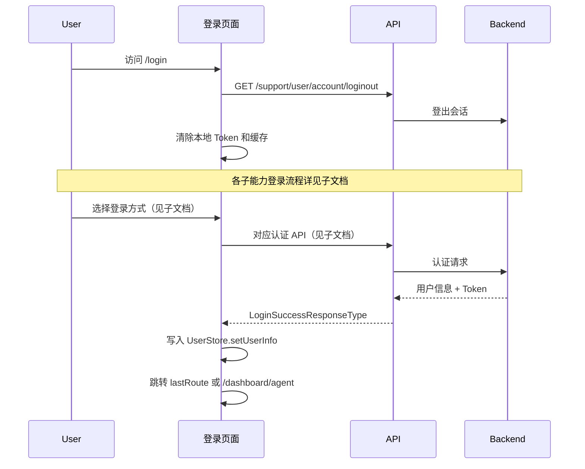

# 登录 — 业务流程详解

> 本模块为纯分组节点，各子能力的详细业务流程见对应文档。

## 子能力业务流程索引

| 子能力 | 业务描述 | 业务流程索引 | 业务流程详解 |
|--------|---------|------------|------------|
| 登录首页 | 密码登录、注册、忘记密码、微信扫码等完整登录交互 | [业务流程索引](../登录首页/业务流程索引.md) | [业务流程详解](../登录首页/业务流程详解.md) |
| 快速登录 | 通过一次性 code+token 完成免密快速登录 | [业务流程索引](../快速登录/业务流程索引.md) | [业务流程详解](../快速登录/业务流程详解.md) |
| 第三方登录 | OAuth 回调处理与第三方账号认证流程 | [业务流程索引](../第三方登录/业务流程索引.md) | [业务流程详解](../第三方登录/业务流程详解.md) |

## 公共业务流程

以下是所有登录子能力共用的前置流程：

### 步骤 1：页面初始化

| 用户操作 | 触发 API | 分支条件 | 页面变化 |
|---------|---------|---------|---------|
| 访问任意登录页面 | 无（客户端操作） | — | 清除本地 Token 和营销缓存数据 |
| 访问任意登录页面 | GET `/support/user/account/loginout` | — | 后端登出当前会话 |
| 访问任意登录页面 | 无（客户端操作） | — | 预加载 `/dashboard/agent` 路由 |

### 步骤 2：登录成功后处理

| 用户操作 | 触发 API | 分支条件 | 页面变化 |
|---------|---------|---------|---------|
| 登录 API 返回成功 | — | 团队状态为 `active` | 写入用户信息到 Store，跳转到 `lastRoute` 或 `/dashboard/agent` |
| 登录 API 返回成功 | POST 邀请链接接受 | 团队状态非 `active` 且 `lastRoute` 含 `invitelinkid` | 自动接受邀请，跳转到 `/dashboard/agent` |
| 登录 API 返回成功 | — | 团队状态非 `active` 且无邀请链接 | 显示"团队未激活"警告提示 |

## Mermaid 附录

