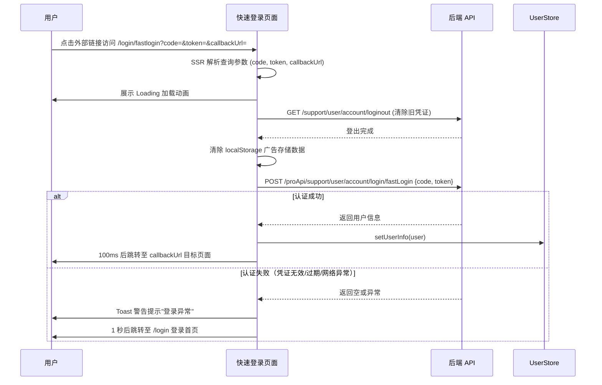

# 快速登录 — 业务流程详解

## 页面总览

快速登录是一个全自动的免密认证页面。用户通过携带 `code`、`token`、`callbackUrl` 参数的链接访问后，页面自动完成旧凭证清除、凭证校验、用户信息写入和页面跳转的完整链路。用户在页面上仅看到加载动画，无需任何手动操作。

---

### 快速登录认证

> **业务描述**: 用户点击外部链接（如邮件中的验证链接）后，浏览器打开快速登录页面，系统自动完成身份认证并跳转至目标页面。

#### 步骤 1：页面初始化与参数解析

| 用户操作 | 触发 API | 分支条件 | 页面变化 |
|---------|---------|---------|---------|
| 点击外部链接，浏览器打开 `/login/fastlogin?code=xxx&token=xxx&callbackUrl=/dashboard/agent` | 无（SSR 阶段服务端解析查询参数） | callbackUrl 为空时默认使用 `/dashboard/agent` | 页面渲染 Loading 加载动画 |

服务端 `getServerSideProps` 从 URL 查询参数中提取 `code`、`token`、`callbackUrl`，并注入到组件 props。

#### 步骤 2：清除旧凭证并开始认证

| 用户操作 | 触发 API | 分支条件 | 页面变化 |
|---------|---------|---------|---------|
| 无（页面自动执行） | `GET /support/user/account/loginout`（clearToken 调用 loginOut） | 无 | Loading 持续展示；localStorage 中旧广告存储数据被清除 |

页面挂载后 `useEffect` 立即执行：
- 调用 `clearToken()` 清除旧的登录状态和广告存储数据
- 调用 `validateRedirectUrl(callbackUrl)` 校验回调 URL 安全性
- 调用 `router.prefetch(safeCallbackUrl)` 预加载目标页面
- 调用 `authCode(code, token)` 发起认证请求

#### 步骤 3：提交快速登录凭证

| 用户操作 | 触发 API | 分支条件 | 页面变化 |
|---------|---------|---------|---------|
| 无（自动提交） | `POST /proApi/support/user/account/login/fastLogin`（参数：`code`, `token`） | 无 | Loading 持续展示；请求发送中 |

`postFastLogin` 向服务端提交 `code` 和 `token` 进行凭证校验。

#### 步骤 4a：认证成功

| 用户操作 | 触发 API | 分支条件 | 页面变化 |
|---------|---------|---------|---------|
| 无 | 无额外 API | 服务端返回有效的 `LoginSuccessResponseType`（含 user 信息） | 用户信息写入 Store；100ms 延迟后页面跳转至 callbackUrl 对应页面 |

认证成功时：
- 调用 `setUserInfo(res.user)` 将用户信息写入 Zustand userStore
- 100ms 延迟后，`router.push(validateRedirectUrl(callbackUrl))` 跳转到目标页面

#### 步骤 4b：认证失败

| 用户操作 | 触发 API | 分支条件 | 页面变化 |
|---------|---------|---------|---------|
| 无 | 无额外 API | 服务端返回空响应（`!res`）或请求异常 | 顶部弹出警告 Toast，文案为 i18n key `common:support.user.login.error`；1 秒后页面跳转至 `/login` |

认证失败时：
- 弹出警告 Toast 提示"登录异常"
- 1 秒后自动跳转回登录首页 `/login`

**失败场景**:
- code 或 token 已过期
- code 或 token 无效或已被使用
- 网络异常导致请求失败

### 数据加载详情

本页面无列表数据加载。页面为一次性认证流程，不涉及分页、排序、筛选或轮询。

### Mermaid 附录

