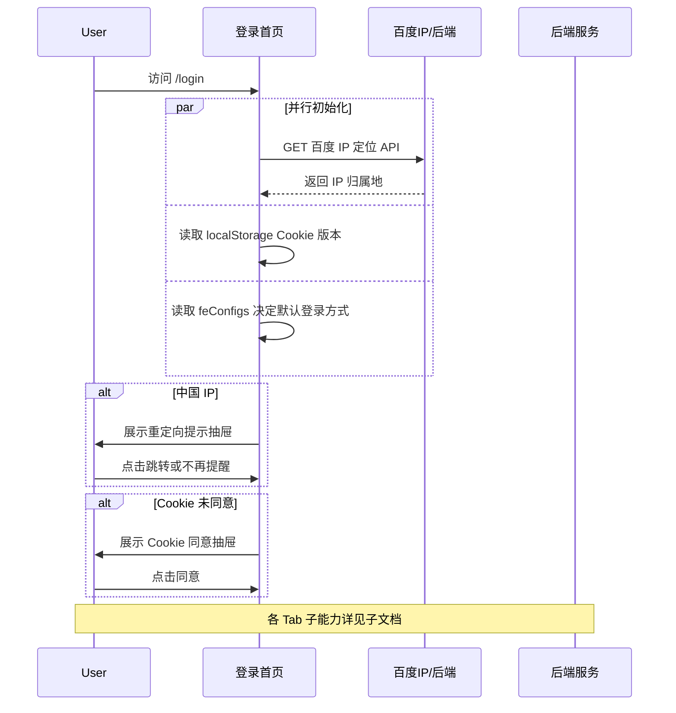

# 登录首页 — 业务流程详解

## 页面总览

登录首页是 FastGPT 的统一认证入口，提供 PC 端双栏布局（左侧品牌展示、右侧表单区）和移动端单栏布局。页面负责协调四种登录方式（密码登录、注册、忘记密码、微信登录）的切换，同时处理 OAuth 第三方登录、IP 归属地检测、Cookie 同意等公共流程。

## Tab 结构索引

| Tab | 业务描述 | 来源 | 详细文档 |
|-----|---------|------|---------|
| 密码登录 | 用户名+密码登录，支持邮箱/手机号/用户名多方式 | 本模块 | [业务流程详解](../登录首页/密码登录/业务流程详解.md) |
| 注册 | 新用户注册，支持邮箱/手机号+验证码 | 本模块 | [业务流程详解](../登录首页/注册/业务流程详解.md) |
| 忘记密码 | 通过验证码重置密码 | 本模块 | [业务流程详解](../登录首页/忘记密码/业务流程详解.md) |
| 微信登录 | [配置可见] 微信扫码授权登录，轮询获取登录结果 | 本模块 | [业务流程详解](../登录首页/微信登录/业务流程详解.md) |

## 非 Tab 业务流程

### 页面初始化

| 用户操作 | 触发 API | 分支条件 | 页面变化 |
|---------|---------|---------|---------|
| 访问 /login 路由 | 无（客户端初始化） | 系统配置了微信 OAuth → 默认展示微信登录 Tab；否则展示密码登录 Tab | 渲染双栏布局（PC）或单栏布局（移动端），加载系统 Logo 和标题 |
| 页面加载后自动执行 | `GET https://qifu-api.baidubce.com/ip/local/geo/v1/district`（百度 IP 定位） | 配置了 CHINESE_IP_REDIRECT_URL 且用户未关闭提示 → 弹出重定向抽屉；IP 检测到中国且非港澳台 → 展示重定向提示 | 底部弹出重定向抽屉，显示"检测到您在中国大陆"提示和跳转按钮 |
| 页面加载后自动执行 | 无（localStorage 读取） | 本地 Cookie 版本与当前版本不一致 → 弹出 Cookie 同意抽屉 | 底部弹出 Cookie 同意抽屉，显示隐私政策链接和同意按钮 |

### 登录成功跳转

| 用户操作 | 触发 API | 分支条件 | 页面变化 |
|---------|---------|---------|---------|
| 任一登录方式成功后（由子 Tab 回调触发） | 无（客户端路由跳转） | URL query 参数含 `lastRoute` 且不以 `/login` 开头且以 `/` 开头 → 跳转到 lastRoute；否则 → 跳转到 `/dashboard/agent` | 页面跳转到目标路由 |

### OAuth 第三方登录

| 用户操作 | 触发 API | 分支条件 | 页面变化 |
|---------|---------|---------|---------|
| 点击 OAuth 按钮（SSO） | `POST /proApi/support/user/account/login/getAuthURL` | 无 | 获取 SSO 授权 URL 后跳转到 SSO 提供商页面 |
| 点击 OAuth 按钮（企业微信） | `POST /proApi/support/user/account/login/wecom/getRedirectUrl` | 无 | 获取企业微信授权 URL 后跳转 |
| 点击 OAuth 按钮（Google/GitHub/Microsoft） | 无（直接构造 redirectUrl 跳转） | 无 | 跳转到对应 OAuth 提供商的授权页面 |

OAuth 列表根据系统配置动态生成，支持：SSO、微信、Google、GitHub、Microsoft、企业微信、密码登录切换。当仅有一种登录方式时，不展示 OAuth 按钮区。

### Cookie 同意

| 用户操作 | 触发 API | 分支条件 | 页面变化 |
|---------|---------|---------|---------|
| 弹出 Cookie 抽屉 | 无 | 用户本地 Cookie 版本号不等于 '1' | 底部弹出抽屉，显示 Cookie 提示文案和隐私政策链接 |
| 点击"同意" | 无（写入 localStorage 'localCookieVersion'='1'） | 无 | 抽屉关闭，不再弹出 |
| 点击隐私政策链接 | 无 | 无 | 新窗口打开隐私政策页面 |

### 中国 IP 重定向

| 用户操作 | 触发 API | 分支条件 | 页面变化 |
|---------|---------|---------|---------|
| 弹出重定向抽屉 | 无 | 百度 IP 检测返回 country='中国' 且 prov 不是香港/澳门/台湾 | 底部弹出抽屉，显示重定向提示 |
| 点击"跳转" | 无 | 无 | 通过 router.push 跳转到 ChineseRedirectUrl |
| 点击"不再提醒" | 无（写入 localStorage 'showRedirect'=false） | 无 | 抽屉关闭，后续不再弹出 |

### 社区联系

| 用户操作 | 触发 API | 分支条件 | 页面变化 |
|---------|---------|---------|---------|
| 点击"无法登录"链接 | 无 | `feConfigs.concatMd` 已配置 | 弹出社区联系方式弹窗 |
| 弹窗展示 | 无 | 用户所属团队是企业微信团队 → 展示固定邮箱联系方式；否则 → 展示 Markdown 自定义内容 | 弹窗展示联系方式内容 |

## Mermaid 附录

> 各 Tab（密码登录、注册、忘记密码、微信登录）的完整业务流程和交互序列详见对应的子文档。
