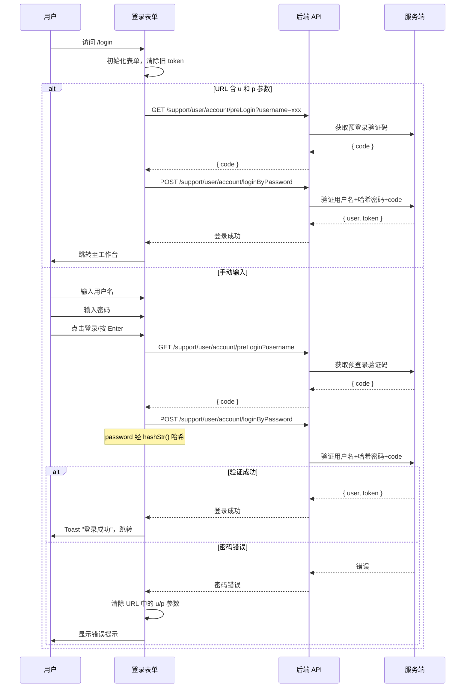

# 密码登录 — 业务流程详解

## 页面总览

密码登录是 FastGPT 登录页的默认 Tab。用户在此输入用户名和密码完成身份认证。页面顶部展示系统 Logo 和标题，中部为表单区域（用户名、密码输入框 + 登录按钮 + 协议提示），底部提供忘记密码和注册入口。商业版用户还可看到 OAuth 第三方登录选项（SSO、微信、Google、GitHub、Microsoft）。

## 非 Tab 业务流程

### 场景 S01：密码登录

> 用户手动输入用户名和密码完成登录。

#### 步骤 1：进入登录页，初始化

| 用户操作 | 触发 API | 分支条件 | 页面变化 |
|---------|---------|---------|---------|
| 访问 `/login` 路由 | 无 | 默认展示密码登录 Tab；若系统配置了微信 OAuth，则自动切到微信登录 Tab | 显示登录表单页面：左侧为系统背景图（仅 PC 端），右侧为表单区域，含系统 Logo、标题、用户名输入框、密码输入框、登录按钮 |
| 页面加载完成 | 无 | 若检测到 URL 含 `rootLogin=1` 参数，跳过 OAuth 自动登录 | 页面顶部右侧显示语言切换器；底部显示版权信息；若本地 Cookie 版本过期，弹出 Cookie 同意抽屉 |

#### 步骤 2：输入用户名

| 用户操作 | 触发 API | 分支条件 | 页面变化 |
|---------|---------|---------|---------|
| 在用户名输入框中输入账号 | 无 | — | 输入框获取焦点，显示输入内容 |
| 输入框失焦 | 无 | 若用户名为空（必填校验失败） | 输入框显示红色错误边框（formState.errors.username） |

**占位提示文案规则**：
- 社区版（`feConfigs.register_method` 存在且 `feConfigs.isPlus` 为 falsy）：显示"请使用 root 用户登录"
- 商业版：根据 `feConfigs.login_method` 数组拼接占位文案，如"用户名/邮箱/手机号"

#### 步骤 3：输入密码

| 用户操作 | 触发 API | 分支条件 | 页面变化 |
|---------|---------|---------|---------|
| 在密码输入框中输入密码 | 无 | — | 输入框以密码类型展示（字符掩盖），显示输入内容 |
| 输入框失焦 | 无 | 若密码为空或超过 60 字符（校验失败） | 输入框显示红色错误边框，密码超长时提示"密码最长为 60 字符" |

**占位提示文案规则**：
- 社区版：显示 root 密码占位提示
- 商业版：显示"密码"

#### 步骤 4：提交登录

| 用户操作 | 触发 API | 分支条件 | 页面变化 |
|---------|---------|---------|---------|
| 点击"登录"按钮 或 按 Enter 键 | `GET /support/user/account/preLogin`（先）→ `POST /support/user/account/loginByPassword`（后，串行依赖 preLogin 返回的 code） | 若正在请求中（`requesting=true`），Enter 键不触发提交 | 登录按钮进入 loading 状态（`isLoading=true`），按钮文字保持不变，不可再次点击 |
| — | `GET /support/user/account/preLogin` 参数: `username`（用户输入的用户名） | — | 按钮保持 loading 状态 |
| — | `POST /support/user/account/loginByPassword` 参数: `username`, `password`（前端 hash 后发送）, `code`（preLogin 返回）, `language`（当前语言）, `teamId`（可选） | — | 按钮保持 loading 状态 |
| — | 登录成功（两个 API 均返回成功） | — | 显示成功提示（"登录成功"），页面跳转至 `/dashboard/agent`（或 `lastRoute` 指定路径；若 `lastRoute` 含 `/login` 或以非 `/` 开头则忽略，回退到 `/dashboard/agent`） |
| — | 登录失败 | 密码错误（`error.statusText === UserErrEnum.account_psw_error`） | URL 中的 `u` 和 `p` 参数被清空（通过 `router.replace`），提示错误信息；按钮恢复可点击状态 |
| — | 登录失败 | 其他错误（网络异常、用户名不存在等） | 提示对应错误信息；按钮恢复可点击状态 |

**密码处理**：密码在前端经过 `hashStr()` 哈希处理后发送，不传输明文。

**登录成功跳转逻辑**：
1. 解析 URL 参数中的 `lastRoute`
2. 若 `lastRoute` 有效（非空、不包含 `/login`、以 `/` 开头）→ 跳转到 `lastRoute`
3. 否则 → 跳转到 `/dashboard/agent`

#### 表单与交互详情

**表单字段清单**（来自 `react-hook-form` 的 `register` 定义）：

| 字段名 | 控件类型 | 必填 | 默认值 | 可选值/约束 | 编辑时只读 | 说明 |
|--------|---------|------|--------|------------|-----------|------|
| username | 文本输入 | ✅ | — | 无格式限制 | 否 | 用户名/邮箱/手机号 |
| password | 密码输入 | ✅ | — | 最大 60 字符 | 否 | 密码，前端哈希后发送 |

**校验规则**：

| 规则 | 触发时机 | 错误提示文案 |
|------|---------|-------------|
| 用户名为空 | 提交时 | 表单校验失败，输入框标红 |
| 密码为空 | 提交时 | 表单校验失败，输入框标红 |
| 密码超过 60 字符 | 失焦 | "密码最长为 60 字符" |

**前置条件**：
- 用户未登录（页面加载时会调用 `clearToken()` 清除本地 token）
- 需要预登录验证码（`getPreLogin` 返回 `code` 字段，作为 `postLogin` 的必传参数）

**后置影响**：
- 登录成功后存储用户信息到 `useUserStore`，清空 `useChatStore.lastChatAppId`
- 签发登录 token

**失败场景**：
- 密码错误：自动清除 URL 中的凭据参数（`u`、`p`），避免重复自动登录
- 网络异常：显示请求失败提示
- 预登录失败：阻止后续登录请求

### 场景 S02：URL 参数自动登录

> 用户通过携带 `u` 和 `p` 参数的 URL 直接访问登录页，系统自动发起登录。

#### 步骤 1：页面加载与自动登录

| 用户操作 | 触发 API | 分支条件 | 页面变化 |
|---------|---------|---------|---------|
| 访问 `/login?u=xxx&p=xxx` | — | URL 中 `u` 和 `p` 参数均非空 | 页面加载后，`useMount` 生命周期自动调用 `onclickLogin({username, password})` |
| — | `GET /support/user/account/preLogin` → `POST /support/user/account/loginByPassword`（流程同 S01） | — | 同 S01 步骤 4 |
| — | 登录成功 | — | 同 S01 成功流程 |
| — | 登录失败（密码错误） | — | URL 中 `u` 和 `p` 参数被清空，停留在登录页等待用户手动输入 |

### Mermaid 附录

