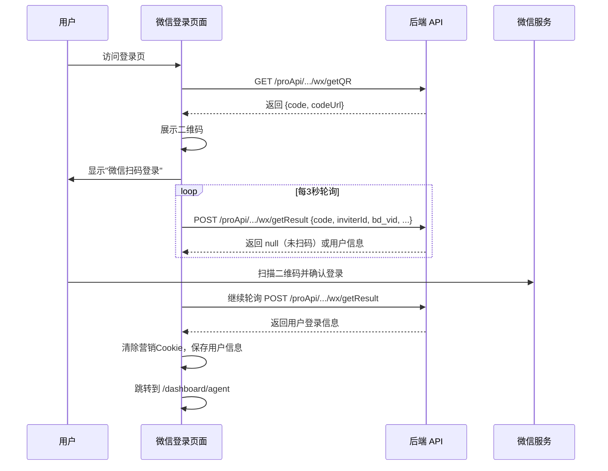

# 微信登录 — 业务流程详解

## 页面总览

微信登录页面向用户展示一个微信扫码二维码，用户使用微信客户端扫描并确认后即可完成登录。页面在展示二维码的同时启动轮询机制，每隔 3 秒检测用户是否已完成扫码确认，确认后自动进入系统。

## 微信扫码登录流程

> 用户通过微信客户端扫描页面二维码完成身份认证并登录系统。

### 步骤 1：页面初始化与二维码获取

| 用户操作 | 触发 API | 分支条件 | 页面变化 |
|---------|---------|---------|---------|
| 进入登录页，页面自动识别应展示微信登录 | GET /proApi/support/user/account/login/wx/getQR | 1. 系统配置 `feConfigs.oauth.wechat` 为 true → 默认进入微信登录 2. 检测到百度推广参数 bd_vid 存在 → 切换为密码登录（不进微信登录） | 页面显示系统 Logo 和标题；二维码区域显示加载中动画（Loading 组件居中旋转） |
| 等待二维码接口返回 | — | 二维码接口成功 → 进入步骤 2 二维码接口失败 → 提示"获取二维码失败"（warning toast），二维码区域持续显示加载动画 | 获取成功后：加载动画消失，显示微信二维码图片（带圆角边框、浅灰背景）；二维码上方显示"微信扫码登录"提示文字 |

### 步骤 2：轮询扫码结果

| 用户操作 | 触发 API | 分支条件 | 页面变化 |
|---------|---------|---------|---------|
| 用户打开微信客户端扫描二维码 | POST /proApi/support/user/account/login/wx/getResult（每 3 秒自动轮询） | 轮询前置条件：`wechatInfo.code` 存在（步骤 1 获取的微信 code） 轮询返回 data 为空 → 继续轮询（用户尚未扫码确认） 轮询返回 data 不为空 → 登录成功，进入步骤 3 轮询期间 API 报错 → 静默处理，继续轮询 | 二维码持续展示，无明显变化（轮询在后台进行） |
| 用户在微信中点击"确认登录" | —（同上轮询 API） | — | 同上：下次轮询将返回登录结果 |

### 步骤 3：登录成功处理

| 用户操作 | 触发 API | 分支条件 | 页面变化 |
|---------|---------|---------|---------|
| —（自动触发） | —（步骤 2 的轮询返回结果） | 返回结果有效 → 执行登录成功回调 | 清除营销 Cookie（removeFastGPTSem） 保存用户信息到全局状态 页面跳转：若有 lastRoute 参数且非登录页路径 → 跳转到 lastRoute；否则跳转到 `/dashboard/agent`（应用工作台） |

### 附加流程：切换登录方式

| 用户操作 | 触发 API | 分支条件 | 页面变化 |
|---------|---------|---------|---------|
| 点击其他 OAuth 登录按钮（如 SSO、Google、GitHub、Microsoft、密码登录） | —（FormLayout 处理切换） | 分别根据 provider 类型执行不同的跳转/切换逻辑 | 1. SSO → 获取认证 URL 后跳转 2. Google/GitHub/Microsoft → 直接跳转 OAuth 授权页 3. 密码登录 → 切换到 LoginForm 组件 |

## 数据加载详情

微信登录页面涉及两种数据加载：

| 加载阶段 | API | 关键参数 | 数据处理 | 渲染结果 |
|---------|-----|---------|---------|---------|
| 二维码加载 | GET /proApi/support/user/account/login/wx/getQR | 无 | 提取 code 和 codeUrl 字段 | 显示微信登录二维码 |
| 结果轮询 | POST /proApi/support/user/account/login/wx/getResult | code（来自上一步）, inviterId, bd_vid, msclkid, fastgpt_sem, sourceDomain | 判断是否有返回数据 | 成功时跳转页面，未完成时静默继续轮询 |

- **轮询参数**：每 3 秒（3000ms）自动请求一次结果查询接口
- **轮询启动条件**：二维码接口成功返回 code 字段后开始轮询
- **轮询停止条件**：返回有效登录结果并执行登录成功回调后停止

## 营销参数收集

微信登录在请求扫码结果时会附带多个营销追踪参数：

| 参数 | 来源 | 说明 |
|------|------|------|
| inviterId | localStorage.getItem('inviterId') | 邀请人 ID，来自邀请链接 |
| bd_vid | Cookie bd_vid | 百度推广标识 |
| msclkid | Cookie msclkid | 微软广告点击 ID |
| fastgpt_sem | Cookie fastgpt_sem | FastGPT 自有 SEM 追踪标识 |
| sourceDomain | document.referrer | 来源域名（从父页面获取） |

## Mermaid 附录

