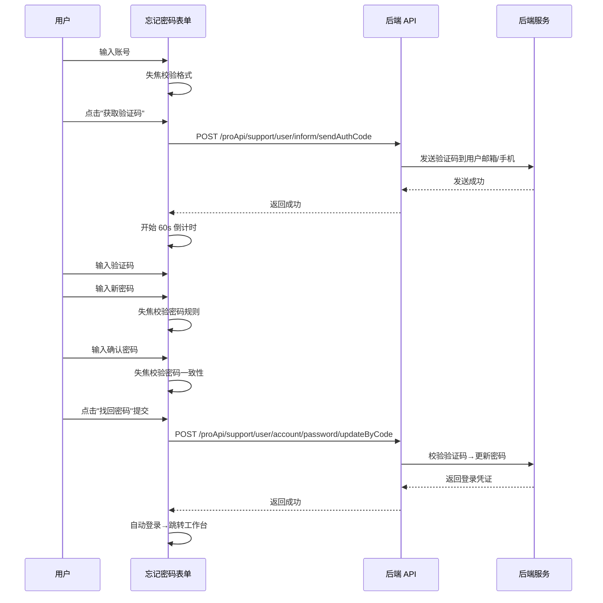

# 忘记密码 — 业务流程详解

## 页面总览

忘记密码功能以表单形式嵌入在登录页面中。用户从密码登录表单底部点击"忘记密码"链接后，登录页面切换显示忘记密码表单。用户依次输入账号、获取验证码、设置新密码后提交，完成密码重置并自动登录系统。

本功能无 Tab 结构，为单页表单流程。

## 找回密码

> 找回密码是忘记密码模块的唯一业务场景。用户通过验证码身份认证后重置密码。

### 步骤 1：输入账号

| 用户操作 | 触发 API | 分支条件 | 页面变化 |
|---------|---------|---------|---------|
| 在账号输入框中输入邮箱或手机号，输入后鼠标离开输入框触发失焦校验 | 无 | 输入为空时提交：显示提示"请输入邮箱/手机号"；格式不匹配：显示提示"邮箱/手机号格式错误" | 输入框失焦后如有错误，输入框变红并显示错误提示文字 |

### 步骤 2：获取验证码

| 用户操作 | 触发 API | 分支条件 | 页面变化 |
|---------|---------|---------|---------|
| 输入账号后，点击输入框右侧"获取验证码"文字按钮 | `POST /proApi/support/user/inform/sendAuthCode`（通过 `useSendCode` 触发） | 账号为空时点击：提示"请输入账号"；人机验证（Google reCAPTCHA）未通过：发送失败；验证码发送中：按钮文字显示"发送中..."；发送成功：提示"验证码已发送"，按钮开始 60 秒倒计时；发送失败：提示具体错误信息 | 点击后如有 googleClientVerKey 配置，弹出人机验证弹窗（`SendCodeAuthModal`）；验证通过后按钮进入 60 秒倒计时（文字变为"60s后重新获取"→"09s后重新获取"→恢复"获取验证码"）；发送期间按钮置灰不可点击 |

**验证码发送详情**：

- 发送 API 参数包含：账号（username）、验证码类型（`findPassword`）、Google reCAPTCHA Token、图形验证码、语言。
- 发送成功后按钮从 60 开始倒数，每秒减 1，到达 0 后恢复可点击状态。
- 倒计时期间按钮颜色变灰（`myGray.500`），不可点击。

### 步骤 3：输入验证码和新密码

| 用户操作 | 触发 API | 分支条件 | 页面变化 |
|---------|---------|---------|---------|
| 在验证码输入框中输入收到的 6-8 位验证码；在新密码输入框中输入新密码（需满足复杂度规则）；在确认密码输入框中再次输入相同密码 | 无（前端校验） | 验证码为空时提交：显示提示"请输入验证码"；密码不满足复杂度规则：显示提示"密码需包含字母和数字（至少两种组合），8-100位"；两次密码不一致：显示提示"两次密码不一致" | 各输入框失焦后即时校验，错误时输入框变红并显示对应错误提示 |

### 步骤 4：提交重置密码

| 用户操作 | 触发 API | 分支条件 | 页面变化 |
|---------|---------|---------|---------|
| 点击"找回密码"按钮（或按 Enter 键）提交表单 | `POST /proApi/support/user/account/password/updateByCode`（参数：username、code、password，其中 password 经 hashStr 加密后传输） | 提交前各字段校验未通过：阻止提交，焦点定位到首个错误字段；API 返回成功：提示"密码已找回"，自动登录系统并跳转；API 返回失败（如验证码错误/过期）：显示后端返回的错误信息 | 点击后按钮显示加载状态（`isLoading`）；提交期间按钮置灰不可重复点击；成功后跳转至工作台页面 |

### 返回登录

| 用户操作 | 触发 API | 分支条件 | 页面变化 |
|---------|---------|---------|---------|
| 点击表单底部"返回登录"链接 | 无 | 无 | 登录页面切换回密码登录表单（`setPageType('passwordLogin')`） |

---

### 表单字段清单

| 字段名 | 控件类型 | 必填 | 默认值 | 可选值/约束 | 编辑时只读 | 说明 |
|--------|---------|------|--------|------------|-----------|------|
| 账号 | 文本输入 | ✅ | — | 邮箱格式或手机号格式（正则：`/(^1[3456789]\d{9}$)\|(^[A-Za-z0-9]+([_\.][A-Za-z0-9]+)*@([A-Za-z0-9\-]+\.)+[A-Za-z]{2,6}$)/`） | 否 | 根据系统配置 `find_password_method` 显示占位提示（如"邮箱/手机号"） |
| 验证码 | 文本输入 | ✅ | — | 最多 8 位 | 否 | 需先点击"获取验证码"获取 |
| 新密码 | 密码输入 | ✅ | — | 需满足 `checkPasswordRule`：8-100 位，含字母+数字（至少两种组合） | 否 | 密码输入时以圆点掩码显示 |
| 确认密码 | 密码输入 | ✅ | — | 须与新密码一致 | 否 | 与新密码比对校验 |

### 字段联动

- 账号输入为空时，"获取验证码"按钮点击后提示"请输入账号"，不发起请求。
- 验证码倒计时期间（60s），"获取验证码"按钮置灰不可点击。
- 任意字段校验未通过时，提交按钮点击后不会发起 API 请求（由 `react-hook-form` 的 `handleSubmit` 拦截）。

### 校验规则

| 规则 | 触发时机 | 错误提示文案 |
|------|---------|-------------|
| 账号为空 | 失焦 | "请输入邮箱/手机号" |
| 账号格式不匹配 | 失焦 | "邮箱/手机号格式错误" |
| 验证码为空 | 提交时 | "请输入验证码" |
| 密码不满足复杂度 | 失焦 | "密码需包含字母和数字（至少两种组合），8-100位"（注：当前代码使用 `reset_password_tip` i18n key，实际文案取决于翻译文件） |
| 两次密码不一致 | 失焦 | "两次密码不一致" |

### 前后置条件

- **前置条件**：系统配置 `feConfigs.find_password_method` 不为空（至少启用邮箱或手机号找回方式）；用户拥有已注册账号。
- **后置影响**：密码重置成功后，系统返回登录凭证并自动登录，跳转至工作台首页；原密码失效。
- **失败场景**：验证码过期或错误时，提示用户重新获取验证码；账号未注册时，后端返回错误信息并显示。

---

### Mermaid 附录

