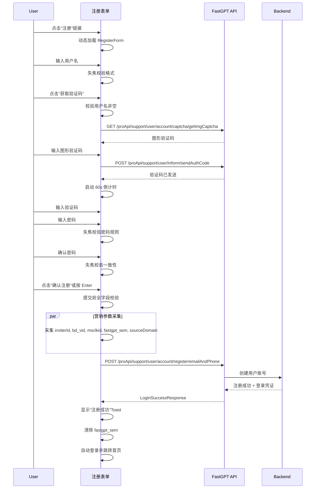

# 注册 — 业务流程详解

## 页面总览

注册 Tab 是登录页面的子视图，提供新用户自助注册能力。用户需依次完成用户名填写、验证码获取、密码设置三个步骤，提交后由后端完成注册并自动登录。整个流程为单页面操作，无页面跳转。

> 本模块为单表单组件，无嵌套 Tab。

---

### 用户注册

> 业务描述：访客在登录页切换到注册 Tab，填写注册信息并提交，完成账号注册后自动登录进入系统。

#### 步骤 1：进入注册表单

| 用户操作 | 触发 API | 分支条件 | 页面变化 |
|---------|---------|---------|---------|
| 在登录首页点击"注册"链接 | 无 | 系统配置中 `feConfigs.register_method` 非空时"注册"链接可见；为空时链接不可见，用户无注册入口 | 登录容器将 `pageType` 切换为 `register`，通过 `next/dynamic` 动态加载 RegisterForm 组件；表单区域展示注册表单 |

#### 步骤 2：填写用户名

| 用户操作 | 触发 API | 分支条件 | 页面变化 |
|---------|---------|---------|---------|
| 在用户名输入框中输入邮箱或手机号，输入框失焦时触发校验 | 无（前端校验） | **邮箱/手机号格式校验**：输入值匹配正则 `/^1[3456789]\d{9}$/`（手机号）或邮箱格式正则；不匹配时显示错误提示"请输入正确的邮箱或手机号"；匹配则校验通过。 **注册方式分支**：placeholder 提示文案由 `feConfigs.register_method` 决定：含 `email` 和 `phone` 时显示"邮箱/手机号"；仅含一项时只显示对应提示。 | 输入框失焦时若校验失败，输入框底部显示红色错误提示；校验通过后错误提示消失。 |

#### 步骤 3：获取验证码

| 用户操作 | 触发 API | 分支条件 | 页面变化 |
|---------|---------|---------|---------|
| 点击输入框右侧"获取验证码"按钮 | `GET /proApi/support/user/account/captcha/getImgCaptcha` → `POST /proApi/support/user/inform/sendAuthCode` | **用户名为空**：弹出警告提示"用户名不能为空"，不发送请求。 **用户名已填写**：弹出验证码认证弹窗（SendCodeAuthModal），用户需完成图形验证码/谷歌验证后发送短信/邮箱验证码。 **60 秒冷却**：发送成功后按钮置灰并显示倒计时"60s后重新获取"→"59s后重新获取"→...，期间不可重复点击。 **发送失败**：显示错误提示"验证码发送失败"。 | 按钮文字从"获取验证码"变为倒计时数字；倒计时结束后恢复为"获取验证码"，按钮恢复可点击状态。 |

#### 步骤 4：输入验证码

| 用户操作 | 触发 API | 分支条件 | 页面变化 |
|---------|---------|---------|---------|
| 在验证码输入框中输入收到的 8 位验证码 | 无 | **空值校验**：提交时若验证码为空，显示错误提示"验证码不能为空"。 **长度限制**：输入框最大长度为 8 位。 | 输入框失焦时若为空则显示红色错误提示。 |

#### 步骤 5：设置密码

| 用户操作 | 触发 API | 分支条件 | 页面变化 |
|---------|---------|---------|---------|
| 在密码输入框中输入密码，失焦时触发校验 | 无（前端 `checkPasswordRule` 校验） | **密码规则校验**：调用 `checkPasswordRule` 函数校验密码复杂度（长度、字符类型等），不符合时显示提示"密码需包含字母和数字，长度 6-20 位"。 | 校验失败时输入框底部显示红色错误提示；校验通过后错误提示消失。输入框为 `type="password"`，输入内容以圆点显示。 |

#### 步骤 6：确认密码

| 用户操作 | 触发 API | 分支条件 | 页面变化 |
|---------|---------|---------|---------|
| 在确认密码输入框中再次输入密码，失焦时触发校验 | 无（前端对比校验） | **两次密码一致性校验**：确认密码与密码输入框的值进行对比；不一致时显示"两次输入的密码不一致"。 | 校验失败时输入框底部显示红色错误提示。 |

#### 步骤 7：提交注册

| 用户操作 | 触发 API | 分支条件 | 页面变化 |
|---------|---------|---------|---------|
| 点击"确认注册"按钮 或 按 Enter 键（当验证码弹窗未打开时）| `POST /proApi/support/user/account/register/emailAndPhone` | **提交前校验**：所有表单字段（用户名、验证码、密码、确认密码）的校验规则需全部通过，否则各字段下方显示对应错误提示，不发送请求。 **后端校验失败**：用户名已注册、验证码错误、密码不符合要求等后端错误通过 `useRequest` 的 `onError` 处理，显示错误 Toast。 **注册成功**：后端返回登录凭证，自动调用 `loginSuccess` 回调完成登录。 | 提交时按钮显示加载动画（`isLoading`），按钮不可重复点击；注册成功后页面显示"注册成功"Toast，自动跳转到应用首页；`fastgpt_sem` 营销标记在注册成功后清除。 |

#### 步骤 8：切换回登录

| 用户操作 | 触发 API | 分支条件 | 页面变化 |
|---------|---------|---------|---------|
| 点击"已有账号？去登录"链接 | 无 | 无条件 | 登录容器将 `pageType` 切换为 `passwordLogin`，注册表单卸载，密码登录表单加载。 |

---

#### 表单与交互详情

**表单字段清单**：

| 字段名 | 控件类型 | 必填 | 默认值 | 可选值/约束 | 编辑时只读 | 说明 |
|--------|---------|------|--------|------------|-----------|------|
| 用户名 | 文本输入 | ✅ | — | 邮箱格式或手机号格式（正则校验） | 否 | 注册方式由 `feConfigs.register_method` 配置决定 |
| 验证码 | 文本输入 | ✅ | — | 最多 8 位 | 否 | 通过"获取验证码"按钮触发发送 |
| 密码 | 密码输入 | ✅ | — | 需通过 `checkPasswordRule` 校验（长度、字符类型等） | 否 | 输入内容以圆点掩码显示 |
| 确认密码 | 密码输入 | ✅ | — | 必须与"密码"字段值一致 | 否 | 失焦时自动对比 |

**校验规则**：

| 规则 | 触发时机 | 错误提示文案 |
|------|---------|-------------|
| 用户名格式校验 | 失焦（`onBlur` 模式）| "请输入正确的邮箱或手机号" |
| 用户名为空 | 失焦 | "邮箱/手机号不能为空" |
| 验证码为空 | 失焦 | "验证码不能为空" |
| 密码规则校验 | 失焦 | "密码需包含字母和数字，长度 6-20 位" |
| 两次密码不一致 | 失焦 | "两次输入的密码不一致" |
| 用户名为空时尝试获取验证码 | 点击"获取验证码" | "用户名不能为空" |

**前后置条件**：

- **前置条件**：系统配置中 `feConfigs.register_method` 非空（注册功能已启用），用户未登录
- **后置影响**：注册成功后自动登录、清除营销标记 `fastgpt_sem`、记录登录追踪事件（`TrackEnum.login`）
- **失败场景**：用户名已注册（后端返回错误提示）、验证码错误或过期（需重新获取验证码）、网络异常（显示错误 Toast，表单状态不变）

**提交时携带的营销参数**：

提交注册时，除了用户名、密码、验证码外，还会自动采集以下营销追踪参数：
- `inviterId`：邀请人 ID
- `bd_vid`：百度推广 VID
- `msclkid`：微软广告 Click ID
- `fastgpt_sem`：FastGPT 语义标记
- `sourceDomain`：来源域名

---

### Mermaid 附录

