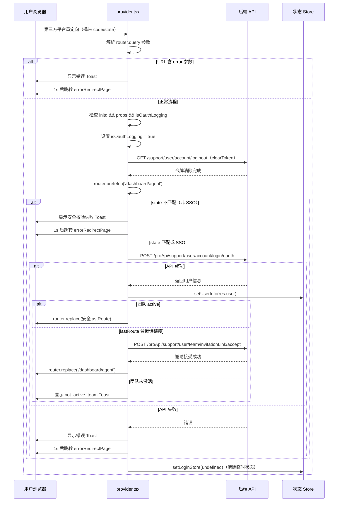

# 第三方登录 — 业务流程详解

## 页面总览

本页面是 OAuth/SSO 第三方登录的统一回调处理页。用户在登录页选择任意第三方登录方式（GitHub、Google、微信、Microsoft、企业微信、SSO）完成授权后，第三方平台将浏览器重定向到此页面，URL 上携带授权码（code）和状态（state）等参数。页面加载后自动执行令牌清除→状态安全校验→OAuth 登录 API 调用→用户信息写入→团队邀请处理→路由跳转的完整链路。

页面 UI 仅展示加载动画（`<Loading />`），所有逻辑均在 `useEffect` 中自动触发，对用户透明。

---

### S01：第三方 OAuth 回调登录

> 业务描述：接收第三方 OAuth 授权回调，完成令牌交换和用户会话建立。支持 GitHub / Google / 微信 / Microsoft / 企业微信 / SSO 六种提供商。

#### 步骤 1：页面加载与参数解析

页面组件渲染后，从 Next.js 路由的 `router.query` 中提取参数。

| 用户操作 | 触发 API | 分支条件 | 页面变化 |
|---------|---------|---------|---------|
| （自动）第三方平台重定向到本页，URL 携带 code、state 等参数 | 无 | — | 页面渲染 `<Loading />` 加载动画 |

URL 参数解析：
- `state`：安全校验 token，与登录页存储的 `loginStore.state` 比对
- `error`：第三方平台返回的错误标识
- 其他 props 参数（code 等）直接透传给后端 API

#### 步骤 2：错误前置检查

页面首先检查 URL 中是否包含错误标识。

| 用户操作 | 触发 API | 分支条件 | 页面变化 |
|---------|---------|---------|---------|
| （自动）页面加载完成 | 无 | **error 参数存在**：第三方平台返回了错误 | 弹出警告 Toast（文案：provider error 对应的 i18n 词条），1 秒后重定向至错误页 |

**分支详情**：
- **error 存在**（如用户拒绝授权）→ 显示错误提示，跳转至 `errorRedirectPage`（优先使用 `/chat` 相关的 lastRoute，否则回退到 `/login`），终止后续流程
- **error 不存在** → 继续步骤 3

#### 步骤 3：初始化校验

检查系统是否完成初始化和必要参数是否存在。

| 用户操作 | 触发 API | 分支条件 | 页面变化 |
|---------|---------|---------|---------|
| （自动）等待系统初始化完成 | 无 | **props 参数缺失或 initd 不为 true**：提前返回，等待下次渲染 | 继续展示加载动画 |
| （自动）重复调用防护 | 无 | **模块级 `isOauthLogging` 已为 true**：提前返回，阻止重复执行 | 无变化 |
| （自动）通过以上校验 | 无 | 符合预期 | 设置 `isOauthLogging = true`，防止重复调用 |

**分支详情**：
- `props` 为 undefined/null（URL 参数尚未解析完成）或 `initd === false`（系统 store 未初始化）→ 不执行任何操作，等待下次 effect 触发
- `isOauthLogging === true`（已有进行中的 OAuth 请求）→ 直接返回，防止并发的重复 API 调用
- 通过校验 → 标记 `isOauthLogging = true`，进入步骤 4

#### 步骤 4：清除旧令牌

在发起 OAuth 登录前，先清除可能存在的旧登录状态。

| 用户操作 | 触发 API | 分支条件 | 页面变化 |
|---------|---------|---------|---------|
| （自动）开始 OAuth 流程 | `GET /support/user/account/loginout`（通过 `clearToken()` 调用，外层包裹 `retryFn`，失败自动重试最多 2 次） | API 调用失败时 `retryFn` 自动重试，最多 2 次；全部失败则抛出异常 | 无可见变化（后台操作） |
| （自动）令牌清除完成 | 无（预加载）| — | `router.prefetch('/dashboard/agent')` 预加载目标页面资源 |

> **`clearToken()` 内部流程**：先调用 `clearAdStorage()` 清除 localStorage 中以 `logout-` 为前缀的广告存储项（逐项触发 ahooks 同步事件），再调用 `loginOut()` API 通知服务端清除会话。

#### 步骤 5：State 安全校验

将 URL 中的 `state` 参数与登录页存储的预期值比对，防止 CSRF 攻击。

| 用户操作 | 触发 API | 分支条件 | 页面变化 |
|---------|---------|---------|---------|
| （自动）令牌清除后 | 无 | **provider 不为 'sso' 且 state 与 loginStore.state 不匹配** | 弹出警告 Toast（文案：security_failed 对应的 i18n 词条），1 秒后重定向至错误页 |
| （自动）state 验证通过 | 无 | **provider 为 'sso'** 或 **state 匹配成功** | 进入步骤 6，调用 authProps |

**分支详情**：
- 非 SSO 登录 + state 不匹配 → **安全风险**：可能遭受 CSRF 攻击，中止流程，跳转错误页
- SSO 登录（不校验 state）或 state 匹配成功 → 继续执行 OAuth 登录

#### 步骤 6：调用 OAuth 登录 API

提交授权参数到后端，完成令牌交换和用户认证。

| 用户操作 | 触发 API | 分支条件 | 页面变化 |
|---------|---------|---------|---------|
| （自动）state 校验通过 | `POST /proApi/support/user/account/login/oauth` | — | 等待 API 响应，继续展示加载动画 |

**API 请求参数**（从源码提取，不编造）：

| 参数名 | 来源 | 说明 |
|--------|------|------|
| `type` | `loginStore.provider` 或默认 `OAuthEnum.sso` | OAuth 提供商类型 |
| `props` | URL query 参数（code 等） | 第三方平台返回的授权参数 |
| `callbackUrl` | `location.origin + '/login/provider'` | 本回调页的完整 URL |
| `inviterId` | `localStorage.getItem('inviterId')` | 邀请人 ID |
| `bd_vid` | `sessionStorage.getItem('bd_vid')` | 百度推广追踪 ID |
| `msclkid` | `sessionStorage.getItem('msclkid')` | 微软广告点击 ID |
| `fastgpt_sem` | `localStorage.getItem('fastgpt_sem')`（JSON 解析） | SEM 追踪参数对象 |
| `sourceDomain` | `sessionStorage.getItem('sourceDomain')` | 来源域名 |
| `language` | `i18n.language` | 当前语言偏好 |

#### 步骤 7：处理 API 响应

| 用户操作 | 触发 API | 分支条件 | 页面变化 |
|---------|---------|---------|---------|
| （自动）API 返回 | 无 | **res 为空（未返回数据）**：登录失败 | 弹出警告 Toast（文案：login.error 对应的 i18n 词条），1 秒后重定向至错误页 |
| （自动）API 返回 | 无 | **API 抛出异常**：网络错误或服务端拒绝 | 弹出警告 Toast（显示 `getErrText(error)` 或默认 login.error），1 秒后重定向至错误页 |
| （自动）API 返回成功 | 无 | **res 有效** | 清除 `fastgpt_sem` 存储，进入步骤 8（loginSuccess） |

**错误处理详情**：
- `res` 为空 → `toast({ status: 'warning', title: t('common:support.user.login.error') })`
- 捕获异常 → `toast({ status: 'warning', title: getErrText(error, t('common:support.user.login.error')) })`
- 两种情况均在 1 秒延迟后执行 `router.replace(errorRedirectPage)`
- 无论成功或失败，最终都会调用 `setLoginStore(undefined)` 清除临时登录状态

#### 步骤 8：登录成功处理

| 用户操作 | 触发 API | 分支条件 | 页面变化 |
|---------|---------|---------|---------|
| （自动）登录成功 | 无 | — | 调用 `setUserInfo(res.user)` 将用户信息写入 store |

**后续分支（决定跳转目标）**：

| 分支条件 | 触发 API | 页面变化 |
|---------|---------|---------|
| **团队状态为 'active'**：正常团队 | 无 | 导航至 `validateRedirectUrl(lastRoute)` 解析的安全 URL |
| **团队状态非 'active' 且 lastRoute 包含 `/account/team?invitelinkid=`**：通过邀请链接注册的新用户 | `POST /proApi/support/user/team/invitationLink/accept`（参数 linkId 从 URL 中提取） | 接受邀请后导航至 `/dashboard/agent` |
| **团队状态非 'active' 且 lastRoute 不包含邀请链接**：团队未激活 | 无 | 弹出警告 Toast（文案：not_active_team 对应的 i18n 词条），不执行导航 |

**`validateRedirectUrl` 安全校验**：
- 目标 URL 必须以 `/` 开头（相对路径）
- 不允许包含 `/login`（防止循环重定向）
- 不允许以 `//` 或 `/\` 开头（防止协议相对 URL 攻击）
- 不允许包含 `javascript:` 或 `data:` 等协议
- 校验失败时回退到 `/dashboard/agent`

#### 步骤 9：路由跳转

| 用户操作 | 触发 API | 分支条件 | 页面变化 |
|---------|---------|---------|---------|
| （自动）确定跳转目标 | 无 | `navigateTo` 有效 | `router.replace(navigateTo)` 替换当前历史记录，跳转至目标页 |
| （自动）确定跳转目标 | 无 | `navigateTo` 无效（团队未激活） | 停留在当前页，用户看到 Toast 提示 |

---

### 场景补充内容

#### 查看/回调处理类场景 — 数据加载详情

本场景为单次回调处理，不涉及分页、排序、轮询。

#### 错误与边界

| 场景 | 处理机制 |
|------|---------|
| 重复提交防护 | 模块级 `isOauthLogging` 标志，整个模块生命周期内只允许一次 OAuth 请求 |
| CSRF 攻击防护 | state 参数比对（`loginStore.state` vs URL `state`），非 SSO 登录时强制校验 |
| 开放重定向防护 | `validateRedirectUrl` 校验跳转目标，拦截绝对 URL、协议注入、登录页循环 |
| 令牌清除失败 | `retryFn` 包裹 `clearToken()`，失败自动重试最多 2 次 |
| OAuth 登录失败 | 显示错误 Toast，1 秒延迟后跳转错误页（非立即跳转，给用户时间看到错误提示） |
| 第三方平台返回 error | 页面加载时前置检查，error 存在则直接跳转错误页，不发起后续 API 调用 |
| 系统未初始化 | 等待 `initd` 变为 true 后再执行流程（useEffect 依赖 initd 触发） |
| URL 参数未就绪 | props 参数为空时提前返回，等待 Next.js 路由解析完成 |
| 团队未激活 | 显示 not_active_team 提示，不执行导航 |
| 老用户重登录 | 团队状态为 active 时跳过邀请处理，直接跳转 lastRoute |

---

### Mermaid 附录

