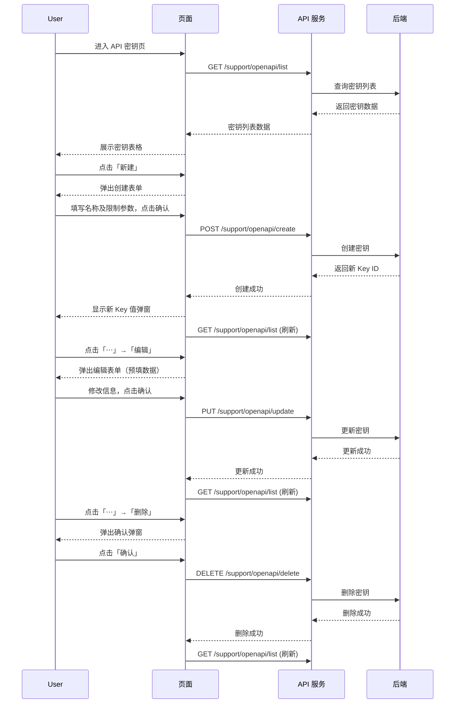

# API 密钥 — 业务流程详解

## 页面总览

API 密钥管理页面提供密钥的全生命周期管理能力。用户进入页面后，系统自动加载当前账户（或指定应用）的 API 密钥列表，并提供创建、编辑、删除操作入口，同时支持复制 API 基础地址和查看调用示例。

页面顶部为操作区（标题、文档链接、调用示例链接、API 基础地址复制区、新建按钮），主体为密钥列表表格（名称、Key 值、已用/总量上限、过期时间、创建时间、最后使用时间、操作菜单）。

### 查看 API 密钥列表

> 用户进入 API 密钥页面，系统自动加载并显示密钥列表。

#### 步骤 1：进入页面并加载数据

| 用户操作 | 触发 API | 分支条件 | 页面变化 |
|---------|---------|---------|---------|
| 在账户导航中点击「API 密钥」Tab | GET /support/openapi/list (params: { appId? }) | 无 — 自动触发，manual: false | MyBox 显示加载遮罩；API 返回后遮罩消失，表格渲染密钥列表 |

#### 步骤 2：浏览密钥列表

| 用户操作 | 触发 API | 分支条件 | 页面变化 |
|---------|---------|---------|---------|
| 查看列表中的密钥信息 | 无（数据已在步骤 1 加载） | isPlus 为 true 时，显示「过期时间」列和用量上限数值 | 表格展示：名称、Key 值、已用点数/上限、过期时间（Plus）、创建时间、最后使用时间、操作菜单（⋯） |

**数据加载详情**：

| 加载阶段 | API | 关键参数 | 数据处理 | 渲染结果 |
|---------|-----|---------|---------|---------|
| 首次加载 | GET /support/openapi/list | { appId } — appId 可选，页面级不传，应用级传入 | 按创建时间倒序（由后端返回） | 表格所有密钥 |
| 操作后刷新 | GET /support/openapi/list | 同上次请求参数 | 无额外处理 | 表格数据更新（无遮罩） |

- 分页：当前版本无前端分页，列表一次性加载全部密钥
- 排序：由后端返回，页面不做客户端排序
- 筛选：appId 可选参数过滤特定应用的密钥；页面级（账户 Tab）不传 appId，显示账户下全部密钥

**特殊列的渲染逻辑**：

- **Key 值列**：显示完整 API Key 字符串，不做脱敏
- **用量列**：显示 `已用点数 / 上限`，当上限为 -1 或 Plus 版本未开启时仅显示已用点数
- **过期时间列**：Plus 版本可见，已设置过期时间则显示格式为 `YYYY/MM/DD HH:mm`，否则显示 `-`
- **最后使用时间列**：有使用记录时显示 `YYYY/MM/DD HH:mm:ss`，从未使用则显示"未使用"
- **操作菜单**：每行末尾的 `⋯` 图标按钮，点击弹出编辑/删除菜单

---

### 创建 API 密钥

> 用户点击「新建」按钮，填写密钥名称及可选限制参数后提交创建。

#### 步骤 1：打开创建表单

| 用户操作 | 触发 API | 分支条件 | 页面变化 |
|---------|---------|---------|---------|
| 点击页面右上角「新建」按钮 | 无 | 无 | 弹出 EditKeyModal 模态框，标题为「创建 API Key」，表单为空默认值 |

#### 步骤 2：填写并提交表单

| 用户操作 | 触发 API | 分支条件 | 页面变化 |
|---------|---------|---------|---------|
| 输入密钥名称 | 无 | 名称必填，最大长度 100 字符；失焦校验非空 | 校验失败时浏览器默认提示 |
| 输入最大用量上限（Plus 版本） | 无 | Plus 版本可见此字段；值范围 -1~10000000，-1 表示无限制 | — |
| 选择过期时间（Plus 版本） | 无 | Plus 版本可见此字段；可选择具体日期时间或不选 | DateTimePicker 弹窗选择 |
| 点击「确认」提交 | POST /support/openapi/create | 名称必填校验通过则提交；校验失败则阻止提交 | 按钮显示 loading 状态（creating）；成功后弹窗关闭 |

#### 步骤 3：获取新密钥

| 用户操作 | 触发 API | 分支条件 | 页面变化 |
|---------|---------|---------|---------|
| 创建成功后自动弹出新密钥展示 | 无 | 创建成功后 onCreate 回调传入新 Key ID | 弹出模态框显示完整 API Key 字符串，提示「请妥善保管，关闭后无法再次查看」 |

#### 步骤 4：复制新密钥

| 用户操作 | 触发 API | 分支条件 | 页面变化 |
|---------|---------|---------|---------|
| 点击密钥值区域或复制图标 | 无（客户端复制） | 无 | 密钥复制到剪贴板，显示复制成功提示 |
| 点击「确定」关闭弹窗 | 无 | 无 | 弹窗关闭，列表自动刷新 |

**表单与交互详情**：

**表单字段清单**：

| 字段名 | 控件类型 | 必填 | 默认值 | 可选值/约束 | 编辑时只读 | 说明 |
|--------|---------|------|--------|------------|-----------|------|
| 名称（name） | 文本输入 | ✅ | — | 最大 100 字符 | 否 | 密钥别名，用于识别不同密钥 |
| 最大用量上限（limit.maxUsagePoints） | 数字输入 | ✅（Plus） | -1 | -1 ~ 10000000，整数 | 否 | Plus 版本功能，-1 表示不限制 |
| 过期时间（limit.expiredTime） | 日期时间选择器 | 否（Plus） | 空 | 任意未来时间 | 否 | Plus 版本功能，不选则永不过期 |

**校验规则**：

| 规则 | 触发时机 | 错误提示文案 |
|------|---------|-------------|
| 名称为空 | 提交时 | 名称为空（i18n: common:name_is_empty） |
| 最大用量上限超出范围 | 提交时 | 浏览器原生约束提示 |
| 创建请求失败 | API 返回错误 | 创建链接错误（i18n: workflow:create_link_error） |

**前置条件**：已登录；账户可见「API 密钥」Tab（需要 hasApikeyCreatePer 权限）

**后置影响**：创建成功后，新密钥立即生效，可用于 API 调用鉴权；密钥列表刷新

**失败场景**：创建请求失败时，EditKeyModal 保持打开，用户可修改后重试

---

### 编辑 API 密钥

> 用户点击列表行操作菜单中的「编辑」，修改密钥的名称、用量上限或过期时间。

#### 步骤 1：打开编辑表单

| 用户操作 | 触发 API | 分支条件 | 页面变化 |
|---------|---------|---------|---------|
| 点击行末「⋯」→「编辑」 | 无 | 无 | 弹出 EditKeyModal 模态框，标题为「编辑 API Key」，表单预填当前密钥数据 |

#### 步骤 2：修改并提交

| 用户操作 | 触发 API | 分支条件 | 页面变化 |
|---------|---------|---------|---------|
| 修改名称/用量上限/过期时间 | 无 | Plus 版本可修改用量上限和过期时间；非 Plus 版本仅可修改名称 | — |
| 点击「确认」提交 | PUT /support/openapi/update | 名称必填校验通过则提交 | 按钮显示 loading 状态（updating）；成功后弹窗关闭，列表刷新 |

**表单与交互详情**：

编辑与创建使用同一个 EditKeyModal 组件，通过 `_id` 是否存在区分编辑/创建模式。编辑模式下表单预填已有数据。

**校验规则**：

| 规则 | 触发时机 | 错误提示文案 |
|------|---------|-------------|
| 名称为空 | 提交时 | 名称为空 |
| 更新请求失败 | API 返回错误 | 更新链接错误（i18n: workflow:update_link_error） |

**前置条件**：密钥已存在且可被编辑

**后置影响**：密钥配置即时更新；列表刷新

**失败场景**：更新请求失败，弹窗保持打开，用户可重试

---

### 删除 API 密钥

> 用户点击列表行操作菜单中的「删除」，确认后永久删除指定密钥。

#### 步骤 1：触发删除确认

| 用户操作 | 触发 API | 分支条件 | 页面变化 |
|---------|---------|---------|---------|
| 点击行末「⋯」→「删除」 | 无 | 无 | 弹出确认弹窗（红色警告样式），标题/内容为「确认删除该 API Key？」 |

#### 步骤 2：确认删除

| 用户操作 | 触发 API | 分支条件 | 页面变化 |
|---------|---------|---------|---------|
| 点击弹窗中「确认」 | DELETE /support/openapi/delete (body: { id }) | 无 | 确认弹窗关闭；列表数据自动刷新；密钥行从表格中移除 |
| 点击「取消」 | 无 | 无 | 弹窗关闭，不执行删除 |

**删除链路详情**：

- **确认弹窗**：标题为删除确认，内容为"确认删除该 API Key？"（i18n: common:delete_api），type 为 "delete" 使用红色警告样式
- **单条删除**：每条密钥独立删除，无批量删除功能
- **级联影响**：删除后该密钥立即失效，所有使用该密钥的 API 调用将被拒绝

---

### 复制 API 基础地址

> 用户在页面顶部点击基础地址区域，将 API 基础 URL 复制到剪贴板。

#### 步骤 1：复制操作

| 用户操作 | 触发 API | 分支条件 | 页面变化 |
|---------|---------|---------|---------|
| 点击页面顶部 API 基础地址显示区域 | 无（客户端剪贴板 API） | 自定义域名配置存在时显示配置值，否则显示 `{当前域名}/api` | 剪贴板更新为基础地址，显示「复制成功」提示 |

---

### 查看调用示例

> 用户点击「调用示例」链接，系统根据当前应用类型和变量配置生成 curl 命令示例。

#### 步骤 1：打开示例弹窗（仅应用级场景）

| 用户操作 | 触发 API | 分支条件 | 页面变化 |
|---------|---------|---------|---------|
| 点击页面顶部「调用示例」链接 | GET /core/app/get (params: { id: appId }) | 仅当有 appId 时触发 API 请求；无 appId 时以空数据显示 | 弹出 CallExampleModal，展示基于应用类型生成的 curl 调用示例、变量说明和类型对照表 |
| 查看示例 | 无 | 根据应用类型（assistant/其他）决定是否包含变量参数；根据文件配置决定是否包含文件上传示例 | 展示带注释的 curl 命令、简洁版复制按钮、变量类型说明 |

**状态转换详情**：

- `feConfigs.docUrl` 存在 → 显示「查看文档」链接和「调用示例」链接
- `feConfigs.docUrl` 不存在 → 不显示文档和调用示例入口

---

### 复制新创建的 API Key

> 创建 API Key 成功后弹出的 Key 展示弹窗中，用户可一键复制新 Key 值。

#### 步骤 1：复制新 Key

| 用户操作 | 触发 API | 分支条件 | 页面变化 |
|---------|---------|---------|---------|
| 点击 Key 值区域或复制图标 | 无（客户端剪贴板 API） | 无 | Key 值复制到剪贴板，显示复制成功提示 |

---

## Mermaid 附录

